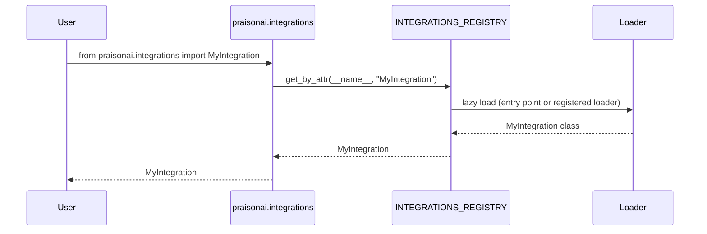

```python
from praisonaiagents import Agent

agent = Agent(name="registry-agent", instructions="Manage integrations via the registry.")
agent.start("List all registered integrations and their status.")
```


Integration Registry enables third-party developers to add custom CLI tools, managed agents, and agent backends to PraisonAI through a centralized plugin system.


## Quick Start

<Steps>
<Step title="Use a built-in integration">
```python
from praisonai.integrations import ClaudeCodeIntegration

integration = ClaudeCodeIntegration(workspace="/path/to/project")
```
</Step>

<Step title="Register at runtime">
```python
from praisonai.integrations._unified_registry import INTEGRATIONS_REGISTRY

def _my_loader():
    from my_pkg.integration import MyIntegration
    return MyIntegration

INTEGRATIONS_REGISTRY.register_lazy("MyIntegration", _my_loader, aliases=["my"])

# Now this works:
from praisonai.integrations import MyIntegration
```
</Step>

<Step title="Distribute as a pip plugin">
```toml
# pyproject.toml of your third-party package
[project.entry-points."praisonai.integrations"]
MyIntegration = "my_pkg.integration:MyIntegration"
```

```bash
pip install my-praisonai-integration
```

```python
# Now this works in any praisonai-using project:
from praisonai.integrations import MyIntegration
```
</Step>
</Steps>

---

## How It Works



Before PR #1763, `praisonai/integrations/__init__.py` had a 70-line `if/elif` ladder in `__getattr__` that mapped attribute names to lazy imports. After #1763, the ladder is replaced by a 4-line dispatch backed by `INTEGRATIONS_REGISTRY`. The registry:

- Subclasses the generic `PluginRegistry[T]` from `praisonai._registry`
- Loads built-in integrations lazily (CLI tools, managed agents, sandboxed agents, hosted/local agent backends, registry helpers)
- Supports third-party integrations via the new entry-point group `praisonai.integrations` — distribute a pip package, no code changes to praisonai
- Exposes a `get_by_attr(module_name, attr_name)` helper that raises `AttributeError` (not `ValueError`) so the dispatch slots into module-level `__getattr__`

---

## Configuration / API

| Method | Parameters | Description |
|---|---|---|
| `INTEGRATIONS_REGISTRY.register_lazy(name, loader, *, aliases=None)` | `name: str`, `loader: () -> Any`, `aliases: list[str] \| None` | Register a lazily-loaded integration |
| `INTEGRATIONS_REGISTRY.resolve(name)` | `name: str` → `Any` | Materialize an integration; `ValueError` if unknown |
| `INTEGRATIONS_REGISTRY.get_by_attr(module, attr)` | `module: str`, `attr: str` → `Any` | Same as `resolve` but raises `AttributeError` (for use inside `__getattr__`) |

---

## Built-in Integrations

The registry includes these built-in integrations with lazy loading:

### CLI Tools
- `ClaudeCodeIntegration` — Claude Code CLI integration
- `GeminiCLIIntegration` — Gemini CLI tools
- `CodexCLIIntegration` — Codex CLI interface  
- `CursorCLIIntegration` — Cursor CLI integration
- `BaseCLIIntegration` — Base class for CLI tools
- `CLIExecutionError` — CLI execution error class

### Managed Agents
- `ManagedAgent` (alias: `ManagedAgentIntegration`) — Managed agent interface
- `AnthropicManagedAgent` — Anthropic-specific managed agent
- `ManagedConfig` (alias: `ManagedBackendConfig`) — Managed agent configuration

### Local & Sandboxed Agents  
- `LocalManagedAgent` — Local managed agent
- `LocalManagedConfig` — Local agent configuration
- `SandboxedAgent` — Sandboxed agent execution
- `SandboxedAgentConfig` — Sandboxed agent configuration

### Agent Backends
- `HostedAgent` — Hosted agent backend
- `HostedAgentConfig` — Hosted agent configuration
- `LocalAgent` — Local agent backend
- `LocalAgentConfig` — Local agent configuration

### Registry Functions
- `get_available_integrations` — List available integrations
- `ExternalAgentRegistry` — External agent registry
- `get_registry` — Get integration registry
- `register_integration` — Register new integration
- `create_integration` — Create integration instance

---

## Advanced Usage

### Build Your Own Namespace

Use `create_lazy_getattr(registry)` from `praisonai._registry` for plugin authors who want to give their own package the same lazy-loading + entry-point dispatch behaviour:

```python
# my_pkg/__init__.py
from praisonai._registry import PluginRegistry, create_lazy_getattr

_REG = PluginRegistry(entry_point_group="my_pkg.plugins")
__getattr__ = create_lazy_getattr(_REG)
```

---

## Common Patterns

<AccordionGroup>
<Accordion title="Override a Built-in">
```python
from praisonai.integrations._unified_registry import INTEGRATIONS_REGISTRY

def _my_loader():
    from my_pkg import MyClaudeCodeIntegration
    return MyClaudeCodeIntegration

# Override built-in
INTEGRATIONS_REGISTRY.register_lazy("ClaudeCodeIntegration", _my_loader)
```

Last-write-wins on the canonical name.
</Accordion>

<Accordion title="Multiple Aliases">
```python
INTEGRATIONS_REGISTRY.register_lazy(
    "MyIntegration", 
    _loader, 
    aliases=["my", "mi", "custom"]
)
```

Both the alias and the canonical name resolve.
</Accordion>

<Accordion title="Multi-tenant Isolation">
```python
from praisonai.integrations._unified_registry import IntegrationRegistry

# Per-tenant registry (not the singleton)
tenant_registry = IntegrationRegistry()
tenant_registry.register_lazy("TenantTool", _loader)
```

Construct your own `IntegrationRegistry()` for per-tenant registration that doesn't leak.
</Accordion>
</AccordionGroup>

---

## Best Practices

<AccordionGroup>
<Accordion title="Always Use Lazy Loading">
Always use a `_loader` function, never import the integration at module top-level — that defeats the lazy-loading:

```python
# ✅ Good
def _my_loader():
    from my_pkg.integration import MyIntegration
    return MyIntegration

# ❌ Bad - imports at module level
from my_pkg.integration import MyIntegration
def _my_loader():
    return MyIntegration
```
</Accordion>

<Accordion title="Use Canonical Names">
Names are case-insensitive; pick the canonical form (matching the class name) for the registration key:

```python
# ✅ Good - matches class name
INTEGRATIONS_REGISTRY.register_lazy("MyIntegration", _loader)

# ❌ Confusing - different case
INTEGRATIONS_REGISTRY.register_lazy("myintegration", _loader)
```
</Accordion>

<Accordion title="Avoid Internal Imports">
Don't bypass the registry to import internal integration modules directly — those paths are not part of the public API:

```python
# ✅ Good - use the public API
from praisonai.integrations import ClaudeCodeIntegration

# ❌ Bad - internal import path
from praisonai.integrations.claude_code import ClaudeCodeIntegration
```
</Accordion>
</AccordionGroup>

---

## Related

<CardGroup cols={2}>
<Card title="Framework Adapter Plugins" icon="plug" href="/docs/features/framework-adapter-plugins">
  Plugin system for multi-agent frameworks
</Card>
<Card title="Persistence Backend Plugins" icon="database" href="/docs/features/persistence-backend-plugins">
  Add custom storage backends
</Card>
</CardGroup>