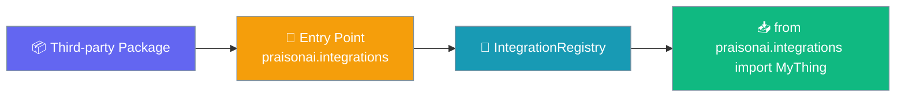
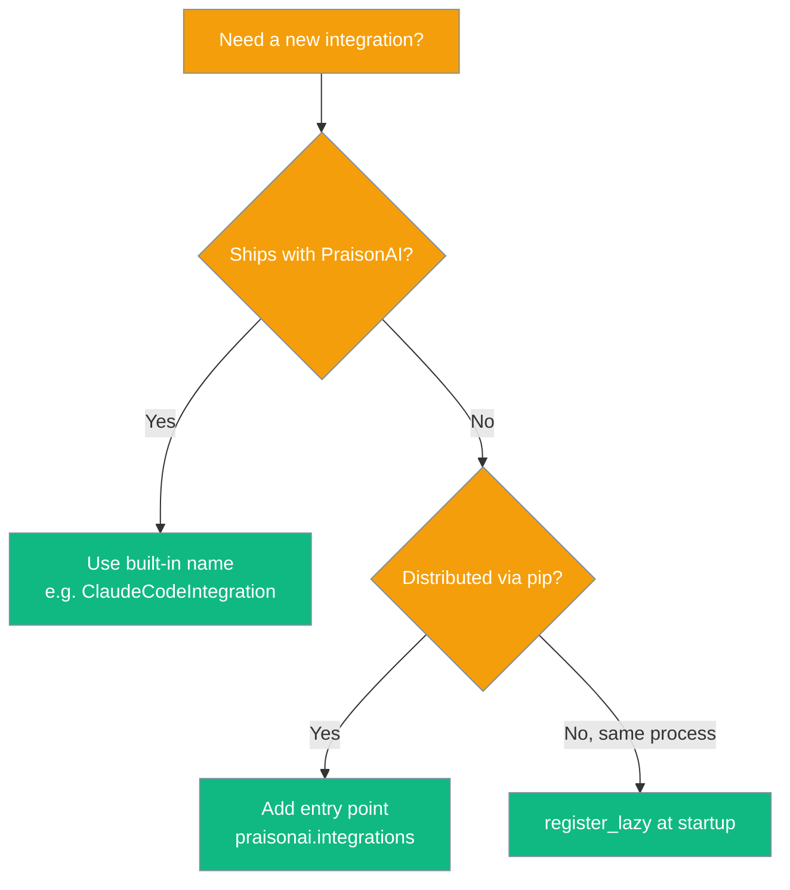
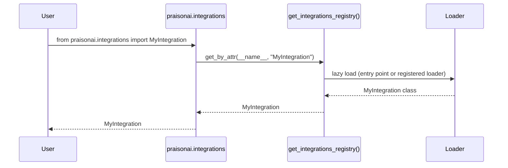

```python
from praisonaiagents import Agent

agent = Agent(name="registry-agent", instructions="Manage integrations via the registry.")
agent.start("List all registered integrations and their status.")
```

The user installs a third-party package; entry points register CLI and agent backends in one registry.

Third-party discovery via the `praisonai.integrations` entry-point group is fully supported from [PraisonAI PR #4154](https://github.com/MervinPraison/PraisonAI/pull/4154) (2026-08-20) onwards; on earlier releases the group was silently ignored and only runtime registration (below) worked.

Integration Registry enables third-party developers to add custom CLI tools, managed agents, and agent backends to PraisonAI through a centralized plugin system.


```mermaid
graph LR
    A[📦 Third-party Package] --> B[🔌 Entry Point\npraisonai.integrations]
    B --> C[📝 IntegrationRegistry]
    C --> D[📥 from praisonai.integrations import MyThing]

    classDef package fill:#6366F1,stroke:#7C90A0,color:#fff
    classDef entrypoint fill:#F59E0B,stroke:#7C90A0,color:#fff
    classDef registry fill:#189AB4,stroke:#7C90A0,color:#fff
    classDef import fill:#10B981,stroke:#7C90A0,color:#fff

    class A package
    class B entrypoint
    class C registry
    class D import

```

## Choose Your Registration Path

Pick a registration path based on how the integration ships.


```mermaid
graph TB
    Start[Need a new integration?] --> Q1{Ships with PraisonAI?}
    Q1 -->|Yes| Builtin[Use built-in name<br/>e.g. ClaudeCodeIntegration]
    Q1 -->|No| Q2{Distributed via pip?}
    Q2 -->|Yes| Plugin[Add entry point<br/>praisonai.integrations]
    Q2 -->|No, same process| Runtime[register_lazy at startup]

    classDef q fill:#F59E0B,stroke:#7C90A0,color:#fff
    classDef done fill:#10B981,stroke:#7C90A0,color:#fff
    class Start,Q1,Q2 q
    class Builtin,Plugin,Runtime done
```

---

## Quick Start

<Steps>
<Step title="Use a built-in integration">
```python
from praisonai.integrations import ClaudeCodeIntegration

integration = ClaudeCodeIntegration(workspace="/path/to/project")
```
</Step>

<Step title="Register at runtime">
```python
# Preferred (lazy — no registry built until first call)
from praisonai.integrations._unified_registry import get_integrations_registry

def _my_loader():
    from my_pkg.integration import MyIntegration
    return MyIntegration

get_integrations_registry().register_lazy("MyIntegration", _my_loader, aliases=["my"])

# Now this works:
from praisonai.integrations import MyIntegration
```
</Step>

<Step title="Distribute as a pip plugin">
```toml
# your-plugin/pyproject.toml
[project.entry-points."praisonai.integrations"]
acme = "acme_praison:AcmeIntegration"
```

```python
# after `pip install your-plugin` — no praisonai code changes needed
from praisonai.integrations import acme
integration = acme(workspace="/path/to/project")
```

The left-hand side (`acme`) is the name users import; the right-hand side is the dotted path to the class. Names collide case-insensitively with built-ins, and built-ins always win.
</Step>
</Steps>

<Warning>
On PraisonAI releases prior to PR #4154 (merged 2026-08-20), entry-point-based
plugins were discovered and then silently discarded — `from praisonai.integrations
import my_plugin` raised `AttributeError` even when the plugin was correctly
installed. If entry-point discovery seems to do nothing, upgrade to a release
that includes PR #4154. Runtime `register_lazy(...)` registration always worked.
</Warning>

---

## How It Works


```mermaid
sequenceDiagram
    participant User
    participant Mod as praisonai.integrations
    participant Reg as get_integrations_registry()
    participant Loader

    User->>Mod: from praisonai.integrations import MyIntegration
    Mod->>Reg: get_by_attr(__name__, "MyIntegration")
    Reg->>Loader: lazy load (entry point or registered loader)
    Loader-->>Reg: MyIntegration class
    Reg-->>Mod: MyIntegration
    Mod-->>User: MyIntegration
```

- Third-party plugins in the `praisonai.integrations` entry-point group are discovered once, lazily, the first time anything imports from `praisonai.integrations`.
- Discovery only stores each plugin's loader; no third-party code runs until you actually import that name.
- Built-in integrations are registered after discovery and take precedence on name collisions — you cannot silently override a built-in by shipping a plugin with the same name.
- `from praisonai.integrations import <name>` raises `AttributeError` for unknown names (native Python behaviour); `.resolve("<name>")` on the registry raises `ValueError`.

### Precedence

Registration sources resolve in a fixed order when names collide.

| Source | When registered | On name collision |
|---|---|---|
| Third-party entry-point plugin | On first registry access | Overridden by built-in |
| Built-in integration | Right after entry-point discovery | Wins over plugin |
| `register_lazy(...)` at runtime | Whenever the caller invokes it | Last write wins |

Built-ins can never be silently shadowed by a same-named plugin; a plugin with a colliding name is discovered but overwritten immediately.

---

## Configuration / API

| Method | Parameters | Description |
|---|---|---|
| `get_integrations_registry()` | → `IntegrationRegistry` | Return the process-default registry, building it lazily on first call (thread-safe) |
| `INTEGRATIONS_REGISTRY.register_lazy(name, loader, *, aliases=None)` | `name: str`, `loader: () -> Any`, `aliases: list[str] \| None` | Register a lazily-loaded integration |
| `INTEGRATIONS_REGISTRY.resolve(name)` | `name: str` → `Any` | Materialize an integration; `ValueError` if unknown |
| `get_by_attr(module, attr)` | `module: str`, `attr: str` → `Any` | Same as `resolve` but raises `AttributeError`; used by `praisonai.integrations.__getattr__` so `from praisonai.integrations import <name>` gets the right error type on typos |

<Note>
`INTEGRATIONS_REGISTRY` remains available as a module-level name for backward compatibility — the first access triggers construction. Use `get_integrations_registry()` in new code to make the lazy build explicit. Underscore-prefixed submodule names (for example `from praisonai.integrations import _unified_registry`) now import normally instead of triggering registry construction.
</Note>

---

## Built-in Integrations

The registry includes these built-in integrations with lazy loading:

### CLI Tools
- `ClaudeCodeIntegration` — Claude Code CLI integration
- `GeminiCLIIntegration` — Gemini CLI tools
- `CodexCLIIntegration` — Codex CLI interface  
- `CursorCLIIntegration` — Cursor CLI integration
- `BaseCLIIntegration` — Base class for CLI tools
- `CLIExecutionError` — CLI execution error class

### Managed Agents
- `ManagedAgent` (alias: `ManagedAgentIntegration`) — Managed agent interface
- `AnthropicManagedAgent` — Anthropic-specific managed agent
- `ManagedConfig` (alias: `ManagedBackendConfig`) — Managed agent configuration

### Local & Sandboxed Agents  
- `LocalManagedAgent` — Local managed agent
- `LocalManagedConfig` — Local agent configuration
- `SandboxedAgent` — Sandboxed agent execution
- `SandboxedAgentConfig` — Sandboxed agent configuration

### Agent Backends
- `HostedAgent` — Hosted agent backend
- `HostedAgentConfig` — Hosted agent configuration
- `LocalAgent` — Local agent backend
- `LocalAgentConfig` — Local agent configuration

### Registry Functions
- `get_available_integrations` — List available integrations
- `ExternalAgentRegistry` — External agent registry
- `get_registry` — Get integration registry
- `register_integration` — Register new integration
- `create_integration` — Create integration instance

---

## Advanced Usage

### Adding a New Built-in Backend

Built-in CLI backends (Claude Code, Gemini, Codex, Cursor) are registered from a single canonical module: `praisonai/integrations/_cli_loaders.py`. It exports `CLASS_NAME_LOADERS` (class-name → loader) used by `IntegrationRegistry`, and `BUILTIN_INTEGRATIONS` (short-alias → loader) used by `ExternalAgentRegistry`. Register a new built-in backend in one place and both registry surfaces pick it up.

### Build Your Own Namespace

Use `create_lazy_getattr(registry)` from `praisonai._registry` for plugin authors who want to give their own package the same lazy-loading + entry-point dispatch behaviour:

```python
# my_pkg/__init__.py
from praisonai._registry import PluginRegistry, create_lazy_getattr

_REG = PluginRegistry(entry_point_group="my_pkg.plugins")
__getattr__ = create_lazy_getattr(_REG)
```

---

## Common Patterns

<AccordionGroup>
<Accordion title="Override a Built-in">
```python
from praisonai.integrations._unified_registry import get_integrations_registry

def _my_loader():
    from my_pkg import MyClaudeCodeIntegration
    return MyClaudeCodeIntegration

# Override built-in
get_integrations_registry().register_lazy("ClaudeCodeIntegration", _my_loader)
```

Last-write-wins on the canonical name.
</Accordion>

<Accordion title="Multiple Aliases">
```python
get_integrations_registry().register_lazy(
    "MyIntegration", 
    _loader, 
    aliases=["my", "mi", "custom"]
)
```

Both the alias and the canonical name resolve.
</Accordion>

<Accordion title="Multi-tenant Isolation">
```python
from praisonai.integrations._unified_registry import IntegrationRegistry

# Per-tenant registry (not the singleton)
tenant_registry = IntegrationRegistry()
tenant_registry.register_lazy("TenantTool", _loader)
```

Construct your own `IntegrationRegistry()` for per-tenant registration that doesn't leak.
</Accordion>
</AccordionGroup>

---

## Best Practices

<AccordionGroup>
<Accordion title="Always Use Lazy Loading">
Always use a `_loader` function, never import the integration at module top-level — that defeats the lazy-loading:

```python
# ✅ Good
def _my_loader():
    from my_pkg.integration import MyIntegration
    return MyIntegration

# ❌ Bad - imports at module level
from my_pkg.integration import MyIntegration
def _my_loader():
    return MyIntegration
```
</Accordion>

<Accordion title="Use Canonical Names">
Names are case-insensitive; pick the canonical form (matching the class name) for the registration key:

```python
# ✅ Good - matches class name
get_integrations_registry().register_lazy("MyIntegration", _loader)

# ❌ Confusing - different case
get_integrations_registry().register_lazy("myintegration", _loader)
```
</Accordion>

<Accordion title="Avoid Internal Imports">
Don't bypass the registry to import internal integration modules directly — those paths are not part of the public API:

```python
# ✅ Good - use the public API
from praisonai.integrations import ClaudeCodeIntegration

# ❌ Bad - internal import path
from praisonai.integrations.claude_code import ClaudeCodeIntegration
```
</Accordion>

<Accordion title="Never Reuse a Built-in Name">
Built-ins always win on name collisions. If you ship a plugin under an
existing built-in name, users will silently get the built-in — pick a name
unique to your package. Names are compared case-insensitively, so
`ClaudeCodeIntegration`, `claudecodeintegration`, and `CLAUDECODEINTEGRATION`
are the same key.
</Accordion>
</AccordionGroup>

---

## Related

<CardGroup cols={2}>
<Card title="Framework Adapter Plugins" icon="plug" href="/features/framework-adapter-plugins">
  Plugin system for multi-agent frameworks
</Card>
<Card title="Persistence Backend Plugins" icon="database" href="/features/persistence-backend-plugins">
  Add custom storage backends
</Card>
</CardGroup>