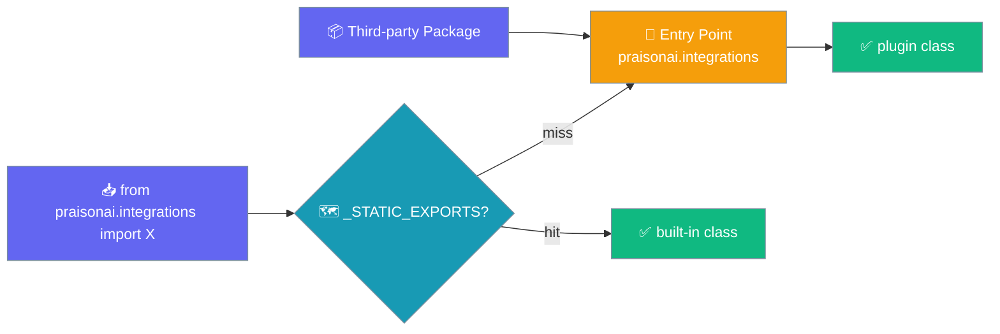
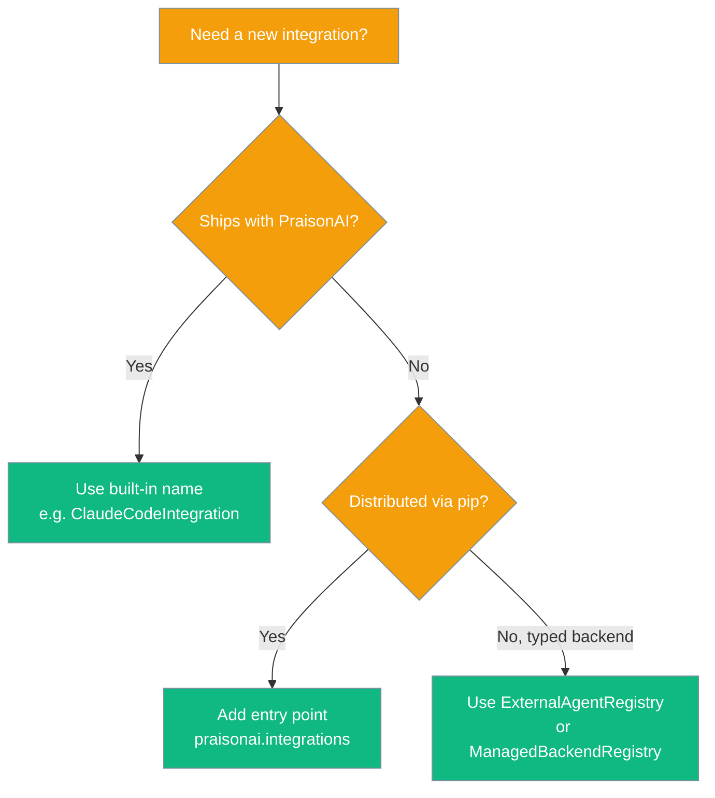
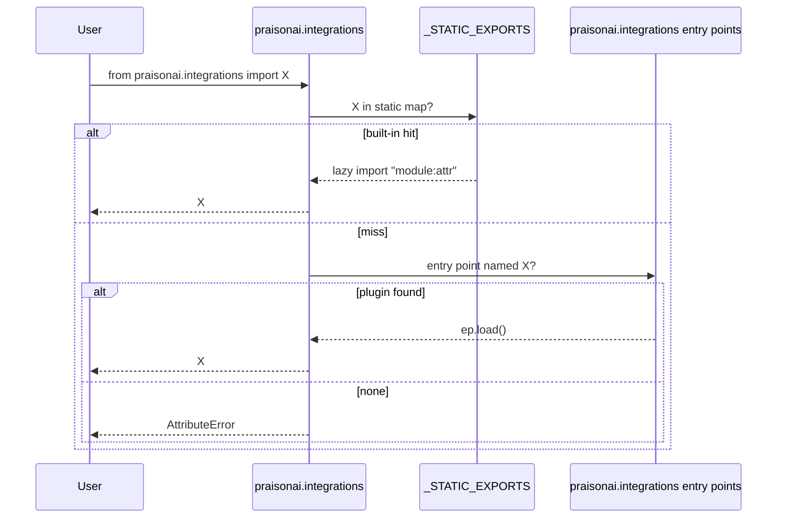

```python
from praisonai.integrations import ClaudeCodeIntegration

integration = ClaudeCodeIntegration(workspace="/path/to/project")
result = await integration.execute("Refactor this module")
```

Import any built-in or plugin-registered integration straight from `praisonai.integrations` — a static export map serves built-ins, and the `praisonai.integrations` entry-point group adds third-party names.

<Note>
**Rewritten for [PraisonAI PR #4651](https://github.com/MervinPraison/PraisonAI/pull/4651).** The old `IntegrationRegistry` class, `get_integrations_registry()`, `INTEGRATIONS_REGISTRY`, and `.get_by_attr()` were **removed**. The public surface is now a static `name -> "module:attr"` map plus an entry-point lookup, both inside `praisonai/integrations/__init__.py`. Importing every built-in name and every plugin name works exactly as before — only the internal registry machinery changed. See [Migration](#migration-from-the-old-registry).
</Note>

Integration Registry lets third-party developers add custom CLI tools, managed agents, and agent backends to PraisonAI, importable from a single module.


```mermaid
graph LR
    A[📦 Third-party Package] --> B[🔌 Entry Point\npraisonai.integrations]
    C[📥 from praisonai.integrations import X] --> D{🗺️ _STATIC_EXPORTS?}
    D -->|hit| E[✅ built-in class]
    D -->|miss| B
    B --> F[✅ plugin class]

    classDef package fill:#6366F1,stroke:#7C90A0,color:#fff
    classDef entrypoint fill:#F59E0B,stroke:#7C90A0,color:#fff
    classDef map fill:#189AB4,stroke:#7C90A0,color:#fff
    classDef import fill:#10B981,stroke:#7C90A0,color:#fff

    class A,C package
    class B entrypoint
    class D map
    class E,F import
```

## Choose Your Registration Path

Pick a path based on how the integration ships.


```mermaid
graph TB
    Start[Need a new integration?] --> Q1{Ships with PraisonAI?}
    Q1 -->|Yes| Builtin[Use built-in name<br/>e.g. ClaudeCodeIntegration]
    Q1 -->|No| Q2{Distributed via pip?}
    Q2 -->|Yes| Plugin[Add entry point<br/>praisonai.integrations]
    Q2 -->|No, typed backend| Typed[Use ExternalAgentRegistry<br/>or ManagedBackendRegistry]

    classDef q fill:#F59E0B,stroke:#7C90A0,color:#fff
    classDef done fill:#10B981,stroke:#7C90A0,color:#fff
    class Start,Q1,Q2 q
    class Builtin,Plugin,Typed done
```

---

## Quick Start

<Steps>
<Step title="Use a built-in integration">
```python
from praisonai.integrations import ClaudeCodeIntegration

integration = ClaudeCodeIntegration(workspace="/path/to/project")
```
</Step>

<Step title="Distribute as a pip plugin">
```toml
# your-plugin/pyproject.toml
[project.entry-points."praisonai.integrations"]
acme = "acme_praison:AcmeIntegration"
```

```python
# after `pip install your-plugin` — no praisonai code changes needed
from praisonai.integrations import acme
integration = acme(workspace="/path/to/project")
```

The left-hand side (`acme`) is the name users import; the right-hand side is the dotted path to the class. Names that collide with a built-in are ignored — built-ins always win.
</Step>
</Steps>

<Warning>
Third-party discovery via the `praisonai.integrations` entry-point group requires [PraisonAI PR #4154](https://github.com/MervinPraison/PraisonAI/pull/4154) (2026-08-20) or later. On earlier releases the group was silently ignored — `from praisonai.integrations import my_plugin` raised `AttributeError`. If discovery seems to do nothing, upgrade.
</Warning>

---

## How It Works


```mermaid
sequenceDiagram
    participant User
    participant Mod as praisonai.integrations
    participant Map as _STATIC_EXPORTS
    participant EP as praisonai.integrations entry points

    User->>Mod: from praisonai.integrations import X
    Mod->>Map: X in static map?
    alt built-in hit
        Map-->>Mod: lazy import "module:attr"
        Mod-->>User: X
    else miss
        Mod->>EP: entry point named X?
        alt plugin found
            EP-->>Mod: ep.load()
            Mod-->>User: X
        else none
            Mod-->>User: AttributeError
        end
    end
```

- `__getattr__` on `praisonai.integrations` first checks the static `_STATIC_EXPORTS` map (`name -> "module:attr"`), lazily importing the owning module on first access.
- If the name isn't a built-in, it's looked up in the `praisonai.integrations` entry-point group and `ep.load()`-ed.
- Unknown names raise `AttributeError` (native Python behaviour).
- Dunder / underscore-prefixed submodule names (e.g. `from praisonai.integrations import base`) fall through to normal import machinery.

### Precedence

Built-ins always win because they are served by `_STATIC_EXPORTS` **before** the entry-point lookup runs. A plugin may only *add* names, never replace a shipped one.

| Source | When resolved | On name collision |
|---|---|---|
| Built-in (`_STATIC_EXPORTS`) | Checked first in `__getattr__` | Wins — plugin never consulted |
| Third-party entry-point plugin | Only if no static-map hit | Cannot shadow a built-in |

---

## Available built-in names

Every key below imports directly: `from praisonai.integrations import <name>`.

### CLI Tools
- `BaseCLIIntegration` — base class for CLI tools
- `CLIExecutionError` — CLI execution error class
- `get_available_integrations` — list available integrations
- `ClaudeCodeIntegration` — Claude Code CLI
- `GeminiCLIIntegration` — Gemini CLI
- `CodexCLIIntegration` — Codex CLI
- `CursorCLIIntegration` — Cursor CLI

### Managed Agents
- `ManagedAgent` (alias `ManagedAgentIntegration`) — managed agent interface
- `AnthropicManagedAgent` — Anthropic managed agent
- `ManagedConfig` (alias `ManagedBackendConfig`) — managed agent configuration

### Local & Sandboxed Agents
- `LocalManagedAgent` — local managed agent
- `LocalManagedConfig` — local agent configuration
- `SandboxedAgent` — sandboxed agent execution
- `SandboxedAgentConfig` — sandboxed agent configuration

### Agent Backends
- `HostedAgent` — hosted agent backend
- `HostedAgentConfig` — hosted agent configuration
- `LocalAgent` — local agent backend
- `LocalAgentConfig` — local agent configuration

### Registry Functions
- `ExternalAgentRegistry` — external agent registry (typed source of truth for `--external-agent`)
- `get_registry` — get the external-agent registry
- `register_integration` — register a new integration
- `create_integration` — create an integration instance

<Note>
`list_external_agents` and `external_agent_catalog` cover the separate `praisonai.external_agents` entry-point group (short-name `--external-agent` choices and UI toggles), **not** the `praisonai.integrations` group documented here. See [Single source of truth](/features/external-cli-integrations#single-source-of-truth).
</Note>

---

## Typed backend registries

The two typed registries are unchanged by #4651 and remain the sources of truth for their surfaces:

| Registry | Surface it drives |
|---|---|
| `ExternalAgentRegistry` | the `--external-agent` CLI short names |
| `ManagedBackendRegistry` | the `run_on=` kwarg |

Use these when you need typed enumeration of backends rather than plain module importability.

---

## Migration from the old registry

The internal registry surfaces removed in [PR #4651](https://github.com/MervinPraison/PraisonAI/pull/4651) no longer exist. Update any code that touched them:

| Removed | Replacement |
|---|---|
| `from praisonai.integrations._unified_registry import get_integrations_registry` | `from praisonai.integrations import <name>` (still works for every built-in and plugin) |
| `INTEGRATIONS_REGISTRY` module attribute | none — import the name you need directly |
| `IntegrationRegistry` class | none — built-ins served by `_STATIC_EXPORTS`, plugins via the entry-point group |
| `registry.get_by_attr(module, attr)` | `getattr(praisonai.integrations, attr)` / a normal `import` |
| Typed backend enumeration | `ExternalAgentRegistry` / `ManagedBackendRegistry` |

```python
# ❌ Before (removed)
from praisonai.integrations._unified_registry import get_integrations_registry
cls = get_integrations_registry().get_by_attr(__name__, "ClaudeCodeIntegration")

# ✅ After
from praisonai.integrations import ClaudeCodeIntegration
```

---

## Advanced Usage

### Adding a new built-in backend

Built-in CLI backends (Claude Code, Gemini, Codex, Cursor) are registered from a single canonical module: `praisonai/integrations/_cli_loaders.py`. It exports `BUILTIN_INTEGRATIONS` (short-alias → loader) used by `ExternalAgentRegistry`. Register a new built-in there and add the class to `_STATIC_EXPORTS` in `praisonai/integrations/__init__.py` to make it importable.

<Note>
This is the **in-tree** path. To ship a `--external-agent` short name and UI toggle **out-of-tree** — pip-installable, no PraisonAI code changes — publish to the `praisonai.external_agents` entry-point group instead. See [Register a custom external agent](/features/external-cli-integrations#register-a-custom-external-agent). That group is distinct from `praisonai.integrations` (module importability) documented here.
</Note>

### Build your own namespace

Use `create_lazy_getattr(registry)` from `praisonai._registry` to give your own package the same lazy-loading + entry-point dispatch behaviour:

```python
# my_pkg/__init__.py
from praisonai._registry import PluginRegistry, create_lazy_getattr

_REG = PluginRegistry(entry_point_group="my_pkg.plugins")
__getattr__ = create_lazy_getattr(_REG)
```

`PluginRegistry.has(name) -> bool` (added in #4651) is a cheap, load-free membership check you can use before triggering a lazy import.

---

## Best Practices

<AccordionGroup>
<Accordion title="Import from the package root, not submodules">
Use the public surface so you get built-in-vs-plugin resolution:

```python
# ✅ Good
from praisonai.integrations import ClaudeCodeIntegration

# ❌ Bad — internal module path, not the public API
from praisonai.integrations.claude_code import ClaudeCodeIntegration
```
</Accordion>

<Accordion title="Never reuse a built-in name">
Built-ins are served by `_STATIC_EXPORTS` before the entry-point lookup runs, so a plugin sharing a built-in name is never reached. Pick a name unique to your package.
</Accordion>

<Accordion title="Prefer typed registries for enumeration">
When you need to *list* backends (not just import one), use `ExternalAgentRegistry` / `ManagedBackendRegistry` — they own the `--external-agent` and `run_on=` surfaces.
</Accordion>

<Accordion title="Upgrade for entry-point discovery">
Plugin discovery needs PR #4154 or later. On older releases, only built-ins resolve.
</Accordion>
</AccordionGroup>

---

## Related

<CardGroup cols={2}>
<Card title="Model Provider Plugins" icon="plug" href="/features/model-provider-plugins">
  Same static-map + entry-point + built-ins-win pattern for model → provider
</Card>
<Card title="Framework Adapter Plugins" icon="plug" href="/features/framework-adapter-plugins">
  Plugin system for multi-agent frameworks
</Card>
</CardGroup>
