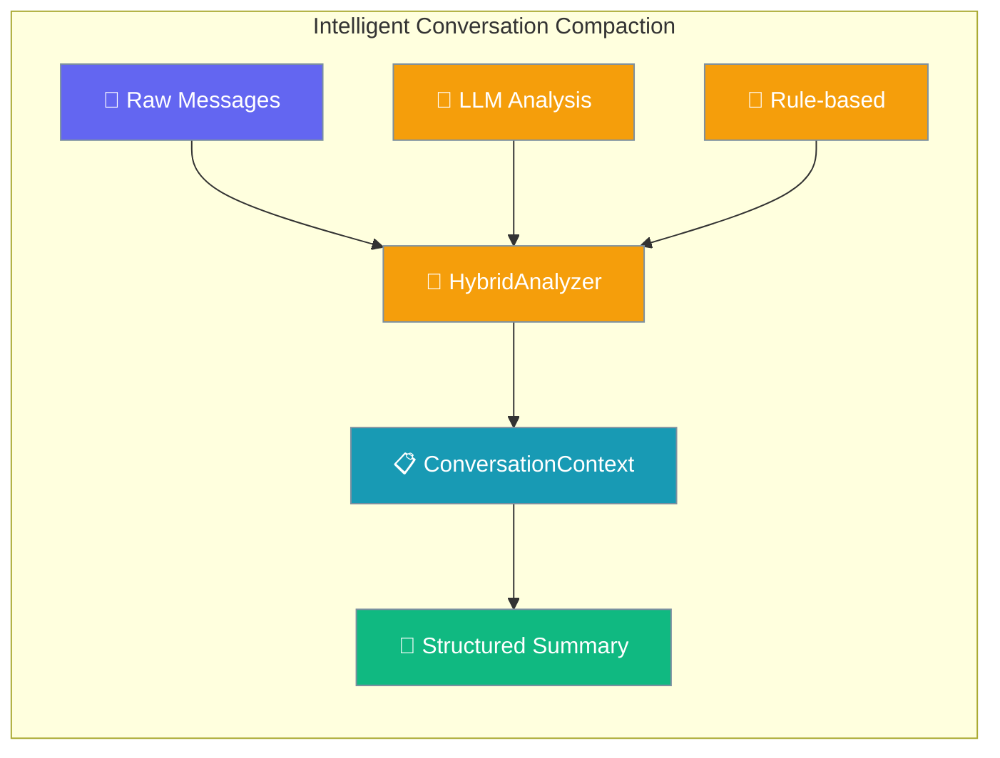
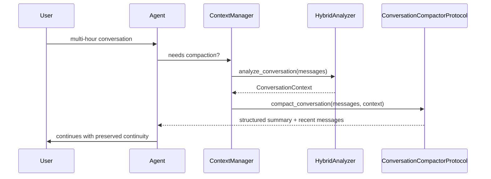
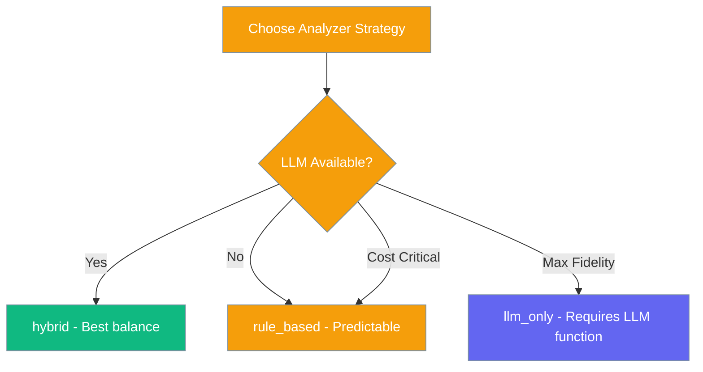

Intelligent Conversation Compaction extracts the conversation's topic, current goal, key decisions, and action items into a structured summary that preserves narrative continuity.



## Quick Start

<Steps>
<Step title="Enable on Agent via ManagerConfig">
```python
from praisonaiagents import Agent, ManagerConfig

agent = Agent(
    name="LongChat",
    instructions="Help the user across many turns.",
    context=ManagerConfig(
        auto_compact=True,
        strategy="conversation",
        conversation_compaction=True,
        conversation_analyzer_strategy="hybrid",
        conversation_min_compaction_ratio=0.3,
    ),
)

agent.start("Let's design a new product over the next few hours...")
```
</Step>

<Step title="Low-Level Class">
```python
from praisonaiagents import ConversationOptimizer

optimizer = ConversationOptimizer(
    analyzer_strategy="hybrid",
    preserve_recent=5,
    min_compaction_ratio=0.3,
)
compacted_messages, stats = optimizer.optimize(messages, target_tokens=4000)
```
</Step>

<Step title="Direct API for full control">
```python
from praisonaiagents import (
    get_conversation_analyzer,
    get_conversation_compactor,
)

analyzer = get_conversation_analyzer(strategy="hybrid")
compactor = get_conversation_compactor(analyzer, min_compaction_ratio=0.3)

compacted, context = compactor.compact_conversation(
    messages,
    target_tokens=4000,
    preserve_recent=5,
)
print(context.main_topic, context.current_goal, context.key_decisions)
```
</Step>
</Steps>

---

## How It Works



**Analyzer Strategy Decision:**



| Strategy | Uses LLM? | When to use |
|----------|-----------|-------------|
| `hybrid` (default) | LLM with rule-based fallback | Best balance — recommended |
| `rule_based` | No | Predictable / no extra LLM cost |
| `llm_only` | Yes (required) | Highest fidelity, requires `llm_analyze_fn` |

---

## ConversationContext Shape

| Field | Type | Description |
|-------|------|-------------|
| `main_topic` | `str` | Primary conversation topic |
| `current_goal` | `str` | User's current objective |
| `progress_summary` | `str` | Progress made towards goal |
| `key_decisions` | `List[str]` | Important decisions made |
| `important_facts` | `List[str]` | Critical factual information |
| `action_items` | `List[str]` | Next steps or todo items |
| `user_preferences` | `List[str]` | Expressed user preferences |
| `tool_results_summary` | `List[str]` | Summaries of tool outputs |
| `conversation_tone` | `str` | Tone: casual, professional, technical |
| `original_message_count` | `int` | Messages before compaction |
| `compacted_message_count` | `int` | Messages after compaction |
| `compaction_timestamp` | `float` | When compaction occurred |

<Note>
The protocol classes were renamed in PR #1899 to `ConversationAnalyzerProtocol` and `ConversationCompactorProtocol`. The old unsuffixed names (`ConversationAnalyzer`, `ConversationCompactor`) remain as deprecated backward-compatible aliases.
</Note>

**`.to_summary_message()` example output:**
```
[💬 **Conversation Summary** - 47 messages compacted]

📋 **Topic**: Product design for developer tools
🎯 **Current Goal**: Create wireframes for the main dashboard
📈 **Progress**: Defined user personas, sketched initial layouts
🔑 **Key Decisions**:
• Using React with TypeScript
• Focus on mobile-first design
• Integrate with GitHub API
💡 **Important Context**:
• Users prefer dark mode interface
• Performance is critical for large repos
✅ **Action Items**:
• Finalize color scheme
• Create interactive prototype
⚙️ **User Preferences**: minimal UI, keyboard shortcuts, offline support
```

---

## ManagerConfig Fields

| Field | Type | Default | Description |
|-------|------|---------|-------------|
| `conversation_compaction` | `bool` | `False` | Enable intelligent conversation compaction |
| `conversation_analyzer_strategy` | `str` | `"hybrid"` | `"hybrid"`, `"rule_based"`, or `"llm_only"` |
| `conversation_min_compaction_ratio` | `float` | `0.3` | Skip compaction if savings below this ratio |

---

## OptimizerStrategy.CONVERSATION

Use `strategy="conversation"` for:
- **Long conversations with topic evolution** — preserves narrative flow better than basic summarization
- **Multi-hour planning sessions** — tracks decisions and action items across topic changes
- **Iterative development** — maintains context of completed work and next steps

**When to use different strategies:**
- `strategy="conversation"` → Structured summaries with topic/goal tracking
- `strategy="smart"` → Adaptive optimization (pruning, sliding window, etc.)  
- `strategy="summarize"` → Simple LLM summarization without structure

---

## Common Patterns

**Multi-hour planning sessions:**
```python
agent = Agent(
    name="ProductPlanner",
    instructions="Help design products over extended sessions.",
    context=ManagerConfig(
        auto_compact=True,
        strategy="conversation",
        conversation_compaction=True,
        conversation_min_compaction_ratio=0.3,
    ),
)
```

**Agent handoff with context preservation:**
```python
# First agent analyzes conversation
analyzer = get_conversation_analyzer(strategy="hybrid")
context = analyzer.analyze_conversation(messages)

# Pass structured context to new agent
new_agent.start(f"""
Continue this conversation about {context.main_topic}.
Current goal: {context.current_goal}
Progress: {context.progress_summary}
Recent decisions: {'; '.join(context.key_decisions[-3:])}
""")
```

**Recover from ineffective basic summarization:**
```python
# If basic summarization lost important context
compactor = get_conversation_compactor(
    analyzer=get_conversation_analyzer("hybrid"),
    min_compaction_ratio=0.3
)
recovered_messages, rich_context = compactor.compact_conversation(
    original_messages,
    target_tokens=4000,
    preserve_recent=5
)
```

---

## Best Practices

<AccordionGroup>

<Accordion title="Keep min_compaction_ratio >= 0.3">
Setting the minimum compaction ratio to at least 30% ensures summaries provide meaningful token savings. Lower ratios may waste computational resources on minimal gains.
</Accordion>

<Accordion title="Use hybrid unless you have strong reasons">
The `hybrid` strategy provides the best balance of quality and reliability. Use `rule_based` only when LLM costs are prohibitive, and `llm_only` only when maximum fidelity is critical.
</Accordion>

<Accordion title="preserve_recent=5 is a good default">
Preserving the last 5 messages maintains immediate context while allowing effective compaction. Increase this for tool-heavy conversations where recent outputs are critical.
</Accordion>

<Accordion title="Inspect key_decisions after compaction">
Always verify that critical decisions were captured correctly by checking `context.key_decisions`. This helps catch cases where important information might be lost.
</Accordion>

</AccordionGroup>

---

## Related

<CardGroup cols={2}>
<Card title="LLM Context Compression" icon="compress" href="/docs/features/llm-context-compression">
  LLM-driven compression with session lineage and head/tail protection
</Card>
<Card title="Context Optimizer" icon="settings" href="/docs/features/optimizer">
  Overview of all optimization strategies including conversation compaction
</Card>
<Card title="Context Strategies" icon="flow-arrow" href="/docs/features/context-strategies">
  Choosing the right optimization approach for your use case
</Card>
<Card title="Context Compaction" icon="package" href="/docs/features/context-compaction">
  Basic compaction strategies and when to use intelligent compaction
</Card>
</CardGroup>