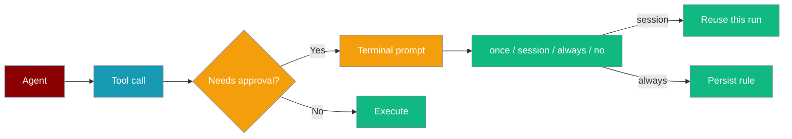
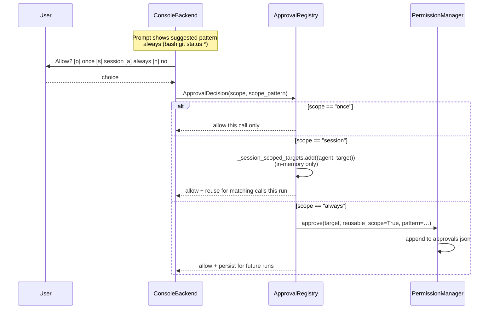
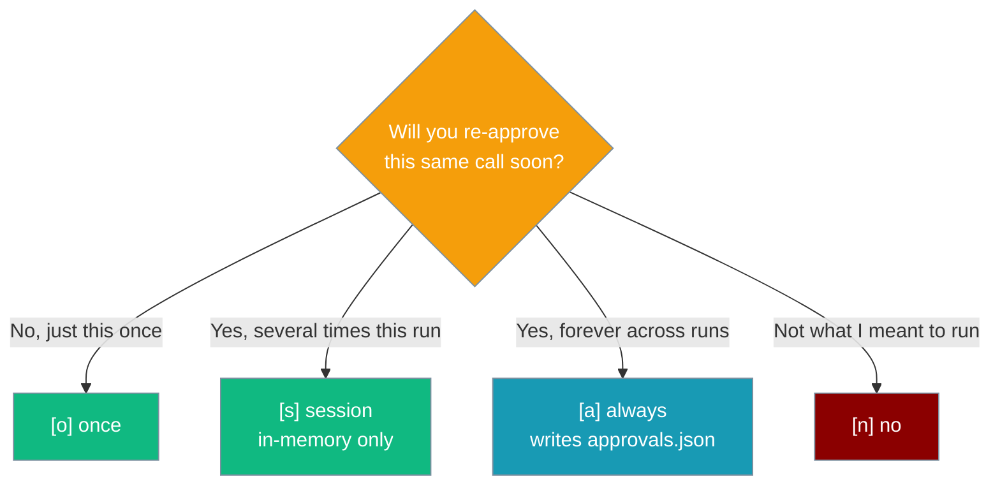
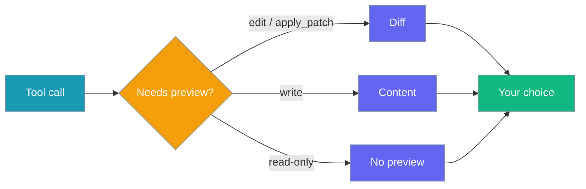
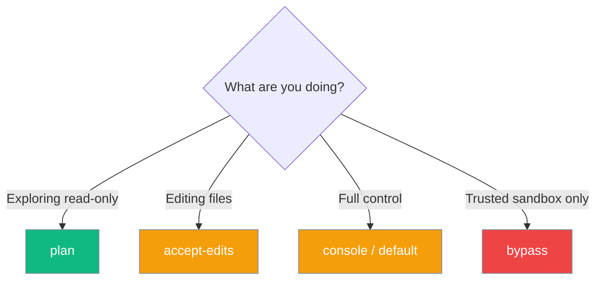

Interactive approval is now the **default** for dangerous built-in tools — no configuration needed. When an agent calls a sensitive or external tool, PraisonAI pauses and asks you before it runs. Your choices can be saved as project rules for next time. See [Approval](/docs/features/approval) for the full list of gated tools and bypass options.

```python
from praisonaiagents import Agent

agent = Agent(
    name="Coder",
    instructions="Edit files as requested",
    approval=True,
)
agent.start("Refactor utils.py")
```

The user requests a change; PraisonAI pauses on dangerous tools until they allow or deny in the terminal.



## Quick Start

<Steps>

<Step title="Simple Usage">

```python
from praisonaiagents import Agent

agent = Agent(
    name="Coder",
    instructions="Edit files as requested",
    approval=True,
)
agent.start("Refactor utils.py")
```

</Step>

<Step title="With Configuration">

```bash
praisonai --approval console run "Show me git status"
```

A prompt appears:

```
🔒 Tool Approval Required
Function: execute_command
Risk Level: MEDIUM
Agent: Coder
Arguments:
  command: git status -s

Allow execute_command?  [o] once   [s] this session   [a] always (bash:git status *)   [n] no
Choice [o/s/a/n] (n):
```

Each key chooses **how long** the approval lasts:

- `[o] once` — approve this exact call and prompt again next time (default; backward compatible).
- `[s] session` — auto-approve matching calls (same permission target) for the rest of this run. **Never persisted** — restarting the process starts over.
- `[a] always` — persist an allow-rule to `approvals.json`. The suggested pattern in parentheses (e.g. `bash:git status *`, `edit:src/app.py`) is what gets saved; it is auto-derived from the tool + arguments.
- `[n] no` — deny (also selected on Ctrl-C / EOF).

<Note>
The prompt no longer offers a single "allow ALL uses of this tool" key. Author a blanket `bash:*` rule with `praisonai permissions allow "bash:*"` when you need one.
</Note>

</Step>

</Steps>

## When approval is required

Approval runs when **any** of these apply:

- The agent has `approval=True` (or a CLI `--approval` backend)
- The tool is in the default dangerous-tools list (e.g. `bash`, `write`, `delete`)
- The tool has `trust_level == "external"` in the tool registry



## Scope choice

Four options in one row — this diagram picks the right one.



| Choice | Where it lives | Scope key | Survives restart? |
|--------|----------------|-----------|-------------------|
| `[o] once` | Nothing persisted | Cache key `(tool_name, sha256(args))` (existing per-call cache) | No |
| `[s] session` | In-memory `ApprovalRegistry._session_scoped_targets` | `(agent_name, permission_target)` | **No** — vanishes when the process ends |
| `[a] always` | `approvals.json` via `PermissionManager` | Suggested pattern (e.g. `bash:git status *`) with `reusable_scope=True` | **Yes** |

<Note>
A nameless `always` grant degrades to `session`. An `always` grant without an `agent_name` would match *any* later agent making the same target call, so the registry refuses to persist it and keeps it in-memory for this run only — which is why an "always" click sometimes doesn't outlive the run.
</Note>

<Note>
`session` grants are keyed by `(agent_name, permission_target)` and live in an in-memory set. `clear_approved()` wipes them, and they are never written to `approvals.json`.
</Note>

## How the suggested pattern is derived

The `always (…)` hint isn't magic — it maps the tool + arguments to a reusable target.

| Tool | Mapping | Example target |
|------|---------|----------------|
| `execute_command`, `acp_execute_command` | `bash:<command>` (first non-empty of `command`/`cmd`/`code`/`query`) | `bash:git status -s` |
| `edit_file`, `acp_edit_file` | `edit:<path>` | `edit:src/app.py` |
| `write_file`, `acp_create_file` | `write:<path>` | `write:src/new.py` |
| `delete_file`, `acp_delete_file` | `delete:<path>` | `delete:tmp/old.log` |
| `move_file` | `move:<src>` (uses `src`, not `dst`) | `move:a/old.py` |
| `copy_file` | `copy:<src>` (uses `src`, not `dst`) | `copy:a/x.py` |
| `apply_patch` | `tool:apply_patch` (**not** an `edit:` target) | `tool:apply_patch` |
| Anything else | `tool:<tool_name>` | `tool:scrape_page` |

<Warning>
`apply_patch` stays `tool:apply_patch` — it takes multi-file patch text, so there is no stable path to scope to. Pressing `[a]` persists `tool:apply_patch`, which covers **every** future `apply_patch` call regardless of file. If you want per-file scoping, use `edit_file` instead.
</Warning>

## Session-only workflow

Press `[s]` to auto-approve a repeated call for the rest of the run — nothing is written to disk.

```python
from praisonaiagents import Agent

agent = Agent(
    name="Coder",
    instructions="Fix the failing tests. Use `pytest` to check as you go.",
    approval=True,   # console prompt is the default
)

agent.start("Fix the broken tests in tests/unit")
# First `bash:pytest tests/unit` call → prompt appears.
# Press [s] once → every later `bash:pytest tests/unit` in this run is auto-approved.
# Close the process → next run prompts again from scratch.
```

Press `[a]` instead when the grant should persist across runs.

```python
# Same agent, same task — press [a] instead of [s].
# The prompt suggests "always (bash:pytest *)" — press Enter to accept.
# On the next run: pytest calls no longer prompt.
# Undo with:   praisonai permissions revoke "bash:pytest *"
```

## Change Preview

Before you press `[a]` on a file-mutating tool, PraisonAI prints a preview so you approve the actual change — not just the tool name.

For `edit` / `apply_patch` (unified diff supplied by the caller):

```
Preview (diff):
--- a/utils.py
+++ b/utils.py
@@ -1,3 +1,3 @@
-def add(a, b): return a+b
+def add(a: int, b: int) -> int: return a + b
```

For `write` (up to 2000 chars, truncated after):

```
Preview (content to utils.py):
def add(a: int, b: int) -> int:
    return a + b
```

No preview is shown for read-only or non-file tools.



## Approval modes



| CLI flag | `PermissionMode` | Value | Behaviour |
|----------|------------------|-------|-----------|
| `--approval console` | `DEFAULT` | `default` | Prompt for each sensitive call |
| `--approval plan` | `PLAN` | `plan` | Block write, edit, delete, bash, shell |
| `--approval accept-edits` | `ACCEPT_EDITS` | `accept_edits` | Auto-approve edit/write tools |
| `--approval bypass` | `BYPASS` | `bypass_permissions` | Skip all checks |

<Warning>
The CLI uses `--approval bypass` but the enum value is `bypass_permissions`.
</Warning>

## Persistence

Press `[a]` to write an allow-rule to `approvals.json` via `PermissionManager` (scoped to the approving agent). The suggested pattern (e.g. `bash:git status *`, `edit:utils.py`) is what gets saved:

| Choice | Scope | Persisted pattern example |
|--------|-------|---------------------------|
| `[o] once` | This call only | *(not persisted)* |
| `[s] this session` | In-memory only — nothing written | *(not persisted)* |
| `[a] always` | Narrow command-prefix / path | `bash:git status *`, `edit:utils.py`, `write:.env` |
| `[n] no` | This call only | *(not persisted)* |

`[a]` uses the shared `suggest_scope_pattern` helper so the CLI, YAML `--allow`/`--deny`, and Python `PermissionManager` all scope identically. Compound commands (`&&`, `|`, `;`, `$(...)`) fall back to a **literal single-use** pattern so a persisted rule can only match the exact invocation you approved. For a blanket `<tool>:*` rule, author it directly with `praisonai permissions allow "bash:*"`.

Session grants live in an in-memory `_session_scoped_targets` set and are cleared by `clear_approved()` at run teardown. Always grants persist across restarts and survive `clear_approved()`.

<Tip>
Tune the derived pattern with [Reusable Approval Scopes](/docs/features/reusable-approval-scopes) — call `PermissionManager.suggest_scope_pattern(target)` for a custom UI, or hand-author `bash:git *` via `praisonai permissions allow`.
</Tip>

Manage rules with:

```bash
praisonai permissions list
praisonai permissions allow "bash:git *"
```

| File | Shared? |
|------|---------|
| `rules.json` | Yes — commit for team rules |
| `approvals.json` | No — local session data |

<Accordion title="approvals.json entry format">
Each entry carries `pattern`, `approved`, `scope`, `created_at`, `expires_at`, `agent_name`, and a `derived` flag. `derived: true` marks approvals whose `pattern` was auto-generated by [reusable command-prefix scopes](/docs/features/permissions#reusable-command-prefix-approvals) — user-edited or hand-authored patterns save with `derived: false`. Old files without the field load cleanly (`derived` defaults to `False`).
</Accordion>

<Tip>
When building a custom UI or CLI wrapper, call `PermissionManager.suggest_scope_pattern(target)` to get a derived prefix glob (e.g. `bash:git status *` for `bash:git status -s`) before saving a session or always approval. Show the suggestion to the user, let them tweak it, then pass the final value as `pattern=` to `approve()`. See [Reusable Approval Scopes](/docs/features/reusable-approval-scopes).
</Tip>

## Non-interactive and CI

```bash
praisonai --yes --approval console run "Check deployment"
PRAISONAI_NON_INTERACTIVE=1 praisonai --approval console run "Check deployment"
```

Without a TTY, prompts default to **deny** so CI pipelines fail closed.

## Best Practices

<AccordionGroup>

<Accordion title="Start with plan for new repos">
Use `--approval plan` until you trust the agent's behaviour in a codebase.
</Accordion>

<Accordion title="Review external tools">
Tools marked `external` always prompt — verify third-party integrations before allowing.
</Accordion>

<Accordion title="Share rules.json in git">
Team-wide allow/deny patterns belong in version control.
</Accordion>

<Accordion title="[a] always narrows automatically — no blanket-tool option any more">
The suggested pattern shown in parentheses (`always (bash:git status *)`) is the exact rule that will be saved — it covers every `git status …` variant but never expands to `git push` or other subcommands. There is no longer a blanket "allow ALL uses of `bash`" keystroke in the interactive prompt — grant blanket access explicitly via `praisonai permissions allow "bash:*"` when you actually want it.
</Accordion>

<Accordion title="Prefer [s] session over [a] always for one-off runs">
`[s]` grants stay in memory and vanish when the process ends — ideal for a repeated call in a single task. Reserve `[a] always` for calls you want persisted across every future run.
</Accordion>

<Accordion title="Skim the change preview before pressing [a]">
The preview is your last chance to catch an unintended edit. It renders for `edit`, `write`, and `apply_patch` so you approve the actual change, not just the tool name.
</Accordion>

<Accordion title="Give a name to your agent before pressing [a]">
A nameless `always` grant can't be persisted — it would match any later agent, so the registry keeps it in-memory for this run only. Set `Agent(name=...)` so `[a]` writes a durable, agent-scoped rule.
</Accordion>

</AccordionGroup>

## Bot/chat-channel approvals

This page covers the CLI/terminal approval flow. When running PraisonAI on Telegram, Slack, or Discord, approvals render as interactive buttons and are actor-bound — only the requester and configured admins can resolve them.

<Card title="Interactive Callback Authorization" icon="user-shield" href="/docs/features/interactive-callback-authorization">
  Lock approval buttons to specific users in shared chats — covers Telegram, Slack, and Discord bots.
</Card>

<Card icon="function" href="/docs/sdk/reference/praisonaiagents/modules/permissions">
  `derive_pattern` — shared narrow-pattern derivation used by CLI, YAML, and Python rules
</Card>

## Related

<CardGroup cols={2}>
  <Card title="Permissions CLI" icon="terminal" href="/docs/cli/permissions">
    `praisonai permissions` reference
  </Card>
  <Card title="Permission Modes" icon="shield" href="/docs/features/permission-modes">
    All modes for agents and CLI
  </Card>
  <Card title="Permissions Module" icon="shield-halved" href="/docs/features/permissions">
    Python SDK API
  </Card>
</CardGroup>
