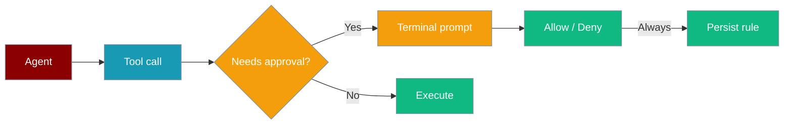
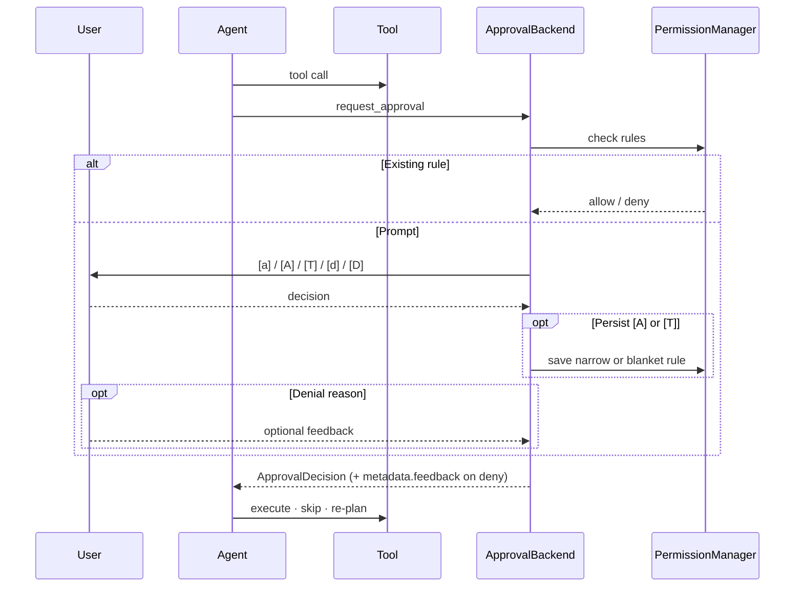
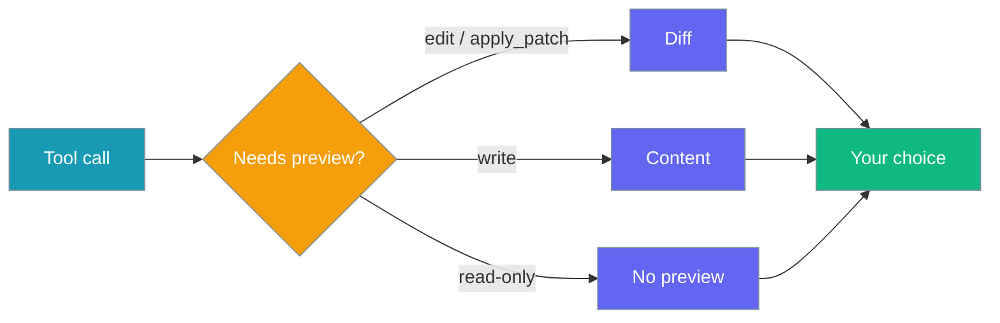
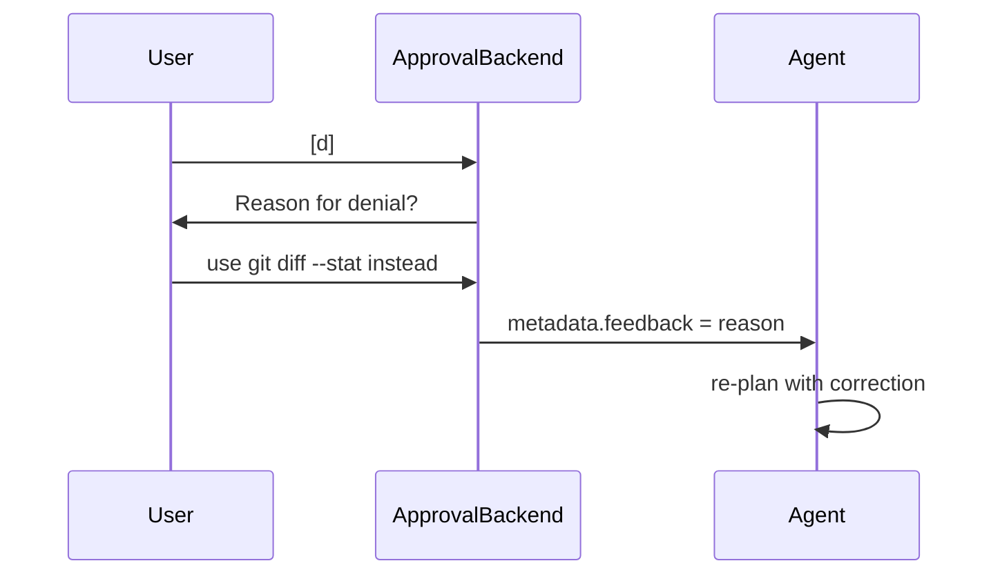
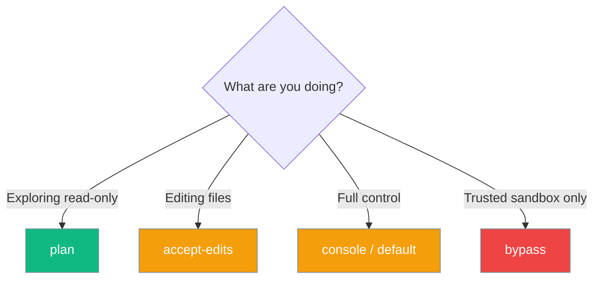

Interactive approval is now the **default** for dangerous built-in tools — no configuration needed. When an agent calls a sensitive or external tool, PraisonAI pauses and asks you before it runs. Your choices can be saved as project rules for next time. See [Approval](/docs/features/approval) for the full list of gated tools and bypass options.

```python
from praisonaiagents import Agent

agent = Agent(
    name="Coder",
    instructions="Edit files as requested",
    approval=True,
)
agent.start("Refactor utils.py")
```

The user requests a change; PraisonAI pauses on dangerous tools until they allow or deny in the terminal.



## Quick Start

<Steps>

<Step title="Simple Usage">

```python
from praisonaiagents import Agent

agent = Agent(
    name="Coder",
    instructions="Edit files as requested",
    approval=True,
)
agent.start("Refactor utils.py")
```

</Step>

<Step title="With Configuration">

```bash
praisonai --approval console run "Show me git status"
```

A prompt appears:

```
⚠ Tool Approval Required
Tool: bash(command='git status -s')
Risk: medium
Agent: Coder

Options:
  [a] Allow once
  [A] Always allow this command (bash:git status *)
  [T] Always allow ALL uses of bash (bash:*)
  [d] Deny
  [D] Always deny (persist rule)

Your choice:
```

<Note>
`[A]` persists the **narrowest reasonable** pattern (command-prefix for shell tools, first-arg literal for others). Only the explicit `[T]` choice grants blanket `bash:*`.
</Note>

</Step>

</Steps>

## When approval is required

Approval runs when **any** of these apply:

- The agent has `approval=True` (or a CLI `--approval` backend)
- The tool is in the default dangerous-tools list (e.g. `bash`, `write`, `delete`)
- The tool has `trust_level == "external"` in the tool registry



## Change Preview

Before you press `[A]` on a file-mutating tool, PraisonAI prints a preview so you approve the actual change — not just the tool name.

For `edit` / `apply_patch` (unified diff supplied by the caller):

```
Preview (diff):
--- a/utils.py
+++ b/utils.py
@@ -1,3 +1,3 @@
-def add(a, b): return a+b
+def add(a: int, b: int) -> int: return a + b
```

For `write` (up to 2000 chars, truncated after):

```
Preview (content to utils.py):
def add(a: int, b: int) -> int:
    return a + b
```

No preview is shown for read-only or non-file tools.



## Denial Steering

Pressing `[d]` or `[D]` opens a follow-up prompt for an optional reason, which is passed back to the agent as feedback so it can correct course instead of aborting.

```
Your choice: d
Reason for denial (optional, steers the agent): use `git diff --stat` instead — this diff is too noisy
```

Empty input skips feedback. Non-interactive shells (CI, `PRAISONAI_NON_INTERACTIVE=1`) skip the prompt entirely — the run stays fail-closed and denials carry no feedback.



## Approval modes



| CLI flag | `PermissionMode` | Value | Behaviour |
|----------|------------------|-------|-----------|
| `--approval console` | `DEFAULT` | `default` | Prompt for each sensitive call |
| `--approval plan` | `PLAN` | `plan` | Block write, edit, delete, bash, shell |
| `--approval accept-edits` | `ACCEPT_EDITS` | `accept_edits` | Auto-approve edit/write tools |
| `--approval bypass` | `BYPASS` | `bypass_permissions` | Skip all checks |

<Warning>
The CLI uses `--approval bypass` but the enum value is `bypass_permissions`.
</Warning>

## Persistence

Press `[A]`, `[T]`, or `[D]` to write a `PermissionRule` to `.praisonai/permissions/rules.json` (priority `100`, scoped to the project directory). The two allow choices persist different scopes:

| Choice | Scope | Persisted pattern example |
|--------|-------|---------------------------|
| `[A] Always allow this command` | Narrow command-prefix | `bash:git status *`, `edit:utils.py`, `write:.env` |
| `[T] Always allow ALL uses of <tool>` | Blanket | `bash:*`, `edit:*`, `write:*` |

`[A]` uses the shared `derive_pattern` helper so the CLI, YAML `--allow`/`--deny`, and Python `PermissionManager` all scope identically. Compound commands (`&&`, `|`, `;`, `$(...)`) fall back to a **literal single-use** pattern so a persisted rule can only match the exact invocation you approved.

<Tip>
Tune the derived pattern with [Reusable Approval Scopes](/docs/features/reusable-approval-scopes) — call `PermissionManager.suggest_scope_pattern(target)` for a custom UI, or hand-author `bash:git *` via `praisonai permissions allow`.
</Tip>

Manage rules with:

```bash
praisonai permissions list
praisonai permissions allow "bash:git *"
```

| File | Shared? |
|------|---------|
| `rules.json` | Yes — commit for team rules |
| `approvals.json` | No — local session data |

<Accordion title="approvals.json entry format">
Each entry carries `pattern`, `approved`, `scope`, `created_at`, `expires_at`, `agent_name`, and a `derived` flag. `derived: true` marks approvals whose `pattern` was auto-generated by [reusable command-prefix scopes](/docs/features/permissions#reusable-command-prefix-approvals) — user-edited or hand-authored patterns save with `derived: false`. Old files without the field load cleanly (`derived` defaults to `False`).
</Accordion>

<Tip>
When building a custom UI or CLI wrapper, call `PermissionManager.suggest_scope_pattern(target)` to get a derived prefix glob (e.g. `bash:git status *` for `bash:git status -s`) before saving a session or always approval. Show the suggestion to the user, let them tweak it, then pass the final value as `pattern=` to `approve()`. See [Reusable Approval Scopes](/docs/features/reusable-approval-scopes).
</Tip>

## Non-interactive and CI

```bash
praisonai --yes --approval console run "Check deployment"
PRAISONAI_NON_INTERACTIVE=1 praisonai --approval console run "Check deployment"
```

Without a TTY, prompts default to **deny** so CI pipelines fail closed.

## Best Practices

<AccordionGroup>

<Accordion title="Start with plan for new repos">
Use `--approval plan` until you trust the agent's behaviour in a codebase.
</Accordion>

<Accordion title="Review external tools">
Tools marked `external` always prompt — verify third-party integrations before allowing.
</Accordion>

<Accordion title="Share rules.json in git">
Team-wide allow/deny patterns belong in version control.
</Accordion>

<Accordion title="[A] is safe by default — only [T] grants blanket access">
`[A]` scopes to the specific command-prefix (shell tools) or first-arg literal (other tools), while `[T]` is the only path to `<tool>:*` — use `[A]` for daily work and reserve `[T]` for tools you already trust project-wide.
</Accordion>

<Accordion title="Skim the change preview before pressing [A]">
The preview is your last chance to catch an unintended edit. It renders for `edit`, `write`, and `apply_patch` so you approve the actual change, not just the tool name.
</Accordion>

<Accordion title="Give a denial reason instead of pressing Ctrl-C">
A reason turns a rejection into a correction — the agent can re-plan rather than abort the whole run.
</Accordion>

</AccordionGroup>

## Bot/chat-channel approvals

This page covers the CLI/terminal approval flow. When running PraisonAI on Telegram, Slack, or Discord, approvals render as interactive buttons and are actor-bound — only the requester and configured admins can resolve them.

<Card title="Interactive Callback Authorization" icon="user-shield" href="/docs/features/interactive-callback-authorization">
  Lock approval buttons to specific users in shared chats — covers Telegram, Slack, and Discord bots.
</Card>

<Card icon="function" href="/docs/sdk/reference/praisonaiagents/modules/permissions">
  `derive_pattern` — shared narrow-pattern derivation used by CLI, YAML, and Python rules
</Card>

## Related

<CardGroup cols={2}>
  <Card title="Permissions CLI" icon="terminal" href="/docs/cli/permissions">
    `praisonai permissions` reference
  </Card>
  <Card title="Permission Modes" icon="shield" href="/docs/features/permission-modes">
    All modes for agents and CLI
  </Card>
  <Card title="Permissions Module" icon="shield-halved" href="/docs/features/permissions">
    Python SDK API
  </Card>
</CardGroup>
