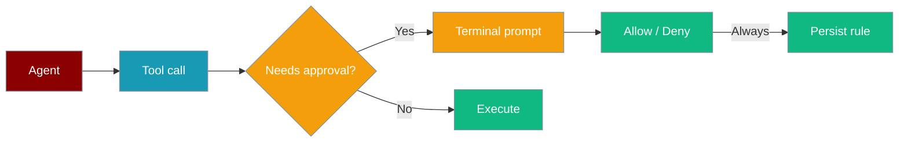
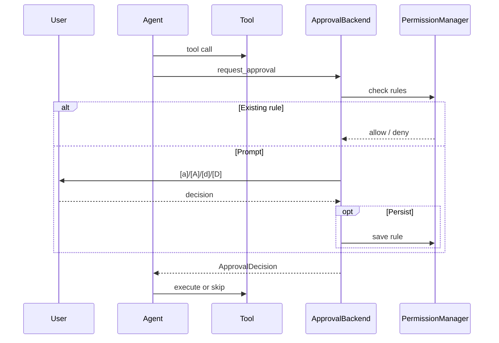
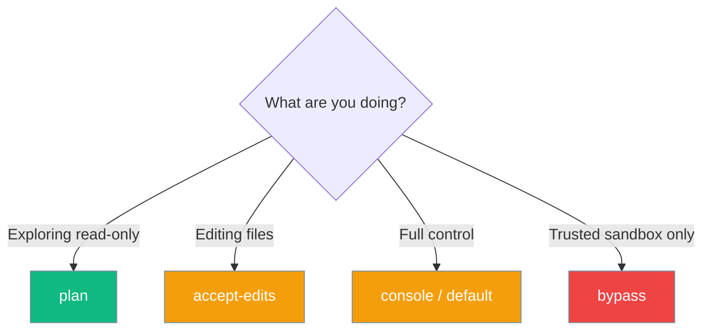

Interactive approval is now the **default** for dangerous built-in tools — no configuration needed. When an agent calls a sensitive or external tool, PraisonAI pauses and asks you before it runs. Your choices can be saved as project rules for next time. See [Approval](/docs/features/approval) for the full list of gated tools and bypass options.

```python
from praisonaiagents import Agent

agent = Agent(
    name="Coder",
    instructions="Edit files as requested",
    approval=True,
)
agent.start("Refactor utils.py")
```

The user requests a change; PraisonAI pauses on dangerous tools until they allow or deny in the terminal.



## Quick Start

<Steps>

<Step title="Simple Usage">

```python
from praisonaiagents import Agent

agent = Agent(
    name="Coder",
    instructions="Edit files as requested",
    approval=True,
)
agent.start("Refactor utils.py")
```

</Step>

<Step title="With Configuration">

```bash
praisonai --approval console run "Refactor utils.py"
```

You will see a prompt like:

```
⚠ Tool Approval Required
Tool: edit(path='utils.py', ...)
Risk: medium
Agent: Coder

Options:
  [a] Allow once
  [A] Always allow (persist rule)
  [d] Deny
  [D] Always deny (persist rule)

Your choice:
```

</Step>

</Steps>

## When approval is required

Approval runs when **any** of these apply:

- The agent has `approval=True` (or a CLI `--approval` backend)
- The tool is in the default dangerous-tools list (e.g. `bash`, `write`, `delete`)
- The tool has `trust_level == "external"` in the tool registry



## Approval modes



| CLI flag | `PermissionMode` | Value | Behaviour |
|----------|------------------|-------|-----------|
| `--approval console` | `DEFAULT` | `default` | Prompt for each sensitive call |
| `--approval plan` | `PLAN` | `plan` | Block write, edit, delete, bash, shell |
| `--approval accept-edits` | `ACCEPT_EDITS` | `accept_edits` | Auto-approve edit/write tools |
| `--approval bypass` | `BYPASS` | `bypass_permissions` | Skip all checks |

<Warning>
The CLI uses `--approval bypass` but the enum value is `bypass_permissions`.
</Warning>

## Persistence

Press `[A]` or `[D]` to write a `PermissionRule` to `.praisonai/permissions/rules.json` (priority `100`, scoped to the project directory). Manage rules with:

<Note>
**Coming soon:** `PermissionManager.approve()` will support `reusable_scope=True` to store a command-prefix glob (e.g. `bash:git status *`) that auto-approves every trailing-arg variant without prompting again. This requires [PraisonAI PR #2576](https://github.com/MervinPraison/PraisonAI/pull/2576). Until then, pass the glob pattern directly: `manager.approve("bash:git status *", True, scope="always")`. See [Reusable Approval Scopes](/docs/features/reusable-approval-scopes).
</Note>

```bash
praisonai permissions list
praisonai permissions allow "bash:git *"
```

| File | Shared? |
|------|---------|
| `rules.json` | Yes — commit for team rules |
| `approvals.json` | No — local session data |

## Non-interactive and CI

```bash
praisonai --yes --approval console run "Check deployment"
PRAISONAI_NON_INTERACTIVE=1 praisonai --approval console run "Check deployment"
```

Without a TTY, prompts default to **deny** so CI pipelines fail closed.

## Best practices

<AccordionGroup>

<Accordion title="Start with plan for new repos">
Use `--approval plan` until you trust the agent's behaviour in a codebase.
</Accordion>

<Accordion title="Review external tools">
Tools marked `external` always prompt — verify third-party integrations before allowing.
</Accordion>

<Accordion title="Share rules.json in git">
Team-wide allow/deny patterns belong in version control.
</Accordion>

</AccordionGroup>

## Bot/chat-channel approvals

This page covers the CLI/terminal approval flow. When running PraisonAI on Telegram, Slack, or Discord, approvals render as interactive buttons and are actor-bound — only the requester and configured admins can resolve them.

<Card title="Interactive Callback Authorization" icon="user-shield" href="/docs/features/interactive-callback-authorization">
  Lock approval buttons to specific users in shared chats — covers Telegram, Slack, and Discord bots.
</Card>

## Related

<CardGroup cols={2}>
  <Card title="Permissions CLI" icon="terminal" href="/docs/cli/permissions">
    `praisonai permissions` reference
  </Card>
  <Card title="Permission Modes" icon="shield" href="/docs/features/permission-modes">
    All modes for agents and CLI
  </Card>
  <Card title="Permissions Module" icon="shield-halved" href="/docs/features/permissions">
    Python SDK API
  </Card>
</CardGroup>
