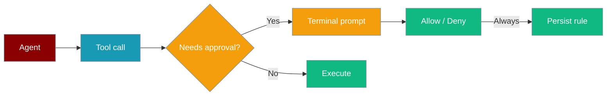

When an agent calls a sensitive or external tool, PraisonAI can pause and ask you before it runs. Your choices can be saved as project rules for next time.



## Quick Start


<Steps>
<Step title="Simple Usage">
```python
from praisonaiagents import Agent

agent = Agent(
    name="Coder",
    instructions="Edit files as requested",
    approval=True,
)
agent.start("Refactor utils.py")
```
</Step>

<Step title="With Configuration">
With the CLI:

```bash
praisonai --approval console run "Refactor utils.py"
```

You will see a prompt like:

```
⚠ Tool Approval Required
Tool: edit(path='utils.py', ...)
Risk: medium
Agent: Coder

Options:
  [a] Allow once
  [A] Always allow (persist rule)
  [d] Deny
  [D] Always deny (persist rule)

Your choice:
```
</Step>
</Steps>


## Best Practices

<AccordionGroup>
  <Accordion title="Start simple">
    Enable the feature with a single parameter before adding configuration. Verify it works, then layer in options.
  </Accordion>
  <Accordion title="Use environment variables for secrets">
    Never hardcode API keys or tokens. Use `os.getenv("KEY_NAME")` to read from environment variables.
  </Accordion>
  <Accordion title="Test with minimal examples first">
    Copy the Quick Start example, run it, then extend it. This confirms your environment is set up correctly.
  </Accordion>
  <Accordion title="Check the logs">
    Set `verbose=True` on your agent to see detailed execution logs when debugging unexpected behavior.
  </Accordion>
</AccordionGroup>

## Related

<CardGroup cols={2}>
  <Card title="Features Overview" icon="grid-2" href="/docs/features">
    Browse all PraisonAI features
  </Card>
  <Card title="Quick Start" icon="rocket" href="/docs/introduction">
    Get started with PraisonAI agents
  </Card>
</CardGroup>
