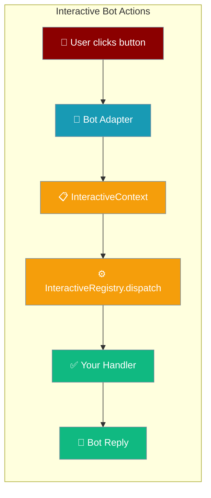
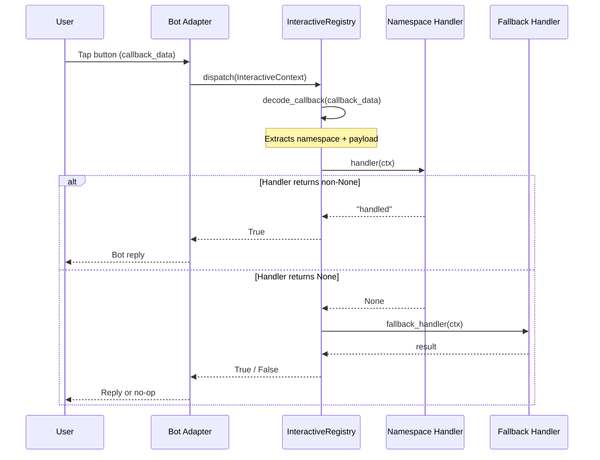
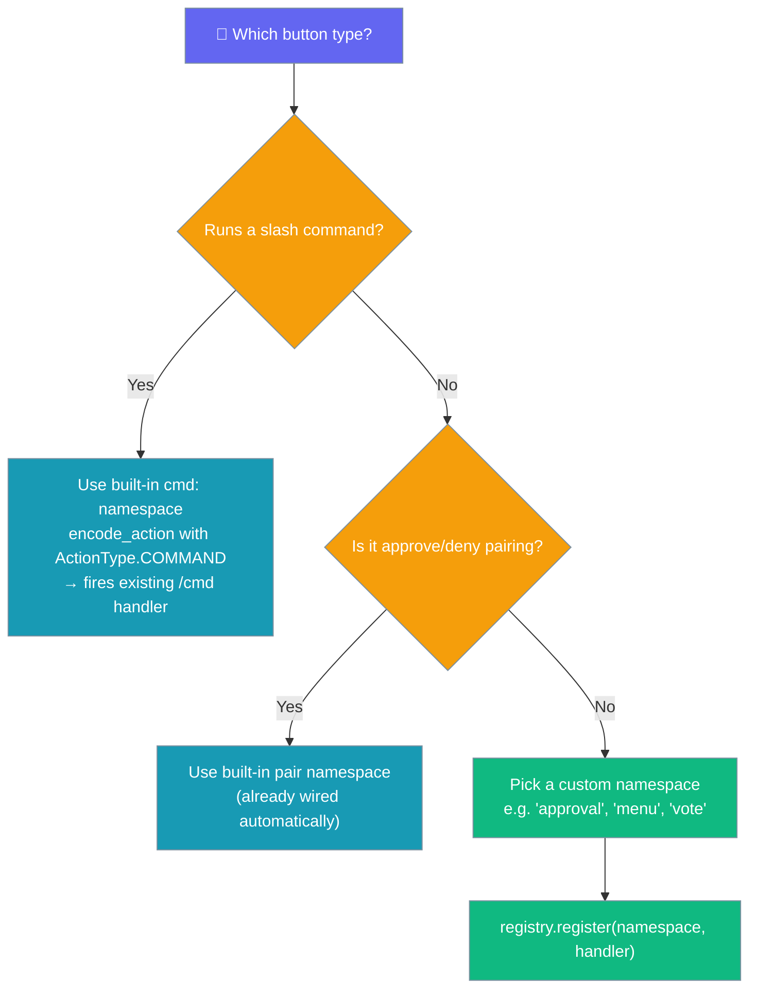

Bots can wire button clicks and select-menu choices to your own async handlers — across Telegram, Discord, and Slack — through a small registry API.

```python
from praisonaiagents import Agent
from praisonai.bots import Bot

agent = Agent(name="ShopBot", instructions="Help customers order")
bot = Bot("telegram", agent=agent)
```

The user taps a button or menu in chat; your registered handler runs and the bot replies.



## Quick Start

<Steps>

<Step title="Use a built-in slash-command button (zero config)">
Buttons wired to slash commands fire automatically — no handler registration needed.

```python
import os
import asyncio
from praisonaiagents import Agent
from praisonaiagents.bots import (
    PresentationButton,
    PresentationAction,
    ActionType,
    MessagePresentation,
    PresentationBlock,
)
from praisonai.bots import TelegramBot

agent = Agent(
    name="assistant",
    instructions="You are a helpful assistant. When asked for help, show a help button.",
)

bot = TelegramBot(
    token=os.environ["TELEGRAM_BOT_TOKEN"],
    agent=agent,
)

help_button = PresentationButton(
    label="📚 Get Help",
    action=PresentationAction(type=ActionType.COMMAND, command="help"),
)

asyncio.run(bot.start())
```

When the user taps **Get Help**, the existing `/help` handler fires automatically via the built-in `command` namespace.
</Step>

<Step title="Register a custom namespace handler">
For your own button logic, create a registry and register an async handler.

```python
import os
import asyncio
from praisonaiagents import Agent
from praisonaiagents.bots import (
    InteractiveContext,
    create_registry,
    encode_action,
    PresentationAction,
    PresentationButton,
    ActionType,
)
from praisonai.bots import TelegramBot

agent = Agent(
    name="assistant",
    instructions="You are a helpful assistant.",
)

registry = create_registry()

async def on_approval(ctx: InteractiveContext) -> str | None:
    payload = ctx.platform_data.get("decoded_payload", {})
    choice = payload.get("value")
    if choice == "yes":
        return "approved"
    elif choice == "no":
        return "denied"
    return None

registry.register("approval", on_approval)

approve_button = PresentationButton(
    label="✅ Approve",
    action=PresentationAction(type=ActionType.CALLBACK, value="yes"),
)
deny_button = PresentationButton(
    label="❌ Deny",
    action=PresentationAction(type=ActionType.CALLBACK, value="no"),
)

approve_callback = encode_action("approval", approve_button.action)
deny_callback = encode_action("approval", deny_button.action)

bot = TelegramBot(
    token=os.environ["TELEGRAM_BOT_TOKEN"],
    agent=agent,
)

asyncio.run(bot.start())
```

`encode_action("approval", ...)` produces `"approval:yes"` / `"approval:no"`. When a user taps the button, `registry.dispatch()` routes the click to `on_approval`.
</Step>

</Steps>

---

## How It Works



| Step | What happens |
|------|-------------|
| **Button tap** | Platform sends `callback_data` string to your bot |
| **Adapter wraps** | Builds an `InteractiveContext` with `user_id`, `message_id`, `chat_id`, and platform-native objects |
| **Registry decodes** | `decode_callback(callback_data)` extracts namespace and payload |
| **Handler runs** | Async handler for matching namespace is called |
| **Fallback** | If no match or handler returns `None`, the fallback handler is tried |

---

## Decoding Rules

`decode_callback(data)` maps raw `callback_data` to a `(namespace, payload)` tuple:

| Input | Namespace | Payload |
|-------|-----------|---------|
| `"cmd:help"` | `"command"` | `{"command": "help"}` |
| `"approval:yes"` | `"approval"` | `{"value": "yes"}` |
| `"pair:approve:telegram:123:abc:deadbeef"` | `"pair"` | `{"value": "approve:telegram:123:abc:deadbeef"}` |
| `"plain"` | `"plain"` | `{}` |
| `""` | `"unknown"` | `{}` |

After `dispatch()`, the registry also writes `decoded_namespace` and `decoded_payload` into `ctx.platform_data` before calling your handler.

---

## Choosing a Namespace Style



---

## Durable callback payload store

When a `reply` / `select` value overflows the channel's inline-callback byte-cap (Telegram's 64 UTF-8 bytes), the framework persists it under a short reference so the exact value round-trips back to your handler.

`TelegramBot` wires this for you — it shares one store between its renderer and the inbound registry. To do it yourself, pass a store to `create_registry`:

```python
from praisonaiagents.bots import create_registry, InMemoryCallbackPayloadStore

store = InMemoryCallbackPayloadStore()
registry = create_registry(store=store)
```

Without a store, overflowing values fall back to the lossy `reply:#<sha1[:16]>` hash and the handler is skipped. See [Interactive Callback Payload Store](/docs/features/interactive-callback-store) for the full flow, configuration, and custom backends.

---

## Platform-Specific Context

Each adapter populates `ctx.platform_data` with native objects so you can access full platform functionality inside your handler.

<AccordionGroup>

<Accordion title="Telegram">
| Key | Type | Description |
|-----|------|-------------|
| `update` | `telegram.Update` | Full update object |
| `context` | `telegram.ext.ContextTypes.DEFAULT_TYPE` | PTB context |
| `query` | `telegram.CallbackQuery` | The callback query that triggered the action |

Access example:
```python
async def my_handler(ctx: InteractiveContext) -> str | None:
    query = ctx.platform_data["query"]
    await query.answer("Processing...")
    return "handled"
```
</Accordion>

<Accordion title="Discord">
| Key | Type | Description |
|-----|------|-------------|
| `interaction` | `discord.Interaction` | The interaction object |

Access example:
```python
async def my_handler(ctx: InteractiveContext) -> str | None:
    interaction = ctx.platform_data["interaction"]
    await interaction.edit_original_response(content="Done!")
    return "handled"
```
</Accordion>

<Accordion title="Slack">
| Key | Type | Description |
|-----|------|-------------|
| `body` | `dict` | Full Block Kit action payload |
| `action` | `dict` | The specific action that was triggered |

Access example:
```python
async def my_handler(ctx: InteractiveContext) -> str | None:
    body = ctx.platform_data["body"]
    action = ctx.platform_data["action"]
    channel = body.get("channel", {}).get("id")
    return "handled"
```
</Accordion>

</AccordionGroup>

---

## Common Patterns

<Tabs>

<Tab title="Slash-command button">
A button that fires an existing slash command — no handler registration needed.

```python
import os
import asyncio
from praisonaiagents import Agent
from praisonaiagents.bots import (
    PresentationButton,
    PresentationAction,
    ActionType,
)
from praisonai.bots import SlackBot

agent = Agent(
    name="assistant",
    instructions="You are a helpful assistant.",
)

status_button = PresentationButton(
    label="📊 Check Status",
    action=PresentationAction(type=ActionType.COMMAND, command="status"),
)

bot = SlackBot(
    token=os.environ["SLACK_BOT_TOKEN"],
    app_token=os.environ["SLACK_APP_TOKEN"],
    agent=agent,
)

asyncio.run(bot.start())
```

Clicking **Check Status** triggers the built-in `/status` command automatically.
</Tab>

<Tab title="Yes / No approval">
Route yes/no button clicks to your own async handler using a custom namespace.

```python
import os
import asyncio
from praisonaiagents import Agent
from praisonaiagents.bots import (
    InteractiveContext,
    create_registry,
    encode_action,
    PresentationAction,
    ActionType,
)
from praisonai.bots import DiscordBot

agent = Agent(
    name="assistant",
    instructions="You are a helpful assistant.",
)

registry = create_registry()

async def on_vote(ctx: InteractiveContext) -> str | None:
    choice = ctx.platform_data.get("decoded_payload", {}).get("value")
    user = ctx.user_id
    if choice == "yes":
        return f"vote:yes:{user}"
    return f"vote:no:{user}"

registry.register("vote", on_vote)

yes_callback = encode_action("vote", PresentationAction(type=ActionType.CALLBACK, value="yes"))
no_callback = encode_action("vote", PresentationAction(type=ActionType.CALLBACK, value="no"))

bot = DiscordBot(
    token=os.environ["DISCORD_BOT_TOKEN"],
    agent=agent,
)

asyncio.run(bot.start())
```
</Tab>

<Tab title="Multi-step menu">
A single handler dispatches different actions based on the button value.

```python
import os
import asyncio
from praisonaiagents import Agent
from praisonaiagents.bots import (
    InteractiveContext,
    create_registry,
    encode_action,
    PresentationAction,
    ActionType,
)
from praisonai.bots import TelegramBot

agent = Agent(
    name="assistant",
    instructions="You are a menu-driven assistant.",
)

registry = create_registry()

async def on_menu(ctx: InteractiveContext) -> str | None:
    choice = ctx.platform_data.get("decoded_payload", {}).get("value", "")
    if choice == "report":
        return "menu:report"
    elif choice == "settings":
        return "menu:settings"
    elif choice == "help":
        return "menu:help"
    return None

registry.register("menu", on_menu)

report_cb = encode_action("menu", PresentationAction(type=ActionType.CALLBACK, value="report"))
settings_cb = encode_action("menu", PresentationAction(type=ActionType.CALLBACK, value="settings"))
help_cb = encode_action("menu", PresentationAction(type=ActionType.CALLBACK, value="help"))

bot = TelegramBot(
    token=os.environ["TELEGRAM_BOT_TOKEN"],
    agent=agent,
)

asyncio.run(bot.start())
```
</Tab>

</Tabs>

---

## API Reference

### `InteractiveContext`

Passed to every handler by the registry's `dispatch()` method.

| Field | Type | Default | Description |
|-------|------|---------|-------------|
| `callback_data` | `str` | required | Raw callback data from the platform |
| `user_id` | `str` | required | Platform-native user ID |
| `message_id` | `Optional[str]` | `None` | ID of the message containing the button |
| `chat_id` | `Optional[str]` | `None` | ID of the chat where the click happened |
| `bot_adapter` | `Optional[BotAdapter]` | `None` | The bot adapter handling this interaction |
| `platform_data` | `Dict[str, Any]` | `{}` | Platform-specific objects + decoded fields after dispatch |

After `dispatch()`, `platform_data` also contains:
- `decoded_namespace` — the decoded namespace string
- `decoded_payload` — the decoded payload dict

### `InteractiveHandler`

```python
InteractiveHandler = Callable[[InteractiveContext], Awaitable[Optional[str]]]
```

Return a non-`None` string to mark the click as handled (stops the chain). Return `None` to fall through to the fallback handler.

### `InteractiveRegistry`

| Method | Description |
|--------|-------------|
| `register(namespace, handler)` | Register an async handler for a namespace. Re-registering warns and overwrites. |
| `unregister(namespace)` | Remove a handler. No-op if not registered. |
| `set_fallback(handler)` | Register a fallback called when no namespace matches or the handler returns `None`. |
| `dispatch(context)` | Decode `callback_data`, invoke the matching handler, try fallback. Returns `True` if handled. |
| `has_handler(namespace)` | Check if a namespace has a registered handler. |
| `list_namespaces()` | Return all registered namespace names. |

### Functions

| Function | Signature | Description |
|----------|-----------|-------------|
| `encode_action(namespace, action)` | `(str, PresentationAction) -> str` | Encode an action for `callback_data`. `CALLBACK` → `"ns:value"`, `COMMAND` → `"cmd:name"`, `URL`/`WEB_APP` → `namespace`. |
| `decode_callback(data)` | `(str) -> Tuple[str, Dict]` | Decode `callback_data` into `(namespace, payload)`. |
| `create_registry(store=None)` | `(Optional[CallbackPayloadStoreProtocol]) -> InteractiveRegistry` | **Preferred.** Create a fresh per-adapter registry. Pass a `store` to resolve `reply:@<ref>` / `select:<action_id>:@<ref>` payloads back to their exact value. |

### Built-in Namespaces

Every platform adapter (Telegram, Discord, Slack) registers these automatically:

| Namespace | What it does |
|-----------|-------------|
| `command` | Routes `cmd:<name>` button clicks to the registered `/name` slash-command handler. Telegram also enforces `command_policy`. |
| `pair` | Handles approve/deny buttons for unknown-user pairing (same behavior as before, now routed through `InteractiveRegistry`). |

---

## Best Practices

<AccordionGroup>

<Accordion title="Use create_registry() per adapter">
Each bot adapter should have its own registry to prevent namespace collisions when running multiple bots in the same process.

```python
from praisonaiagents.bots import create_registry

registry = create_registry()
registry.register("approval", on_approval)
```

<Warning>
`get_registry()`, `register_handler()`, and `unregister_handler()` operate on a **process-global registry** and are deprecated. Multiple adapters sharing one registry can cause namespace conflicts. Always use `create_registry()` for new code.
</Warning>
</Accordion>

<Accordion title="Always set PRAISONAI_CALLBACK_SECRET in production">
Inline-button callbacks are HMAC-signed. Without a persistent secret, callbacks fail after every bot restart.

```bash
export PRAISONAI_CALLBACK_SECRET="$(openssl rand -hex 32)"
```
</Accordion>

<Accordion title="Return non-None only when you handled the click">
Returning `None` lets the fallback handler run. This is useful when one namespace handler is shared across multiple button types and you only want to handle specific values.

```python
async def on_menu(ctx: InteractiveContext) -> str | None:
    choice = ctx.platform_data.get("decoded_payload", {}).get("value", "")
    if choice in ("report", "settings"):
        return f"menu:{choice}"
    return None
```
</Accordion>

<Accordion title="Catch your own exceptions inside the handler">
Unhandled exceptions inside a handler are logged, but the registry will still try the fallback. Users won't see a useful error message unless you handle it yourself.

```python
async def on_approval(ctx: InteractiveContext) -> str | None:
    try:
        result = await process_approval(ctx)
        return result
    except Exception as e:
        query = ctx.platform_data.get("query")
        if query:
            await query.answer(f"Error: {e}")
        return "error"
```
</Accordion>

</AccordionGroup>

---

## Related

<CardGroup cols={2}>
  <Card title="Messaging Bots" icon="robot" href="/docs/features/messaging-bots">
    Complete bot configuration and platform setup
  </Card>
  <Card title="Unknown-User Pairing" icon="user-check" href="/docs/features/bot-unknown-user-pairing">
    Owner-approval flow for new users using the pair namespace
  </Card>
  <Card title="Callback Payload Store" icon="database" href="/docs/features/interactive-callback-store">
    Round-trip long reply/select values past a channel's 64-byte cap
  </Card>
</CardGroup>
