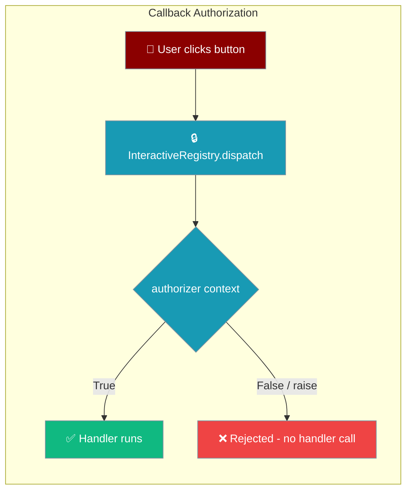
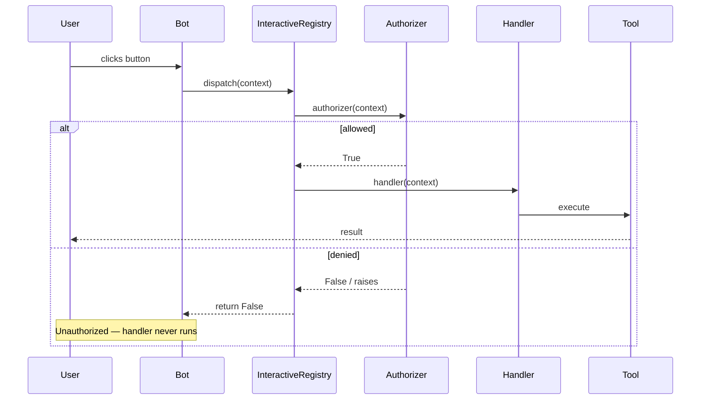
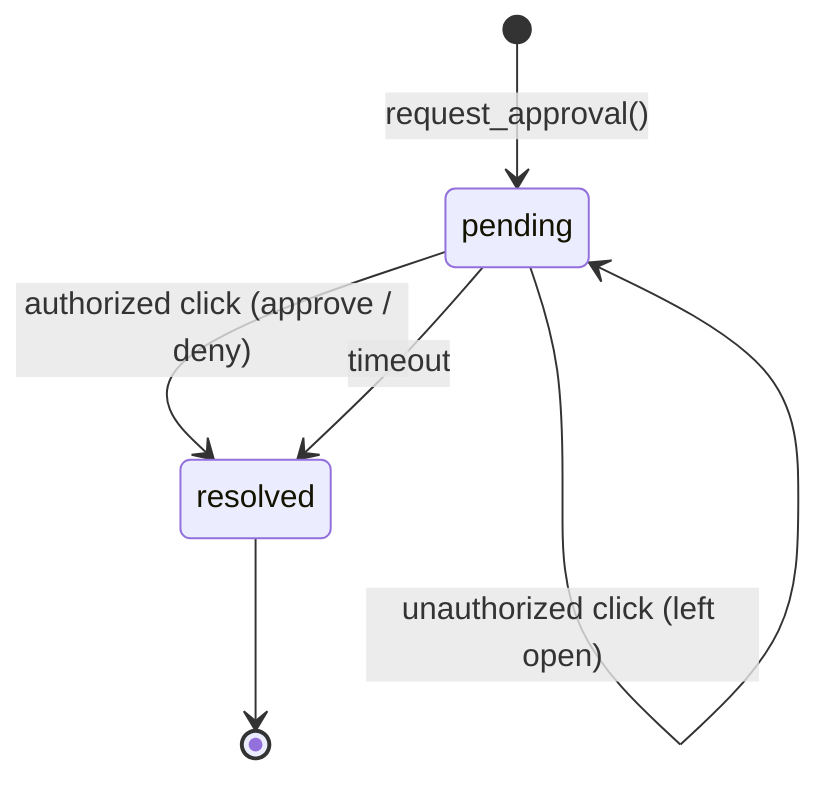
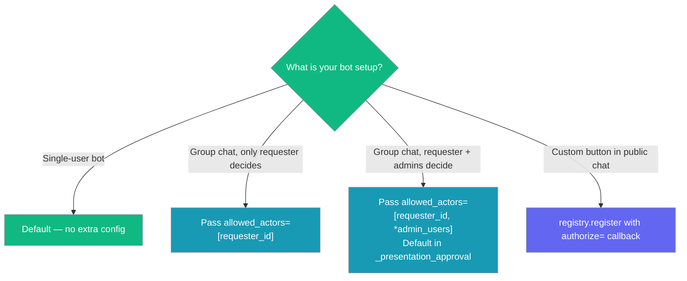

PraisonAI bots can pin every interactive button (approve, deny, menu choice) to a specific set of users so other participants in the same chat cannot resolve it.

```python
from praisonaiagents import Agent
from praisonai.bots import Bot

agent = Agent(name="Ops", instructions="Run approved changes only", approval=True)
bot = Bot("slack", agent=agent)
```

The user clicks Approve in a shared channel; only the requester and owners can resolve that callback.



<Warning>
Before [PR #2307](https://github.com/MervinPraison/PraisonAI/pull/2307) (fixes [#2299](https://github.com/MervinPraison/PraisonAI/issues/2299)), any chat member could click another user's approval button and resolve it. Tool approvals in shared chats are now actor-bound by default in the core wrapper, fail-closed.
</Warning>

## Quick Start

<Steps>

<Step title="Default — your bot is already protected">

If you run a Telegram, Slack, or Discord bot using the built-in `_presentation_approval` wrapper, approvals are already pinned to the requester plus any configured owner/admins. No extra code required.

```python
from praisonaiagents import Agent
from praisonai.bots import Bot

agent = Agent(
    name="assistant",
    instructions="You are a helpful assistant.",
)

bot = Bot("telegram", agent=agent)
bot.run()
```

When the bot sends an approval prompt, only the user who triggered the tool call (plus `owner_user_id` and `admin_users` you configured) can click Approve or Deny. Other users in the same group chat are silently rejected.

</Step>

<Step title="Restrict approvals to a specific user">

Pass `allowed_actors` when calling `request_approval` from a custom bot adapter to bind a single approval to one or more actors:

```python
from praisonai.bots._presentation_approval import PresentationApprovalHandler

handler = PresentationApprovalHandler()

result = await handler.request_approval(
    tool_name="bash",
    arguments={"command": "rm -rf /tmp/cache"},
    allowed_actors=["telegram:12345"],   # only this user may resolve
    channel_send_func=send_func,
    target=chat_id,
)

if result["approved"]:
    print("Approved by the authorized user")
```

An unauthorized click leaves the approval pending — the legitimate actor can still resolve it.

</Step>

<Step title="Register a custom interactive button with authorization">

Protect any interactive namespace (menus, polls, custom buttons) using an `authorize` callback:

```python
from praisonaiagents.bots.interactive import InteractiveRegistry, InteractiveAuthorizer

registry = InteractiveRegistry()

OWNER_IDS = {"telegram:99999", "slack:U01234"}

def only_owners(ctx) -> bool:
    return ctx.user_id in OWNER_IDS

async def my_menu_handler(ctx):
    return f"Selected: {ctx.platform_data.get('value')}"

registry.register("menu", my_menu_handler, authorize=only_owners)
```

If `authorize` returns `False` or raises, `dispatch()` returns `False` and the handler is never called. Fail-closed by design.

</Step>

</Steps>

---

## How It Works

Two layers of protection work together: the registry layer (any interactive callback) and the approval-wrapper layer (tool approvals specifically).



**State of an approval ID:**



A resolved approval ID is single-use — any second callback for it is a no-op, preventing replay attacks.

---

## Which authorization shape do I need?



---

## API Reference

| Symbol | Surface | Module |
|--------|---------|--------|
| `InteractiveAuthorizer` | type alias `Callable[[InteractiveContext], bool]` | `praisonaiagents.bots.interactive` |
| `InteractiveRegistry.register(..., authorize=)` | registers handler + optional authorizer | `praisonaiagents.bots.interactive` |
| `request_approval(..., allowed_actors=)` | binds approval to actor set | `praisonai.bots._presentation_approval` |
| `handle_approval_command(..., actor=)` | enforces actor on resolve | `praisonai.bots._presentation_approval` |
| `is_authorized(approval_id, actor)` | helper for custom adapters | `praisonai.bots._presentation_approval` |
| `audit_log` (property) | copy of resolved-approval audit entries | `praisonai.bots._presentation_approval` |
| `history_limit` (constructor) | bounded FIFO for `_resolved_ids` + `_audit_log` (default 1000) | `praisonai.bots._presentation_approval` |

---

## Audit Log

Every resolution appends an entry to the bounded in-memory audit log. Retrieve it with the `audit_log` property (returns deep-copied dicts — callers cannot mutate internal state).

| Field | Type | Description |
|-------|------|-------------|
| `approval_id` | `str` | Unique ID for this approval request |
| `tool_name` | `str` | Name of the tool awaiting approval |
| `actor` | `str \| None` | User ID of the clicker (platform-prefixed, e.g. `telegram:12345`) |
| `decision` | `str` | `allow`, `deny`, or `always` |
| `approved` | `bool` | Whether the tool was approved |
| `authorized` | `bool` | Whether the actor was in the allowed set |
| `timestamp` | `float` | Unix timestamp of the resolution |

Three categories of entries are written:

| Category | `approved` | `authorized` |
|----------|-----------|-------------|
| Authorized approval | `True` | `True` |
| Authorized denial | `False` | `True` |
| Unauthorized attempt | `False` | `False` |

Timeouts also append an entry (decision `"timeout"`, `approved=False`, `authorized=True` if no actor restriction was set).

---

## Common Patterns

**Read the audit log after a session:**

```python
from praisonai.bots._presentation_approval import PresentationApprovalHandler

handler = PresentationApprovalHandler()

# ... run your bot session ...

for entry in handler.audit_log:
    print(entry["actor"], entry["decision"], entry["authorized"])
```

**Cap memory for short-lived sessions:**

```python
handler = PresentationApprovalHandler(history_limit=200)
```

The oldest entries are evicted once the limit is exceeded (bounded FIFO). Replay protection still holds for the most recent `history_limit` approvals.

**Check authorization without resolving:**

```python
if handler.is_authorized(approval_id, actor="telegram:12345"):
    print("This user may resolve the approval")
```

---

## Best Practices

<AccordionGroup>

<Accordion title="Pin approvals to the requester in group chats">
The `_presentation_approval` wrapper does this automatically by passing `allowed_actors` including the requesting user, `owner_user_id`, and `admin_users`. Only override when you have a specific reason.
</Accordion>

<Accordion title="Authorizers must be fast and pure">
Authorizers run synchronously inside `dispatch()`. Any exception counts as a deny — the callback is rejected and an error is logged. Surface real errors in your application layer, not inside the authorizer.
</Accordion>

<Accordion title="Persist audit_log if you need long-term accountability">
The in-memory log is bounded by `history_limit` (default 1000). For compliance or long-running bots, push entries to your logging sink (e.g. structured logging, database) before they are evicted.
</Accordion>

<Accordion title="Backward-compatible: omit authorize= to keep legacy behaviour">
`registry.register("namespace", handler)` without `authorize=` allows any clicker — identical to the pre-PR behaviour. Useful for non-privileged callbacks such as read-only menus or informational polls.
</Accordion>

</AccordionGroup>

---

## Related

<CardGroup cols={2}>
  <Card title="Approval Protocol" icon="shield-check" href="/docs/features/approval-protocol">
    Tool approval backends (console, Slack, Telegram, webhook)
  </Card>
  <Card title="Durable Approvals" icon="database" href="/docs/features/durable-approvals">
    Persist approvals to SQLite — including the `--approval secure` backend with actor authorisation and fail-closed start
  </Card>
  <Card title="Interactive Tool Approval" icon="shield" href="/docs/features/interactive-approval">
    CLI/terminal approval flow and persistence
  </Card>
  <Card title="Interactive Bot Messages" icon="display" href="/docs/features/bot-presentations">
    Buttons, dropdowns, and approval prompts on Telegram/Slack/Discord
  </Card>
  <Card title="Bot Command Access Control" icon="lock" href="/docs/features/bot-command-access-control">
    Restrict which users can run which bot commands
  </Card>
</CardGroup>
