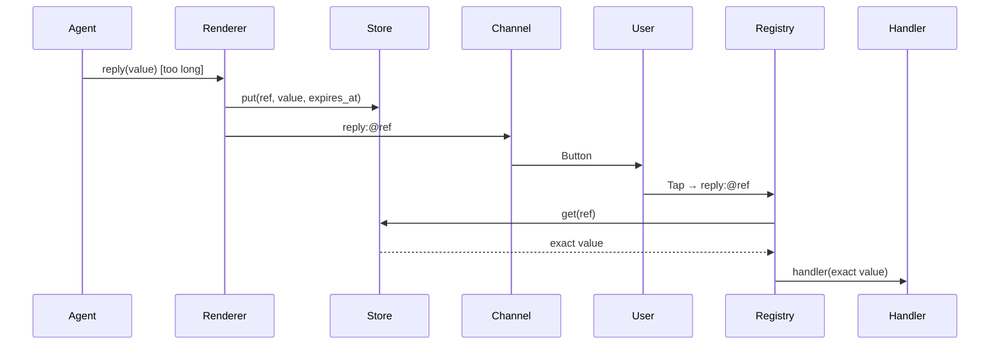
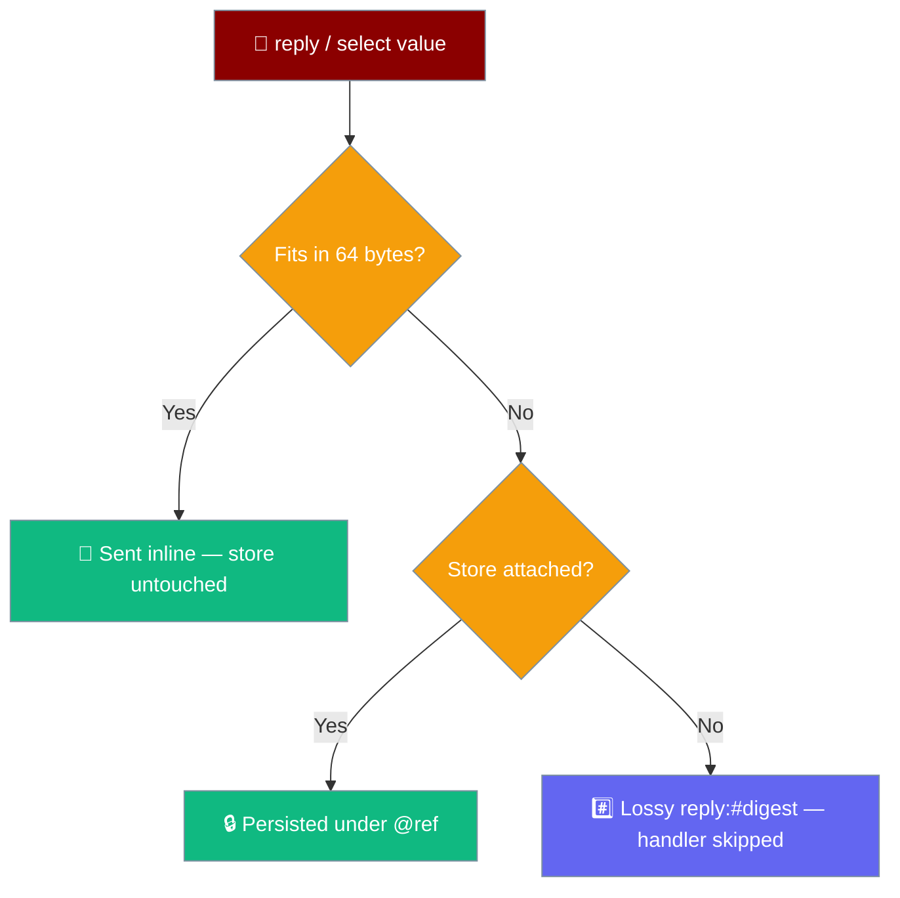

The callback payload store persists long `reply` / `select` values under a short reference so the exact value round-trips back to your handler when a user taps.


## Quick Start

<Steps>

<Step title="Zero-config on Telegram">
`TelegramBot` already shares one store between its renderer and inbound registry — a long `reply` value round-trips back to your agent exactly.

```python
from praisonaiagents import Agent
from praisonaiagents.bots import (
    MessagePresentation,
    PresentationAction,
    ActionType,
    PresentationBlock,
    PresentationButton,
)
from praisonai.bots import TelegramBot
import os

agent = Agent(
    name="linker",
    instructions="Offer the user a choice of documentation links.",
)

# A reply value that comfortably exceeds Telegram's 64-byte inline-callback cap.
long_url = (
    "https://docs.praison.ai/features/interactive-callback-store"
    "?ref=chat&session=abcdef1234567890&utm_campaign=demo_long_value_roundtrip"
)

presentation = MessagePresentation([
    PresentationBlock.make_text("Open the docs page:"),
    PresentationBlock.make_buttons([
        PresentationButton(
            label="📚 Open docs",
            action=PresentationAction(type=ActionType.REPLY, value=long_url),
        ),
    ]),
])

bot = TelegramBot(token=os.environ["TELEGRAM_BOT_TOKEN"], agent=agent)
# TelegramBot already shares an InMemoryCallbackPayloadStore between renderer
# and inbound registry, so the user's tap resolves back to `long_url` exactly —
# no truncation, no hash, the handler sees the original value.
bot.run()
```
</Step>

<Step title="Plug your own store">
Implement `CallbackPayloadStoreProtocol` (`put` / `get`) with any backend and pass the same instance to both the registry and the renderer.

```python
from typing import Optional
from praisonaiagents.bots import create_registry
from praisonai_bot.bots import TelegramPresentationRenderer

class RedisCallbackStore:
    def __init__(self, client):
        self.client = client

    def put(self, ref: str, value: str, *, expires_at: float) -> None:
        self.client.set(ref, value, exat=int(expires_at))

    def get(self, ref: str) -> Optional[str]:
        result = self.client.get(ref)
        return result.decode() if result else None

store = RedisCallbackStore(client=my_redis_client)

registry = create_registry(store=store)
renderer = TelegramPresentationRenderer()
# Pass the SAME store on the render side so references resolve on click.
rendered = renderer.render(presentation, callback_store=store)
```
</Step>

</Steps>

---

## How It Works

The renderer stores overflowing values before send; the registry resolves the reference on click.



Encoding only kicks in when the inline payload would overflow the channel cap.



---

## Configuration

`InMemoryCallbackPayloadStore` is a bounded, zero-dependency, per-process store. It purges expired entries on every `put` and evicts oldest-inserted (FIFO) once full.

```python
from praisonaiagents.bots import InMemoryCallbackPayloadStore

store = InMemoryCallbackPayloadStore(max_entries=4096)
```

| Option | Type | Default | Description |
|--------|------|---------|-------------|
| `max_entries` | `int` | `4096` | Maximum stored references. Oldest-inserted evicted first once full. |
| `CALLBACK_REF_TTL` | `float` | `3600.0` | Seconds a reference stays resolvable (1 hour). Expired entries are purged on write. |

### API surface

| Symbol | Kind | Signature | Notes |
|--------|------|-----------|-------|
| `CallbackPayloadStoreProtocol` | `Protocol` | `put(ref, value, *, expires_at: float) -> None`; `get(ref) -> Optional[str]` | Runtime-checkable contract. Implement it for any backend. |
| `InMemoryCallbackPayloadStore` | Class | `__init__(*, max_entries: int = 4096)` | Bounded, per-process default. |
| `create_registry(store=None)` | Function | `(Optional[CallbackPayloadStoreProtocol]) -> InteractiveRegistry` | Threads the store into the inbound registry. |
| `InteractiveRegistry(store=None)` | Class ctor | New `store` kwarg | Same semantics. |

```python
from praisonaiagents.bots import (
    CallbackPayloadStoreProtocol,
    InMemoryCallbackPayloadStore,
    create_registry,
)
```

---

## Failure modes

| Situation | Behaviour |
|-----------|-----------|
| Value fits inline | Sent inline, no store touched |
| Value overflows, store attached | Persisted under `@<ref>`, resolved on click |
| Value overflows, no store | Falls back to `reply:#<sha1[:16]>` (lossy, handler skipped) |
| Reference unknown / expired | Callback dropped (fails closed), warning logged |

---

## Best Practices

<AccordionGroup>

<Accordion title="Reuse one store between renderer and registry">
References only resolve when the same store instance backs both sides. A mismatch means `put` and `get` never meet, so taps silently drop.

```python
store = InMemoryCallbackPayloadStore()
registry = create_registry(store=store)
rendered = renderer.render(presentation, callback_store=store)
```
</Accordion>

<Accordion title="Prefer a durable backend for long-running bots">
The in-memory store is per-process and clears on restart. Back it with Redis or SQLite when references must survive restarts or span multiple workers.
</Accordion>

<Accordion title="Keep callback values short when you can">
The store is a safety net, not a substitute — short inline values skip the round-trip entirely and resolve faster.
</Accordion>

<Accordion title="Set max_entries to bound memory">
Raise `max_entries` for very large menus so live references are not evicted before users tap; lower it to cap memory on constrained hosts.

```python
store = InMemoryCallbackPayloadStore(max_entries=16384)
```
</Accordion>

</AccordionGroup>

---

## Related

<CardGroup cols={2}>
  <Card title="Interactive Bot Actions" icon="hand-pointer" href="/docs/features/interactive-bot-actions">
    Wire button and select-menu clicks to your own handlers
  </Card>
  <Card title="Message Presentation" icon="comment" href="/docs/features/message-presentation">
    Build reply and select prompts agents send to chat
  </Card>
  <Card title="Bot Presentations" icon="table-cells" href="/docs/features/bot-presentations">
    Adapt presentations to each channel's limits
  </Card>
  <Card title="Telegram Durable Approval" icon="shield" href="/docs/features/telegram-durable-approval">
    Approvals that survive restarts on Telegram
  </Card>
</CardGroup>
