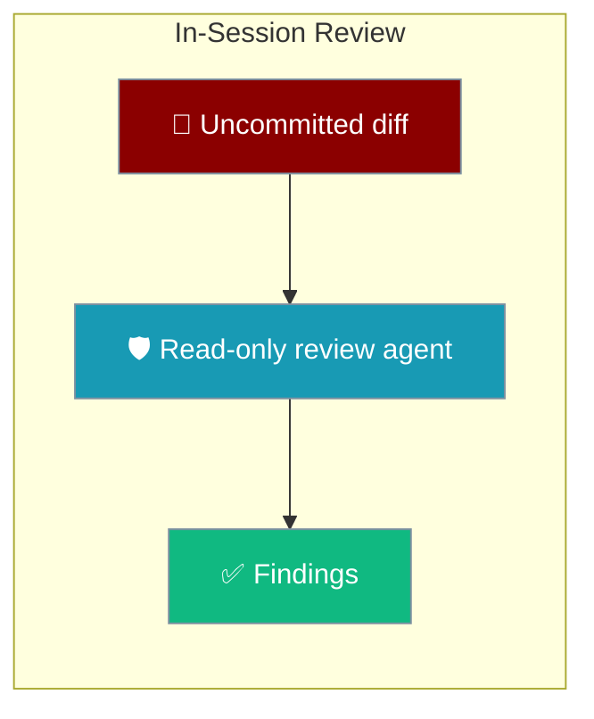
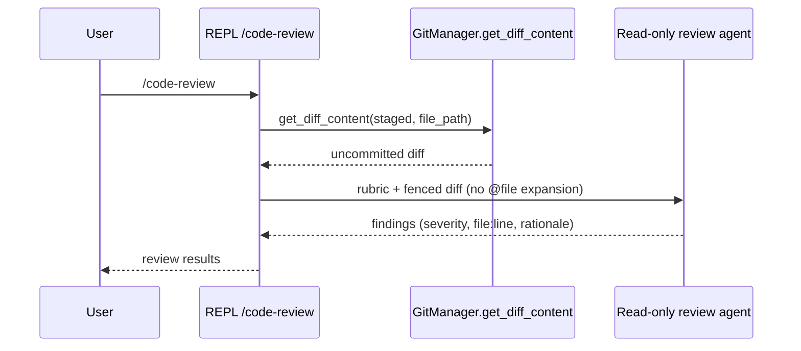
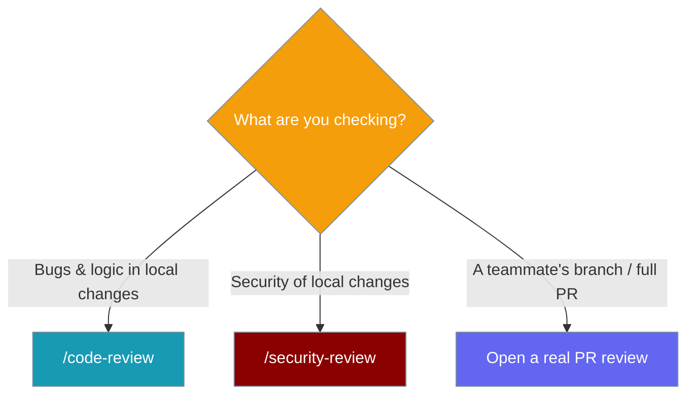

Review your uncommitted changes for bugs or security issues from inside `praisonai code` — no separate PR, no writes to your files.



Two slash commands run inside the `praisonai code` interactive session:

- `/code-review [file] [--staged]` — reviews the working-tree diff for bugs, logic errors, and edge cases.
- `/security-review [file] [--staged]` — same pipeline with a **security rubric**: injection, authz, secrets, deserialization, path traversal, SSRF, and crypto.

The review runs on the shipped **read-only `review` agent preset**. Its tool set excludes write and command-execution tools, so the command cannot touch your files even if the model tries.

## Quick Start

<Steps>
<Step title="Launch a session">
Start `praisonai code` in a git repository with uncommitted changes:

```bash
praisonai code
```
</Step>

<Step title="Review the working-tree diff">
Type `/code-review` — the agent reads your uncommitted diff and reports findings:

```bash
❯ /code-review
❯ /code-review --staged
❯ /code-review src/auth/login.py
```
</Step>

<Step title="Audit for security issues">
Swap in the security rubric with `/security-review`:

```bash
❯ /security-review
❯ /security-review --staged src/auth/login.py
```
</Step>
</Steps>

The review agent is a plain composition of existing parts. The equivalent programmatic form uses a standard `Agent` with read-only instructions:

```python
from praisonaiagents import Agent

# The /code-review and /security-review commands run a preset built like this:
# a read-only reviewer that inspects a diff and never writes files.
reviewer = Agent(
    name="Reviewer",
    instructions=(
        "You are a code reviewer. Review ONLY the diff you are given for "
        "bugs, logic errors, edge cases, and error-handling gaps. "
        "Do NOT modify any files."
    ),
)

diff = """diff --git a/app.py b/app.py
+def login(user, pw):
+    query = f"SELECT * FROM users WHERE name = '{user}'"
+    return db.execute(query)
"""

reviewer.start(f"Review this diff:\n\n```diff\n{diff}\n```")
```

<Note>
You don't build this agent yourself — `/code-review` and `/security-review` ship it for you and feed it the diff. The snippet above shows what the command does under the hood.
</Note>

---

## How It Works

`/code-review` collects the diff, wraps it in a review rubric, and runs it against the read-only agent — findings come straight back to the REPL.



| Step | What happens |
|------|--------------|
| Collect diff | `GitManager.get_diff_content(staged, file_path)` returns the working-tree, staged, or single-file diff. |
| Empty diff | The REPL prints **"Working tree clean — no uncommitted changes to review."** |
| Build prompt | The diff is fenced as ```` ```diff ```` and prefixed with a bug or security rubric. |
| Run review | The prompt routes through the same `_queue_or_execute` path as `/plan`, so session/queue rules apply. |
| Report | Each finding lists severity (high/medium/low), the `file:line`, and a short rationale. |

<Warning>
These commands are safe to run against untrusted diffs by design:

- **Read-only at the capability level** — the review agent's tool set excludes write and command-execution tools. The command can't touch files even if the model attempts a write call.
- **`@file` expansion is skipped** — a `@../../secret` token embedded in an untrusted diff cannot exfiltrate files.
- **Failures are never masked** — if the diff can't be collected, the REPL raises `ReviewDiffError` and surfaces it as an error, not as a false "Working tree clean".
</Warning>

---

## Common Patterns

**Review before you stage.** Run `/code-review` on the working tree, apply fixes, then re-check:

```bash
❯ /code-review
```

**Review only what you're about to commit.** Use `--staged` to scope the review to staged changes:

```bash
❯ /code-review --staged
```

**Focus on one file.** Pass a path to review a single file's changes:

```bash
❯ /security-review src/auth/login.py
```

Quoted paths survive — args are parsed with `shlex`, so `/code-review "src/my dir/app.py"` works. Multiple positional paths are rejected with a usage message.

---

## User Interaction Flow

A typical loop: finish an edit, review, fix, then security-check before staging.

<Steps>
<Step title="Finish an edit">
Make your changes in the session as usual.
</Step>
<Step title="Review for bugs">
Type `/code-review` — the agent reports logic errors and edge cases with `file:line` locations.
</Step>
<Step title="Apply fixes">
Address the findings, then re-run `/code-review` to confirm they're gone.
</Step>
<Step title="Security-check before staging">
Type `/security-review` — the agent audits the same diff against the security rubric before you commit.
</Step>
</Steps>

Use the decision guide to pick the right tool:



---

## Best Practices

<AccordionGroup>
<Accordion title="Run /security-review before every commit that touches auth">
Auth, session, and credential code is where injection and authz flaws hide. Make `/security-review` a habit before staging any change under `src/auth/` or similar.
</Accordion>

<Accordion title="Scope with --staged to review exactly what ships">
The working tree may hold experiments you won't commit. Use `--staged` so the review matches the diff that will actually land.
</Accordion>

<Accordion title="Trust the read-only guarantee on untrusted diffs">
The review agent has no write or command-execution tools, and `@file` tokens in the diff are never expanded. It's safe to review diffs from sources you don't fully trust.
</Accordion>

<Accordion title="Treat a ReviewDiffError as a real problem">
An empty diff prints "Working tree clean". A `ReviewDiffError` means the diff couldn't be collected (not a repo, Git failure). Fix the underlying issue — it is never silently reported as clean.
</Accordion>
</AccordionGroup>

---

## Related

<CardGroup cols={2}>
<Card title="Checkpoints" icon="clock-rotate-left" href="/features/checkpoints">
Snapshot and roll back workspace changes across a session.
</Card>
<Card title="Shell Escape" icon="terminal" href="/features/interactive-shell-escape">
Run inline shell commands without spending a model turn.
</Card>
<Card title="Slash Commands" icon="terminal" href="/docs/cli/slash-commands">
The full interactive command reference.
</Card>
<Card title="Permission Modes" icon="lock" href="/features/permission-modes">
Read-only and other enforcement modes, including `/plan`.
</Card>
</CardGroup>
