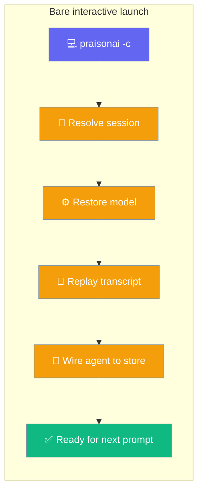
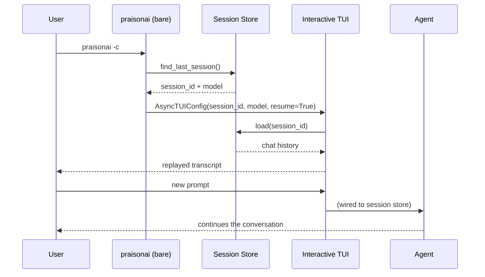

Resume where you left off, straight from the shell — the interactive TUI opens with your prior model, transcript, and agent memory already loaded.



## Quick Start

<Steps>
<Step title="Resume the most recent session">
```bash
praisonai -c
```
</Step>

<Step title="Resume a specific session id">
```bash
praisonai --session abc12345
```
</Step>

<Step title="Fork a resumed session non-destructively">
```bash
praisonai --fork --session abc12345
```
</Step>
</Steps>

---

## How It Works

The bare launch resolves a session, restores its model, replays its transcript, and wires the agent to its store — all before the first prompt.



| Step | What happens |
|------|--------------|
| Resolve | `find_last_session` (for `-c`) or `session_exists_anywhere` (for `--session <id>`) locates the session across project + global stores. |
| Model | `find_session_model` restores the recorded model — resumes stay on the original provider. |
| Replay | The transcript is drawn into scrollback with the same renderer as `/continue`. |
| Wire | The primary agent is wired to the resumed session's store via `apply_cli_session_continuity` — follow-up prompts have full conversational memory. |
| Fork | `HierarchicalSessionStore.fork_session` mints a child id; the resumed launch continues on the fork, leaving the source session unchanged. |

If the resume path fails, the launch degrades to a fresh session rather than aborting. The no-flag path (`praisonai`) is byte-identical to previous versions.

---

## Configuration Options

Bare `praisonai` accepts:

| Option | Short | Description |
|--------|-------|-------------|
| `--continue` | `-c` | Resume the most recent project session. |
| `--session <id>` | `-s <id>` | Resume a specific session id. |
| `--fork` | | Fork the resumed session non-destructively. Requires `--continue` or `--session`. |

Validation errors (exit `1`, parity with `run`):

- `--fork` without `--continue` / `--session` → `--fork requires --continue or --session to specify which session to fork from`
- `--continue` + `--session` together → `Cannot use both --continue and --session together`

---

## Common Patterns

Resume, then keep working — your next prompt has full memory of prior turns:

```bash
praisonai -c
# ❯ (transcript replayed) …
# ❯ now refactor the auth module we discussed
```

Branch a resumed session to explore an idea without disturbing the original:

```bash
praisonai --fork --session abc12345
```

Hop between sessions from inside the TUI with the extended slash command:

```bash
❯ /continue          # most recent session
❯ /continue abc12345 # a specific session id
```

---

## Best Practices

<AccordionGroup>
<Accordion title="Use -c for the fastest return">
Bare `praisonai -c` is the shortest path back into your last conversation — no session id lookup, no subcommand.
</Accordion>

<Accordion title="Fork before branching an idea">
Forking preserves the original transcript so you can branch without losing the parent timeline.
</Accordion>

<Accordion title="Switch sessions without leaving the TUI">
The in-TUI `/continue` command now accepts an optional id — use it to hop between sessions without restarting.
</Accordion>

<Accordion title="Trust the fresh-session fallback">
A failure in the resume path degrades to a fresh session rather than aborting the launch, so `-c` is always safe to try.
</Accordion>
</AccordionGroup>

---

## Related

<CardGroup cols={2}>
<Card title="Interactive TUI" icon="rectangle-terminal" href="/cli/interactive-tui">
  Rich terminal interface, slash commands, and the resumed-launch flow
</Card>
<Card title="Session Resume" icon="play" href="/cli/session-resume">
  Resume a session into a prompt or YAML run
</Card>
</CardGroup>
