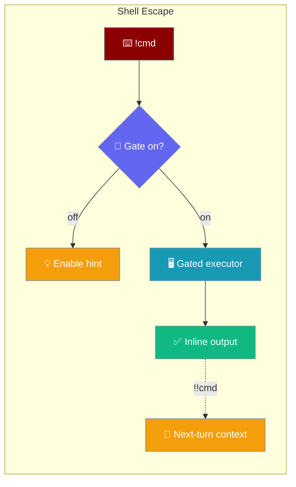
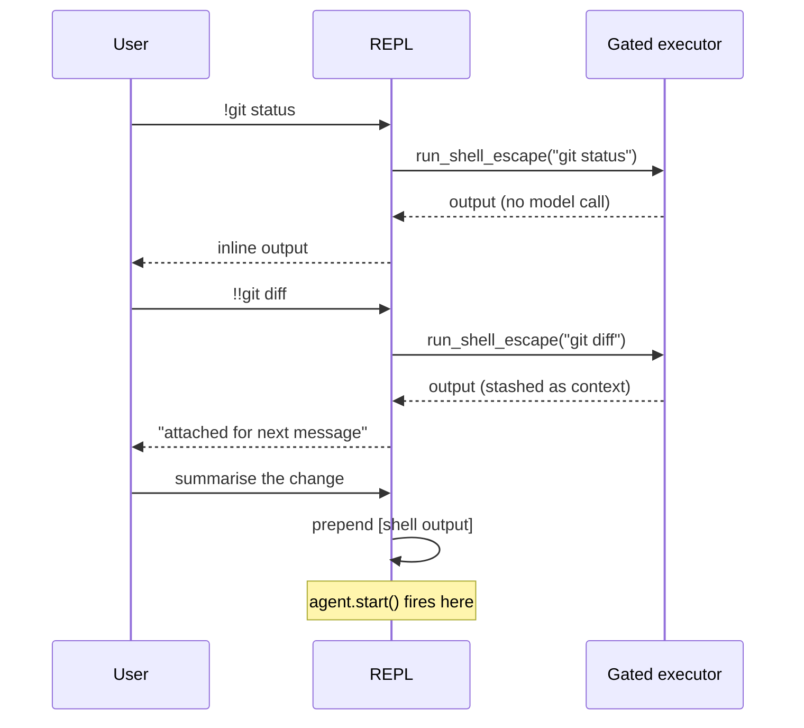
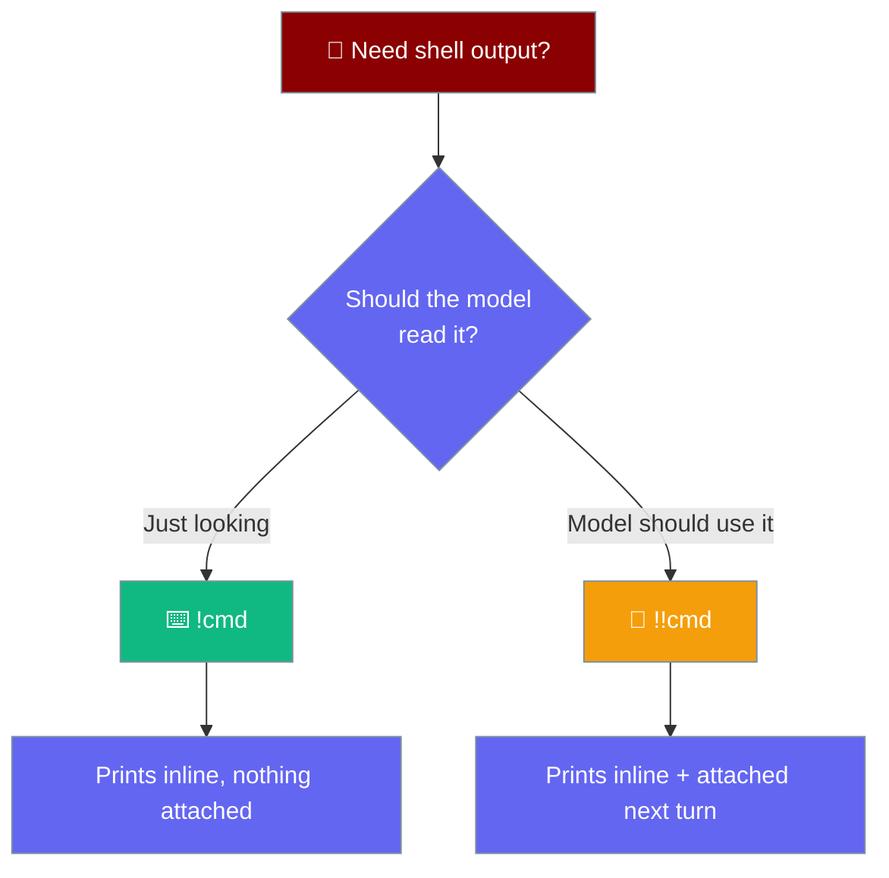

Type `!cmd` in an interactive session to run a shell command without spending a model turn. `!!cmd` also attaches the output as context for your next message.

```python
from praisonaiagents import Agent

# The shell escape lives in the `praisonai code` interactive REPL/TUI,
# not on the Agent class. Nothing to configure on the agent itself —
# just launch a session and enable the gate:
agent = Agent(
    name="Coder",
    instructions="You are a coding assistant.",
)

# Then from your terminal:
#   $ export PRAISONAI_ALLOW_SHELL=true
#   $ praisonai code
#   > !git status                # run inline, no model turn
#   > !!git diff                 # attach output as context for the next prompt
#   > summarise the change       # this turn sees the diff
```



## Quick Start

<Steps>
<Step title="Enable the gate and run a command">
Shell escape is off by default. Enable it, launch a session, and run a command inline:

```bash
export PRAISONAI_ALLOW_SHELL=true
praisonai code
```

```bash
> !git status
On branch main
nothing to commit, working tree clean
```

The command runs immediately and prints its output — no model turn is spent.
</Step>

<Step title="Attach output as context">
Prefix with `!!` to also stash the output as context for your next message:

```bash
> !!git diff
[diff prints here]
Output attached as context for the next message.

> summarise the change
```

The follow-up turn sees the diff, prefixed as `[shell output]`.
</Step>
</Steps>

---

## How It Works

The `!cmd` path never calls the model — `agent.start()` only fires on your next real prompt, prefixed with `[shell output]` if a `!!cmd` is pending.



| Prefix | Runs command | Spends a model turn | Attaches output |
|--------|--------------|---------------------|-----------------|
| `!cmd` | Yes | No | No |
| `!!cmd` | Yes | No (until next prompt) | Yes |

---

## `!cmd` vs `!!cmd`

Pick `!` for a quick peek and `!!` when you want the model to read the output.



---

## Configuration

Shell escape reuses the same gate that powers `` !`cmd` `` template substitution — there is no second flag to remember.

<Tabs>
<Tab title="Environment variable">
```bash
export PRAISONAI_ALLOW_SHELL=true
praisonai code
```
</Tab>

<Tab title="Config file">
```yaml
# .praisonai/config.yaml
commands:
  allow_shell: true
```
</Tab>
</Tabs>

<Note>The environment variable wins if set to a truthy value; otherwise the `commands.allow_shell` config flag is consulted. When neither is set, typing `!ls` prints a one-line enable hint and never runs the command.</Note>

---

## Safety Limits

Shell escape carries the same safety posture as `` !`cmd` `` template substitution.

| Limit | Value |
|-------|-------|
| Timeout | 30 s |
| Output cap | 100 KB |
| Default state | Off |

---

## Failure Behaviour

A non-zero exit, timeout, or output cap never raises into the REPL loop — the diagnostic is rendered inline instead. For `!!cmd`, the error text is still attached as context so the model can help debug it.

```bash
> !!pytest -x
[test failures print here]
Output attached as context for the next message.

> why did this fail?
```

The failing output is attached, so the follow-up turn can reason about it.

---

## Pending-Context Lifecycle

`!!cmd` output is retained until the next model call succeeds. If that call raises, the context stays so you can retry without re-running the command.

---

## Common Patterns

Review a staged diff with the model:

```bash
> !!git diff --staged
> review this diff
```

Debug a failing test:

```bash
> !!pytest -x
> why did this fail?
```

Quick peek with no attach:

```bash
> !ls -la
```

---

## Best Practices

<AccordionGroup>
<Accordion title="Keep the gate off for unattended surfaces">
Bots and webhooks that never need a shell should leave `PRAISONAI_ALLOW_SHELL` unset. Default-off keeps unattended surfaces shell-free.
</Accordion>

<Accordion title="Prefer !!cmd for context you actually want the model to read">
Attaching everything bloats prompts. Use `!` for a quick look and reserve `!!` for output the model needs.
</Accordion>

<Accordion title="Combine with @file mentions">
Pair shell escape with `@file` mentions to give the model both live output and file content in one turn. See the [@file mentions](/docs/cli/interactive-tui) docs.
</Accordion>

<Accordion title="Beware the 100 KB cap for verbose commands">
Output is capped at 100 KB. Pipe noisy commands through `head`, `tail`, or `grep` first to keep the useful lines.
</Accordion>
</AccordionGroup>

---

## Related

<CardGroup cols={2}>
<Card title="Interactive TUI" icon="rectangle-terminal" href="/docs/cli/interactive-tui">
  The full interactive terminal interface, including `@file` mentions.
</Card>
<Card title="Slash Commands" icon="terminal" href="/docs/cli/slash-commands">
  Registered `/cmd` commands — a sibling input path to `!cmd`.
</Card>
<Card title="Custom Agents & Commands" icon="file-code" href="/docs/features/custom-agents-commands">
  The sibling `` !`cmd` `` template substitution — same gate.
</Card>
</CardGroup>
