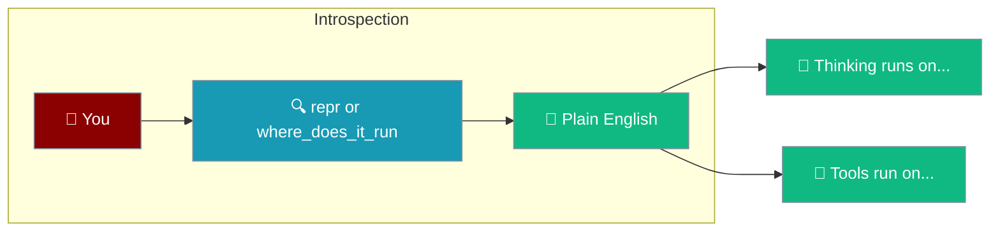
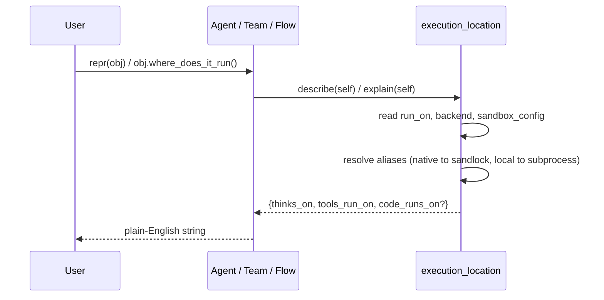

Every `Agent`, `AgentTeam`, and `AgentFlow` can tell you — in plain English — where its thinking and tools actually run.



## Quick Start

<Steps>
<Step title="Ask a plain agent">
Print the agent and it tells you where it runs.

```python
from praisonaiagents import Agent

agent = Agent(name="builder", instructions="Write short answers")

print(repr(agent))
# Agent(name='builder', thinks_on='this machine', tools_run_on='this machine')

print(agent.where_does_it_run())
# Thinking (the AI model calls) happens on this machine.
# Tools run on this machine.
# Nothing is isolated: tools you pass run in this program, with your permissions.
```
</Step>

<Step title="Ask a workflow with a shared sandbox">
A workflow with `run_on=` shows the shared container every step uses.

```python
from praisonaiagents import Agent, AgentFlow

writer = Agent(name="writer", instructions="Write a file")
reader = Agent(name="reader", instructions="Read the file back")

flow = AgentFlow(run_on="docker", steps=[writer, reader])

print(repr(flow))
# AgentFlow(name='AgentFlow', steps=2, thinks_on='this machine',
#           tools_run_on='a Docker container (shared)')

print(flow.where_does_it_run())
# Thinking (the AI model calls) happens on this machine.
# Tools run on a Docker container (shared).
# Every step shares that same sandbox, so a file written by one step is visible to the next.
```
</Step>

<Step title="Ask a team">
A team reports the same shared-sandbox detail across its agents.

```python
from praisonaiagents import Agent, AgentTeam, Task

worker = Agent(name="worker", instructions="Do the task")

team = AgentTeam(
    agents=[worker],
    tasks=[Task(description="Analyse the data", agent=worker)],
    run_on="e2b",
)

print(repr(team))
# AgentTeam(name='...', agents=1, thinks_on='this machine',
#           tools_run_on='an E2B cloud sandbox (shared)')
```
</Step>
</Steps>

---

## How It Works

Both `repr()` and `where_does_it_run()` read the same source of truth: `run_on=`, `backend=`, and `sandbox=`.



| Method | Returns | Best for |
|--------|---------|----------|
| `repr(obj)` | One line with `thinks_on` and `tools_run_on` inline | A quick glance |
| `obj.where_does_it_run()` | A full plain-English paragraph, plus a warning when the tier is not a security boundary | Reading or sharing |

---

## How the answer is picked

Each input maps to a plain-English place. These phrases come straight from the SDK — they are the exact words the object prints.

A `run_on=` on a team or workflow sets `tools_run_on` to a shared sandbox:

| You wrote... | `thinks_on` | `tools_run_on` |
|---|---|---|
| `Agent(name=...)` | this machine | this machine |
| `AgentFlow(run_on="docker", ...)` | this machine | a Docker container (shared) |
| `AgentTeam(run_on="e2b", ...)` | this machine | an E2B cloud sandbox (shared) |
| `AgentFlow(run_on="modal", ...)` | this machine | a Modal cloud sandbox (shared) |
| `AgentFlow(run_on="daytona", ...)` | this machine | a Daytona cloud sandbox (shared) |
| `AgentFlow(run_on="flyio", ...)` | this machine | a Fly.io machine (shared) |
| `AgentFlow(run_on="tenki", ...)` | this machine | a Tenki cloud sandbox (shared) |
| `AgentFlow(run_on="novita", ...)` | this machine | a Novita cloud sandbox (shared) |
| `AgentFlow(run_on="ssh", ...)` | this machine | a remote machine over SSH (shared) |

A `sandbox=` on an agent adds a `code_runs_on` place — where code you run yourself with `execute_code()` runs:

| You wrote... | `code_runs_on` |
|---|---|
| `Agent(sandbox=True)` | a separate process on this machine |
| `Agent(sandbox="native")` | a locked-down process on this machine |

Public sandbox aliases resolve to the backend that actually runs: `native` becomes a locked-down process, and `local` becomes a separate process. An unknown provider name is printed back as-is.

---

## Common Patterns

Print the location at the top of your script before running untrusted code.

```python
from praisonaiagents import Agent

agent = Agent(name="runner", instructions="Run the task", sandbox=True)
print(agent.where_does_it_run())
# Thinking (the AI model calls) happens on this machine.
# Tools run on this machine.
# Code you run yourself with execute_code() runs on a separate process on this machine.
# Note: a separate process is not a security boundary -- it can still reach
# the network and read your files. Use docker or a cloud provider for
# untrusted code.
# Nothing is isolated: tools you pass run in this program, with your permissions.
```

Confirm a shared sandbox actually shares state. For a workflow with `run_on=`, the explanation ends with a line about visibility between steps.

```python
from praisonaiagents import Agent, AgentFlow

flow = AgentFlow(run_on="docker", steps=[Agent(name="a", instructions="x")])
print(flow.where_does_it_run())
# ...
# Every step shares that same sandbox, so a file written by one step is visible to the next.
```

Read the machine-readable places directly when you need data instead of prose.

```python
from praisonaiagents import Agent
from praisonaiagents.agent.execution_location import describe

agent = Agent(name="builder", instructions="x")
print(describe(agent))
# {'thinks_on': 'this machine', 'tools_run_on': 'this machine'}
```

---

## Best Practices

<AccordionGroup>
<Accordion title="Print the repr in code review">
A reviewer can tell "local vs container vs cloud" from one printed line, without opening the docs or tracing `run_on=`.
</Accordion>

<Accordion title="Trust the boundary warning">
If `where_does_it_run()` says "not a security boundary", it isn't. Under a separate process the network is still reachable and your files are still readable. Use `run_on="docker"` or a cloud provider for untrusted code.
</Accordion>

<Accordion title="Use where_does_it_run() in beginner tutorials">
It is written for a non-developer — no "harness", "provision", "runtime", or "topology" appears in its output.
</Accordion>

<Accordion title="Never parse the repr">
The phrases are for humans and may be re-worded in later releases. For machine-readable data, call `describe(obj)` — it returns a `dict[str, str]`.
</Accordion>
</AccordionGroup>

---

## Related

<CardGroup cols={2}>
<Card title="Execution" icon="play" href="/features/execution">
  Where and how agents run their work.
</Card>
<Card title="Agents" icon="user" href="/features/agents">
  Build the agents you can introspect.
</Card>
</CardGroup>
