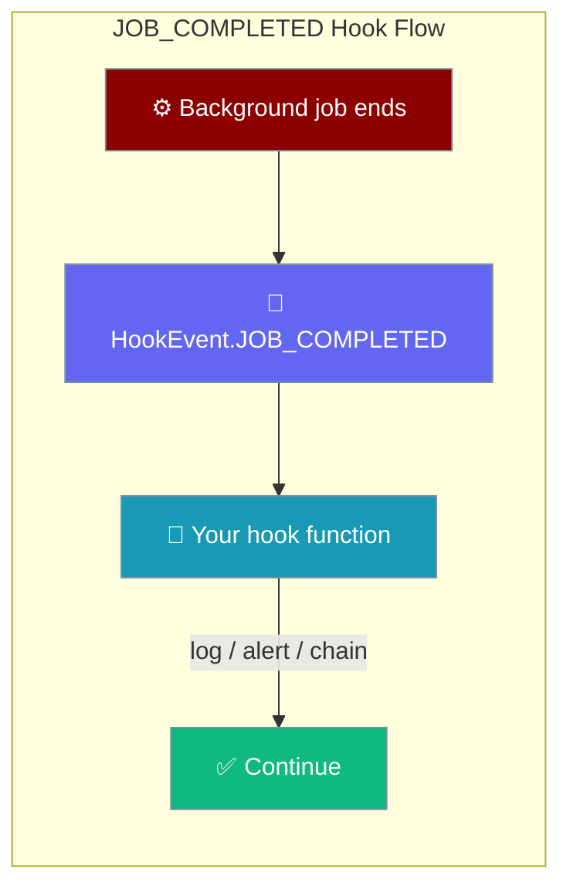
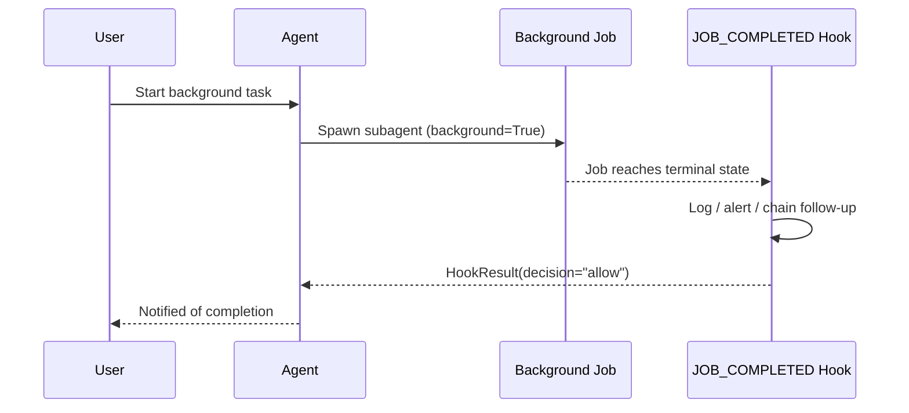

`HookEvent.JOB_COMPLETED` fires whenever a background subagent reaches a terminal state — whether it succeeded or failed. Register a hook to log completions, send alerts, or trigger follow-up work.

```python
from praisonaiagents import Agent

agent = Agent(name="Coordinator", instructions="Delegate long tasks to background workers")
agent.start("Analyse this repo and email me when done")
```

The user starts background work; your `JOB_COMPLETED` hook runs when the subagent finishes or fails.



## How It Works



## Quick Start

<Steps>

<Step title="Create a hook registry">
```python
from praisonaiagents.hooks import HookRegistry, HookEvent, HookResult
from praisonaiagents.hooks import JobCompletedInput

registry = HookRegistry()
```
</Step>

<Step title="Register a JOB_COMPLETED handler">
```python
@registry.on(HookEvent.JOB_COMPLETED)
def log_completion(data: JobCompletedInput) -> HookResult:
    with open("job_completions.log", "a") as f:
        f.write(
            f"{data.job_id}\t{data.status}\t{data.deliver or '-'}\t{data.error or ''}\n"
        )
    return HookResult(decision="allow")
```
</Step>

<Step title="Attach to your agent">
```python
from praisonaiagents import Agent

agent = Agent(
    name="SupportBot",
    instructions="Help users.",
    hooks=registry,
)
```
</Step>

</Steps>

---

## `JobCompletedInput` Fields

`JobCompletedInput` carries everything about the finished job, including the delivery context if one was set.

| Field | Type | Description |
|-------|------|-------------|
| `job_id` | `str` | Unique job identifier returned by `spawn_subagent(background=True)` |
| `status` | `str` | Terminal state: `"completed"` or `"failed"` |
| `result` | `Any` | The job's return value on success; `None` on failure |
| `error` | `str \| None` | Error message on failure; `None` on success |
| `deliver` | `str` | Delivery target set at spawn time (e.g. `"origin"`, `"telegram:123"`, or `""`) |
| `platform` | `str` | Origin platform captured at spawn time |
| `chat_id` | `str` | Origin chat/channel ID captured at spawn time |
| `thread_id` | `str` | Origin thread ID captured at spawn time |

---

## Behaviour Notes

- **Fires on both success and failure.** Check `data.status` to distinguish.
- **Best-effort.** A raising hook never crashes the background worker — exceptions are caught and logged.
- **Sits alongside `SCHEDULE_TRIGGER`.** Both fire in the background-job lifecycle and follow the same hook shape.

```python
@registry.on(HookEvent.JOB_COMPLETED)
def alert_on_failure(data: JobCompletedInput) -> HookResult:
    if data.status == "failed":
        send_alert(f"Job {data.job_id} failed: {data.error}")
    return HookResult(decision="allow")
```

---

## Logging Example

The shortest copy-paste hook that logs every completion to a file:

```python
import datetime
from praisonaiagents.hooks import HookRegistry, HookEvent, HookResult
from praisonaiagents.hooks import JobCompletedInput

registry = HookRegistry()

@registry.on(HookEvent.JOB_COMPLETED)
def log_job(data: JobCompletedInput) -> HookResult:
    ts = datetime.datetime.utcnow().isoformat()
    line = f"[{ts}] job={data.job_id} status={data.status} deliver={data.deliver!r}\n"
    if data.error:
        line += f"  error: {data.error}\n"
    with open("jobs.log", "a") as f:
        f.write(line)
    return HookResult(decision="allow")
```

---

## Best Practices

<AccordionGroup>
<Accordion title="Make hooks idempotent">
Background jobs may be retried or replayed. Design your `JOB_COMPLETED` hook so running it twice for the same `job_id` produces no unintended side effects — for example, check if a log entry already exists before appending, or use an upsert rather than an insert.
</Accordion>

<Accordion title="Do not block the event loop">
The hook dispatcher is synchronous by default. Avoid slow I/O (database writes, HTTP calls) inside the hook body — offload to a thread pool or enqueue to a background queue instead:

```python
import concurrent.futures

_pool = concurrent.futures.ThreadPoolExecutor(max_workers=4)

@registry.on(HookEvent.JOB_COMPLETED)
def notify_async(data: JobCompletedInput) -> HookResult:
    _pool.submit(send_slack_message, data.job_id, data.status)
    return HookResult(decision="allow")
```
</Accordion>

<Accordion title="Errors in hooks are logged, not raised">
Per the hook dispatcher in `praisonaiagents/hooks/runner.py`, exceptions raised inside a hook are caught and logged — they never crash the background worker. Use this as a safety net, but do not rely on it: log errors explicitly so failures are visible.

```python
@registry.on(HookEvent.JOB_COMPLETED)
def safe_hook(data: JobCompletedInput) -> HookResult:
    try:
        record_to_db(data)
    except Exception as exc:
        import logging
        logging.getLogger(__name__).error("hook failed: %s", exc)
    return HookResult(decision="allow")
```
</Accordion>

<Accordion title="Chain follow-up work via deliver=, not inline">
If a completed job should trigger another agent, use the `deliver` field to route the result back through the gateway — do not call a second agent inline from the hook. Inline calls block the dispatcher and can create nested background jobs that are harder to trace.
</Accordion>

<Accordion title="Check status before acting">
Use `data.status` to distinguish success from failure. Only trigger alerts or follow-up workflows when `status == "failed"` to avoid noise from normal completions.
</Accordion>
</AccordionGroup>

---

## Related

<CardGroup cols={2}>
  <Card title="Subagent Tool" icon="robot" href="/docs/features/subagent-tool">
    Spawn background subagents with `deliver=` routing
  </Card>
  <Card title="Hooks" icon="webhook" href="/docs/features/gateway-hooks">
    Full hook system reference — all events and patterns
  </Card>
</CardGroup>
