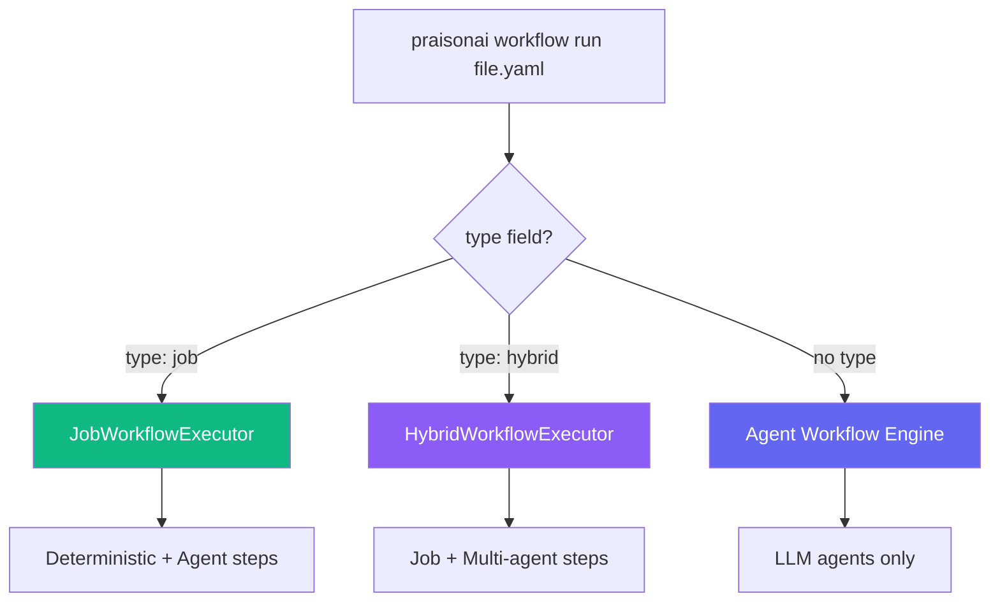

Job workflows run ordered pipelines in YAML — mixing shell commands, Python scripts, inline Python, custom actions, and AI agent steps. Use `type: job` for deterministic automation with optional AI-powered steps.

## Quick Start

```yaml deploy.yaml
type: job
name: deploy
description: Build and publish to PyPI

steps:
  - name: Clean
    run: rm -rf dist

  - name: Build
    run: uv build

  - name: Publish
    run: uv publish --token ${{ env.PYPI_TOKEN }}
```

```bash
praisonai workflow run deploy.yaml
praisonai workflow run deploy.yaml --dry-run
```

> [!TIP]
> A YAML file is a job workflow when it has **`type: job`** at the root. Without it, PraisonAI treats it as an agent workflow.

---

## How It Works



---

## Step Types

### Deterministic Steps (No LLM)

| Key | Type | What it does |
|-----|------|-------------|
| `run:` | Shell | Execute a shell command via subprocess |
| `python:` | Script | Run a Python script file |
| `script:` | Inline | Execute inline Python code |
| `action:` | Action | Run a named action (YAML-defined, file-based, or built-in) |

### Agent-Centric Steps (LLM-Powered)

| Key | Type | What it does |
|-----|------|-------------|
| `agent:` | AI Agent | Execute a single AI agent with `Agent.chat()` |
| `judge:` | Quality Gate | Evaluate content with `Judge.evaluate()` and threshold |
| `approve:` | Approval Gate | Request human or auto approval before continuing |

---

## Deterministic Steps

### Shell Steps

```yaml
- name: Build
  run: uv build
  cwd: ./packages/core    # optional working directory
  timeout: 120            # optional timeout in seconds (default: 300)
  env:                    # optional extra env vars
    NODE_ENV: production
```

Runs via `subprocess.run()` with `shell=True`. Non-zero exit code means failure.

### Python Script Steps

```yaml
- name: Analyze
  python: scripts/analyze.py
  args: --verbose --format json
```

Path is resolved relative to the workflow file. Uses `sys.executable` to match the current Python interpreter.

### Inline Python Steps

```yaml
- name: Custom logic
  script: |
    import json
    data = json.load(open("config.json"))
    result = f"Version: {data['version']}"
```

Runs via `exec()` in an isolated namespace:

| Variable | Type | Description |
|----------|------|-------------|
| `flags` | dict | Parsed CLI flags |
| `vars` | dict | Resolved workflow variables |
| `env` | dict | Copy of `os.environ` |
| `cwd` | str | Workflow's working directory |
| `result` | — | **Set this** to produce step output |

### Action Steps

```yaml
- name: Bump version
  action: bump-version
  file: pyproject.toml
  strategy: patch          # patch (default), minor, or major
```

Actions use a **3-tier resolution chain**: YAML-defined → file-based → built-in. See [Custom Actions](/docs/features/custom-actions) for full details.

**Built-in actions**: `bump-version` — bumps `version = "X.Y.Z"` in a file.

---

## Agent-Centric Steps

### Agent Step (`agent:`)

Execute an AI agent inline using `praisonaiagents.Agent`:

```yaml
- name: Generate changelog
  agent:
    role: Technical Writer
    instructions: |
      You create clear, concise changelogs.
      Focus on user-facing changes and bug fixes.
    prompt: |
      Generate a changelog entry for the latest release.
      Include: Features, Bug Fixes, Breaking Changes.
    model: gpt-4o-mini
    tools:
      - read_file
      - execute_command
  output_file: CHANGELOG.md
```

**Agent config fields**:

| Field | Default | Description |
|-------|---------|-------------|
| `role` | `"Assistant"` | Agent's role description |
| `instructions` | `""` | System instructions for the agent |
| `prompt` | Uses `instructions` | The prompt sent to `Agent.chat()` |
| `model` | `"gpt-4o-mini"` | LLM model to use |
| `tools` | `[]` | Tool names to resolve and attach |
| `name` | Step name | Agent display name |

**Features**:
- `output_file:` — automatically saves agent output to a file
- `prompt` supports variable resolution: `${{ env.X }}`, `{{ flags.X }}`
- Tools are resolved from the `praisonaiagents.tools` registry
- Simple string shorthand: `agent: "Write a greeting"` (uses defaults)

### Judge Step (`judge:`)

Quality gate that evaluates content and passes/fails based on a threshold:

```yaml
- name: Quality check
  judge:
    input_file: CHANGELOG.md
    criteria: |
      - Completeness: All sections present
      - Clarity: Easy to understand
      - Formatting: Proper markdown
    threshold: 8.0
    on_fail: warn
    model: gpt-4o-mini
```

**Judge config fields**:

| Field | Default | Description |
|-------|---------|-------------|
| `input_file` | — | File to evaluate (path relative to workflow) |
| `input` | — | Inline text to evaluate (alternative to `input_file`) |
| `criteria` | `"Output is high quality"` | Evaluation criteria |
| `threshold` | `7.0` | Minimum score (0–10) to pass |
| `on_fail` | `"stop"` | What to do on failure |
| `model` | `"gpt-4o-mini"` | LLM model for evaluation |

**`on_fail` options**:

| Value | Behavior |
|-------|----------|
| `stop` | Halt workflow (default) |
| `warn` | Log warning, continue to next step |
| `retry` | Retry the previous step (future) |

### Approve Step (`approve:`)

Human or automatic approval gate:

```yaml
- name: Approve release
  approve:
    description: Review and approve the release
    risk_level: high
    auto_approve: false
```

**Approve config fields**:

| Field | Default | Description |
|-------|---------|-------------|
| `description` | Step name | What is being approved |
| `risk_level` | `"medium"` | Risk level: `low`, `medium`, `high` |
| `auto_approve` | `false` | Skip human approval (`true` for CI/CD) |

When `auto_approve: false`, the workflow pauses and prompts in the console. Use flag expressions for dynamic control:

```yaml
approve:
  auto_approve: "{{ flags.skip_approval }}"
```

---

## YAML-Defined Actions

Define reusable actions inline — including agent-powered actions:

```yaml
type: job
name: my-workflow

actions:
  check-python:
    run: python3 --version

  generate-docs:
    agent:
      role: Documentation Writer
      prompt: Generate API docs from the codebase
      model: gpt-4o-mini

steps:
  - name: Check Python
    action: check-python

  - name: Generate docs
    action: generate-docs
```

YAML-defined actions support four inner types: `run:` (shell), `script:` (inline Python), `python:` (script file), and `agent:` (AI agent).

---

## Variables

### Workflow Variables

```yaml
type: job
vars:
  target:
    default: production
    description: Deployment target

steps:
  - name: Deploy
    run: echo "Deploying to {{ vars.target }}"
```

### Environment Variables

```yaml
- name: Publish
  run: uv publish --token ${{ env.PYPI_TOKEN }}
```

### Variable Resolution

| Syntax | Resolves to | Example |
|--------|------------|---------|
| `${{ env.VAR }}` | Environment variable | `${{ env.PYPI_TOKEN }}` |
| `{{ flags.name }}` | CLI flag value | `{{ flags.major }}` → `True` |

> [!NOTE]
> Flag names with hyphens are converted to underscores: `--no-bump` → `flags.no_bump`.

---

## Flags

```yaml
type: job
name: release
flags:
  major: { description: "Bump major version" }
  minor: { description: "Bump minor version" }
  no-bump: { description: "Skip version bump" }
  skip-approval: { description: "Auto-approve" }

steps:
  - name: Bump
    action: bump-version
    if: "{{ not flags.no_bump }}"

  - name: Approve
    approve:
      auto_approve: "{{ flags.skip_approval }}"
```

```bash
praisonai workflow run release.yaml --major
praisonai workflow run release.yaml --no-bump --skip-approval
```

---

## Conditional Steps

```yaml
- name: Run tests
  run: pytest tests/ -v
  if: "{{ not flags.skip_tests }}"

- name: Push tags
  run: git push --tags
  if: "{{ flags.major or flags.minor }}"
```

Python expressions with `flags` (dot access) and `env` (`os.environ`) in scope.

---

## Dry Run

```bash
praisonai workflow run deploy.yaml --dry-run
```

```
╭───────────── ⚡ Job Workflow — DRY RUN ──────────────╮
│ smart-release                                         │
╰──────────────────────────────────────────────────────╯

  ● Bump version — action: bump-version
  ● Generate changelog — agent: Technical Writer (model: gpt-4o-mini)
  ● Quality check — judge: threshold=8.0
  ● Approve release — approve: risk=medium
  ● Build package — shell: echo "Building..."

⚡ Dry run complete — 5 steps planned
```

## Execution Output

```
╭───────────── ⚡ Job Workflow — EXECUTE ───────────────╮
│ smart-release                                         │
╰──────────────────────────────────────────────────────╯

  ▸ Bump version ✓ (0.0s)
  ▸ Generate changelog ✓ (1.7s)
  ▸ Quality check ✓ (0.8s)
  ▸ Approve release ✓ (0.0s)
  ▸ Build package ✓ (0.1s)

✓ Workflow completed — 5 steps
```

---

## Error Handling

```yaml
- name: Optional cleanup
  run: rm -rf tmp/
  continue_on_error: true
```

By default, workflows stop on the first failure. Agent steps show helpful errors for missing API keys.

---

## Full Example

```yaml release.yaml
type: job
name: smart-release
description: AI-powered release workflow

flags:
  major: { description: "Major version" }
  minor: { description: "Minor version" }
  skip-approval: { description: "Auto-approve" }

steps:
  # Deterministic: bump version
  - name: Bump version
    action: bump-version
    strategy: patch

  # Agent: generate changelog with AI
  - name: Generate changelog
    agent:
      role: Technical Writer
      instructions: Create clear, concise changelogs
      prompt: |
        Generate a changelog entry with:
        Features, Bug Fixes, Breaking Changes
      model: gpt-4o-mini
    output_file: CHANGELOG_ENTRY.md

  # Judge: quality gate
  - name: Quality check
    judge:
      input_file: CHANGELOG_ENTRY.md
      criteria: Complete, well-formatted, concise
      threshold: 7.0
      on_fail: warn

  # Approve: human sign-off
  - name: Approve release
    approve:
      description: Review and approve the release
      risk_level: medium
      auto_approve: "{{ flags.skip_approval }}"

  # Deterministic: build and publish
  - name: Build
    run: uv build

  - name: Publish
    run: uv publish --token ${{ env.PYPI_TOKEN }}
```

```bash
praisonai workflow run release.yaml --dry-run
praisonai workflow run release.yaml --major --skip-approval
```

---

## Comparison: Job vs Agent Workflows

| | Job Workflows | Agent Workflows |
|---|---|---|
| **Discriminator** | `type: job` | No `type` field |
| **Execution** | Deterministic + optional AI | LLM-driven |
| **Deterministic steps** | ✅ `run`, `python`, `script`, `action` | ❌ |
| **Agent steps** | ✅ `agent`, `judge`, `approve` | ✅ Agent tasks |
| **API key required** | Only for agent steps | Always |
| **Dry-run** | ✅ `--dry-run` | ❌ |
| **Conditionals** | ✅ `if:` expressions | ❌ (LLM decides) |
| **Use case** | CI/CD, build, deploy, mixed pipelines | Research, content, analysis |

---

## YAML Schema Reference

```yaml
type: job                        # Required: identifies as job workflow
name: string                     # Workflow name
description: string              # Optional description

vars:                            # Optional: workflow variables
  var_name: { default: string, description: string }

flags:                           # Optional: CLI flag definitions
  flag-name: { description: string }

actions:                         # Optional: YAML-defined actions
  action-name:
    run: "shell command"         # Shell action
    script: |                    # OR inline Python action
      code
    python: "script.py"          # OR Python file action
    agent:                       # OR AI agent action
      role: string
      prompt: string

steps:                           # Required: ordered step list
  - name: string

    # Deterministic (pick one):
    run: string                  # Shell command
    python: string               # Python script path (+ args: string)
    script: |                    # Inline Python
      code
    action: string               # Named action (3-tier resolution)

    # Agent-centric (pick one):
    agent:                       # AI agent
      role: string
      instructions: string
      prompt: string
      model: string
      tools: [string]
    judge:                       # Quality gate
      input_file: string
      criteria: string
      threshold: number
      on_fail: stop|warn|retry
    approve:                     # Approval gate
      description: string
      risk_level: low|medium|high
      auto_approve: boolean

    # Optional on any step:
    if: string                   # Conditional expression
    cwd: string                  # Working directory
    timeout: integer             # Seconds (default: 300)
    env: { KEY: value }          # Extra env vars
    continue_on_error: boolean   # Don't stop on failure
    output_file: string          # Save agent output to file
```

---

## Related

<CardGroup cols={3}>
  <Card title="Custom Actions" icon="puzzle-piece" href="/docs/features/custom-actions">
    YAML-defined, file-based, built-in actions
  </Card>
  <Card title="Hybrid Workflows" icon="shuffle" href="/docs/features/hybrid-workflows">
    Combine job + multi-agent workflows
  </Card>
  <Card title="All Systems" icon="layer-group" href="/docs/features/execution-systems">
    Compare all 8 PraisonAI systems
  </Card>
</CardGroup>
