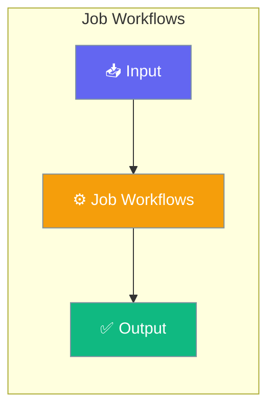

Job workflows run ordered pipelines in YAML — mixing shell commands, Python scripts, inline Python, custom actions, and AI agent steps. Use `type: job` for deterministic automation with optional AI-powered steps.




## Quick Start


<Steps>
<Step title="Simple Usage">
```yaml deploy.yaml
type: job
name: deploy
description: Build and publish to PyPI

steps:
  - name: Clean
    run: rm -rf dist

  - name: Build
    run: uv build

  - name: Publish
    run: uv publish --token ${{ env.PYPI_TOKEN }}
```
</Step>

<Step title="With Configuration">
```bash
praisonai workflow run deploy.yaml
praisonai workflow run deploy.yaml --dry-run
```

```python Run programmatically
from praisonai.agents_generator import AgentsGenerator

# Job workflow YAML
gen = AgentsGenerator(agent_file="deploy.yaml")
gen.generate_crew_and_kickoff()

# Or async
import asyncio
asyncio.run(AgentsGenerator(agent_file="deploy.yaml").agenerate_crew_and_kickoff())
```

> [!TIP]
> A YAML file is a job workflow when it has **`type: job`** at the root. Without it, PraisonAI treats it as an agent workflow.

**No extra flag needed** — the wrapper detects `type: job` and routes automatically. Previously only the `praisonai workflow run` CLI did this; the programmatic API now matches.

---
</Step>
</Steps>


## Best Practices

<AccordionGroup>
  <Accordion title="Start simple">
    Enable the feature with a single parameter before adding configuration. Verify it works, then layer in options.
  </Accordion>
  <Accordion title="Use environment variables for secrets">
    Never hardcode API keys or tokens. Use `os.getenv("KEY_NAME")` to read from environment variables.
  </Accordion>
  <Accordion title="Test with minimal examples first">
    Copy the Quick Start example, run it, then extend it. This confirms your environment is set up correctly.
  </Accordion>
  <Accordion title="Check the logs">
    Set `verbose=True` on your agent to see detailed execution logs when debugging unexpected behavior.
  </Accordion>
</AccordionGroup>

## Related

<CardGroup cols={2}>
  <Card title="Features Overview" icon="grid-2" href="/docs/features">
    Browse all PraisonAI features
  </Card>
  <Card title="Quick Start" icon="rocket" href="/docs/introduction">
    Get started with PraisonAI agents
  </Card>
</CardGroup>
