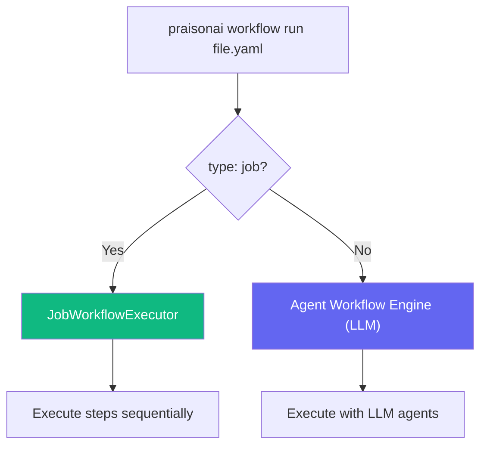

Job workflows run ordered, deterministic pipelines in YAML — mixing shell commands, Python scripts, inline Python, and custom actions. No API keys, no LLM tokens, same result every time.

## Quick Start

```yaml deploy.yaml
type: job
name: deploy
description: Build and publish to PyPI

steps:
  - name: Clean
    run: rm -rf dist

  - name: Build
    run: uv build

  - name: Publish
    run: uv publish --token ${{ env.PYPI_TOKEN }}
```

```bash
praisonai workflow run deploy.yaml
praisonai workflow run deploy.yaml --dry-run
```

> [!TIP]
> A YAML file is a job workflow when it has **`type: job`** at the root. Without it, PraisonAI treats it as an agent workflow.

---

## How It Works



Both job and agent workflows use the same CLI — `praisonai workflow run`. The `type` field determines which engine handles the file.

---

## Step Types

Each step declares its type with a single YAML key:

| Key | Type | What it does |
|-----|------|-------------|
| `run:` | Shell | Execute a shell command via subprocess |
| `python:` | Script | Run a Python script file |
| `script:` | Inline | Execute inline Python code |
| `action:` | Action | Run a named action (YAML-defined, file-based, or built-in) |

### Shell Steps

```yaml
- name: Build
  run: uv build
  cwd: ./packages/core    # optional working directory
  timeout: 120            # optional timeout in seconds (default: 300)
  env:                    # optional extra env vars
    NODE_ENV: production
```

Runs via `subprocess.run()` with `shell=True`. Captures stdout and stderr — non-zero exit code means failure. Error message shows stderr (or stdout if stderr is empty).

### Python Script Steps

```yaml
- name: Analyze
  python: scripts/analyze.py
  args: --verbose --format json
```

Path is resolved relative to the workflow file's directory. Uses `sys.executable` so it matches the current Python interpreter. The `args:` string is split on spaces and passed as argv.

### Inline Python Steps

```yaml
- name: Custom logic
  script: |
    import json
    data = json.load(open("config.json"))
    result = f"Version: {data['version']}"
```

Runs via `exec()` in an isolated namespace with these variables available:

| Variable | Type | Description |
|----------|------|-------------|
| `flags` | dict | Parsed CLI flags (e.g., `{"major": True}`) |
| `vars` | dict | Resolved workflow variables |
| `env` | dict | Copy of `os.environ` |
| `cwd` | str | Workflow's working directory |
| `result` | — | **Set this** to produce step output |

### Action Steps

```yaml
- name: Bump version
  action: bump-version
  file: pyproject.toml
  strategy: patch          # patch (default), minor, or major
```

Actions use a **3-tier resolution chain**: YAML-defined → file-based → built-in. See [Custom Actions](/docs/features/custom-actions) for full details on creating your own.

**Built-in actions**:

| Action | What it does |
|--------|-------------|
| `bump-version` | Bumps `version = "X.Y.Z"` in a file (default: `pyproject.toml`) |

---

## Variables

### Workflow Variables

Define reusable values with `vars:`:

```yaml
type: job
name: deploy
vars:
  target:
    default: production
    description: Deployment target
  registry:
    default: pypi

steps:
  - name: Deploy
    run: echo "Deploying to {{ vars.target }}"
```

### Environment Variables

Reference environment variables with `${{ env.VAR_NAME }}`:

```yaml
- name: Deploy
  run: ssh ${{ env.DEPLOY_HOST }} "cd /app && git pull"

- name: Publish
  run: uv publish --token ${{ env.PYPI_TOKEN }}
```

### Variable Resolution

Two template syntaxes are supported in step targets:

| Syntax | Resolves to | Example |
|--------|------------|---------|
| `${{ env.VAR_NAME }}` | Environment variable | `${{ env.PYPI_TOKEN }}` → value of `$PYPI_TOKEN` |
| `{{ flags.flag_name }}` | CLI flag value | `{{ flags.major }}` → `True` or `False` |

> [!NOTE]
> Flag names with hyphens are converted to underscores for access. `--no-bump` → `flags.no_bump`.

---

## Flags

Define custom CLI flags in the `flags:` block:

```yaml
type: job
name: release
flags:
  major: { description: "Bump major version" }
  minor: { description: "Bump minor version" }
  no-bump: { description: "Skip version bump" }

steps:
  - name: Bump
    action: bump-version
    file: pyproject.toml
    if: "{{ not flags.no_bump }}"
```

```bash
praisonai workflow run release.yaml --major
praisonai workflow run release.yaml --no-bump
```

Flags are boolean — present means `True`, absent means `False`. The `--major` and `--minor` flags are also recognized by the built-in `bump-version` action to override the `strategy:` field.

---

## Conditional Steps

Skip steps based on flag or environment values using `if:`:

```yaml
- name: Run tests
  run: pytest tests/ -v
  if: "{{ not flags.skip_tests }}"

- name: Push tags
  run: git push --tags
  if: "{{ flags.major or flags.minor }}"
```

Conditions are Python expressions evaluated in a restricted context with `flags` (object with dot access) and `env` (`os.environ`).

---

## YAML-Defined Actions

Define reusable actions inline with the `actions:` block — no external files needed:

```yaml
type: job
name: my-workflow

actions:
  check-python:
    run: python3 --version

  count-files:
    script: |
      import os
      py_files = [f for f in os.listdir(cwd) if f.endswith('.py')]
      result = f"Found {len(py_files)} Python files"

steps:
  - name: Check Python
    action: check-python

  - name: Count files
    action: count-files
```

YAML-defined actions support all three inner types: `run:` (shell), `script:` (inline Python), `python:` (script file). They take **highest priority** in the resolution chain — see [Custom Actions](/docs/features/custom-actions) for file-based actions and the full resolution order.

---

## Dry Run

Preview the workflow without executing:

```bash
praisonai workflow run deploy.yaml --dry-run
```

```
╭───────────── ⚡ Job Workflow — DRY RUN ──────────────╮
│ deploy                                                │
│ Build and publish to PyPI                             │
╰──────────────────────────────────────────────────────╯

  ● Bump version — action: bump-version
  ● Clean dist — shell: rm -rf dist
  ● Build package — shell: uv build
  ● Publish to PyPI — shell: uv publish --token ****

⚡ Dry run complete — 4 steps planned
```

## Execution Output

When run live, each step shows pass/fail with timing:

```
╭───────────── ⚡ Job Workflow — EXECUTE ───────────────╮
│ deploy                                                │
╰──────────────────────────────────────────────────────╯

  ▸ Bump version ✓ (0.0s)
  ▸ Clean dist ✓ (0.0s)
  ▸ Build package ✓ (1.2s)
  ▸ Publish to PyPI ✓ (3.4s)

✓ Workflow completed — 4 steps
```

Failed steps show `✗ (0.3s)` with the error message below.

---

## Error Handling

By default, workflows stop on the first failed step. Use `continue_on_error` to keep going:

```yaml
- name: Optional cleanup
  run: rm -rf tmp/
  continue_on_error: true
```

---

## Full Example

```yaml release.yaml
type: job
name: release
description: Version bump, build, test, and publish

flags:
  major: { description: "Bump major version" }
  minor: { description: "Bump minor version" }
  skip-tests: { description: "Skip test suite" }
  no-bump: { description: "Skip version bump" }

steps:
  - name: Bump version
    action: bump-version
    file: pyproject.toml
    if: "{{ not flags.no_bump }}"

  - name: Install dependencies
    run: pip install -e ".[dev]"

  - name: Run tests
    run: pytest tests/ -v
    if: "{{ not flags.skip_tests }}"

  - name: Build
    run: uv build

  - name: Analyze bundle
    python: scripts/bundle_check.py
    args: --max-size 50MB

  - name: Publish
    run: uv publish --token ${{ env.PYPI_TOKEN }}
```

```bash
praisonai workflow run release.yaml
praisonai workflow run release.yaml --major --skip-tests
praisonai workflow run release.yaml --no-bump --dry-run
```

---

## Comparison: Job vs Agent Workflows

| | Job Workflows | Agent Workflows |
|---|---|---|
| **Discriminator** | `type: job` | No `type` field |
| **Execution** | Deterministic, sequential | LLM-driven, non-deterministic |
| **Step types** | shell, python, script, action | Agent tasks with LLM calls |
| **API key required** | No | Yes |
| **Cost** | Free | LLM tokens |
| **Custom actions** | YAML-defined, file-based, built-in | Tools, plugins |
| **Dry-run** | ✅ `--dry-run` | ❌ |
| **Conditionals** | `if:` expressions | LLM decides |
| **Use case** | CI/CD, build, deploy, automation | Research, content, analysis |
| **CLI** | `praisonai workflow run` | Same |

---

## YAML Schema Reference

```yaml
type: job                      # Required: identifies as job workflow
name: string                   # Workflow name
description: string            # Optional description

vars:                          # Optional: workflow variables
  var_name:
    default: string
    description: string

flags:                         # Optional: CLI flag definitions
  flag-name:
    description: string

actions:                       # Optional: YAML-defined custom actions
  action-name:
    run: "shell command"       # Shell action
    # OR
    script: |                  # Inline Python action
      python_code_here
    # OR
    python: "script.py"        # Python file action

steps:                         # Required: ordered step list
  - name: string              # Step name (displayed in output)
    run: string               # Shell command
    # OR
    python: string            # Python script path
    args: string              # Script arguments
    # OR
    script: |                 # Inline Python
      python_code_here
    # OR
    action: string            # Action name (3-tier resolution)

    # Optional on any step:
    if: string                # Conditional expression
    cwd: string               # Working directory
    timeout: integer           # Timeout in seconds (default: 300)
    env:                       # Extra environment variables
      KEY: value
    continue_on_error: boolean # Don't stop on failure (default: false)
```

---

## Related

<CardGroup cols={2}>
  <Card title="Custom Actions" icon="puzzle-piece" href="/docs/features/custom-actions">
    YAML-defined, file-based, and built-in actions
  </Card>
  <Card title="All Systems" icon="layer-group" href="/docs/features/execution-systems">
    Compare Job Workflows vs Agent Workflows vs Recipes
  </Card>
</CardGroup>
