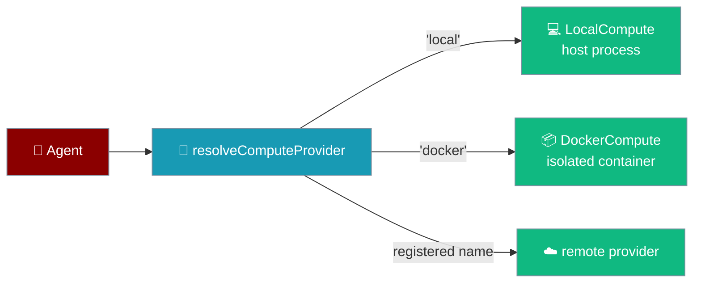
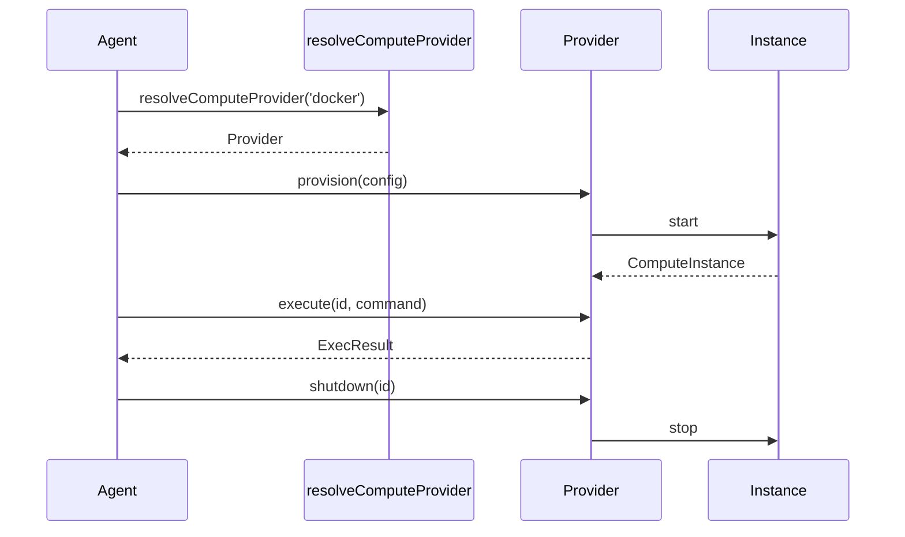
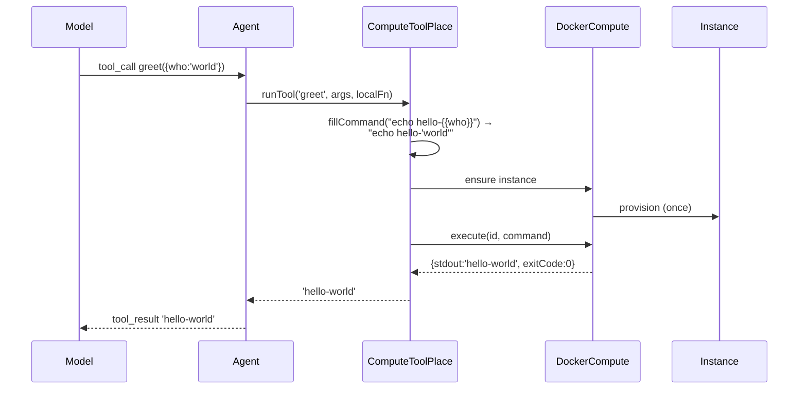

Compute providers decide where an agent's tools run; `praisonai-ts` ships one on this machine and one in a Docker container, and lets you plug in remote providers by name.



## Quick Start

<Steps>
<Step title="Run a command on this machine">
```typescript
import { LocalCompute } from 'praisonai';

const local = new LocalCompute();
const instance = await local.provision();
const result = await local.execute(instance.id, 'echo hello');
console.log(result.stdout.trim());   // 'hello'
await local.shutdown(instance.id);
```
</Step>

<Step title="Run it in an isolated Docker container">
```typescript
import { DockerCompute } from 'praisonai';

const docker = new DockerCompute();
if (!(await docker.isAvailable())) throw new Error('Docker daemon not running');

const instance = await docker.provision({ image: 'python:3.11-slim' });
const result = await docker.execute(instance.id, 'python -c "print(2+2)"');
console.log(result.stdout.trim());   // '4'
await docker.shutdown(instance.id);
```
</Step>

<Step title="Resolve a provider by name">
```typescript
import { resolveComputeProvider, listComputeProviders } from 'praisonai';

console.log(listComputeProviders());               // ['docker', 'local']
const provider = resolveComputeProvider('docker'); // throws if the name is unknown
```
</Step>
</Steps>

---

## How It Works

A provider is resolved by name, provisions an instance, runs commands against it, then tears it down.



| Method | What it does |
|---|---|
| `isAvailable()` | Whether this provider can be used here — SDK present, daemon reachable, credentials set. Callers check this instead of discovering it through a failure mid-run. |
| `provision(config?)` | Bring up a fresh instance. Returns a `ComputeInstance` with an `id`. |
| `execute(id, cmd, config?)` | Run one command. Returns `{ stdout, stderr, exitCode, timedOut, durationMs }`. |
| `shutdown(id)` | Tear the instance down. `DockerCompute` runs `docker rm -f`; a failure raises. |
| `listInstances()` / `getStatus(id)` | Introspect what has been provisioned. |

---

## Configuration Options

Every provider accepts the same `ComputeConfig` on `provision()` and `execute()`.

| Option | Type | Default | Description |
|---|---|---|---|
| `image` | `string` | `python:3.11-slim` (Docker) | Image or template id, where the provider has such a concept. |
| `workdir` | `string` | `/workspace` (Docker) | Working directory inside the instance. |
| `env` | `Record<string, string>` | `undefined` | Environment variables for every command. |
| `timeoutSeconds` | `number` | `60` | Seconds before a command is killed. Providers enforce this. |
| `options` | `Record<string, unknown>` | `undefined` | Provider-specific extras, passed through untouched. |

---

## `ComputeToolPlace` — turning a provider into a tool place

`ComputeToolPlace` adapts a `ComputeProvider` to the place `toolsRunOn` selects, so a tool call can run on the provider instead of in the host process.

```typescript
import { Agent, ComputeToolPlace, DockerCompute } from 'praisonai';

// 1. A place with a command template per tool. 'greet' knows how to run itself.
const place = new ComputeToolPlace(new DockerCompute(), {
  greet: 'echo hello-{{who}}',
});

// 2. Point the agent at that place. Everything else stays local.
const agent = new Agent({ instructions: 'Greeter', toolsRunOn: place });

// 3. When the model calls greet({ who: 'world' }), the shell command runs
//    inside Docker and its stdout comes back as the tool result.
await agent.chat('Say hi to the world.');
```



Five decisions govern where a call goes and what a failure returns:

**A declared command runs on the provider.**
```typescript
const place = new ComputeToolPlace(new LocalCompute(), { greet: 'echo hello-{{who}}' });
const out = await place.runTool('greet', { who: 'world' }, async () => 'LOCAL');
// out.trim() === 'hello-world'
```

**A tool with no command falls back to the local implementation.** A JavaScript closure cannot cross a process boundary; running it locally and saying so beats implying isolation that is not there.
```typescript
const place = new ComputeToolPlace(new LocalCompute());
await place.runTool('anything', {}, async () => 'LOCAL'); // 'LOCAL'
```

**Arguments are quoted — an injection stays one argument.** Every substituted `{{arg}}` is single-quoted.
```typescript
const place = new ComputeToolPlace(new LocalCompute(), { greet: 'echo hello-{{who}}' });
const out = await place.runTool('greet', { who: 'a; echo pwned' }, async () => 'x');
// out.trim() === 'hello-a; echo pwned'  — the literal text, not a second command
```

**A timeout raises rather than returning an empty string.** An empty string would read as a successful tool call that found nothing.
```typescript
// ComputeError: Tool 'slow' timed out on local. No output was produced, ...
```

**An unavailable provider raises instead of silently running on the host.** Silently running on the host what a caller asked to sandbox is the opposite of what asking for a sandbox means.
```typescript
// ComputeError: toolsRunOn='docker' but that provider is not available here.
// Tools would silently run on the host instead, ...
```

**`setCommand(toolName, template)` declares a tool after construction.**
```typescript
const place = new ComputeToolPlace(new LocalCompute());
place.setCommand('later', 'echo declared-later');
await place.runTool('later', {}, async () => 'x'); // 'declared-later'
```

### Auto-registration on import

`registerComputeToolPlaces()` populates the placement registry with the built-in providers (`local`, `docker`). It is idempotent and called on import of `praisonai/compute`, so consumers never call it themselves. Registering a *new* compute provider with `registerComputeProvider('e2b', …)` also mirrors into the placement registry, so `new Agent({ toolsRunOn: 'e2b' })` works after that one call.

---

## `LocalCompute`

Runs commands in the host Node process — the honest baseline that does not isolate anything.

- Spawns a detached shell (`/bin/sh -c` on POSIX, `%ComSpec% /d /s /c` on Windows) and kills the whole process group on timeout, so a backgrounded descendant (`(sleep 3; touch marker) &`) is terminated with the shell rather than orphaned.
- **Does not sandbox.** Use `DockerCompute` or a remote provider for untrusted code.
- Unavailable in webviews / mobile / any runtime without `child_process`. `child_process` is loaded through a computed specifier so bundlers cannot see it statically; there, `isAvailable()` returns `false` and any `provision()` / `execute()` throws `ComputeError`.

<Warning>
`LocalCompute` runs tool commands in your own process with no isolation. Anything the command can do, your app can do. Reach for `DockerCompute` or a remote provider before running code you did not write.
</Warning>

## `DockerCompute`

Real isolation via the `docker` CLI.

- Uses the `docker` CLI directly — no Docker SDK dependency, because this package ships to a webview.
- Default image `python:3.11-slim`, default workdir `/workspace`.
- Checks `docker info`, not `docker --version` — the CLI can be installed while the daemon is down, so it surfaces "daemon down" honestly instead of promising availability and then failing on provision.
- Timeouts fire **inside** the container (`timeout -k 5 <seconds>`), so the process is actually killed — not just the host-side `docker exec` client, which would leave the command running.
- `shutdown()` runs `docker rm -f <id>`; if that fails, the instance is marked `error` and `ComputeError` is raised ("Could not remove container … It may still be running."). A container reported stopped while still running is exactly the silent wrongness this guards against. A clean removal forgets the container.
- Env vars, workdir, and image on `ComputeConfig` are honoured; shell metacharacters in values are single-quoted, so a filename with a space cannot become two arguments.

---

## The Registry

Providers resolve by name through an open registry.

```typescript
import { registerComputeProvider, listComputeProviders, resolveComputeProvider } from 'praisonai';
```

- `registerComputeProvider(name, factory)` — add a provider. Names are lower-cased.
- `listComputeProviders()` — the names available in this build. Ships with `['docker', 'local']`.
- `resolveComputeProvider(nameOrInstance)` — returns a provider, or `null` for an empty target. **An unknown name throws** and lists what exists.

`resolveComputeProvider` handles each input shape:

| Input | Result |
|---|---|
| `undefined` / `null` / `""` | `null` — no provider, not an error |
| A registered name (case-insensitive) | A new provider instance from the factory |
| An unknown name (`'e2b'`, `'made-up'`) | **Throws `ComputeError`** listing what exists |
| An object with `execute()` | Returned as-is |
| An object without `execute()` | Throws `ComputeError` |

### An unknown name RAISES — deliberately

```typescript
import { resolveComputeProvider } from 'praisonai';

resolveComputeProvider('e2b');
// ComputeError: Unknown compute provider 'e2b'. Available: docker, local.
// Falling back to local would run on the host something you asked to sandbox.
```

Falling back to `local` for an unrecognised sandbox name would run on the host something the caller explicitly asked to isolate. That is a security property, not an inconvenience — the same reasoning as the Python contract.

### Adding a remote provider

Any consumer can register one without touching the SDK.

```typescript
import { registerComputeProvider, type ComputeProvider } from 'praisonai';

class MyRemoteCompute implements ComputeProvider {
  readonly name = 'my-remote';
  async isAvailable() { return Boolean(process.env.MY_REMOTE_KEY); }
  async provision(config) { /* start a remote instance, return a ComputeInstance */ }
  async execute(id, cmd, config) { /* run one command, return an ExecResult */ }
  async shutdown(id) { /* tear it down */ }
  async listInstances() { /* return known instances */ }
  async getStatus(id) { /* return one instance or null */ }
}

registerComputeProvider('my-remote', () => new MyRemoteCompute());
```

E2B, Modal, Daytona, SSH and Novita are intentionally not built in yet — each needs its own SDK and credentials, and belongs in a follow-up against this contract rather than a stub that looks implemented and does nothing.

---

## Timeouts and Exit Codes

A timeout is its own outcome, not a non-zero exit.

```typescript
const r = await local.execute(id, 'sleep 5', { timeoutSeconds: 1 });
r.timedOut    // true
r.exitCode    // null
```

*"We don't know the answer"* and *"the answer is no"* are different, and collapsing them makes a slow command look like a failing one. `DockerCompute` maps the container-side `timeout` exit code `124` back to the same `{ timedOut: true, exitCode: null }`, so both providers report timeouts identically. On POSIX, `LocalCompute` escalates the timeout `SIGTERM` → `SIGKILL` 2 s later, so a shell that ignores `SIGTERM` still goes.

---

## Common Patterns

Try Docker for isolation, fall back to Local in development:

```typescript
import { DockerCompute, LocalCompute } from 'praisonai';

const docker = new DockerCompute();
const provider = (await docker.isAvailable()) ? docker : new LocalCompute();
const instance = await provider.provision();
```

Register a remote provider once at app boot:

```typescript
import { registerComputeProvider, resolveComputeProvider } from 'praisonai';

registerComputeProvider('my-remote', () => new MyRemoteCompute());
const provider = resolveComputeProvider('my-remote');
```

Provision once, run many commands, then shut down:

```typescript
const instance = await provider.provision();
await provider.execute(instance.id, 'pip install requests');
await provider.execute(instance.id, 'python script.py');
await provider.shutdown(instance.id);
```

---

## Best Practices

<AccordionGroup>
<Accordion title="Never trust LocalCompute for untrusted code">
`LocalCompute` runs in the host process without isolation. Anything the command can reach, your app can reach. Use `DockerCompute` or a remote provider for anything you did not write.
</Accordion>

<Accordion title="Always shut instances down">
Especially with Docker — an ungoverned container is not free. Pair every `provision()` with a `shutdown()`, even on the error path.
</Accordion>

<Accordion title="Check isAvailable() before you rely on a provider">
Fail loudly at boot rather than mid-run. `docker.isAvailable()` checks the daemon; a remote provider checks its credentials.
</Accordion>

<Accordion title="Let an unknown name raise">
An unknown provider name raises on purpose. Silencing it — falling back to `local` — defeats the point of asking for a sandbox.
</Accordion>
</AccordionGroup>

---

## Related

<CardGroup cols={2}>
  <Card title="Placement" icon="server" href="/js/placement">
    The `toolsRunOn` / `runOn` / `backend` axes
  </Card>
  <Card title="Compute Providers (Python)" icon="server" href="/features/compute-providers">
    The Python counterpart of this contract
  </Card>
</CardGroup>
