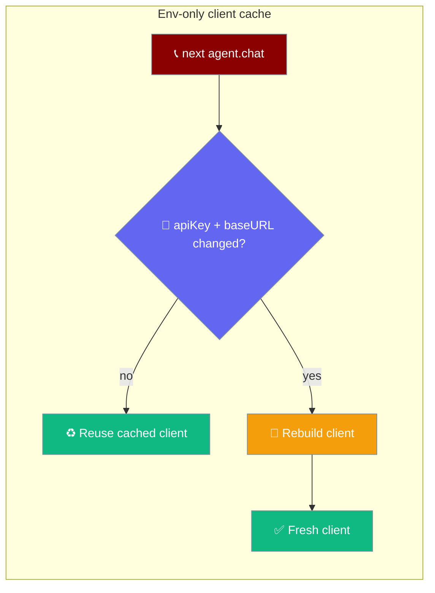
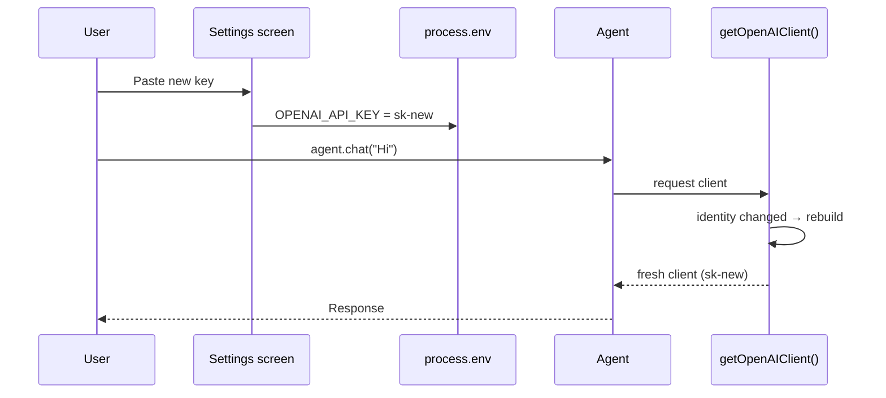
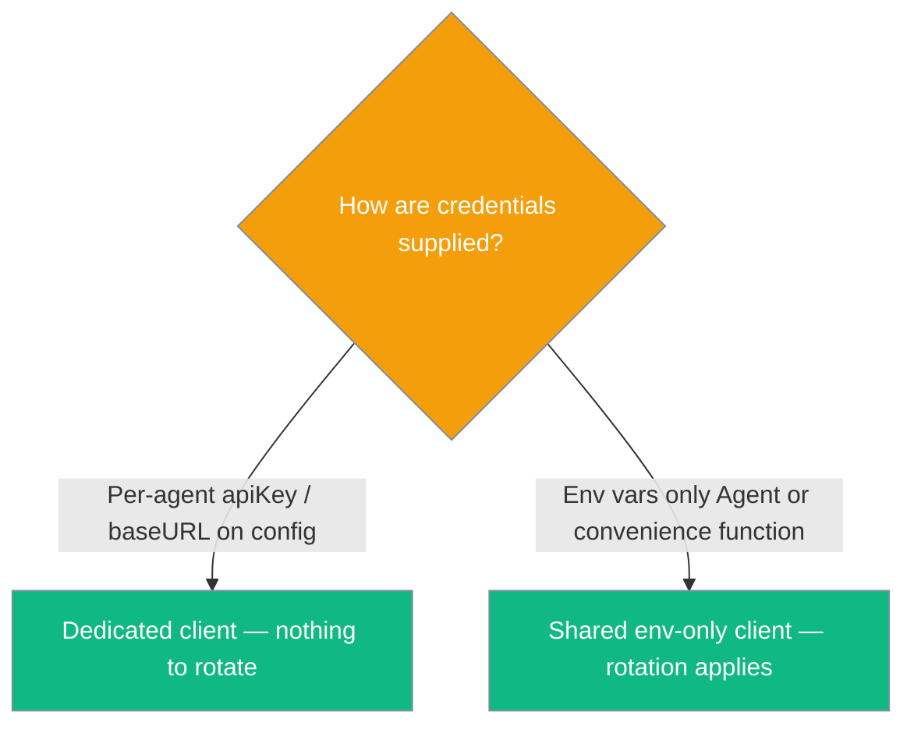

`praisonai-ts` picks up a changed `OPENAI_API_KEY` or `OPENAI_BASE_URL` on the next call — no restart, no code change.



The env-only OpenAI client caches on **client identity** (`apiKey` + `baseURL`). Rotate either and the next call rebuilds automatically — the exact flow a settings screen needs when a user pastes a new key.

## Quick Start

<Steps>
<Step title="Rotate the key in your settings screen">
Set the env var; the next call uses the new key.

```typescript
import { Agent } from 'praisonai';

process.env.OPENAI_API_KEY = 'sk-new';
const agent = new Agent({ instructions: 'You are helpful' });
await agent.chat('Hello');   // uses sk-new — no restart
```
</Step>

<Step title="Point at a different gateway">
Set `OPENAI_BASE_URL`; the next call rebuilds against the new endpoint.

```typescript
process.env.OPENAI_BASE_URL = 'https://gateway.example/v1';
await agent.chat('Hello via gateway');   // rebuilt against the new endpoint
```
</Step>

<Step title="Force a rebuild explicitly">
Call `resetOpenAIClient()` to rebuild on the next call — useful in tests and after a bulk settings change.

```typescript
import { resetOpenAIClient } from 'praisonai';

resetOpenAIClient();
await agent.chat('Fresh client');
```
</Step>
</Steps>

---

## How It Works

The env-only client keys its cache on `apiKey + baseURL`. A settings-screen edit to either env var changes that identity, so the next `getOpenAIClient()` rebuilds.



| Trigger | Result |
|---------|--------|
| `OPENAI_API_KEY` changes between calls | Rebuild on next call |
| `OPENAI_BASE_URL` changes between calls | Rebuild on next call |
| Nothing changes | Reuse cached client |
| `resetOpenAIClient()` called | Rebuild on next call |

<Note>
`OPENAI_BASE_URL` is honoured in the env-only path. Exporting it works for the module-level convenience functions and any `Agent` built from env only — the same way an explicit `baseURL` on the config already did.
</Note>

---

## When Does This Apply?

Rotation applies only to the shared env-only client. Per-agent credentials never touch that cache.



An `Agent` built with an explicit `apiKey` or `baseURL` gets its own dedicated client, so a later env-var change does not affect it. Rotate by constructing a new `Agent` with the new value.

---

## Concurrency

A `resetOpenAIClient()` or credential change that races an in-flight request is safe. Each caller keeps the client it built for its own identity — an overlapping call that swaps the key never hands back another call's client, and a reset mid-flight never yields `null`.

---

## Security

The identity that keys the cache contains the secret key. `praisonai-ts` never logs it — do not add logging that prints it either.

---

## API Reference

Two exports back the rotation contract. The recommended user surface stays `new Agent(...)` and `agent.chat(...)`.

| Export | Signature | When to call |
|--------|-----------|--------------|
| `resetOpenAIClient` | `() => void` | Tests; explicit "apply now" from a settings screen; recovery after a suspected stale-cache bug in older versions. |

<Accordion title="Advanced: getOpenAIClient()" icon="wrench">
`getOpenAIClient(): Promise<OpenAI>` is exported so tests and advanced integrations can reach the shared env-only client. It throws `OPENAI_API_KEY not found in environment variables` when no key is set. Prefer `new Agent(...)` for application code.
</Accordion>

---

## Common Patterns

**Simple rotation — no code change from the SDK caller**

```typescript
import { Agent } from 'praisonai';

process.env.OPENAI_API_KEY = 'sk-first';
const agent = new Agent({ instructions: 'You are helpful' });
await agent.chat('Hello');           // uses sk-first

// Settings screen updates the env var:
process.env.OPENAI_API_KEY = 'sk-second';
await agent.chat('Hello again');     // rebuilds automatically; uses sk-second
```

**Change the gateway at runtime**

```typescript
import { Agent } from 'praisonai';

process.env.OPENAI_API_KEY = 'sk-shared';
process.env.OPENAI_BASE_URL = 'https://gateway-a.example/v1';
const agent = new Agent({ instructions: 'You are helpful' });
await agent.chat('Hello via gateway A');

process.env.OPENAI_BASE_URL = 'https://gateway-b.example/v1';
await agent.chat('Hello via gateway B');   // rebuilt against gateway B
```

**Explicit rebuild — tests and bulk settings updates**

```typescript
import { Agent, resetOpenAIClient } from 'praisonai';

process.env.OPENAI_API_KEY = 'sk-stable';
const agent = new Agent({ instructions: 'You are helpful' });
await agent.chat('One');

resetOpenAIClient();                   // force next call to rebuild
await agent.chat('Two');               // fresh client, same env
```

---

## Best Practices

<AccordionGroup>
<Accordion title="Prefer per-agent credentials in multi-tenant apps" icon="users">
Pass `apiKey` / `baseURL` on each `Agent` to isolate tenants. Each agent gets its own client, so one tenant's rotation never affects another.
</Accordion>

<Accordion title="Trust the automatic rebuild in single-tenant apps" icon="rotate">
The next call rebuilds when the key or base URL changes. There is no need to call `resetOpenAIClient()` on every key update.
</Accordion>

<Accordion title="Never log the identity string or API key" icon="lock">
The cache identity embeds the secret. Keep it out of logs and error messages.
</Accordion>

<Accordion title="One reset after a bulk settings change" icon="wand-magic-sparkles">
After changing several settings at once in a UI, a single `resetOpenAIClient()` is enough — the next call rebuilds once.
</Accordion>
</AccordionGroup>

---

## Related

<CardGroup cols={2}>
  <Card title="Agent" icon="robot" href="/js/agent">
    The core Agent class and credential options
  </Card>
  <Card title="Import Safety (JS)" icon="shield-check" href="/features/js-import-safety">
    Lazy credential reads and runtime safety
  </Card>
  <Card title="Browser & Webview Runtimes" icon="globe" href="/features/browser-runtimes">
    Run agents in browsers, Tauri, Electron, and React Native
  </Card>
</CardGroup>
