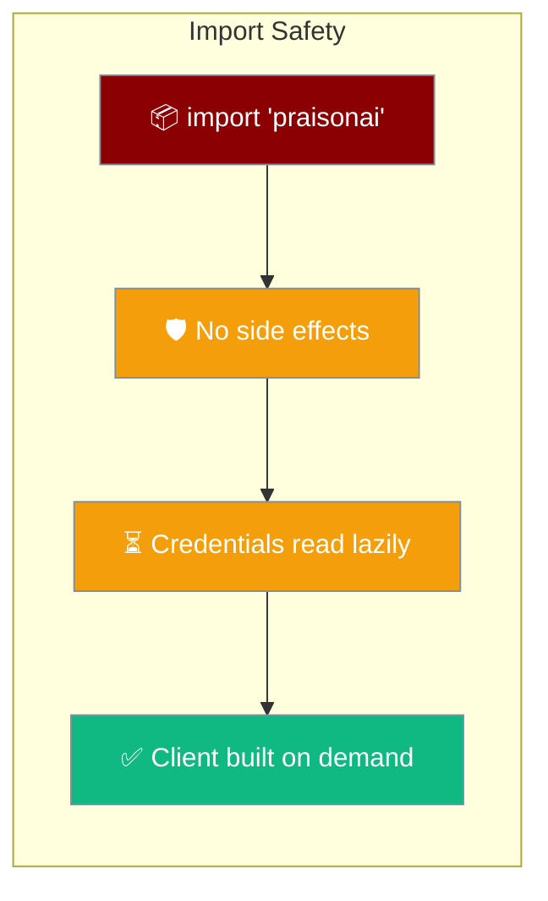
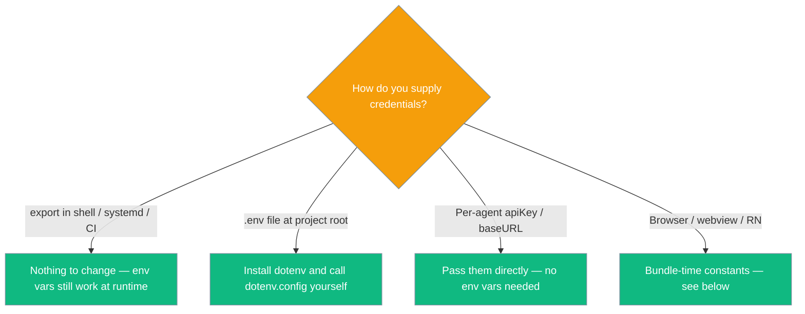

`import 'praisonai'` runs no `process.env` reads and no `dotenv.config()` at load time, so it works in browsers, Electron renderers, webviews (Tauri), and React Native.



## Import safety

Importing `praisonai` no longer touches the runtime environment.

- `import 'praisonai'` performs **no** `process.env` reads and **no** `dotenv.config()` at load time — safe in browsers, Electron renderers, webviews (Tauri), and React Native.
- The old `dotenv.config()` side effect **is gone**. If you relied on it to auto-load `.env` in Node, call it yourself (see [Migrating from auto-loaded `.env`](#migrating-from-auto-loaded-env)).
- The `dotenv` and `node-fetch` npm packages are **no longer transitive dependencies** of `praisonai`. Both were unused in the SDK source; dropping them improves tree-shaking and shrinks install size.

<Note>
Credentials are still read for you — just **later**. `OPENAI_API_KEY` is read lazily inside the OpenAI client the moment a client is actually built, mirroring the Python SDK. Env vars set in your shell, systemd, Docker, or CI keep working with zero code changes.
</Note>

## Do I still need `dotenv`?

Only `.env` files need a one-line change; every other credential path is untouched.



## Quick Start

<Steps>
<Step title="Zero-config Node with shell env vars">
No code change needed when `OPENAI_API_KEY` is set in your shell, `.zshrc`, or systemd unit.

```ts
import { Agent } from 'praisonai';

const agent = new Agent({ instructions: 'You are a helpful assistant' });
await agent.start('Hello');
```
</Step>

<Step title="Node with a .env file">
Load `.env` yourself — `praisonai` no longer does it for you.

```ts
import 'dotenv/config';                 // Load .env yourself — praisonai no longer does.
import { Agent } from 'praisonai';

const agent = new Agent({ instructions: 'You are a helpful assistant' });
await agent.start('Hello');
```
</Step>

<Step title="Browser / webview">
No `process`, no `dotenv`, no throw. Pass credentials per-agent.

```ts
import { Agent } from 'praisonai';

// Nothing at module load reaches for `process` or `.env`.
const agent = new Agent({
  instructions: 'You are a helpful assistant',
  apiKey: import.meta.env.VITE_OPENAI_KEY,
});
await agent.chat('Hello from the browser!');
```
</Step>
</Steps>

---

## Migrating from auto-loaded `.env`

`praisonai` used to call `dotenv.config()` for you on import — now you call it once yourself.

Process env vars set in the shell, systemd, Docker, or CI still work with **zero** code changes. Only `.env` files loaded via the `dotenv` package need this one-line addition.

<CodeGroup>
```ts Before (v1.7.4 and earlier)
// .env was loaded for you the moment you imported the package.
import { Agent } from 'praisonai';
const agent = new Agent({ instructions: 'Hi' });
```

```ts After (from PR #4416)
import 'dotenv/config';       // Load .env explicitly — praisonai no longer does this for you.
import { Agent } from 'praisonai';
const agent = new Agent({ instructions: 'Hi' });
```
</CodeGroup>

---

## Best Practices

<AccordionGroup>
<Accordion title="Prefer shell/CI env vars in production" icon="terminal">
Set `OPENAI_API_KEY` in your shell, systemd unit, Docker, or CI. These work at runtime with no code changes and keep secrets out of your bundle.
</Accordion>

<Accordion title="Use dotenv only for local .env files" icon="file">
If you keep credentials in a project-root `.env`, install `dotenv` and call `dotenv.config()` (or `import 'dotenv/config'`) at the very top of your entrypoint.
</Accordion>

<Accordion title="Pass credentials per-agent in browsers" icon="globe">
Browsers and webviews have no `process` or `.env`. Provide `apiKey` (and `baseURL`/`fetch` when needed) directly on each `Agent` using bundle-time constants like `import.meta.env.VITE_OPENAI_KEY`.
</Accordion>

<Accordion title="Rely on lazy credential reads" icon="clock">
`praisonai` reads `OPENAI_API_KEY` only when an OpenAI client is built, and `LOGLEVEL` only on first log. Importing the package never throws in runtimes without `process`.
</Accordion>
</AccordionGroup>

---

## Related

<CardGroup cols={2}>
  <Card title="Node.js Agents" icon="node-js" href="/js/nodejs">
    Node.js quick start and examples
  </Card>
  <Card title="TypeScript Agents" icon="scroll" href="/js/typescript">
    TypeScript quick start and examples
  </Card>
</CardGroup>
