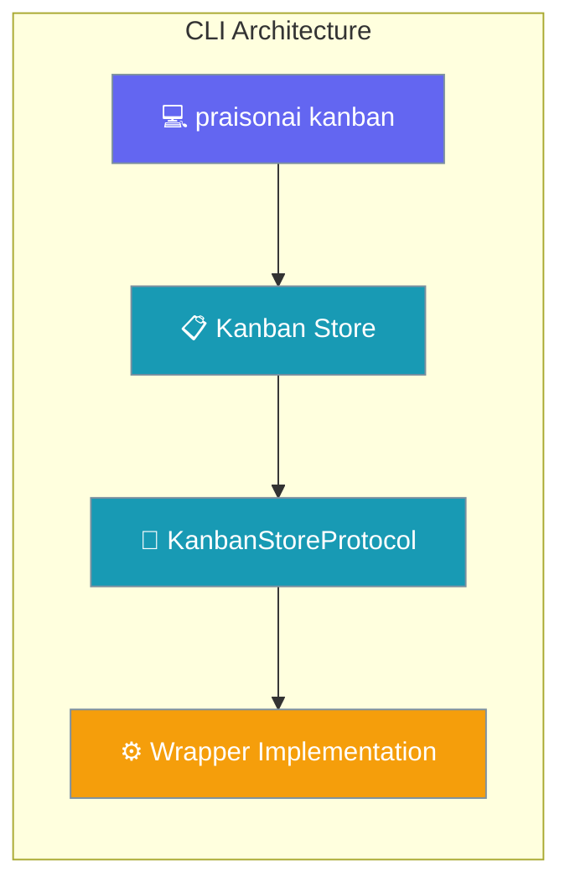
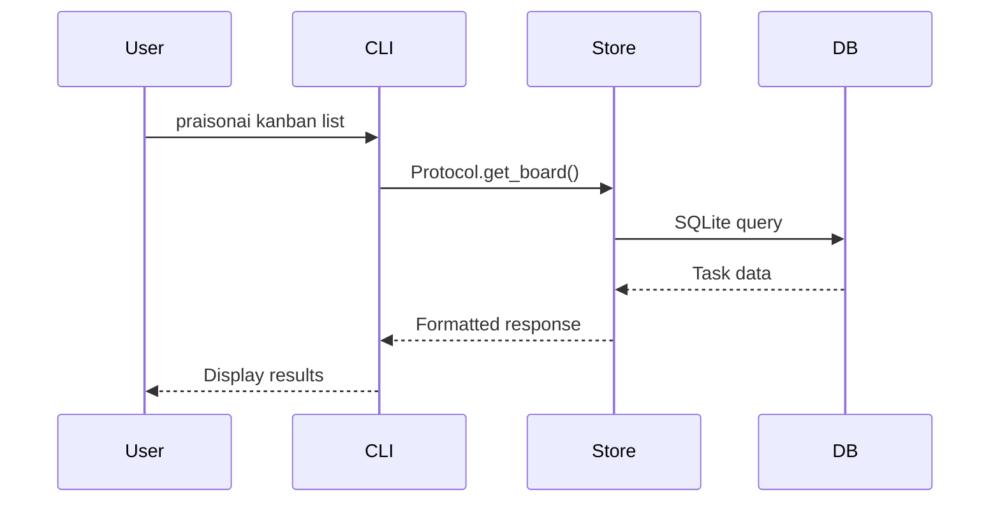

```python
from praisonaiagents import Agent

agent = Agent(name="kanban-agent", instructions="Manage kanban boards via CLI.")
agent.start("Show the current kanban board and move completed tasks to Done.")
```

The user runs `praisonai kanban` commands to list boards, add tasks, and update status from the terminal.

CLI commands for kanban task management through `praisonai kanban` subcommands.

<Note>
**Feature Status:** The CLI commands documented here require wrapper implementation. The core SDK provides protocols only. See [praisonaiagents.kanban.protocols](/docs/sdk/praisonaiagents/kanban) for available interfaces.
</Note>



## Quick Start

<Steps>
<Step title="Install Wrapper">

CLI commands require the wrapper package with kanban implementation:

```bash
# Wrapper installation (implementation-specific)
pip install praisonai[kanban]  # Example
```

</Step>

<Step title="Basic Usage">

```bash
# List tasks (requires implementation)
praisonai kanban list --status ready
```

</Step>
</Steps>

---

## How It Works

CLI commands operate through the KanbanStoreProtocol interface:



---

## Configuration Options

CLI commands use environment variables for configuration:

| Variable | Purpose | Default | Example |
|----------|---------|---------|---------|
| `PRAISONAI_KANBAN_BOARD` | Active board name | `"default"` | `export PRAISONAI_KANBAN_BOARD=project-a` |
| `PRAISONAI_KANBAN_DB` | Database path | `~/.praisonai/kanban.db` | `export PRAISONAI_KANBAN_DB=/custom/kanban.db` |

### Tuning lease & reclamation

| Variable | Default | What it controls |
|----------|---------|-----------------|
| `PRAISONAI_KANBAN_CLAIM_TTL` | `900` (15 min) | How long a worker's claim stays valid before it can be reclaimed |
| `PRAISONAI_KANBAN_STALE_TIMEOUT` | `1800` (30 min) | How long a heartbeat can go stale before the worker is treated as hung |

Increase `PRAISONAI_KANBAN_CLAIM_TTL` for long-running tasks. See [Kanban Reliability](/docs/features/kanban#reliability-claim-leases--automatic-reclamation) for full details.

---

## Common Patterns

### Project Workflow

```bash
# Set project board
export PRAISONAI_KANBAN_BOARD=project-a

# Create tasks (requires implementation)
praisonai kanban create "Design login UI" --assignee designer
praisonai kanban create "Implement auth API" --assignee developer

# Link dependencies (requires implementation)
praisonai kanban link design_task api_task
```

### Multi-Agent Coordination

```bash
# Human creates high-level task
praisonai kanban create "Build user system" --assignee coordinator

# Coordinator agent breaks it down (via agent tools)
# Worker agents claim and complete subtasks (via agent tools)

# Human monitors progress
praisonai kanban list --status running --json | jq '.tasks[] | .title'
```

---

<Note>
Each kanban task now records every attempt (`kanban_runs`), supports a per-task retry/circuit-breaker (`max_retries`), and accepts idempotent creation (`idempotency_key`). See [Attempt History & Retry](/docs/features/kanban#attempt-history--retry).
</Note>

## Best Practices

<AccordionGroup>
<Accordion title="Board Organization">
Use separate boards for different projects. Set `PRAISONAI_KANBAN_BOARD` environment variable to switch between projects efficiently.
</Accordion>

<Accordion title="Task Naming">
Use clear, actionable task titles. Include context and expected outcomes. Example: "Fix login validation error in user service" vs "Fix bug".
</Accordion>

<Accordion title="Status Workflow">
Follow the standard workflow: `todo` → `ready` → `running` → `done`. Use `blocked` for dependencies and `review` for approval gates.
</Accordion>
</AccordionGroup>

---

## `kanban_runs` tool

The `kanban_runs` tool lists all execution attempts for a specific task, enabling agents to inspect retry history and handoff summaries.

```bash
# From agent tool invocation:
kanban_runs --task-id task-abc123

# Outputs:
# run-1: outcome=success, summary="Auth module tests passed", finished_at=2026-06-29T10:00:00Z
# run-2: outcome=failure, summary="DB connection refused", finished_at=2026-06-29T10:05:00Z
```

### CLI example with runs

```bash
# Create a task with retry limits
praisonai kanban create "Deploy to staging" --max-retries 3

# Complete with structured handoff
praisonai kanban complete <task-id> --summary "Deployed v2.1.0" --metadata '{"sha": "abc123"}'

# List runs for a task
praisonai kanban runs <task-id>
```

---

## Related

<CardGroup cols={2}>
<Card title="Kanban Feature" icon="kanban" href="/docs/features/kanban">
  Main kanban documentation including runs, retries, and structured handoff
</Card>

<Card title="Background Tasks" icon="clock" href="/docs/features/background-tasks">
  Async job processing and scheduling
</Card>
</CardGroup>

---

## Commands Reference

<Note>
The following command reference describes the expected CLI interface. Implementation depends on wrapper package.
</Note>

<Tabs>
<Tab title="list">

List kanban tasks with filtering options.

```bash
# List all tasks
praisonai kanban list

# Filter by status
praisonai kanban list --status ready

# Filter by assignee
praisonai kanban list --assignee developer

# Specific board
praisonai kanban list --board project-a

# JSON output
praisonai kanban list --json

# Combine filters
praisonai kanban list --status todo --assignee agent --limit 10
```

**Options:**
- `--status, -s`: Filter by status (triage, todo, ready, running, blocked, review, done, archived)
- `--assignee, -a`: Filter by assignee username
- `--board, -b`: Board name (default: "default")
- `--limit, -l`: Maximum tasks to show (default: 50)
- `--json`: Output as JSON

</Tab>

<Tab title="create">

Create a new kanban task.

```bash
# Basic task
praisonai kanban create "Implement user authentication"

# With details
praisonai kanban create "Fix login bug" \
  --body "Users can't log in with special characters" \
  --assignee developer \
  --status ready \
  --priority 5

# Different board
praisonai kanban create "Review PR #123" --board project-a

# JSON output
praisonai kanban create "Setup CI/CD" --json
```

**Arguments:**
- `title`: Task title (required)

**Options:**
- `--body, -b`: Task description
- `--assignee, -a`: Username to assign task to
- `--status, -s`: Initial status (default: "todo")
- `--priority, -p`: Priority level (higher = more important, default: 0)
- `--board`: Board name (default: "default")
- `--json`: Output as JSON

</Tab>

<Tab title="show">

Display detailed task information.

```bash
# Show task details
praisonai kanban show task_abc123

# JSON output  
praisonai kanban show task_abc123 --json
```

Shows task details, comments, and dependency information.

**Arguments:**
- `task_id`: The task ID to display (required)

**Options:**
- `--json`: Output as JSON

</Tab>

<Tab title="move">

Move a task to a different status.

```bash
# Move to ready
praisonai kanban move task_abc123 ready

# Move to running
praisonai kanban move task_abc123 running

# Move to done
praisonai kanban move task_abc123 done
```

**Arguments:**
- `task_id`: The task ID to move (required)
- `status`: New status (required)

Valid statuses: `triage`, `todo`, `scheduled`, `ready`, `running`, `blocked`, `review`, `done`, `archived`

</Tab>

<Tab title="comment">

Add a comment to a task.

```bash
# Add progress comment
praisonai kanban comment task_abc123 "Authentication module 50% complete"

# Different author
praisonai kanban comment task_abc123 "Looks good to me" --author reviewer

# JSON output
praisonai kanban comment task_abc123 "Testing phase started" --json
```

**Arguments:**
- `task_id`: The task ID to comment on (required)
- `text`: Comment text (required)

**Options:**
- `--author, -a`: Comment author (default: current user)
- `--json`: Output as JSON

</Tab>

<Tab title="link">

Create a dependency link between tasks.

```bash
# Create dependency (design must finish before implementation)
praisonai kanban link task_design task_implement

# JSON output
praisonai kanban link task_parent task_child --json
```

Child task waits in its current column (`todo`/`blocked`) until **all** parents reach `done`/`archived` — then the dispatcher auto-promotes it to `ready`. See [Dependency Auto-Promotion](/docs/features/kanban#dependency-auto-promotion).

**Arguments:**
- `parent_id`: Parent task ID (must complete first)
- `child_id`: Child task ID (depends on parent)

**Options:**
- `--json`: Output as JSON

</Tab>

<Tab title="complete">

Mark a task as completed.

```bash
# Mark complete
praisonai kanban complete task_abc123

# With completion message
praisonai kanban complete task_abc123 --comment "Authentication working perfectly"

# JSON output
praisonai kanban complete task_abc123 --json
```

Automatically moves task to "done" status.

**Arguments:**
- `task_id`: The task ID to complete (required)

**Options:**
- `--comment, -c`: Completion comment
- `--json`: Output as JSON

</Tab>

<Tab title="block">

Mark a task as blocked with a reason.

```bash
# Block task with reason
praisonai kanban block task_abc123 "Waiting for API credentials"

# JSON output
praisonai kanban block task_abc123 "Database migration needed" --json
```

Automatically moves task to "blocked" status and adds a comment with the reason.

**Arguments:**
- `task_id`: The task ID to block (required)
- `reason`: Blocking reason (required)

**Options:**
- `--json`: Output as JSON

</Tab>

<Tab title="unblock">

Remove block and move task back to ready status.

```bash
# Unblock task
praisonai kanban unblock task_abc123

# With resolution comment
praisonai kanban unblock task_abc123 --comment "Got API credentials"
```

**Arguments:**
- `task_id`: The task ID to unblock (required)

**Options:**
- `--comment, -c`: Resolution comment
- `--json`: Output as JSON

</Tab>

<Tab title="boards">

List and manage available boards.

```bash
# List all boards
praisonai kanban boards

# Switch active board
praisonai kanban boards --switch project-a

# Create new board
praisonai kanban boards --create new-project
```

**Options:**
- `--switch, -s`: Switch to different board
- `--create, -c`: Create new board
- `--json`: Output as JSON

</Tab>

<Tab title="dispatch">

Start background task dispatcher.

```bash
# Start dispatcher with defaults
praisonai kanban dispatch

# Custom configuration
praisonai kanban dispatch --max-concurrent 5 --poll-interval 15

# Check dispatcher status
praisonai kanban dispatch --status

# Stop running dispatcher
praisonai kanban dispatch --stop
```

On each tick the dispatcher first promotes any dependent tasks whose parents are all complete, then claims `ready` tasks. The dispatcher automatically claims "ready" tasks and spawns agent processes to work on them.

**Options:**
- `--max-concurrent, -m`: Maximum concurrent tasks (default: 3)
- `--poll-interval, -p`: Seconds between polls (default: 5.0)
- `--status`: Check if dispatcher is running
- `--stop`: Stop the dispatcher
- `--daemon, -d`: Run in background

</Tab>

<Tab title="reclaim">

Reclaim orphaned tasks from crashed workers.

```bash
# Reclaim all orphaned tasks
praisonai kanban reclaim

# Reclaim specific task
praisonai kanban reclaim --task-id task_abc123

# Force reclaim (ignore timeouts)
praisonai kanban reclaim --force
```

Used to recover tasks that were claimed by agents that crashed or were interrupted.

**Options:**
- `--task-id, -t`: Specific task to reclaim
- `--force, -f`: Force reclaim ignoring normal timeouts
- `--json`: Output as JSON

</Tab>
</Tabs>

## Environment Variables

| Variable | Effect | Example |
|----------|--------|---------|
| `PRAISONAI_KANBAN_BOARD` | Default board for all commands | `export PRAISONAI_KANBAN_BOARD=project-a` |
| `PRAISONAI_KANBAN_DB` | Override database file path | `export PRAISONAI_KANBAN_DB=/custom/kanban.db` |

## Examples

### Basic Workflow

```bash
# Create a task
praisonai kanban create "Implement login system" --assignee developer --status ready

# Check tasks assigned to you
praisonai kanban list --assignee developer --status ready

# Work on task (from agent)
# ... agent claims and processes task ...

# Check progress
praisonai kanban show task_abc123

# Mark complete
praisonai kanban complete task_abc123 --comment "Login system implemented and tested"
```

### Multi-Agent Coordination

```bash
# Coordinator creates tasks
praisonai kanban create "Design authentication flow" --status todo
praisonai kanban create "Implement auth backend" --status todo  
praisonai kanban create "Create login UI" --status todo

# Link dependencies
praisonai kanban link design_task backend_task
praisonai kanban link backend_task ui_task

# Start background processing
praisonai kanban dispatch --max-concurrent 2

# Monitor progress
praisonai kanban list --status running
```

### Project Management

```bash
# Switch to project board
export PRAISONAI_KANBAN_BOARD=mobile-app

# Create feature tasks
praisonai kanban create "User profile screen" --assignee frontend
praisonai kanban create "Profile API endpoint" --assignee backend  
praisonai kanban create "Unit tests for profile" --assignee qa

# Track progress
praisonai kanban list --json > project_status.json
```