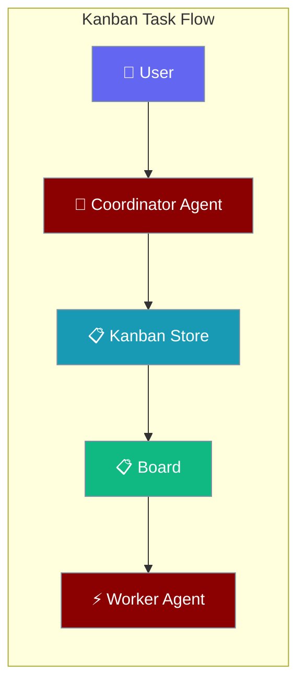
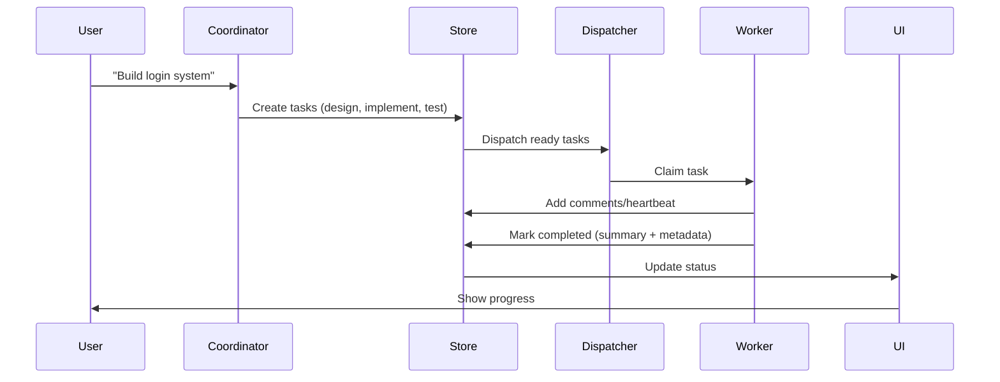
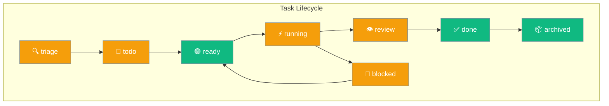
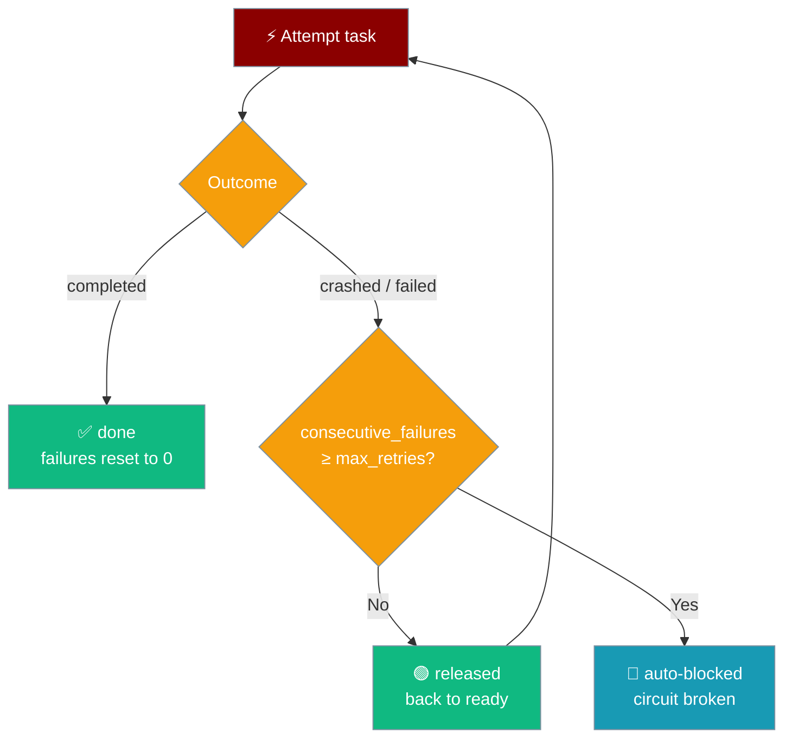
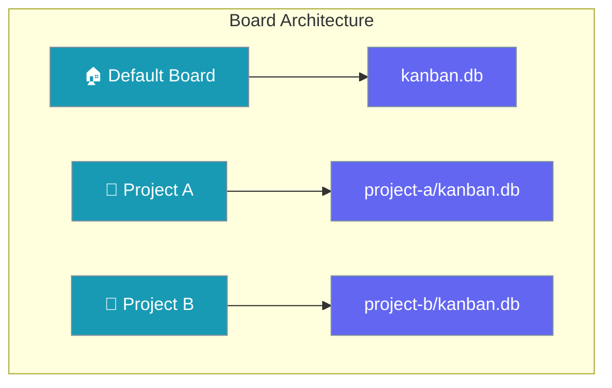
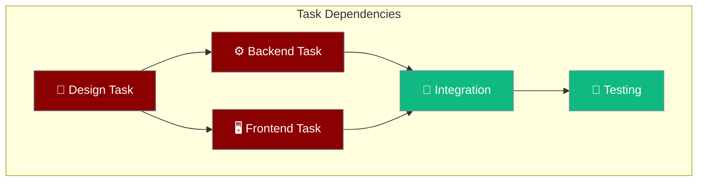
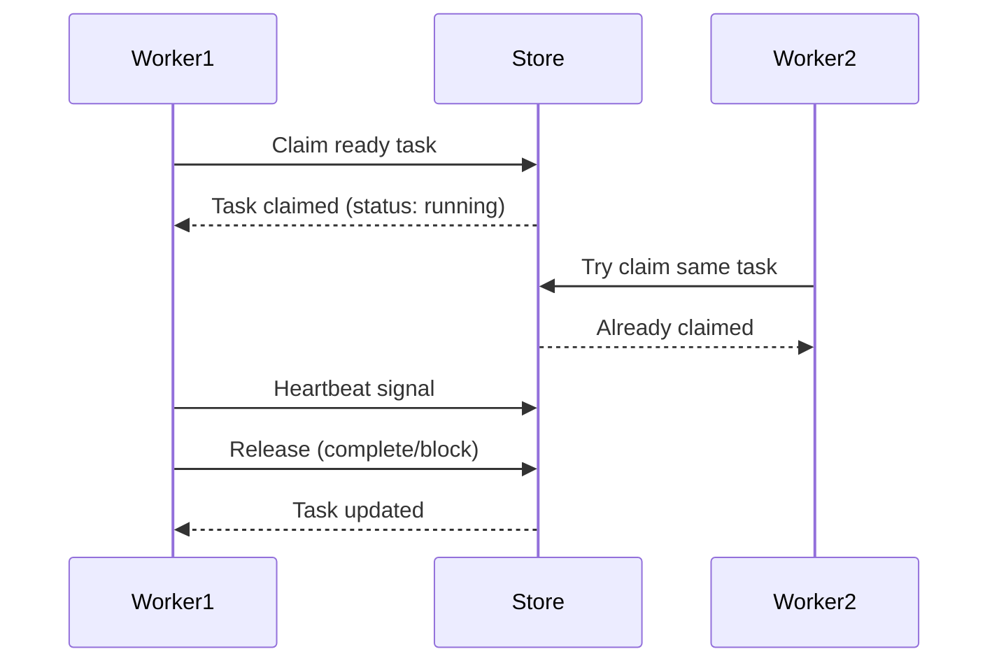

Kanban enables agents to coordinate through persistent tasks with per-task retries and structured handoff, creating a shared workspace where work is tracked and distributed across multiple agents.



## Quick Start

<Steps>
<Step title="Create Agent with Kanban Tools">

```python
from praisonaiagents import Agent

agent = Agent(name="Coordinator", instructions="Break tasks down and create kanban tasks")
result = agent.start("Create user auth system")
```

</Step>

<Step title="Add Worker Agent">

```python
from praisonaiagents import Agent

worker = Agent(name="Worker", instructions="Claim and complete tasks")
result = worker.start("Find ready tasks")
```

</Step>
</Steps>

---

## How It Works



Task coordination happens through a SQLite-backed persistent store that all agents and the UI share.

| Component | Purpose |
|-----------|---------|
| **Kanban Store** | SQLite database storing tasks, comments, links, and run history |
| **Agent Tools** | 9 functions for task CRUD, completion, and run history |
| **CLI Commands** | Human interface for task management |
| **Background Dispatcher** | Auto-claims ready tasks for processing |

---

## Task Status Flow



---

## Retry & Circuit Breaker

Each task tracks its own consecutive-failure count and auto-blocks after the limit, so a flaky task doesn't loop forever.



| Knob | Where | Default | Effect |
|------|-------|---------|--------|
| `max_retries` on `kanban_create` | per-task override | `None` → board default | After N consecutive failed attempts, the task is auto-blocked. |
| `DEFAULT_MAX_RETRIES` | module-level constant in `praisonai/kanban/sqlite_store.py` | `3` | Fallback when a task has no override (or override is invalid). |
| Reset behaviour | `record_run(..., 'completed', ...)` | n/a | A completed run resets `consecutive_failures` back to `0`. |

<Note>
Two edge cases pinned by tests:
- Non-positive or non-integer `max_retries` on create (e.g. `0`, `-1`, `"oops"`) falls back to `DEFAULT_MAX_RETRIES` instead of auto-blocking on the first failure (`test_invalid_max_retries_falls_back_to_default`).
- A legacy migrated row with persisted `max_retries = 0` also falls back to the default (`test_legacy_zero_max_retries_does_not_block_on_first_failure`).
</Note>

---

## Structured Handoff

`kanban_complete` records a structured summary + metadata alongside the status change, so retrying workers and linked children read facts instead of prose.

```python
from praisonaiagents import Agent

worker = Agent(
    name="AuthBuilder",
    instructions=(
        "Claim a ready task, build the feature, then call kanban_complete "
        "with a one-line summary and a metadata dict listing changed_files "
        "and tests_run so the next task can pick up the handoff."
    ),
)
worker.start("Implement the auth task on the board")
```

| Field | Type | Description |
|-------|------|-------------|
| `summary` | `str` | One- or two-sentence statement of what was done. |
| `metadata` | `dict` | Structured handoff fields, e.g. `{"changed_files": [...], "tests_run": 14, "residual_risk": "..."}`. |
| `outcome` | `str` | One of `completed` / `blocked` / `crashed` / `failed` / `gave_up`. |
| `error` | `str` | Error text for non-`completed` outcomes. |
| `started_at` / `ended_at` | ISO-8601 `str` | Run window; `ended_at` is `None` while the run is open. |

---

## Run History (`kanban_runs`)

Before retrying a task, call `kanban_runs` to read prior attempts' outcomes / summaries / errors so the next attempt avoids the path that already failed.

```python
from praisonaiagents import Agent

retrier = Agent(
    name="Retrier",
    instructions=(
        "If a task has prior attempts, call kanban_runs(task_id) first. "
        "Use the prior summary / error to choose a different approach this "
        "attempt; then complete with kanban_complete(summary=..., metadata=...)."
    ),
)
retrier.start("Pick up task task_abc123 and retry it")
```

<Note>
`kanban_runs` returns `{ "task_id": ..., "runs": [...], "count": N }`, oldest first. Each run carries the full `KanbanRunProtocol` shape (fields: `summary`, `metadata`, `outcome`, `error`, `started_at`, `ended_at`).
</Note>

---

## Idempotent Create

Repeating `kanban_create` with the same `idempotency_key` on the same board (and tenant) returns the existing task instead of creating a duplicate — safe for retrying automation and webhook handlers.

```python
from praisonaiagents import Agent

agent = Agent(
    name="WebhookHandler",
    instructions=(
        "When the webhook fires, call kanban_create(title, "
        "idempotency_key=<webhook_event_id>). A retry of the same webhook "
        "must return the existing task, not a duplicate."
    ),
)
```

<Note>
Idempotency is scoped to `(board, tenant, idempotency_key)`. The same key under a different tenant creates a distinct task — verified by `test_idempotent_create_scoped_by_tenant`.
</Note>

---

## Concepts

### Task Statuses

Tasks flow through 8 defined states from creation to completion:

```mermaid
graph TB
    subgraph "Status Flow"
        Triage[🔍 triage] --> Todo[📝 todo]
        Todo --> Ready[🟢 ready]
        Ready --> Running[⚡ running]
        Running --> Review[👁️ review]
        Running --> Blocked[🚫 blocked]
        Blocked --> Ready
        Review --> Done[✅ done]
        Done --> Archived[📦 archived]
    end
    
    classDef status fill:#F59E0B,stroke:#7C90A0,color:#fff
    classDef ready fill:#10B981,stroke:#7C90A0,color:#fff
    classDef done fill:#10B981,stroke:#7C90A0,color:#fff
    
    class Triage,Todo,Running,Review,Blocked status
    class Ready ready  
    class Done,Archived done
```

### Boards

Boards provide workspace isolation for different projects or contexts:



### DAG Links

Tasks form directed acyclic graphs through parent-child dependencies:



### Claim/Release

Workers coordinate through atomic claim and release operations:



---

## Agent Tools

Kanban tools are available through the SDK protocols. The wrapper implementation provides these agent tools:

### Task Management

| Tool | Purpose | Example |
|------|---------|---------|
| `kanban_create` | Create new task (with retry limit + idempotency dedup) | `kanban_create("Audit auth", max_retries=2, idempotency_key="audit-1")` |
| `kanban_list` | Filter tasks | `kanban_list(status="ready", assignee="dev")` |
| `kanban_show` | Get task details | `kanban_show("task_abc123")` |

### Status Changes

| Tool | Purpose | Example |
|------|---------|---------|
| `kanban_complete` | Mark task done with structured handoff | `kanban_complete("task_abc123", summary="JWT + 14 tests", metadata={"changed_files": ["auth.py"]})` |
| `kanban_runs` | Read attempt history | `kanban_runs("task_abc123")` |
| `kanban_block` | Block with reason | `kanban_block("task_abc123", "Need API keys")` |

> Back-compat: `kanban_complete("task_abc123", "Auth working")` still works — the second positional becomes `summary`. The old keyword `comment=` is preserved and writes a visible comment if `summary` is empty.

### Coordination

| Tool | Purpose | Example |
|------|---------|---------|
| `kanban_comment` | Add progress note | `kanban_comment("task_abc123", "50% complete")` |
| `kanban_link` | Create dependency | `kanban_link("design_task", "implement_task")` |
| `kanban_heartbeat` | Signal liveness | `kanban_heartbeat("task_abc123", "testing")` |

---

## Boards & Storage

### Single Board (Default)
```
~/.praisonai/kanban.db
```

### Multi-Board Layout
```
~/.praisonai/kanban/boards/
├── project-a/kanban.db
├── project-b/kanban.db
└── team-x/kanban.db
```

<Info>
Upgrading from a pre-v1.6.84 DB: the store adds a `task_runs` table and four columns on `tasks` (`idempotency_key`, `max_retries`, `consecutive_failures`, `current_run_id`) in place on first open — no migration command needed.
</Info>

### Environment Configuration

| Variable | Effect | Example |
|----------|--------|---------|
| `PRAISONAI_KANBAN_BOARD` | Select active board | `export PRAISONAI_KANBAN_BOARD=project-a` |
| `PRAISONAI_KANBAN_DB` | Override DB path | `export PRAISONAI_KANBAN_DB=/custom/path.db` |

---

## Common Patterns

### Coordinator-Worker Pattern

```python
from praisonaiagents import Agent

coordinator = Agent(
    name="Coordinator", 
    instructions="Break user requests into kanban tasks"
)

worker = Agent(
    name="Worker",
    instructions="Claim ready tasks, report progress via heartbeat"
)
```

### Background Processing

```python
from praisonaiagents import Agent

worker = Agent(
    name="Worker",
    instructions="""Claim ready tasks and report liveness via heartbeat. 
    Use kanban_heartbeat every 30 seconds during long-running work."""
)

result = worker.start("Find ready tasks, claim one, and report progress")
```

### Worker with Structured Handoff

```python
from praisonaiagents import Agent

worker = Agent(
    name="Worker",
    instructions=(
        "Claim a ready task, do the work, then call "
        "kanban_complete with summary and metadata so the next "
        "agent knows exactly what was done."
    ),
)
worker.start("Find and complete a ready task on the board")
```

### Retry-Aware Worker

```python
from praisonaiagents import Agent

worker = Agent(
    name="RetryWorker",
    instructions=(
        "Before starting a task, call kanban_runs to check prior attempts. "
        "If a prior attempt failed, use that error to choose a different path. "
        "Always complete with kanban_complete(summary=..., metadata=...)."
    ),
)
worker.start("Retry task task_abc123 with a fresh approach")
```

---

## Best Practices

<AccordionGroup>
<Accordion title="Task Granularity">
Create tasks that can be completed in 15-30 minutes. Break larger work into linked subtasks using `kanban_link` for proper dependency tracking.
</Accordion>

<Accordion title="Status Management">
Move tasks through statuses systematically: `todo` → `ready` → `running` → `done`. Use `blocked` for dependencies and `review` for human approval.
</Accordion>

<Accordion title="Agent Coordination">
Use `kanban_heartbeat` during long-running tasks to signal liveness. Add detailed comments with `kanban_comment` to track progress and decisions.
</Accordion>

<Accordion title="Board Organization">
Use separate boards for different projects or contexts. Default board works well for single-project setups.
</Accordion>

<Accordion title="Structured Handoff">
Prefer `kanban_complete(summary="...", metadata={...})` over a free-text `comment`. The summary + metadata are surfaced verbatim to retrying workers (via `kanban_runs`) and to linked children — short structured facts beat parsed prose. Use `comment` only for human-visible notes that don't need to drive automation.
</Accordion>

<Accordion title="Retry Limits">
The board default (`DEFAULT_MAX_RETRIES = 3`) is fine for most tasks. Set `kanban_create(..., max_retries=N)` only when you know a task is flaky and want a tighter or looser limit. After `N` consecutive failed attempts the task auto-blocks; a completed attempt resets the counter to `0`.
</Accordion>
</AccordionGroup>

---

## Related

<CardGroup cols={2}>
<Card title="Async Jobs" icon="clock" href="/docs/features/async-jobs">
  Asynchronous job processing and queuing
</Card>

<Card title="Background Tasks" icon="clock" href="/docs/features/background-tasks">
  Async job processing and scheduling
</Card>

<Card title="CLI Dispatcher" icon="terminal" href="/docs/features/cli-dispatcher">
  Command-line task orchestration
</Card>
</CardGroup>
