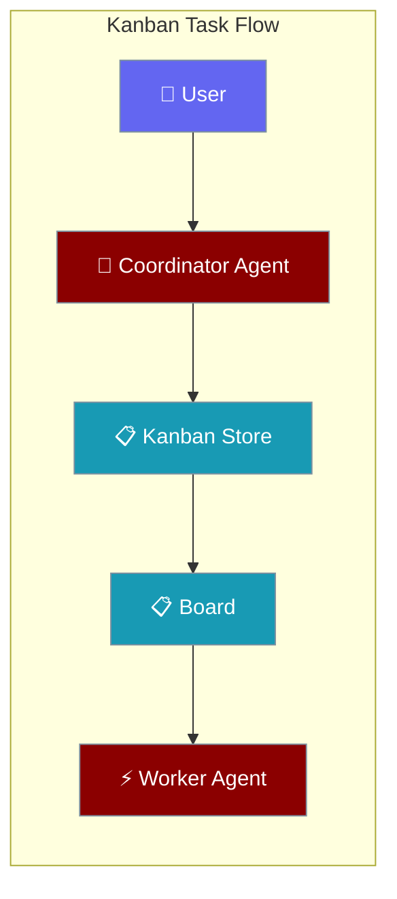
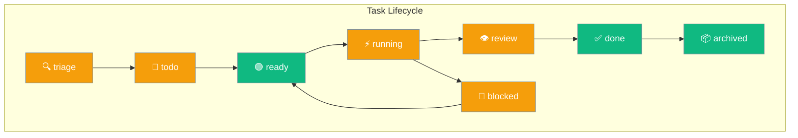
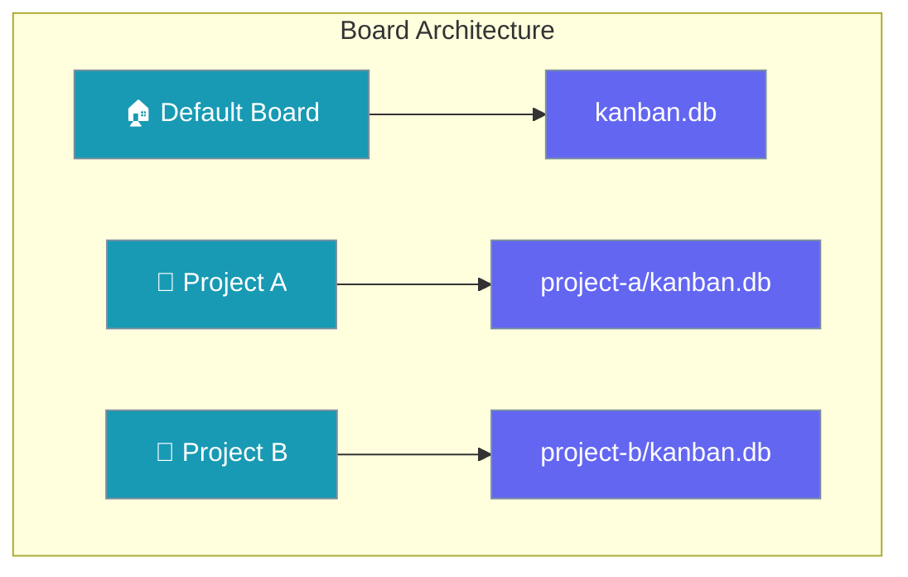
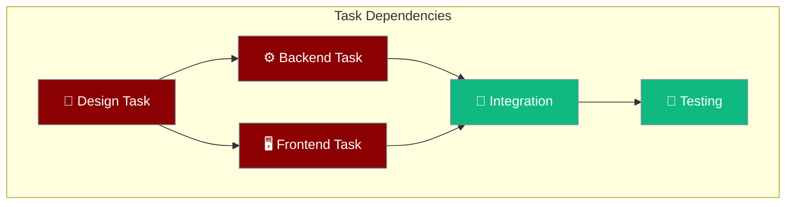
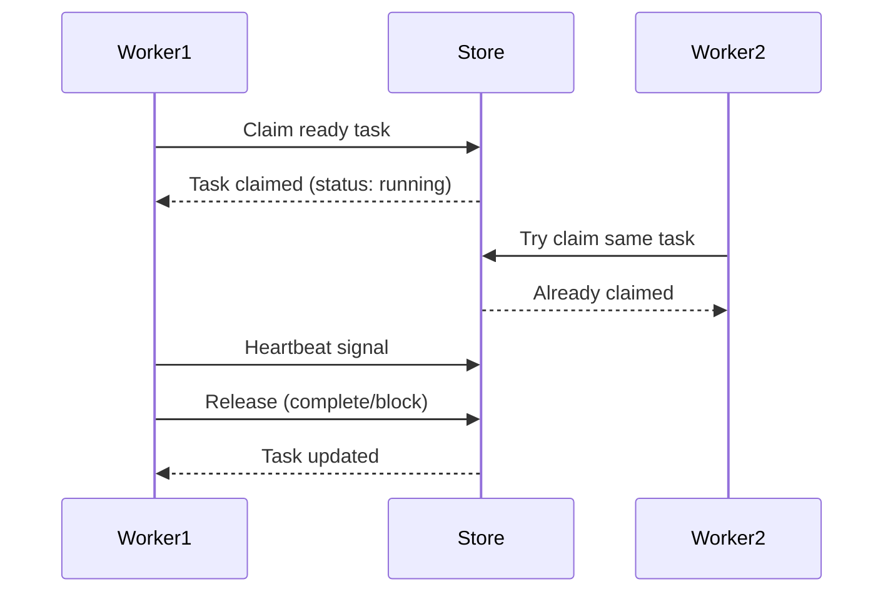
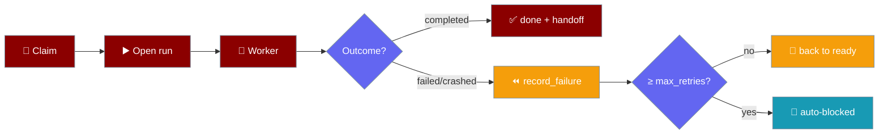
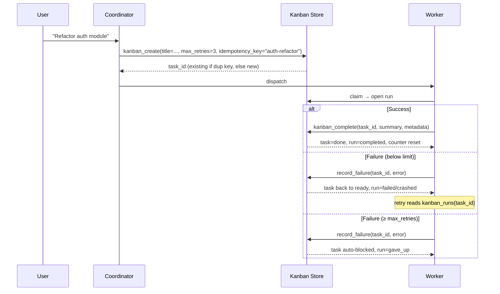
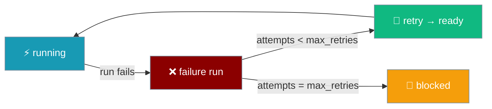

Kanban enables agents to coordinate through persistent tasks, creating a shared workspace where work is tracked and distributed across multiple agents.



## Quick Start

<Steps>
<Step title="Create Agent with Kanban Tools">

```python
from praisonaiagents import Agent
from praisonaiagents.kanban import KanbanStoreProtocol

# Agent with kanban protocols (implementation needed from wrapper)
agent = Agent(name="Coordinator", instructions="Break tasks down")
result = agent.start("Create user auth system")
```

</Step>

<Step title="Add Worker Agent">

```python
from praisonaiagents import Agent
from praisonaiagents.kanban import VALID_KANBAN_STATUSES

worker = Agent(name="Worker", instructions="Claim and complete tasks")
result = worker.start("Find ready tasks")
```

</Step>
</Steps>

---

## How It Works


Task coordination happens through a SQLite-backed persistent store that all agents and the UI share.

| Component | Purpose |
|-----------|---------|
| **Kanban Store** | SQLite database storing tasks, comments, links |
| **Agent Tools** | 8 functions for task CRUD operations |
| **CLI Commands** | Human interface for task management |
| **Background Dispatcher** | Auto-claims ready tasks for processing |

---

## Concepts

### Task Statuses

Tasks flow through 8 defined states from creation to completion:



### Boards

Boards provide workspace isolation for different projects or contexts:



### DAG Links

Tasks form directed acyclic graphs through parent-child dependencies:



### Claim/Release

Workers coordinate through atomic claim and release operations:



---

## Agent Tools

Kanban tools are available through the SDK protocols. The wrapper implementation provides these agent tools:

### Task Management

| Tool | Purpose | Example |
|------|---------|---------|
| `kanban_create` | Create new task | `kanban_create("Implement auth", assignee="dev", idempotency_key="auth-v1")` |
| `kanban_list` | Filter tasks | `kanban_list(status="ready", assignee="dev")` |
| `kanban_show` | Get task details | `kanban_show("task_abc123")` |
| `kanban_runs` | Read attempt history | `kanban_runs("task_abc123")` |

### Status Changes

| Tool | Purpose | Example |
|------|---------|---------|
| `kanban_complete` | Mark task done with structured handoff | `kanban_complete("task_abc123", summary="Auth done; 14 tests pass", metadata={"changed_files": ["auth.py"]})` |
| `kanban_block` | Block with reason | `kanban_block("task_abc123", "Need API keys")` |

### Coordination

| Tool | Purpose | Example |
|------|---------|---------|
| `kanban_comment` | Add progress note | `kanban_comment("task_abc123", "50% complete")` |
| `kanban_link` | Create dependency | `kanban_link("design_task", "implement_task")` |
| `kanban_heartbeat` | Signal liveness | `kanban_heartbeat("task_abc123", "testing")` |

---

## Boards & Storage

### Single Board (Default)
```
~/.praisonai/kanban.db
```

### Multi-Board Layout
```
~/.praisonai/kanban/boards/
├── project-a/kanban.db
├── project-b/kanban.db
└── team-x/kanban.db
```

### Environment Configuration

| Variable | Effect | Example |
|----------|--------|---------|
| `PRAISONAI_KANBAN_BOARD` | Select active board | `export PRAISONAI_KANBAN_BOARD=project-a` |
| `PRAISONAI_KANBAN_DB` | Override DB path | `export PRAISONAI_KANBAN_DB=/custom/path.db` |

---

## Attempt History & Retry

Each kanban task records every attempt, auto-blocks after repeated failures, and hands off a structured summary on completion.





<Steps>
<Step title="Idempotent create with retry limit">

```python
from praisonaiagents import Agent
from praisonai.tools.kanban_tools import kanban_create

agent = Agent(name="Coordinator", instructions="Break work into tasks")

task = kanban_create(
    "Replace bcrypt with argon2",
    body="Migrate auth module to argon2",
    assignee="coder",
    max_retries=3,                       # per-task circuit-breaker
    idempotency_key="auth-refactor-q3",  # safe to repeat
)
```

</Step>

<Step title="Structured completion handoff">

```python
from praisonai.tools.kanban_tools import kanban_complete

kanban_complete(
    task["id"],
    summary="argon2 migration; 14 tests pass; CHANGELOG updated",
    metadata={
        "changed_files": ["auth.py", "tests/test_auth.py"],
        "tests_run": 14,
        "residual_risk": "rotate old hashes on next login",
    },
)
```

</Step>

<Step title="Read attempt history on retry">

```python
from praisonai.tools.kanban_tools import kanban_runs

history = kanban_runs(task["id"])
for run in history["runs"]:
    print(run["outcome"], run["error"] or run["summary"])
# crashed: ModuleNotFoundError: argon2
# completed: argon2 migration; 14 tests pass; CHANGELOG updated
```

</Step>
</Steps>

### What the dispatcher does automatically

When a worker claims a task, the dispatcher **opens a run** with the claim — anything the worker writes via `kanban_complete` closes it as `completed`, anything that crashes closes it as `crashed`/`failed`. Below the `max_retries` limit, failed attempts release the claim and put the task back on `ready` for re-dispatch. At the limit, the task auto-blocks with `gave_up` so a human can step in. A successful completion **resets the failure counter** — the limit is consecutive, not cumulative.

### New params on `kanban_create`

| Option | Type | Default | Description |
|--------|------|---------|-------------|
| `max_retries` | `int` | `3` (board default) | Per-task circuit-breaker limit. After this many *consecutive* failed attempts the task auto-blocks. Invalid values (`<1` / non-numeric) fall back to the board default. |
| `idempotency_key` | `str` | `None` | Per-board, **per-tenant** dedup key. Repeating a create with the same key returns the existing task instead of a duplicate — safe for retrying automation and webhooks. |

### New params on `kanban_complete`

| Option | Type | Default | Description |
|--------|------|---------|-------------|
| `summary` | `str` | `""` | Structured summary of what was done. Surfaced to linked children and retrying workers. |
| `metadata` | `dict` | `{}` | Structured handoff fields. Common keys: `changed_files`, `tests_run`, `residual_risk`, `next_steps`. |
| `comment` | `str` | `""` | Free-text completion comment (kept for back-compat). |

<Note>
`kanban_complete` moves the task to `done` **before** recording the run. A `move_task` failure never leaves an orphaned completed run for a task that never reached `done`.
</Note>

### New tool: `kanban_runs`

| Tool | Purpose | Example |
|------|---------|---------|
| `kanban_runs` | Read attempt history (oldest first) | `kanban_runs("task_abc123")` → `{"runs": [{"outcome": "crashed", "error": "...", "started_at": "...", "ended_at": "..."}, ...], "count": 2}` |

Each row matches the `KanbanRunProtocol` shape:

| Field | Type | Description |
|-------|------|-------------|
| `id` | `int` | Auto-incremented run ID |
| `task_id` | `str` | Parent task ID |
| `profile` | `str` | Worker/profile identifier |
| `outcome` | `str \| None` | `completed`, `blocked`, `crashed`, `failed`, or `gave_up`; `None` while the run is open |
| `summary` | `str` | Structured handoff summary |
| `metadata` | `dict` | Structured handoff fields |
| `error` | `str` | Error text for failed/crashed attempts |
| `started_at` | `str \| None` | ISO-8601 timestamp |
| `ended_at` | `str \| None` | ISO-8601 timestamp; `None` while the run is open |

### New `Task` fields

| Field | Type | Meaning |
|-------|------|---------|
| `max_retries` | `int \| None` | Per-task circuit-breaker limit. `None` means use the board default (`3`). |
| `consecutive_failures` | `int` | Count of consecutive failed attempts since the last `completed` outcome. Reset to `0` by a successful completion. |
| `current_run_id` | `int \| None` | Active attempt id; `None` when no run is open. |

<Note>
Existing SQLite databases are **auto-migrated** on first open — no user action required.
</Note>

### Common Patterns

**Automation-safe creation** — pass `idempotency_key` derived from the trigger (`f"github-issue-{n}"`, `f"webhook-{uuid}"`). Re-firing the webhook is a no-op instead of spawning duplicates. Idempotency is **per-board, per-tenant** — two tenants on the same board never collide on the same key.

**Long-running flaky network tasks** — set `max_retries=5` per task to absorb transient flakes without giving up too early. Watch `consecutive_failures` in `kanban_show` to spot stuck tasks.

**Retrying workers use prior failures** — call `kanban_runs(task_id)` at the start of a retry attempt to read prior outcomes and errors. Use `summary` and `metadata` from the most recent failed run as context: "previous attempt crashed at line X; avoid path Y."

<AccordionGroup>
<Accordion title="Use idempotency_key for every automated kanban_create">
Webhooks, schedulers, and GitHub-issue triagers should always pass an `idempotency_key`. The cost is one extra string; the value is zero duplicate tasks under retry.
</Accordion>

<Accordion title="Tune max_retries per task type">
Fast deterministic work: `max_retries=1`. Flaky network or integration tests: `max_retries=3–5`. Leave the rest at the board default (`3`).
</Accordion>

<Accordion title="Send a real summary and metadata">
Use `summary` and `metadata` in `kanban_complete` instead of free-text comments. Downstream child tasks and retrying workers consume the structured fields; humans still read them fine.
</Accordion>

<Accordion title="Read kanban_runs before retrying">
The structured run history is the cheapest "what went wrong last time" context a retrying worker can fetch. Call `kanban_runs(task_id)` at the start of every retry attempt.
</Accordion>
</AccordionGroup>

---

## Common Patterns

### Coordinator-Worker Pattern

```python
# Coordinator breaks down requests
from praisonaiagents import Agent
from praisonaiagents.kanban import VALID_KANBAN_STATUSES

coordinator = Agent(
    name="Coordinator", 
    instructions="Break user requests into kanban tasks"
)

# Worker with heartbeat reporting
worker = Agent(
    name="Worker",
    instructions="Claim ready tasks, report progress via heartbeat"
)
```

### Background Processing

```python
# Background processing requires wrapper implementation
# The praisonaiagents.kanban protocols support:
# - Task claiming and status updates
# - Heartbeat reporting for long-running tasks
# - Multi-board coordination
```

### Worker with Heartbeat

```python
from praisonaiagents import Agent
from praisonaiagents.kanban import VALID_KANBAN_STATUSES

worker = Agent(
    name="Worker",
    instructions="""Claim ready tasks and report liveness via heartbeat. 
    Use kanban_heartbeat every 30 seconds during long-running work."""
)

# Worker claims task and reports progress
result = worker.start("Find ready tasks, claim one, and report progress")
```

### Human-Agent Collaboration

```bash
# Human-agent collaboration pattern
# Requires wrapper implementation of:
# - CLI commands for task management
# - UI board visualization
# - Agent-to-store protocol bindings
```

---

## Runs, Retries, and Structured Handoff

Kanban now tracks every execution attempt for each task via the `task_runs` table, supports per-task retry limits, and allows agents to pass structured data when completing a task.

### `kanban_complete` — structured handoff

```python
kanban_complete(
    task_id="task-123",
    summary="Implemented OAuth2 flow with PKCE",
    metadata={"pr_url": "https://github.com/org/repo/pull/42", "test_coverage": 0.91},
)
```

| Parameter | Type | Default | Description |
|-----------|------|---------|-------------|
| `task_id` | `str` | _(required)_ | Task to complete |
| `summary` | `str` | `""` | Human-readable completion summary stored in the run record |
| `metadata` | `dict` | `{}` | Arbitrary structured data for downstream consumers (e.g. PR URL, metrics) |

### `kanban_create` — idempotency and retries

```python
kanban_create(
    title="Write unit tests for auth module",
    body="Cover all edge cases in JWT validation",
    idempotency_key="auth-tests-v1",
    max_retries=3,
)
```

| Parameter | Type | Default | Description |
|-----------|------|---------|-------------|
| `title` | `str` | _(required)_ | Task title |
| `body` | `str` | `""` | Task description |
| `idempotency_key` | `str \| None` | `None` | If set, calling `kanban_create` again with the same key returns the existing task instead of creating a duplicate |
| `max_retries` | `int` | `0` | Max number of times the dispatcher retries a failed run. After N failures the task is auto-moved to `blocked` |

### `kanban_runs` — per-task run history

List all execution attempts for a task:

```python
runs = kanban_runs(task_id="task-123")
for run in runs:
    print(run["outcome"], run["summary"], run["created_at"])
```

Each run record contains:

| Field | Type | Description |
|-------|------|-------------|
| `id` | `str` | Unique run ID |
| `task_id` | `str` | Parent task |
| `outcome` | `str` | `"success"`, `"failure"`, or `"in_progress"` |
| `summary` | `str` | Summary provided at completion |
| `metadata` | `dict` | Structured handoff data |
| `created_at` | `float` | Unix timestamp of run start |
| `finished_at` | `float \| None` | Unix timestamp of run end |

### Auto-block after max retries

When `max_retries > 0` and the task accumulates that many `"failure"` run outcomes, the dispatcher automatically moves the task from `running` to `blocked`. The task must be manually unblocked (`kanban_move(task_id, "ready")`) after the root cause is resolved.



---

## Best Practices

<AccordionGroup>
<Accordion title="Task Granularity">
Create tasks that can be completed in 15-30 minutes. Break larger work into linked subtasks using `kanban_link` for proper dependency tracking.
</Accordion>

<Accordion title="Status Management">
Move tasks through statuses systematically: `todo` → `ready` → `running` → `done`. Use `blocked` for dependencies and `review` for human approval.
</Accordion>

<Accordion title="Agent Coordination">
Use `kanban_heartbeat` during long-running tasks to signal liveness. Add detailed comments with `kanban_comment` to track progress and decisions.
</Accordion>

<Accordion title="Board Organization">
Use separate boards for different projects or contexts. Default board works well for single-project setups.
</Accordion>
</AccordionGroup>

---

## Related

<CardGroup cols={2}>
<Card title="Kanban CLI" icon="terminal" href="/docs/features/kanban-cli">
  CLI commands for viewing boards, tasks, and run history
</Card>

<Card title="Async Jobs" icon="clock" href="/docs/features/async-jobs">
  Asynchronous job processing and queuing
</Card>

<Card title="Background Tasks" icon="clock" href="/docs/features/background-tasks">
  Async job processing and scheduling
</Card>

<Card title="CLI Dispatcher" icon="terminal" href="/docs/features/cli-dispatcher">
  Command-line task orchestration
</Card>
</CardGroup>