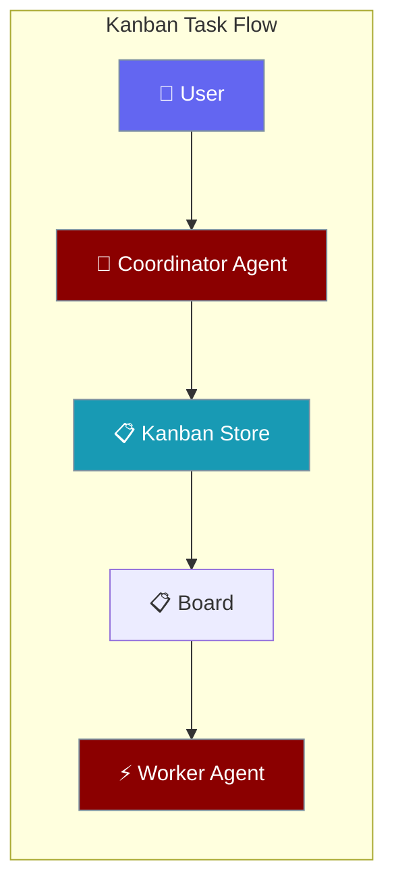
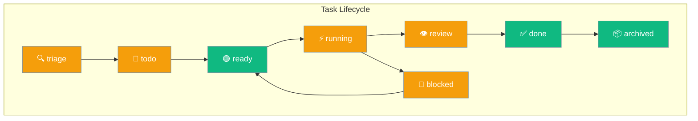
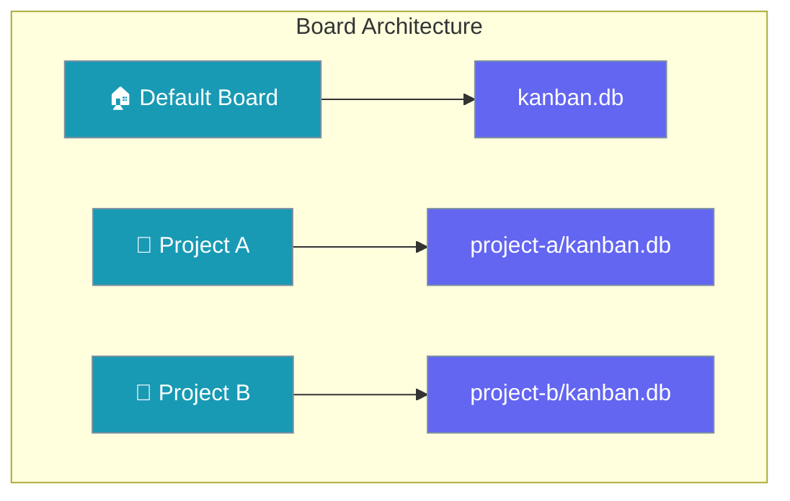
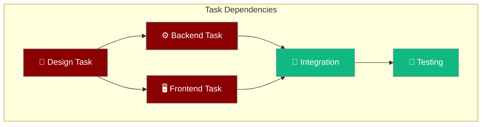
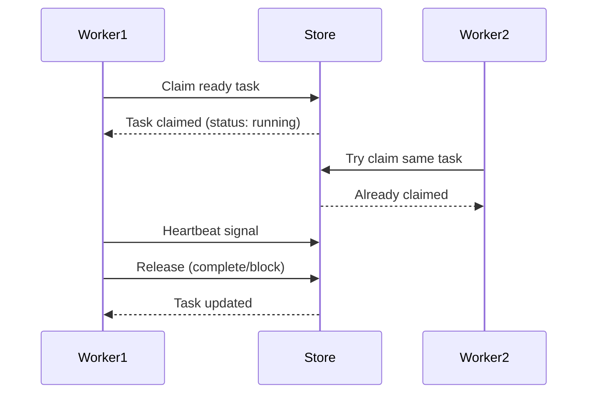

Kanban enables agents to coordinate through persistent tasks, creating a shared workspace where work is tracked and distributed across multiple agents.



## Quick Start

<Steps>
<Step title="Create Agent with Kanban Tools">

```python
from praisonaiagents import Agent
from praisonaiagents.kanban import KanbanStoreProtocol

# Agent with kanban protocols (implementation needed from wrapper)
agent = Agent(name="Coordinator", instructions="Break tasks down")
result = agent.start("Create user auth system")
```

</Step>

<Step title="Add Worker Agent">

```python
from praisonaiagents import Agent
from praisonaiagents.kanban import VALID_KANBAN_STATUSES

worker = Agent(name="Worker", instructions="Claim and complete tasks")
result = worker.start("Find ready tasks")
```

</Step>
</Steps>

---

## How It Works


Task coordination happens through a SQLite-backed persistent store that all agents and the UI share.

| Component | Purpose |
|-----------|---------|
| **Kanban Store** | SQLite database storing tasks, comments, links |
| **Agent Tools** | 8 functions for task CRUD operations |
| **CLI Commands** | Human interface for task management |
| **Background Dispatcher** | Auto-claims ready tasks for processing |

---

## Task Status Flow



## Concepts

### Task Statuses

Tasks flow through 8 defined states from creation to completion:

```mermaid
graph TB
    subgraph "Status Flow"
        Triage[🔍 triage] --> Todo[📝 todo]
        Todo --> Ready[🟢 ready]
        Ready --> Running[⚡ running]
        Running --> Review[👁️ review]
        Running --> Blocked[🚫 blocked]
        Blocked --> Ready
        Review --> Done[✅ done]
        Done --> Archived[📦 archived]
    end
    
    classDef status fill:#F59E0B,stroke:#7C90A0,color:#fff
    classDef ready fill:#10B981,stroke:#7C90A0,color:#fff
    classDef done fill:#10B981,stroke:#7C90A0,color:#fff
    
    class Triage,Todo,Running,Review,Blocked status
    class Ready ready  
    class Done,Archived done
```

### Boards

Boards provide workspace isolation for different projects or contexts:



### DAG Links

Tasks form directed acyclic graphs through parent-child dependencies:



### Claim/Release

Workers coordinate through atomic claim and release operations:



---

## Agent Tools

Kanban tools are available through the SDK protocols. The wrapper implementation provides these agent tools:

### Task Management

| Tool | Purpose | Example |
|------|---------|---------|
| `kanban_create` | Create new task | `kanban_create("Implement auth", assignee="dev")` |
| `kanban_list` | Filter tasks | `kanban_list(status="ready", assignee="dev")` |
| `kanban_show` | Get task details | `kanban_show("task_abc123")` |

### Status Changes

| Tool | Purpose | Example |
|------|---------|---------|
| `kanban_complete` | Mark task done | `kanban_complete("task_abc123", "Auth working")` |
| `kanban_block` | Block with reason | `kanban_block("task_abc123", "Need API keys")` |

### Coordination

| Tool | Purpose | Example |
|------|---------|---------|
| `kanban_comment` | Add progress note | `kanban_comment("task_abc123", "50% complete")` |
| `kanban_link` | Create dependency | `kanban_link("design_task", "implement_task")` |
| `kanban_heartbeat` | Signal liveness | `kanban_heartbeat("task_abc123", "testing")` |

---

## Boards & Storage

### Single Board (Default)
```
~/.praisonai/kanban.db
```

### Multi-Board Layout
```
~/.praisonai/kanban/boards/
├── project-a/kanban.db
├── project-b/kanban.db
└── team-x/kanban.db
```

### Environment Configuration

| Variable | Effect | Example |
|----------|--------|---------|
| `PRAISONAI_KANBAN_BOARD` | Select active board | `export PRAISONAI_KANBAN_BOARD=project-a` |
| `PRAISONAI_KANBAN_DB` | Override DB path | `export PRAISONAI_KANBAN_DB=/custom/path.db` |

---

## Common Patterns

### Coordinator-Worker Pattern

```python
# Coordinator breaks down requests
from praisonaiagents import Agent
from praisonaiagents.kanban import VALID_KANBAN_STATUSES

coordinator = Agent(
    name="Coordinator", 
    instructions="Break user requests into kanban tasks"
)

# Worker with heartbeat reporting
worker = Agent(
    name="Worker",
    instructions="Claim ready tasks, report progress via heartbeat"
)
```

### Background Processing

```python
# Background processing requires wrapper implementation
# The praisonaiagents.kanban protocols support:
# - Task claiming and status updates
# - Heartbeat reporting for long-running tasks
# - Multi-board coordination
```

### Worker with Heartbeat

```python
from praisonaiagents import Agent
from praisonaiagents.kanban import VALID_KANBAN_STATUSES

worker = Agent(
    name="Worker",
    instructions="""Claim ready tasks and report liveness via heartbeat. 
    Use kanban_heartbeat every 30 seconds during long-running work."""
)

# Worker claims task and reports progress
result = worker.start("Find ready tasks, claim one, and report progress")
```

### Human-Agent Collaboration

```bash
# Human-agent collaboration pattern
# Requires wrapper implementation of:
# - CLI commands for task management
# - UI board visualization
# - Agent-to-store protocol bindings
```

---

## Best Practices

<AccordionGroup>
<Accordion title="Task Granularity">
Create tasks that can be completed in 15-30 minutes. Break larger work into linked subtasks using `kanban_link` for proper dependency tracking.
</Accordion>

<Accordion title="Status Management">
Move tasks through statuses systematically: `todo` → `ready` → `running` → `done`. Use `blocked` for dependencies and `review` for human approval.
</Accordion>

<Accordion title="Agent Coordination">
Use `kanban_heartbeat` during long-running tasks to signal liveness. Add detailed comments with `kanban_comment` to track progress and decisions.
</Accordion>

<Accordion title="Board Organization">
Use separate boards for different projects or contexts. Default board works well for single-project setups.
</Accordion>
</AccordionGroup>

---

## Related

<CardGroup cols={3}>
<Card title="Async Jobs" icon="clock" href="/docs/features/async-jobs">
  Asynchronous job processing and queuing
</Card>

<Card title="Background Tasks" icon="clock" href="/docs/features/background-tasks">
  Async job processing and scheduling
</Card>

<Card title="CLI Dispatcher" icon="terminal" href="/docs/features/cli-dispatcher">
  Command-line task orchestration
</Card>
</CardGroup>