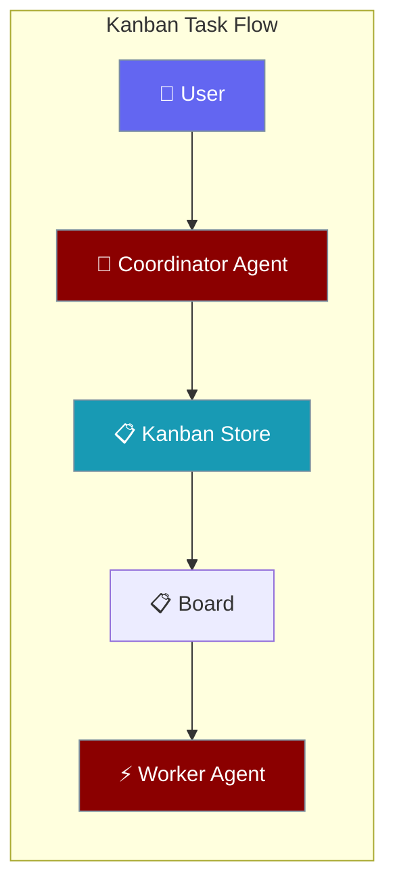
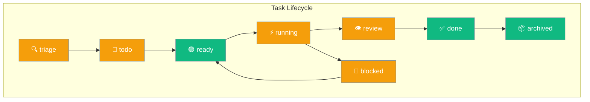
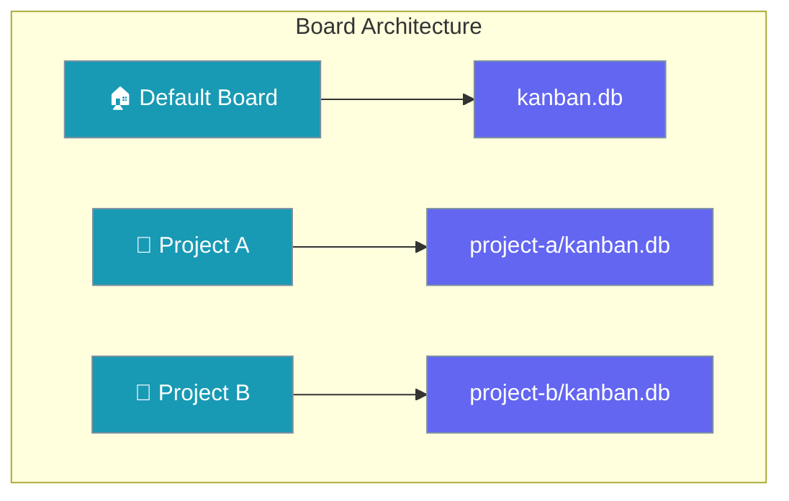
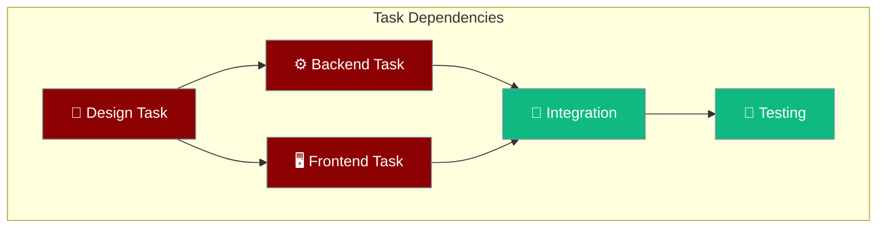
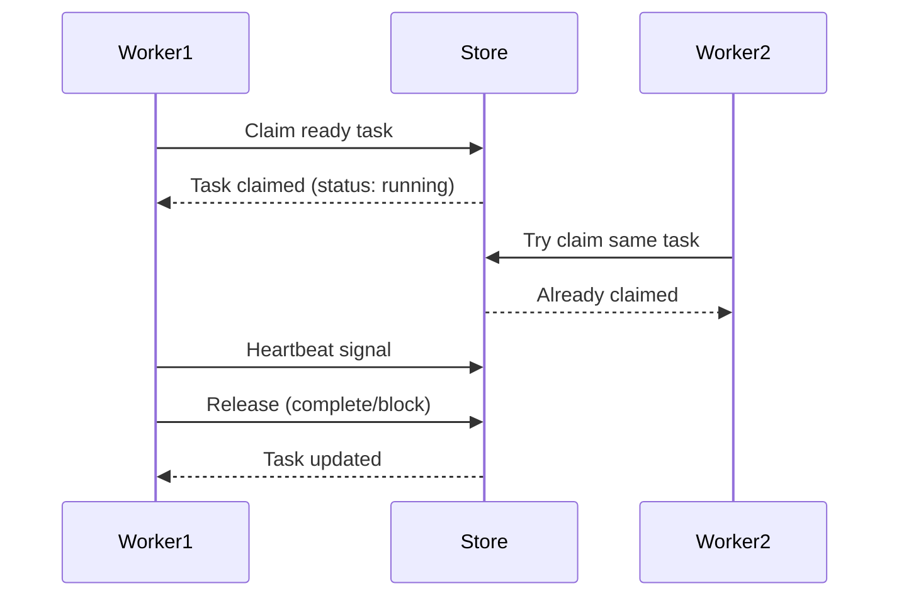
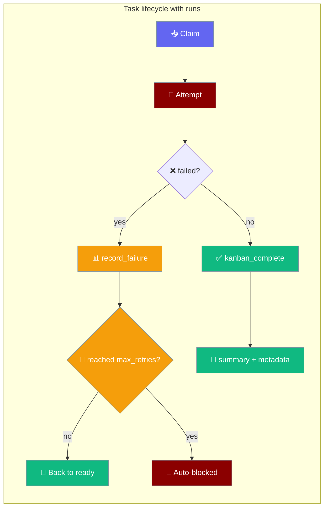
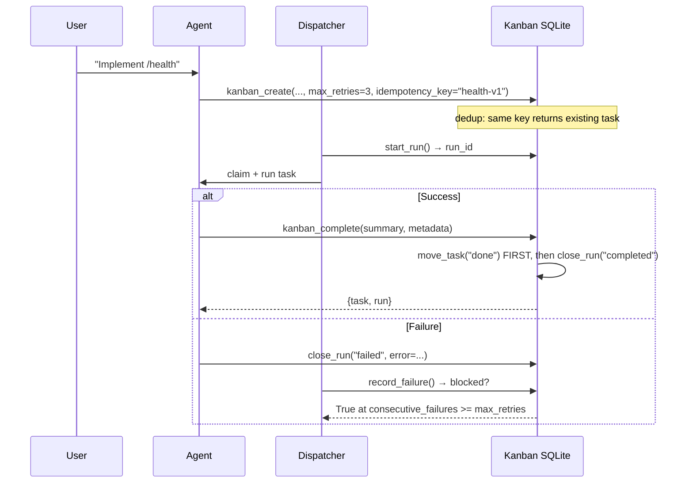

Kanban enables agents to coordinate through persistent tasks, creating a shared workspace where work is tracked and distributed across multiple agents.



## Quick Start

<Steps>
<Step title="Create Agent with Kanban Tools">

```python
from praisonaiagents import Agent

# Agent with kanban protocols (implementation needed from wrapper)
agent = Agent(name="Coordinator", instructions="Break tasks down")
result = agent.start("Create user auth system")
```

</Step>

<Step title="Add Worker Agent">

```python
from praisonaiagents import Agent
from praisonaiagents.kanban import VALID_KANBAN_STATUSES

worker = Agent(name="Worker", instructions="Claim and complete tasks")
result = worker.start("Find ready tasks")
```

</Step>
</Steps>

---

## How It Works


Task coordination happens through a SQLite-backed persistent store that all agents and the UI share.

| Component | Purpose |
|-----------|---------|
| **Kanban Store** | SQLite database storing tasks, comments, links |
| **Agent Tools** | 8 functions for task CRUD operations |
| **CLI Commands** | Human interface for task management |
| **Background Dispatcher** | Auto-claims ready tasks for processing |

---

## Task Status Flow



## Concepts

### Task Statuses

Tasks flow through 8 defined states from creation to completion:

```mermaid
graph TB
    subgraph "Status Flow"
        Triage[🔍 triage] --> Todo[📝 todo]
        Todo --> Ready[🟢 ready]
        Ready --> Running[⚡ running]
        Running --> Review[👁️ review]
        Running --> Blocked[🚫 blocked]
        Blocked --> Ready
        Review --> Done[✅ done]
        Done --> Archived[📦 archived]
    end
    
    classDef status fill:#F59E0B,stroke:#7C90A0,color:#fff
    classDef ready fill:#10B981,stroke:#7C90A0,color:#fff
    classDef done fill:#10B981,stroke:#7C90A0,color:#fff
    
    class Triage,Todo,Running,Review,Blocked status
    class Ready ready  
    class Done,Archived done
```

### Boards

Boards provide workspace isolation for different projects or contexts:



### DAG Links

Tasks form directed acyclic graphs through parent-child dependencies:



### Claim/Release

Workers coordinate through atomic claim and release operations:



---

## Agent Tools

Kanban tools are available through the SDK protocols. The wrapper implementation provides these agent tools:

### Task Management

| Tool | Purpose | Example |
|------|---------|---------|
| `kanban_create` | Create a task; optional `max_retries=`, `idempotency_key=` | `kanban_create("Implement auth", assignee="dev", max_retries=5, idempotency_key="auth-v1")` |
| `kanban_list` | Filter tasks | `kanban_list(status="ready", assignee="dev")` |
| `kanban_show` | Get task details | `kanban_show("task_abc123")` |

### Status Changes

| Tool | Purpose | Example |
|------|---------|---------|
| `kanban_complete` | Mark done with structured handoff (`summary`, `metadata`) | `kanban_complete("task_abc123", summary="auth wired; 14 tests pass", metadata={"changed_files": ["auth.py"], "tests_run": 14})` |
| `kanban_block` | Block with reason | `kanban_block("task_abc123", "Need API keys")` |

### Coordination

| Tool | Purpose | Example |
|------|---------|---------|
| `kanban_comment` | Add progress note | `kanban_comment("task_abc123", "50% complete")` |
| `kanban_link` | Create dependency | `kanban_link("design_task", "implement_task")` |
| `kanban_heartbeat` | Signal liveness | `kanban_heartbeat("task_abc123", "testing")` |
| `kanban_runs` | Read attempt history for a task | `kanban_runs("task_abc123")` |

---

## Reliability: attempt history, retries & structured handoff

Every attempt at a task is recorded as a durable `TaskRun`; repeated failures auto-block the task; completion carries a structured handoff to the next agent.



### Quick Start

<Steps>
<Step title="Create a task with a retry budget and an idempotency key">

```python
from praisonaiagents import Agent
from praisonai.tools.kanban_tools import kanban_create, kanban_complete, kanban_runs

agent = Agent(
    name="Backend Engineer",
    instructions="Implement features and complete kanban tasks with a structured handoff.",
    tools=[kanban_create, kanban_complete, kanban_runs],
)

agent.start("Create a task to add a /health endpoint, then implement it.")
```

</Step>

<Step title="Complete with a structured handoff">

```python
from praisonai.tools.kanban_tools import kanban_complete

kanban_complete(
    "task_abc123",
    summary="token-bucket limiter; 14 tests pass",
    metadata={"changed_files": ["limiter.py"], "tests_run": 14, "residual_risk": "rate limiter is in-memory only"},
)
```

</Step>

<Step title="Read prior attempts before retrying">

```python
from praisonai.tools.kanban_tools import kanban_runs

history = kanban_runs("task_abc123")
# → {"runs": [{"outcome": "crashed", "error": "...", "summary": ""}], "count": 1}
```

</Step>
</Steps>

### User Interaction Flow



### TaskRun Fields

Each attempt at a task creates one `TaskRun` row in the store:

| Field | Type | Default | Notes |
|-------|------|---------|-------|
| `id` | `Optional[int]` | `None` | AUTOINCREMENT in SQLite |
| `task_id` | `str` | — | FK to `tasks(id)` `ON DELETE CASCADE` |
| `profile` | `str` | `""` | Worker profile name |
| `outcome` | `Optional[str]` | `None` | One of `RunOutcome`; `None` while open |
| `summary` | `str` | `""` | Structured summary on completion |
| `metadata` | `Optional[Dict[str, Any]]` | `{}` | JSON-serialised; structured handoff fields |
| `error` | `str` | `""` | Last error on failure |
| `started_at` | `Optional[datetime]` | now (UTC) | ISO-8601 in JSON |
| `ended_at` | `Optional[datetime]` | `None` | Set when closed |

`RunOutcome` values: `completed`, `blocked`, `crashed`, `failed`, `gave_up`.

### Circuit-Breaker Fields on Task

| Field | Type | Default | Behaviour |
|-------|------|---------|-----------|
| `max_retries` | `Optional[int]` | `None` → falls back to `DEFAULT_MAX_RETRIES` (3) | Per-task circuit-breaker limit. Non-positive/non-numeric stored values are also normalised to the default. |
| `consecutive_failures` | `int` | `0` | Incremented by `record_failure`; reset on completion. |
| `current_run_id` | `Optional[int]` | `None` | Points at the active `task_runs` row while a worker holds the claim. |

### Idempotent Task Creation

<Note>
Same `(board, tenant, idempotency_key)` returns the original task instead of inserting a duplicate. Uniqueness is **tenant-scoped** — two tenants on the same board can use the same key without colliding. Legacy databases are migrated on first open.
</Note>

```python
from praisonai.tools.kanban_tools import kanban_create

# Safe to call multiple times — returns existing task if key already used
task = kanban_create(
    "Add /health endpoint",
    max_retries=3,
    idempotency_key="health-v1",
)
```

### Behaviour Notes

<Warning>
`kanban_complete` moves the task to `done` **first**, then persists the run/handoff — a `move_task` failure never leaves an orphan completed run for a task that never reached done.
</Warning>

- `record_failure` is a no-op on a terminal task (`done`/`archived`) — a stale process-exit handler cannot re-block a finished task.
- `close_run` rejects re-closing an already-finalised run, so a stale `current_run_id` cannot overwrite a failed attempt as completed.
- When the dispatcher's `close_run` fails transiently, the run id is retained and a sweep retries the close on the next tick (`_retry_pending_run_closes`).
- All run timestamps round-trip as ISO-8601 strings.

---

## Boards & Storage

### Single Board (Default)
```
~/.praisonai/kanban.db
```

### Multi-Board Layout
```
~/.praisonai/kanban/boards/
├── project-a/kanban.db
├── project-b/kanban.db
└── team-x/kanban.db
```

### Environment Configuration

| Variable | Effect | Example |
|----------|--------|---------|
| `PRAISONAI_KANBAN_BOARD` | Select active board | `export PRAISONAI_KANBAN_BOARD=project-a` |
| `PRAISONAI_KANBAN_DB` | Override DB path | `export PRAISONAI_KANBAN_DB=/custom/path.db` |

---

## Common Patterns

### Coordinator-Worker Pattern

```python
from praisonaiagents import Agent
from praisonaiagents.kanban import VALID_KANBAN_STATUSES

coordinator = Agent(
    name="Coordinator", 
    instructions="Break user requests into kanban tasks"
)

# Worker with heartbeat reporting
worker = Agent(
    name="Worker",
    instructions="Claim ready tasks, report progress via heartbeat"
)
```

### Background Processing

```python
# Background processing requires wrapper implementation
# The praisonaiagents.kanban protocols support:
# - Task claiming and status updates
# - Heartbeat reporting for long-running tasks
# - Multi-board coordination
```

### Worker with Heartbeat

```python
from praisonaiagents import Agent
from praisonaiagents.kanban import VALID_KANBAN_STATUSES

worker = Agent(
    name="Worker",
    instructions="""Claim ready tasks and report liveness via heartbeat. 
    Use kanban_heartbeat every 30 seconds during long-running work."""
)

# Worker claims task and reports progress
result = worker.start("Find ready tasks, claim one, and report progress")
```

### Human-Agent Collaboration

```bash
# Human-agent collaboration pattern
# Requires wrapper implementation of:
# - CLI commands for task management
# - UI board visualization
# - Agent-to-store protocol bindings
```

---

## Best Practices

<AccordionGroup>
<Accordion title="Task Granularity">
Create tasks that can be completed in 15-30 minutes. Break larger work into linked subtasks using `kanban_link` for proper dependency tracking.
</Accordion>

<Accordion title="Retry Budget">
Pick `max_retries` per task type — flaky network jobs get 5; deterministic refactor jobs get 1. The default is 3.
</Accordion>

<Accordion title="Idempotency Keys">
Use `idempotency_key` whenever a webhook or scheduler might re-fire the same task — prevents duplicate entries on the same board and tenant.
</Accordion>

<Accordion title="Structured Handoff">
Pass real structure in `metadata` (`changed_files`, `tests_run`, `residual_risk`) — downstream agents can read it via `kanban_runs` without parsing prose.
</Accordion>

<Accordion title="Read Run History Before Retry">
Call `kanban_runs` at the top of every retry — it gives you prior errors and the previous summary so you don't repeat known-failed paths.
</Accordion>

<Accordion title="Agent Coordination">
Use `kanban_heartbeat` during long-running tasks to signal liveness. Add detailed comments with `kanban_comment` to track progress and decisions.
</Accordion>

<Accordion title="Board Organization">
Use separate boards for different projects or contexts. Default board works well for single-project setups.
</Accordion>
</AccordionGroup>

---

## Related

<CardGroup cols={2}>
<Card title="Kanban CLI" icon="terminal" href="/docs/features/kanban-cli">
  Command-line interface for kanban task management
</Card>

<Card title="Async Jobs" icon="clock" href="/docs/features/async-jobs">
  Asynchronous job processing and queuing
</Card>

<Card title="Background Tasks" icon="clock" href="/docs/features/background-tasks">
  Async job processing and scheduling
</Card>

<Card title="CLI Dispatcher" icon="terminal" href="/docs/features/cli-dispatcher">
  Command-line task orchestration
</Card>
</CardGroup>
