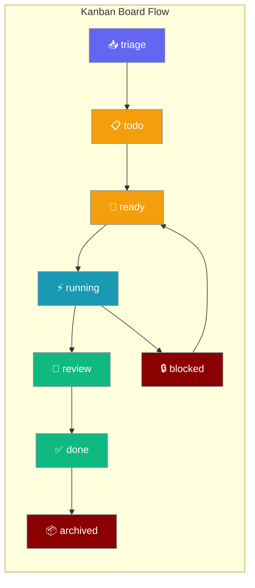
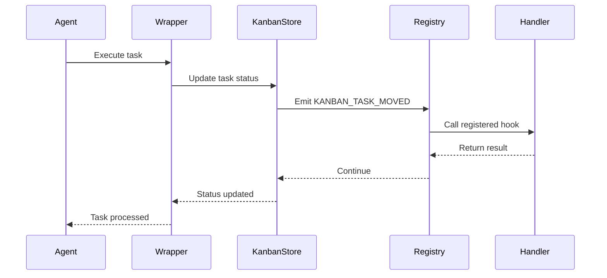
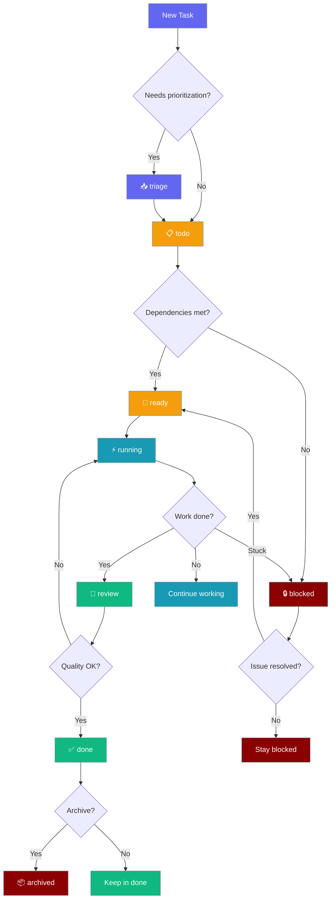

Kanban tracks agent task lifecycle visually on a board while providing hook events for observability and workflow automation.



## Quick Start

<Steps>

<Step title="Subscribe to Task Completion">
```python
from praisonaiagents import Agent
from praisonaiagents.hooks import HookRegistry, HookEvent, HookResult

registry = HookRegistry()

@registry.on(HookEvent.KANBAN_TASK_DONE)
def on_task_done(event_data):
    print(f"Task completed: {event_data.task_id}")
    return HookResult.allow()

agent = Agent(
    name="Task Tracker",
    instructions="Complete the task and track progress",
    hooks=registry
)

agent.start("Complete the project documentation")
```
</Step>

<Step title="Track Task Lifecycle">
```python
from praisonaiagents import Agent
from praisonaiagents.hooks import HookRegistry, HookEvent, HookResult

registry = HookRegistry()

@registry.on([
    HookEvent.KANBAN_TASK_CREATED,
    HookEvent.KANBAN_TASK_MOVED,
    HookEvent.KANBAN_TASK_DONE,
    HookEvent.KANBAN_TASK_BLOCKED
])
def track_all_events(event_data):
    print(f"Task {event_data.task_id}: {event_data.status}")
    if event_data.from_status and event_data.to_status:
        print(f"  {event_data.from_status} → {event_data.to_status}")
    return HookResult.allow()

agent = Agent(
    name="Lifecycle Tracker",
    instructions="Handle tasks with full tracking",
    hooks=registry
)
```
</Step>

</Steps>

---

## How It Works



| Component | Role |
|-----------|------|
| **Agent** | Executes tasks and triggers kanban events |
| **Wrapper Dispatcher** | Manages kanban store operations |
| **KanbanStore** | Implements protocol for task persistence |
| **Hook Registry** | Routes events to registered handlers |
| **User Handler** | Custom logic for kanban events |

---

## Kanban Hook Events

| Event | When Fired | Input Type | Use Case |
|-------|------------|------------|----------|
| [`KANBAN_TASK_CREATED`](#kanban-hook-input-payload) | New task added to board | `KanbanHookInput` | Log task creation, assign defaults |
| [`KANBAN_TASK_CLAIMED`](#kanban-hook-input-payload) | Task assigned to agent/user | `KanbanHookInput` | Notify assignee, start tracking |
| [`KANBAN_TASK_MOVED`](#kanban-hook-input-payload) | Task status transition | `KanbanHookInput` | Track progress, update metrics |
| [`KANBAN_TASK_DONE`](#kanban-hook-input-payload) | Task moved to `done` | `KanbanHookInput` | Celebration, completion tracking |
| [`KANBAN_TASK_BLOCKED`](#kanban-hook-input-payload) | Task moved to `blocked` | `KanbanHookInput` | Alert, escalation workflow |
| [`KANBAN_TASK_FAILED`](#kanban-hook-input-payload) | Task failed during execution | `KanbanHookInput` | Error logging, retry logic |

```python
from praisonaiagents.hooks import HookRegistry, HookEvent, HookResult

registry = HookRegistry()

@registry.on(HookEvent.KANBAN_TASK_MOVED)
def track_progress(event_data):
    print(f"Task {event_data.task_id} moved from {event_data.from_status} to {event_data.to_status}")
    return HookResult.allow()

@registry.on(HookEvent.KANBAN_TASK_BLOCKED)
def handle_blocked(event_data):
    print(f"🔒 Task {event_data.task_id} is blocked - sending alert")
    # Send notification to Slack, email, etc.
    return HookResult.allow()
```

---

## Status Columns

| Status | Description |
|--------|-------------|
| `triage` | Newly created, awaiting prioritization |
| `todo` | Prioritized, not yet ready to start |
| `ready` | Ready to be picked up by an agent |
| `running` | Actively being worked on |
| `blocked` | Paused due to dependency or error |
| `review` | Completed, awaiting validation |
| `done` | Completed and validated |
| `archived` | Closed and removed from active board |

---

## Status Decision Diagram



---

## KanbanHookInput Payload

| Field | Type | Default | Description |
|-------|------|---------|-------------|
| `session_id` | `str` | - | Session identifier from base `HookInput` |
| `cwd` | `str` | - | Current working directory from base |
| `event_name` | `str` | - | Hook event name from base |
| `timestamp` | `str` | - | Event timestamp from base |
| `task_id` | `str` | `""` | Kanban task identifier |
| `board` | `str` | `"default"` | Board name for the task |
| `status` | `str` | `""` | Current task status |
| `assignee` | `str \| None` | `None` | Task assignee if any |
| `from_status` | `str \| None` | `None` | Previous status for move events |
| `to_status` | `str \| None` | `None` | New status for move events |

```python
from praisonaiagents.hooks import HookRegistry, HookEvent

@registry.on(HookEvent.KANBAN_TASK_MOVED)
def log_transition(event_data):
    # Access all fields
    task = event_data.task_id
    transition = f"{event_data.from_status} → {event_data.to_status}"
    board = event_data.board
    assignee = event_data.assignee or "unassigned"
    
    print(f"[{board}] {task} {transition} (assignee: {assignee})")
    return HookResult.allow()
```

---

## Common Patterns

### Observability Logging

```python
import json
from praisonaiagents.hooks import HookRegistry, HookEvent, HookResult

registry = HookRegistry()

@registry.on([
    HookEvent.KANBAN_TASK_CREATED,
    HookEvent.KANBAN_TASK_MOVED,
    HookEvent.KANBAN_TASK_DONE,
    HookEvent.KANBAN_TASK_BLOCKED,
    HookEvent.KANBAN_TASK_FAILED
])
def log_kanban_events(event_data):
    # Convert to JSON for structured logging
    log_entry = {
        "timestamp": event_data.timestamp,
        "event": event_data.event_name,
        "task_id": event_data.task_id,
        "board": event_data.board,
        "status": event_data.status,
        "transition": f"{event_data.from_status} → {event_data.to_status}" if event_data.from_status else None
    }
    
    with open("kanban_events.jsonl", "a") as f:
        f.write(json.dumps(log_entry) + "\n")
    
    return HookResult.allow()
```

### Slack Notifications on Completion or Blockage

```python
import requests
from praisonaiagents.hooks import HookRegistry, HookEvent, HookResult

registry = HookRegistry()

@registry.on([HookEvent.KANBAN_TASK_DONE, HookEvent.KANBAN_TASK_BLOCKED])
def notify_slack(event_data):
    webhook_url = "https://hooks.slack.com/your/webhook/url"
    
    if event_data.event_name == "kanban_task_done":
        message = f"✅ Task completed: {event_data.task_id}"
        color = "good"
    else:  # blocked
        message = f"🔒 Task blocked: {event_data.task_id}"
        color = "warning"
    
    payload = {
        "attachments": [{
            "color": color,
            "text": message,
            "fields": [
                {"title": "Board", "value": event_data.board, "short": True},
                {"title": "Assignee", "value": event_data.assignee or "None", "short": True}
            ]
        }]
    }
    
    requests.post(webhook_url, json=payload)
    return HookResult.allow()
```

### Cost Tracking by Task

```python
from collections import defaultdict
from praisonaiagents.hooks import HookRegistry, HookEvent, HookResult

# Track token usage per task
task_costs = defaultdict(int)

@registry.on(HookEvent.KANBAN_TASK_MOVED)
def track_task_costs(event_data):
    # Accumulate costs based on status transitions
    if event_data.from_status == "running" and event_data.to_status in ["review", "done"]:
        # Task finished running - could integrate with token counting here
        cost = get_task_token_cost(event_data.task_id)  # Your implementation
        task_costs[event_data.task_id] += cost
        
        print(f"Task {event_data.task_id} cost: {task_costs[event_data.task_id]} tokens")
    
    return HookResult.allow()
```

---

## Protocol Reference (Advanced)

<AccordionGroup>

<Accordion title="KanbanStoreProtocol - Core Interface">
The core protocol that any kanban store implementation must satisfy. PraisonAIUI accepts stores conforming to this contract.

```python
from praisonaiagents.kanban.protocols import KanbanStoreProtocol

# Core methods required for isinstance(store, KanbanStoreProtocol)
def get_board(*, board="default", tenant=None, include_archived=False) -> dict
def get_task(task_id: str) -> dict | None  
def create_task(data: dict) -> dict
def update_task(task_id: str, data: dict) -> dict | None
def move_task(task_id: str, status: str) -> dict | None
def bulk_update(task_ids: list[str], status: str) -> dict
def delete_task(task_id: str) -> bool
def list_events(since: float = 0.0, board: str = "default") -> list[dict]
def health() -> dict
```
</Accordion>

<Accordion title="Extension Protocols - Optional Features">
Optional protocols for stores that want to support additional functionality.

```python
from praisonaiagents.kanban.protocols import KanbanCommentingProtocol, KanbanLinkingProtocol

# Optional - commenting support
class KanbanCommentingProtocol:
    def add_comment(task_id: str, text: str, author: str | None = None) -> dict | None

# Optional - task linking support  
class KanbanLinkingProtocol:
    def link_tasks(parent_id: str, child_id: str) -> bool
    def unlink_tasks(parent_id: str, child_id: str) -> bool
```

These protocols are separate from the core `KanbanStoreProtocol` so that an `isinstance` check doesn't require commenting/linking support.
</Accordion>

<Accordion title="Implementation Notes">
- The core SDK only ships protocols — the SQLite implementation lives in the `praisonai` wrapper
- Use `@runtime_checkable` to enable `isinstance` checks on protocols
- The `VALID_KANBAN_STATUSES` constant ensures consistency with PraisonAIUI board columns
- Store implementations should emit hook events when task states change

<Card title="Auto-Generated SDK Reference" icon="code" href="/docs/sdk/reference/python">
Complete protocol documentation
</Card>
</Accordion>

</AccordionGroup>

---

## Best Practices

<AccordionGroup>

<Accordion title="Subscribe only to events you need">
Don't register all 6 kanban events if you only care about completion. This reduces overhead and keeps handlers focused.

```python
# Good - specific event
@registry.on(HookEvent.KANBAN_TASK_DONE)
def celebrate_completion(event_data):
    send_completion_notification(event_data.task_id)
    return HookResult.allow()

# Avoid - catching all events when you only need one
@registry.on([HookEvent.KANBAN_TASK_CREATED, HookEvent.KANBAN_TASK_MOVED, ...])
def handle_all(event_data):
    if event_data.event_name == "kanban_task_done":
        send_completion_notification(event_data.task_id)
```
</Accordion>

<Accordion title="Keep handlers fast">
Kanban events fire on the agent's main execution path. Avoid slow operations like network calls or heavy processing.

```python
# Good - async operation
@registry.on(HookEvent.KANBAN_TASK_BLOCKED)
def quick_alert(event_data):
    # Queue for async processing
    alert_queue.put(("blocked", event_data.task_id))
    return HookResult.allow()

# Avoid - blocking network call
@registry.on(HookEvent.KANBAN_TASK_BLOCKED) 
def slow_alert(event_data):
    requests.post("https://api.slack.com/webhook", json={"text": "Task blocked"})  # Slow!
```
</Accordion>

<Accordion title="Use from_status/to_status for transitions">
When you care about task transitions, use `from_status` and `to_status` fields instead of just `status`.

```python
@registry.on(HookEvent.KANBAN_TASK_MOVED)
def track_transitions(event_data):
    # Good - specific transition tracking
    if event_data.from_status == "running" and event_data.to_status == "blocked":
        alert_blocked_task(event_data.task_id)
    
    # Less useful - just current status
    if event_data.status == "blocked":
        # Could be newly blocked or already blocked
        pass
```
</Accordion>

<Accordion title="Validate status transitions">
Before calling `move_task`, validate that the target status is in `VALID_KANBAN_STATUSES`.

```python
from praisonaiagents.kanban.protocols import VALID_KANBAN_STATUSES

def safe_move_task(store, task_id: str, new_status: str):
    if new_status not in VALID_KANBAN_STATUSES:
        raise ValueError(f"Invalid status: {new_status}")
    
    return store.move_task(task_id, new_status)
```
</Accordion>

</AccordionGroup>

---

## Related

<CardGroup cols={2}>
  <Card title="Hook Events" icon="webhook" href="/docs/features/hook-events">
    Complete hook event reference
  </Card>
  <Card title="Hooks" icon="link" href="/docs/concepts/hooks">
    Hook system overview
  </Card>
</CardGroup>