Kanban enables agents to coordinate through persistent tasks, creating a shared workspace where work is tracked and distributed across multiple agents.

```python
from praisonaiagents import Agent

coordinator = Agent(name="Coordinator", instructions="Break work into kanban tasks")
coordinator.start("Plan the auth feature and assign workers")
```

The user asks for a feature; the coordinator creates tasks workers pick up from the shared board.

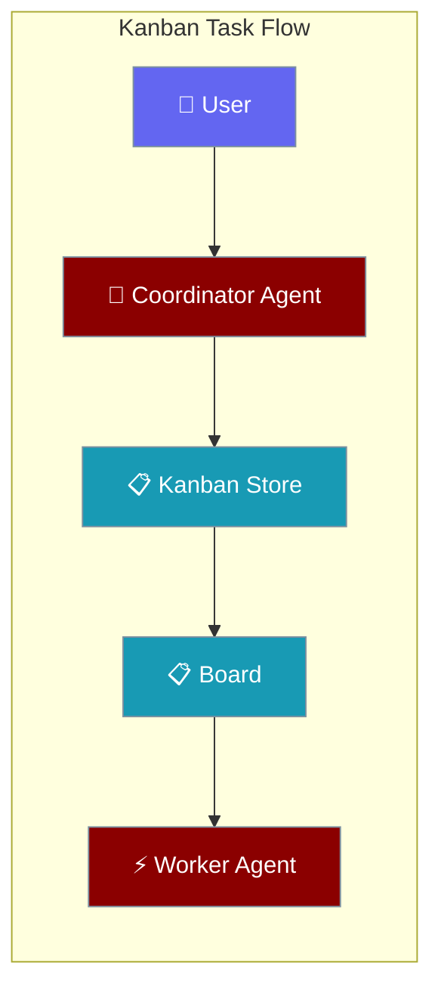
```mermaid
graph LR
    subgraph "Kanban Task Flow"
        User[👤 User] --> Coordinator[🧠 Coordinator Agent]
        Coordinator --> Store[📋 Kanban Store]
        Store --> Board[📋 Board]
        Board --> Worker[⚡ Worker Agent]
    end
    
    classDef user fill:#6366F1,stroke:#7C90A0,color:#fff
    classDef agent fill:#8B0000,stroke:#7C90A0,color:#fff
    classDef store fill:#189AB4,stroke:#7C90A0,color:#fff
    classDef result fill:#10B981,stroke:#7C90A0,color:#fff
    
    class User user
    class Coordinator,Worker agent
    class Store,Board store
```

## Quick Start

<Steps>
<Step title="Create Agent with Kanban Tools">

```python
from praisonaiagents import Agent
from praisonaiagents.kanban import KanbanStoreProtocol

# Agent with kanban protocols (implementation needed from wrapper)
agent = Agent(name="Coordinator", instructions="Break tasks down")
result = agent.start("Create user auth system")
```

</Step>

<Step title="Add Worker Agent">

```python
from praisonaiagents import Agent
from praisonaiagents.kanban import VALID_KANBAN_STATUSES

worker = Agent(name="Worker", instructions="Claim and complete tasks")
result = worker.start("Find ready tasks")
```

</Step>
</Steps>

---

## How It Works

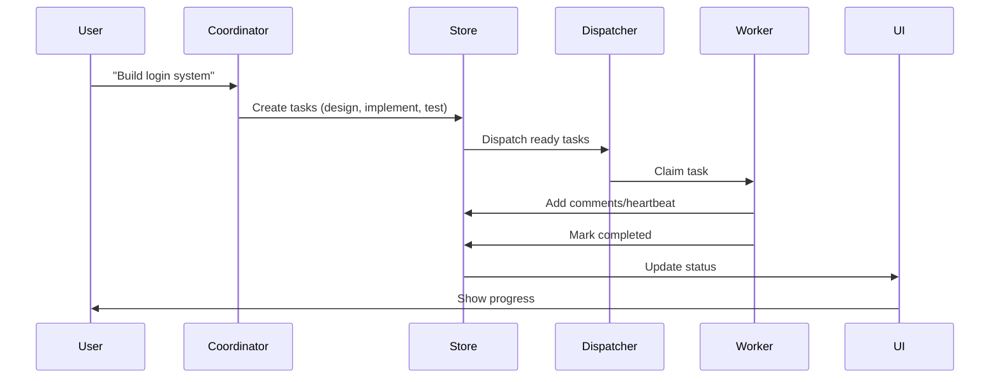
```mermaid
sequenceDiagram
    participant User
    participant Coordinator
    participant Store
    participant Dispatcher
    participant Worker
    participant UI
    
    User->>Coordinator: "Build login system"
    Coordinator->>Store: Create tasks (design, implement, test)
    Store->>Dispatcher: Dispatch ready tasks
    Dispatcher->>Worker: Claim task
    Worker->>Store: Add comments/heartbeat
    Worker->>Store: Mark completed
    Store->>UI: Update status
    UI->>User: Show progress
```

Task coordination happens through a SQLite-backed persistent store that all agents and the UI share.

| Component | Purpose |
|-----------|---------|
| **Kanban Store** | SQLite database storing tasks, comments, links |
| **Agent Tools** | 8 functions for task CRUD operations |
| **CLI Commands** | Human interface for task management |
| **Background Dispatcher** | Auto-claims ready tasks for processing |

---

## Concepts

### Task Statuses

Tasks flow through 8 defined states from creation to completion:

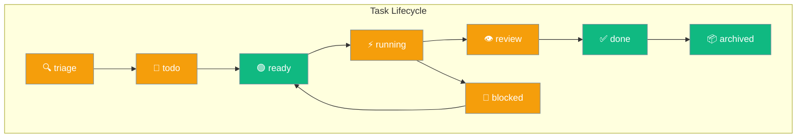
```mermaid
graph TB
    subgraph "Task Lifecycle"
        Triage[🔍 triage] --> Todo[📝 todo]
        Todo --> Ready[🟢 ready]
        Ready --> Running[⚡ running]
        Running --> Review[👁️ review]
        Running --> Blocked[🚫 blocked]
        Blocked --> Ready
        Review --> Done[✅ done]
        Done --> Archived[📦 archived]
    end
    
    classDef status fill:#F59E0B,stroke:#7C90A0,color:#fff
    classDef ready fill:#10B981,stroke:#7C90A0,color:#fff
    classDef done fill:#10B981,stroke:#7C90A0,color:#fff
    
    class Triage,Todo,Running,Review,Blocked status
    class Ready ready
    class Done,Archived done
```

### Boards

Boards provide workspace isolation for different projects or contexts:

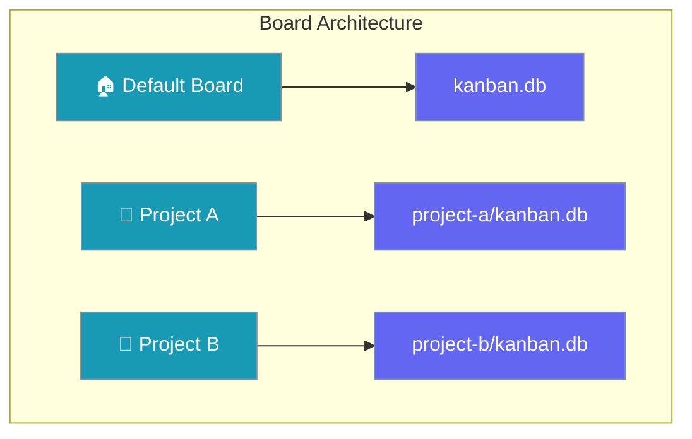
```mermaid
graph TB
    subgraph "Board Architecture"
        Default[🏠 Default Board] --> DB1[kanban.db]
        ProjectA[📁 Project A] --> DB2[project-a/kanban.db] 
        ProjectB[📁 Project B] --> DB3[project-b/kanban.db]
    end
    
    classDef board fill:#189AB4,stroke:#7C90A0,color:#fff
    classDef storage fill:#6366F1,stroke:#7C90A0,color:#fff
    
    class Default,ProjectA,ProjectB board
    class DB1,DB2,DB3 storage
```

### DAG Links

Tasks form directed acyclic graphs through parent-child dependencies:

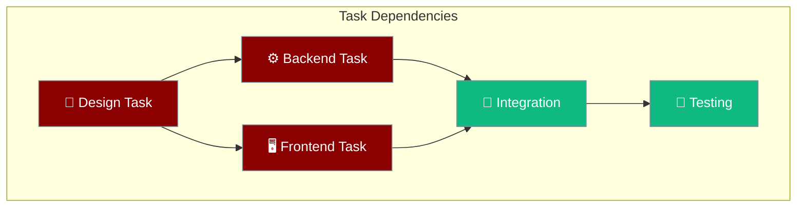
```mermaid
graph TB
    subgraph "Task Dependencies"
        Design[🎨 Design Task] --> Backend[⚙️ Backend Task]
        Design --> Frontend[🖥️ Frontend Task]
        Backend --> Integration[🔗 Integration]
        Frontend --> Integration
        Integration --> Testing[🧪 Testing]
    end
    
    classDef task fill:#8B0000,stroke:#7C90A0,color:#fff
    classDef ready fill:#10B981,stroke:#7C90A0,color:#fff
    
    class Design,Backend,Frontend task
    class Integration,Testing ready
```

### Claim/Release

Workers coordinate through atomic claim and release operations:

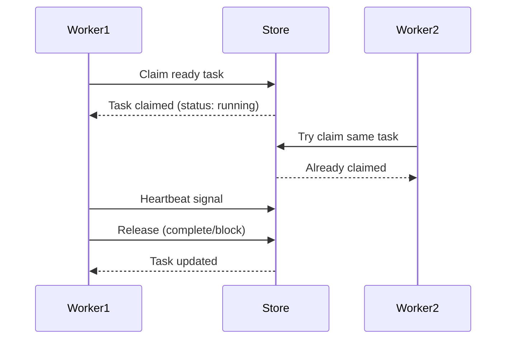
```mermaid
sequenceDiagram
    participant Worker1
    participant Store
    participant Worker2
    
    Worker1->>Store: Claim ready task
    Store-->>Worker1: Task claimed (status: running)
    Worker2->>Store: Try claim same task
    Store-->>Worker2: Already claimed
    Worker1->>Store: Heartbeat signal
    Worker1->>Store: Release (complete/block)
    Store-->>Worker1: Task updated
```

---

## Agent Tools

Kanban tools are available through the SDK protocols. The wrapper implementation provides these agent tools:

### Task Management

| Tool | Purpose | Example |
|------|---------|---------|
| `kanban_create` | Create new task | `kanban_create("Implement auth", assignee="dev", idempotency_key="auth-v1")` |
| `kanban_list` | Filter tasks | `kanban_list(status="ready", assignee="dev")` |
| `kanban_show` | Get task details | `kanban_show("task_abc123")` |
| `kanban_runs` | Read attempt history | `kanban_runs("task_abc123")` |

### Status Changes

| Tool | Purpose | Example |
|------|---------|---------|
| `kanban_complete` | Mark task done with structured handoff | `kanban_complete("task_abc123", summary="Auth done; 14 tests pass", metadata={"changed_files": ["auth.py"]})` |
| `kanban_block` | Block with reason | `kanban_block("task_abc123", "Need API keys")` |

### Coordination

| Tool | Purpose | Example |
|------|---------|---------|
| `kanban_comment` | Add progress note | `kanban_comment("task_abc123", "50% complete")` |
| `kanban_link` | Create dependency | `kanban_link("design_task", "implement_task")` |
| `kanban_heartbeat` | Signal liveness | `kanban_heartbeat("task_abc123", "testing")` |

---

## Boards & Storage

### Single Board (Default)
```
~/.praisonai/kanban.db
```

### Multi-Board Layout
```
~/.praisonai/kanban/boards/
├── project-a/kanban.db
├── project-b/kanban.db
└── team-x/kanban.db
```

### Environment Configuration

| Variable | Effect | Example |
|----------|--------|---------|
| `PRAISONAI_KANBAN_BOARD` | Select active board | `export PRAISONAI_KANBAN_BOARD=project-a` |
| `PRAISONAI_KANBAN_DB` | Override DB path | `export PRAISONAI_KANBAN_DB=/custom/path.db` |

---

## Attempt History & Retry

Each kanban task records every attempt, auto-blocks after repeated failures, and hands off a structured summary on completion.

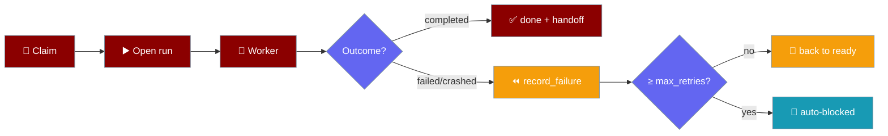
```mermaid
graph LR
    Claim[🎯 Claim] --> Open[▶️ Open run]
    Open --> Work[🤖 Worker]
    Work --> Outcome{Outcome?}
    Outcome -->|completed| Done[✅ done + handoff]
    Outcome -->|failed/crashed| Fail[⏪ record_failure]
    Fail --> Limit{≥ max_retries?}
    Limit -->|no| Ready[🔄 back to ready]
    Limit -->|yes| Block[🛑 auto-blocked]

    classDef agent fill:#8B0000,stroke:#7C90A0,color:#fff
    classDef decision fill:#6366F1,stroke:#7C90A0,color:#fff
    classDef intermediate fill:#F59E0B,stroke:#7C90A0,color:#fff
    classDef terminal fill:#189AB4,stroke:#7C90A0,color:#fff

    class Claim,Open,Work,Done agent
    class Outcome,Limit decision
    class Fail,Ready intermediate
    class Block terminal
```

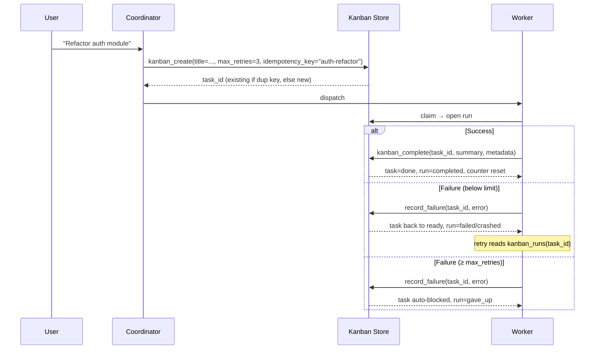
```mermaid
sequenceDiagram
    participant User
    participant Coordinator
    participant Store as Kanban Store
    participant Worker

    User->>Coordinator: "Refactor auth module"
    Coordinator->>Store: kanban_create(title=..., max_retries=3, idempotency_key="auth-refactor")
    Store-->>Coordinator: task_id (existing if dup key, else new)
    Coordinator->>Worker: dispatch
    Worker->>Store: claim → open run
    alt Success
        Worker->>Store: kanban_complete(task_id, summary, metadata)
        Store-->>Worker: task=done, run=completed, counter reset
    else Failure (below limit)
        Worker->>Store: record_failure(task_id, error)
        Store-->>Worker: task back to ready, run=failed/crashed
        Note over Worker: retry reads kanban_runs(task_id)
    else Failure (≥ max_retries)
        Worker->>Store: record_failure(task_id, error)
        Store-->>Worker: task auto-blocked, run=gave_up
    end
```

<Steps>
<Step title="Idempotent create with retry limit">

```python
from praisonaiagents import Agent
from praisonai.tools.kanban_tools import kanban_create

agent = Agent(name="Coordinator", instructions="Break work into tasks")

task = kanban_create(
    "Replace bcrypt with argon2",
    body="Migrate auth module to argon2",
    assignee="coder",
    max_retries=3,                       # per-task circuit-breaker
    idempotency_key="auth-refactor-q3",  # safe to repeat
)
```

</Step>

<Step title="Structured completion handoff">

```python
from praisonai.tools.kanban_tools import kanban_complete

kanban_complete(
    task["id"],
    summary="argon2 migration; 14 tests pass; CHANGELOG updated",
    metadata={
        "changed_files": ["auth.py", "tests/test_auth.py"],
        "tests_run": 14,
        "residual_risk": "rotate old hashes on next login",
    },
)
```

</Step>

<Step title="Read attempt history on retry">

```python
from praisonai.tools.kanban_tools import kanban_runs

history = kanban_runs(task["id"])
for run in history["runs"]:
    print(run["outcome"], run["error"] or run["summary"])
# crashed: ModuleNotFoundError: argon2
# completed: argon2 migration; 14 tests pass; CHANGELOG updated
```

</Step>
</Steps>

### What the dispatcher does automatically

When a worker claims a task, the dispatcher **opens a run** with the claim — anything the worker writes via `kanban_complete` closes it as `completed`, anything that crashes closes it as `crashed`/`failed`. Below the `max_retries` limit, failed attempts release the claim and put the task back on `ready` for re-dispatch. At the limit, the task auto-blocks with `gave_up` so a human can step in. A successful completion **resets the failure counter** — the limit is consecutive, not cumulative.

### New params on `kanban_create`

| Option | Type | Default | Description |
|--------|------|---------|-------------|
| `max_retries` | `int` | `3` (board default) | Per-task circuit-breaker limit. After this many *consecutive* failed attempts the task auto-blocks. Invalid values (`<1` / non-numeric) fall back to the board default. |
| `idempotency_key` | `str` | `None` | Per-board, **per-tenant** dedup key. Repeating a create with the same key returns the existing task instead of a duplicate — safe for retrying automation and webhooks. |

### New params on `kanban_complete`

| Option | Type | Default | Description |
|--------|------|---------|-------------|
| `summary` | `str` | `""` | Structured summary of what was done. Surfaced to linked children and retrying workers. |
| `metadata` | `dict` | `{}` | Structured handoff fields. Common keys: `changed_files`, `tests_run`, `residual_risk`, `next_steps`. |
| `comment` | `str` | `""` | Free-text completion comment (kept for back-compat). |

<Note>
`kanban_complete` moves the task to `done` **before** recording the run. A `move_task` failure never leaves an orphaned completed run for a task that never reached `done`.
</Note>

### New tool: `kanban_runs`

| Tool | Purpose | Example |
|------|---------|---------|
| `kanban_runs` | Read attempt history (oldest first) | `kanban_runs("task_abc123")` → `{"runs": [{"outcome": "crashed", "error": "...", "started_at": "...", "ended_at": "..."}, ...], "count": 2}` |

Each row matches the `KanbanRunProtocol` shape:

| Field | Type | Description |
|-------|------|-------------|
| `id` | `int` | Auto-incremented run ID |
| `task_id` | `str` | Parent task ID |
| `profile` | `str` | Worker/profile identifier |
| `outcome` | `str \| None` | `completed`, `blocked`, `crashed`, `failed`, or `gave_up`; `None` while the run is open |
| `summary` | `str` | Structured handoff summary |
| `metadata` | `dict` | Structured handoff fields |
| `error` | `str` | Error text for failed/crashed attempts |
| `started_at` | `str \| None` | ISO-8601 timestamp |
| `ended_at` | `str \| None` | ISO-8601 timestamp; `None` while the run is open |

### New `Task` fields

| Field | Type | Meaning |
|-------|------|---------|
| `max_retries` | `int \| None` | Per-task circuit-breaker limit. `None` means use the board default (`3`). |
| `consecutive_failures` | `int` | Count of consecutive failed attempts since the last `completed` outcome. Reset to `0` by a successful completion. |
| `current_run_id` | `int \| None` | Active attempt id; `None` when no run is open. |

<Note>
Existing SQLite databases are **auto-migrated** on first open — no user action required.
</Note>

### Common Patterns

**Automation-safe creation** — pass `idempotency_key` derived from the trigger (`f"github-issue-{n}"`, `f"webhook-{uuid}"`). Re-firing the webhook is a no-op instead of spawning duplicates. Idempotency is **per-board, per-tenant** — two tenants on the same board never collide on the same key.

**Long-running flaky network tasks** — set `max_retries=5` per task to absorb transient flakes without giving up too early. Watch `consecutive_failures` in `kanban_show` to spot stuck tasks.

**Retrying workers use prior failures** — call `kanban_runs(task_id)` at the start of a retry attempt to read prior outcomes and errors. Use `summary` and `metadata` from the most recent failed run as context: "previous attempt crashed at line X; avoid path Y."

<AccordionGroup>
<Accordion title="Use idempotency_key for every automated kanban_create">
Webhooks, schedulers, and GitHub-issue triagers should always pass an `idempotency_key`. The cost is one extra string; the value is zero duplicate tasks under retry.
</Accordion>

<Accordion title="Tune max_retries per task type">
Fast deterministic work: `max_retries=1`. Flaky network or integration tests: `max_retries=3–5`. Leave the rest at the board default (`3`).
</Accordion>

<Accordion title="Send a real summary and metadata">
Use `summary` and `metadata` in `kanban_complete` instead of free-text comments. Downstream child tasks and retrying workers consume the structured fields; humans still read them fine.
</Accordion>

<Accordion title="Read kanban_runs before retrying">
The structured run history is the cheapest "what went wrong last time" context a retrying worker can fetch. Call `kanban_runs(task_id)` at the start of every retry attempt.
</Accordion>
</AccordionGroup>

---

## Common Patterns

### Coordinator-Worker Pattern

```python
# Coordinator breaks down requests
from praisonaiagents import Agent
from praisonaiagents.kanban import VALID_KANBAN_STATUSES

coordinator = Agent(
    name="Coordinator", 
    instructions="Break user requests into kanban tasks"
)

# Worker with heartbeat reporting
worker = Agent(
    name="Worker",
    instructions="Claim ready tasks, report progress via heartbeat"
)
```

### Background Processing

```python
# Background processing requires wrapper implementation
# The praisonaiagents.kanban protocols support:
# - Task claiming and status updates
# - Heartbeat reporting for long-running tasks
# - Multi-board coordination
```

### Worker with Heartbeat

```python
from praisonaiagents import Agent
from praisonaiagents.kanban import VALID_KANBAN_STATUSES

worker = Agent(
    name="Worker",
    instructions="""Claim ready tasks and report liveness via heartbeat. 
    Use kanban_heartbeat every 30 seconds during long-running work."""
)

# Worker claims task and reports progress
result = worker.start("Find ready tasks, claim one, and report progress")
```

### Human-Agent Collaboration

```bash
# Human-agent collaboration pattern
# Requires wrapper implementation of:
# - CLI commands for task management
# - UI board visualization
# - Agent-to-store protocol bindings
```

---

## Runs, Retries, and Structured Handoff

Kanban now tracks every execution attempt for each task via the `task_runs` table, supports per-task retry limits, and allows agents to pass structured data when completing a task.

### `kanban_complete` — structured handoff

```python
kanban_complete(
    task_id="task-123",
    summary="Implemented OAuth2 flow with PKCE",
    metadata={"pr_url": "https://github.com/org/repo/pull/42", "test_coverage": 0.91},
)
```

| Parameter | Type | Default | Description |
|-----------|------|---------|-------------|
| `task_id` | `str` | _(required)_ | Task to complete |
| `summary` | `str` | `""` | Human-readable completion summary stored in the run record |
| `metadata` | `dict` | `{}` | Arbitrary structured data for downstream consumers (e.g. PR URL, metrics) |

### `kanban_create` — idempotency and retries

```python
kanban_create(
    title="Write unit tests for auth module",
    body="Cover all edge cases in JWT validation",
    idempotency_key="auth-tests-v1",
    max_retries=3,
)
```

| Parameter | Type | Default | Description |
|-----------|------|---------|-------------|
| `title` | `str` | _(required)_ | Task title |
| `body` | `str` | `""` | Task description |
| `idempotency_key` | `str \| None` | `None` | If set, calling `kanban_create` again with the same key returns the existing task instead of creating a duplicate |
| `max_retries` | `int` | `0` | Max number of times the dispatcher retries a failed run. After N failures the task is auto-moved to `blocked` |

### `kanban_runs` — per-task run history

List all execution attempts for a task:

```python
runs = kanban_runs(task_id="task-123")
for run in runs:
    print(run["outcome"], run["summary"], run["created_at"])
```

Each run record contains:

| Field | Type | Description |
|-------|------|-------------|
| `id` | `str` | Unique run ID |
| `task_id` | `str` | Parent task |
| `outcome` | `str` | `"success"`, `"failure"`, or `"in_progress"` |
| `summary` | `str` | Summary provided at completion |
| `metadata` | `dict` | Structured handoff data |
| `created_at` | `float` | Unix timestamp of run start |
| `finished_at` | `float \| None` | Unix timestamp of run end |

### Auto-block after max retries

When `max_retries > 0` and the task accumulates that many `"failure"` run outcomes, the dispatcher automatically moves the task from `running` to `blocked`. The task must be manually unblocked (`kanban_move(task_id, "ready")`) after the root cause is resolved.

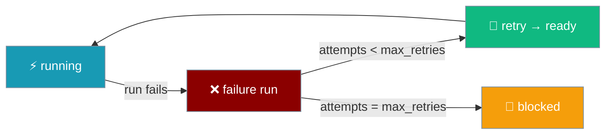
```mermaid
graph LR
    Running[⚡ running] -->|run fails| Failure[❌ failure run]
    Failure -->|attempts < max_retries| Retry[🔄 retry → ready]
    Failure -->|attempts = max_retries| Blocked[🚫 blocked]
    Retry --> Running

    classDef running fill:#189AB4,stroke:#7C90A0,color:#fff
    classDef failure fill:#8B0000,stroke:#7C90A0,color:#fff
    classDef blocked fill:#F59E0B,stroke:#7C90A0,color:#fff
    classDef retry fill:#10B981,stroke:#7C90A0,color:#fff

    class Running running
    class Failure failure
    class Blocked blocked
    class Retry retry
```

---

## Per-Task Worktree Isolation

Give every kanban worker its own git worktree so parallel tasks never overwrite each other's files.

<Note>
For **CLI, per-run** isolation (not per-task), see [`praisonai run --worktree`](/docs/cli/run#isolated-runs).
</Note>

```python
from praisonaiagents import Agent
from praisonai.tools.kanban_tools import kanban_create

# Opt this task into per-task worktree isolation
task = kanban_create(
    "Refactor auth module",
    workspace_kind="worktree",   # <-- the whole feature
)
```

One keyword moves a task onto its own branch and working directory. Everything else — creation, merge-back, and cleanup — happens automatically.

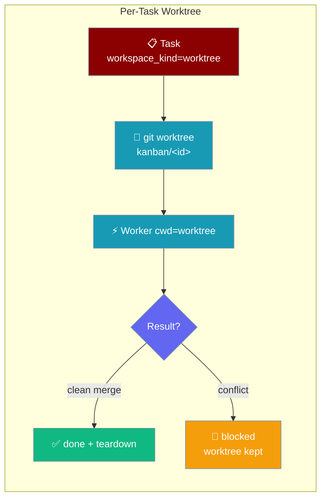
```mermaid
graph LR
    subgraph "Per-Task Worktree"
        Task[📋 Task<br/>workspace_kind=worktree] --> Fork[🌱 git worktree<br/>kanban/&lt;id&gt;]
        Fork --> Worker[⚡ Worker cwd=worktree]
        Worker --> Result{Result?}
        Result -->|clean merge| Done[✅ done + teardown]
        Result -->|conflict| Blocked[🛑 blocked<br/>worktree kept]
    end

    classDef task fill:#8B0000,stroke:#7C90A0,color:#fff
    classDef process fill:#189AB4,stroke:#7C90A0,color:#fff
    classDef decision fill:#6366F1,stroke:#7C90A0,color:#fff
    classDef done fill:#10B981,stroke:#7C90A0,color:#fff
    classDef blocked fill:#F59E0B,stroke:#7C90A0,color:#fff

    class Task task
    class Fork,Worker process
    class Result decision
    class Done done
    class Blocked blocked
```

### Auto-upgrade for repo-linked tasks

Link a task to a git repo and the dispatcher gives it a worktree automatically — no keyword needed.

```python
from praisonai_bot.kanban.sqlite_store import SQLiteKanbanStore

store = SQLiteKanbanStore()

# repo_path alone opts the task into isolation — workspace_kind is set for you
task = store.create_task({
    "title": "Refactor auth module",
    "repo_path": "/repos/service-a",
})

assert task.workspace_kind == "worktree"
assert task.branch == f"kanban/{task.id}"
assert task.metadata["repo_path"] == "/repos/service-a"
```

<Note>
The built-in `kanban_create` agent tool (`praisonai.tools.kanban_tools`) accepts a fixed argument list — `title`, `body`, `assignee`, `status`, `priority`, `board`, `max_retries`, `idempotency_key` — and does **not** forward `repo_path`, `auto_worktree`, or `workspace_kind`. To opt a task into worktree isolation by linkage, call `SQLiteKanbanStore().create_task({...})` directly as shown above.
</Note>

The upgrade is triggered by *linkage*, not by task content — the task body is never inspected.

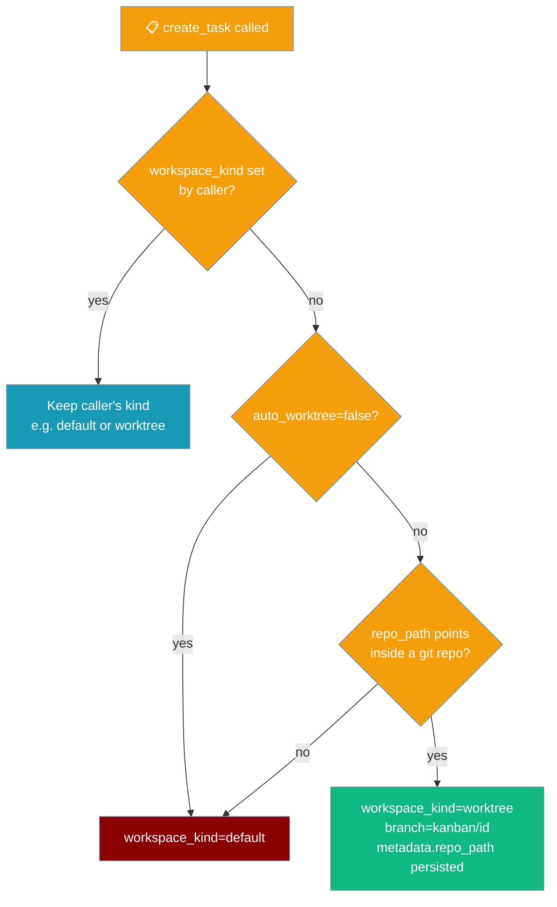
```mermaid
graph TB
    Start[📋 create_task called] --> Explicit{workspace_kind set<br/>by caller?}
    Explicit -->|yes| Keep[Keep caller's kind<br/>e.g. default or worktree]
    Explicit -->|no| AutoFlag{auto_worktree=false?}
    AutoFlag -->|yes| Default[workspace_kind=default]
    AutoFlag -->|no| RepoLinked{repo_path points<br/>inside a git repo?}
    RepoLinked -->|yes| Upgrade[workspace_kind=worktree<br/>branch=kanban/id<br/>metadata.repo_path persisted]
    RepoLinked -->|no| Default

    classDef q fill:#F59E0B,stroke:#7C90A0,color:#fff
    classDef keep fill:#189AB4,stroke:#7C90A0,color:#fff
    classDef def fill:#8B0000,stroke:#7C90A0,color:#fff
    classDef up fill:#10B981,stroke:#7C90A0,color:#fff

    class Start,Explicit,AutoFlag,RepoLinked q
    class Keep keep
    class Default def
    class Upgrade up
```

| Task input | Effective `workspace_kind` | Effective `branch` | Notes |
|---|---|---|---|
| `repo_path="/repos/svc"` (git repo) | `worktree` | `kanban/<task_id>` | Auto-upgrade fires. `metadata["repo_path"]` is persisted so dispatch sees the same linkage. |
| `metadata={"repo_path": "/repos/svc"}` | `worktree` | `kanban/<task_id>` | Same — `repo_path` can live inside `metadata` too. |
| `repo_path="/repos/svc"` + `workspace_kind="default"` | `default` | *(unset)* | Explicit kind always wins. Deliberate opt-out. |
| `repo_path="/repos/svc"` + `auto_worktree=False` | `default` | *(unset)* | Board- or task-level escape hatch. `metadata["auto_worktree"]=False` works too. |
| `workspace_kind="worktree"` (no `repo_path`) | `worktree` | `kanban/<task_id>` | Branch is derived at **create** time, not dispatch. |
| `repo_path="/not/a/repo"` | `default` | *(unset)* | Bad path → not a repo → no upgrade. Never fails the create. |
| `repo_path="/repos/svc"` + `metadata={"repo_path": "/explicit/other"}` | `worktree` | `kanban/<task_id>` | Explicit `metadata.repo_path` is respected — top-level `repo_path` does not overwrite. |

Disable the upgrade per task (or per board via `metadata`) with `auto_worktree=False`:

```python
from praisonai_bot.kanban.sqlite_store import SQLiteKanbanStore

store = SQLiteKanbanStore()

# repo-linked, but isolation explicitly disabled
task = store.create_task({
    "title": "Read-only audit",
    "repo_path": "/repos/service-a",
    "auto_worktree": False,
})

assert task.workspace_kind == "default"
```

### How It Works

The dispatcher forks a worktree from the base branch, runs the worker inside it, then merges the branch back on success.

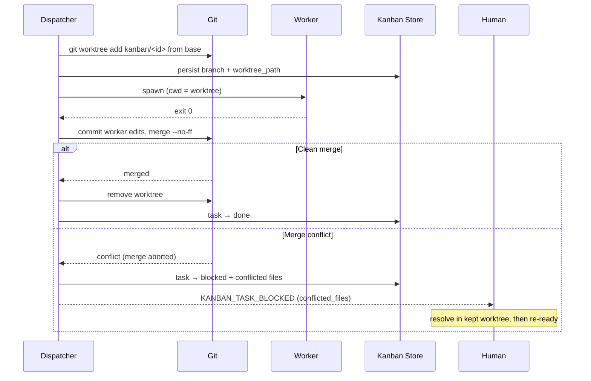
```mermaid
sequenceDiagram
    participant Dispatcher
    participant Git
    participant Worker
    participant Store as Kanban Store
    participant Human

    Dispatcher->>Git: git worktree add kanban/<id> from base
    Dispatcher->>Store: persist branch + worktree_path
    Dispatcher->>Worker: spawn (cwd = worktree)
    Worker-->>Dispatcher: exit 0
    Dispatcher->>Git: commit worker edits, merge --no-ff
    alt Clean merge
        Git-->>Dispatcher: merged
        Dispatcher->>Git: remove worktree
        Dispatcher->>Store: task → done
    else Merge conflict
        Git-->>Dispatcher: conflict (merge aborted)
        Dispatcher->>Store: task → blocked + conflicted files
        Dispatcher-->>Human: KANBAN_TASK_BLOCKED (conflicted_files)
        Note over Human: resolve in kept worktree, then re-ready
    end
```

On success the dispatcher auto-commits any uncommitted worker edits as `kanban worker output for kanban/<task_id>`, merges the branch into the base with `git merge --no-ff`, then tears the worktree down. On conflict the merge is aborted, so the base branch is never left half-merged.

### Choosing `default` vs `worktree`

Pick isolation only when workers actually edit files in a git repo.

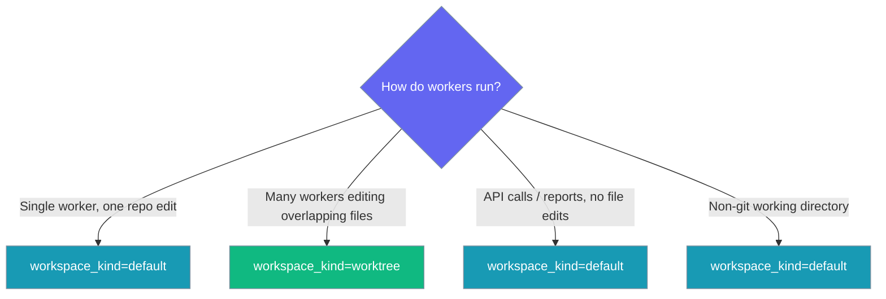
```mermaid
graph TB
    Start{How do workers run?} -->|Single worker, one repo edit| Default1[workspace_kind=default]
    Start -->|Many workers editing overlapping files| Tree[workspace_kind=worktree]
    Start -->|API calls / reports, no file edits| Default2[workspace_kind=default]
    Start -->|Non-git working directory| Default3[workspace_kind=default]

    classDef decision fill:#6366F1,stroke:#7C90A0,color:#fff
    classDef default fill:#189AB4,stroke:#7C90A0,color:#fff
    classDef tree fill:#10B981,stroke:#7C90A0,color:#fff

    class Start decision
    class Default1,Default2,Default3 default
    class Tree tree
```

### New `Task` fields

| Field | Type | Default | Description |
|-------|------|---------|-------------|
| `workspace_kind` | `str` | `"default"` | `"worktree"` opts the task into per-task git worktree isolation. Any other value keeps the shared-cwd behaviour. |
| `repo_path` | `str \| None` | `None` | Filesystem path of the git repo this task is linked to. When set and the caller left `workspace_kind` unset, the store upgrades `workspace_kind` to `"worktree"` and persists the resolved path into `metadata["repo_path"]`. Non-git or unreadable paths are treated as unlinked (never fails the create). Also accepted inside `metadata`. |
| `auto_worktree` | `bool` | `True` | Set to `False` to disable the repo-linked auto-upgrade for this task (or a whole board via `metadata["auto_worktree"]`). Explicit `workspace_kind` always wins over both this flag and `repo_path`. |
| `branch` | `str \| None` | `None` | Populated at `create_task` time on worktree tasks (auto-upgraded **or** explicit `workspace_kind="worktree"`) — `kanban/<task_id>`. An explicit `branch` in `task_data` is respected. Read it via `kanban_show`. |
| `worktree_path` | `str \| None` | `None` | Populated by the dispatcher — filesystem path of the worktree (`~/.praisonai/kanban/worktrees/<task_id>`). |

<Note>
Existing SQLite boards **auto-migrate** to add the `branch` and `worktree_path` columns on first open — no user action required.
</Note>

### Environment configuration

Add these to the [Environment Configuration](#environment-configuration) table when the dispatcher runs outside the repo.

| Variable | Effect | Example |
|----------|--------|---------|
| `PRAISONAI_KANBAN_REPO_DIR` | Base repo path for worktree / merge operations | `export PRAISONAI_KANBAN_REPO_DIR=/repos/service-a` |
| `PRAISONAI_KANBAN_BASE_BRANCH` | Fallback branch to fork from / integrate into when HEAD cannot be detected | `export PRAISONAI_KANBAN_BASE_BRANCH=develop` |

The dispatcher branches from the current HEAD of `PRAISONAI_KANBAN_REPO_DIR` (defaulting to the process working directory). When HEAD cannot be detected, it falls back to `PRAISONAI_KANBAN_BASE_BRANCH` (default `main`).

### Merge conflict handling

A conflict never touches the base branch — it routes the task to `blocked` for a human to resolve.

- The merge is **aborted**; the base branch is left untouched.
- The task moves to `blocked` with a comment listing the conflicted files.
- The `KANBAN_TASK_BLOCKED` hook fires with `conflicted_files: list[str]`.
- The worktree is **preserved** on disk for inspection.

To recover, resolve the conflicts inside the kept worktree, then re-run or discard it:

```python
from praisonai.tools.kanban_tools import kanban_move

# After resolving conflicts inside ~/.praisonai/kanban/worktrees/<task_id>
kanban_move("task_abc123", "ready")   # re-dispatch the task
```

Or discard the worktree entirely from the base repo:

```bash
git worktree remove --force ~/.praisonai/kanban/worktrees/task_abc123
```

<Note>
Task IDs are validated (`^[A-Za-z0-9._-]+$`, no leading `.`, no path traversal) before use as a branch ref or path. An unsafe ID **fails closed** — the task refuses to spawn a worker rather than falling back to the shared cwd.
</Note>

### Lossless-only worktree teardown

The dispatcher never destroys work a worker produced but failed to integrate — a worktree with uncommitted changes or unmerged commits is preserved on disk with a `worktree_preserved` comment on the task.

```mermaid
sequenceDiagram
    participant Dispatcher
    participant Guard as Lossless guard
    participant Git
    participant Store as Kanban Store

    Dispatcher->>Git: git merge --no-ff kanban/<id>
    Dispatcher->>Guard: _remove_worktree(path, branch)
    Guard->>Git: git status --porcelain
    Guard->>Git: git rev-list --count base..branch
    alt Clean tree and 0 commits ahead
        Guard->>Git: git worktree remove --force
        alt remove succeeded
            Git-->>Guard: ok
            Guard-->>Dispatcher: None (removed)
            Dispatcher->>Store: drop tracking entry
        else remove failed (nonzero / exception)
            Git-->>Guard: error
            Guard-->>Dispatcher: "worktree removal failed: …"
            Dispatcher->>Store: add_comment worktree_preserved at <path>: …
            Note over Dispatcher: tracking entry kept — no orphan
        end
    else Dirty or ahead of base
        Guard-->>Dispatcher: reason string
        Dispatcher->>Store: add_comment worktree_preserved at <path>: <reason>
        Note over Dispatcher: worktree left on disk; tracking entry kept
    end
```

Every preserved worktree records its reason as a task comment, readable via `kanban_show(task_id)`:

| Reason (recorded on the task) | Trigger | Recovery |
|---|---|---|
| `worktree has uncommitted changes` | Worktree still has files in `git status --porcelain` after integration | `cd` into the worktree, `git add -A && git commit`, then rerun cleanup — or discard with `git -C <path> reset --hard HEAD` then remove |
| `branch has <N> commit(s) not in <base>` | `git rev-list --count <base>..<branch>` > 0 (worker committed something that never merged into base) | Merge or cherry-pick the branch into base by hand, then rerun cleanup, or force-remove if the commits are known-throwaway |
| `could not read worktree status: <err>` / `could not compute ahead-count: <err>` | The `git status` / `git rev-list` command itself failed | Investigate the worktree state manually — the guard errs toward preservation, so no data is at risk |
| `worktree removal failed: <detail>` | `git worktree remove --force` returned nonzero | Read the git error, resolve, then rerun cleanup or force-remove |
| `worktree removal error: <exc>` | `git worktree remove` raised (permissions, missing binary, etc.) | Fix the underlying environment issue, then retry |

To recover a preserved worktree, commit anything worth keeping first, then integrate or remove it from the base repo:

```bash
# Read the preserved worktree, losslessly commit anything worth keeping
git -C ~/.praisonai/kanban/worktrees/task_abc123 status
git -C ~/.praisonai/kanban/worktrees/task_abc123 add -A
git -C ~/.praisonai/kanban/worktrees/task_abc123 commit -m "recover worker output"

# Then either integrate the branch by hand...
git merge kanban/task_abc123

# ...or, if the edits are known throwaway, remove the worktree manually
git worktree remove --force ~/.praisonai/kanban/worktrees/task_abc123
```

Inside a dispatcher-owned code path (e.g. a custom `KanbanDispatcher` subclass), the equivalent destructive teardown is an explicit `force=True`:

```python
# Explicitly opt into destructive teardown — bypasses the lossless guard
dispatcher._remove_worktree(path, branch, force=True)
```

<Warning>
`force=True` is destructive by design — use it only when the outstanding work in the worktree is known to be throwaway. In normal operation the dispatcher never sets it.
</Warning>

### Best Practices

<AccordionGroup>
<Accordion title="Enable worktree isolation only when workers edit files">
Tasks that only call APIs or print reports gain nothing from isolation and pay the git overhead. Keep `workspace_kind="default"` for read-only work; reserve `"worktree"` for concurrent file edits.
</Accordion>

<Accordion title="Set PRAISONAI_KANBAN_REPO_DIR outside the repo">
The dispatcher falls back to `os.getcwd()` at start, which is wrong under systemd/supervisord. Export `PRAISONAI_KANBAN_REPO_DIR=/path/to/repo` so worktrees and merges run against the right checkout.
</Accordion>

<Accordion title="Use short, git-ref-safe task IDs">
The dispatcher rejects `..`, `/`, leading `.`, spaces, and other invalid chars. Unsafe IDs fail closed (no isolation, no worker) — keep IDs to `[A-Za-z0-9._-]`.
</Accordion>

<Accordion title="Sweep stuck worktrees under ~/.praisonai/kanban/worktrees/">
Both `blocked`-on-conflict tasks and clean-merge tasks with a `worktree_preserved` comment leave their worktree on disk by design. Read the comment for the reason (`kanban_show <task_id>`), integrate any recoverable work by hand, then `git worktree remove --force ~/.praisonai/kanban/worktrees/<task_id>` once resolved.
</Accordion>

<Accordion title="Prefer repo_path over workspace_kind for repo-scoped work">
Linking a task to its repo (`repo_path="/repos/foo"`) opts it into isolation *and* records the isolating repo in `metadata` so the dispatcher never loses the linkage. `workspace_kind="worktree"` still works for callers that already track the repo themselves.
</Accordion>
</AccordionGroup>

---

## Best Practices

<AccordionGroup>
<Accordion title="Task Granularity">
Create tasks that can be completed in 15-30 minutes. Break larger work into linked subtasks using `kanban_link` for proper dependency tracking.
</Accordion>

<Accordion title="Status Management">
Move tasks through statuses systematically: `todo` → `ready` → `running` → `done`. Use `blocked` for dependencies and `review` for human approval.
</Accordion>

<Accordion title="Agent Coordination">
Use `kanban_heartbeat` during long-running tasks to signal liveness. Add detailed comments with `kanban_comment` to track progress and decisions.
</Accordion>

<Accordion title="Board Organization">
Use separate boards for different projects or contexts. Default board works well for single-project setups.
</Accordion>
</AccordionGroup>

---

## Related

<CardGroup cols={2}>
<Card title="Kanban CLI" icon="terminal" href="/docs/features/kanban-cli">
  CLI commands for viewing boards, tasks, and run history
</Card>

<Card title="Async Jobs" icon="clock" href="/docs/features/async-jobs">
  Asynchronous job processing and queuing
</Card>

<Card title="Background Tasks" icon="clock" href="/docs/features/background-tasks">
  Async job processing and scheduling
</Card>

<Card title="CLI Dispatcher" icon="terminal" href="/docs/features/cli-dispatcher">
  Command-line task orchestration
</Card>
</CardGroup>