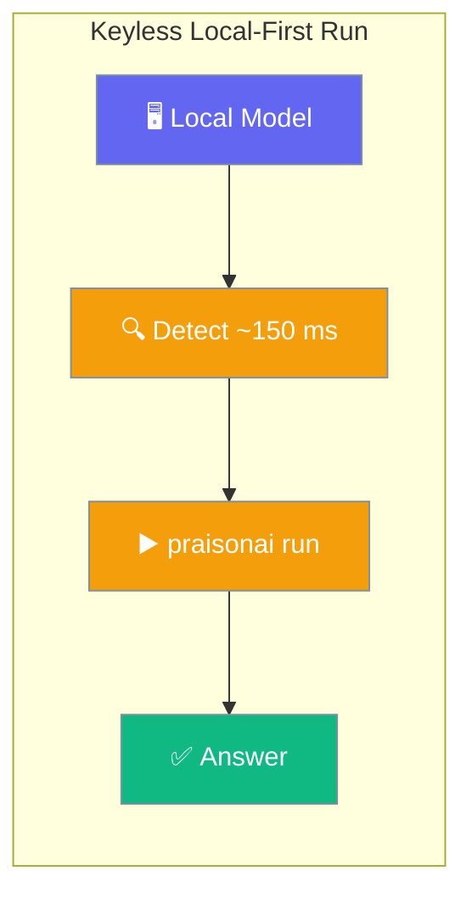
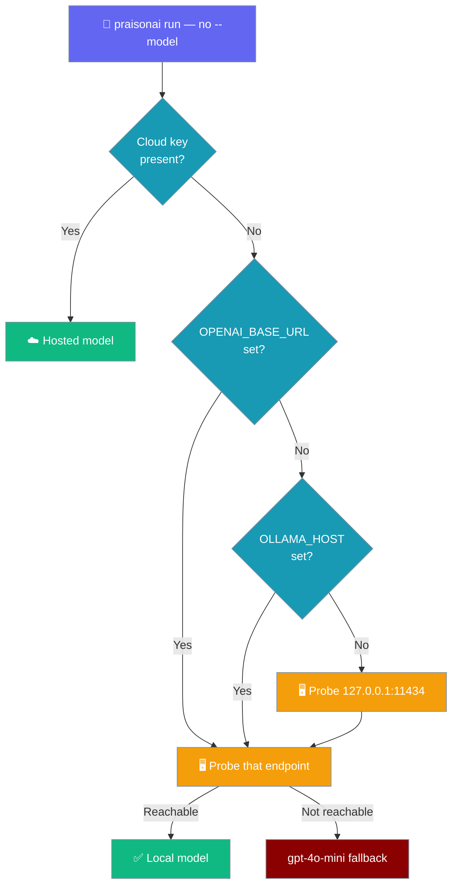

If Ollama (or any OpenAI-compatible local server) is running, `praisonai run "..."` works with no API key and no setup.



Start a local model, run a prompt — no `OPENAI_API_KEY`, no `--model`, no `praisonai setup`. When no cloud key is configured but a local endpoint answers, PraisonAI adopts it as the zero-config default.

## Quick Start

<Steps>
<Step title="Start Ollama">
```bash
ollama serve
ollama pull llama3.2
```
</Step>

<Step title="Run a prompt — no key, no model flag">
```bash
praisonai run "Hello"
```

No `OPENAI_API_KEY`. No `--model`. No `praisonai setup`.
</Step>

<Step title="See the one-line notice">
PraisonAI prints a transparency notice to `stderr`, then answers:

```
No cloud key found; using local model ollama/llama3.2. Run `praisonai setup` to add a hosted provider.
```
</Step>
</Steps>

---

## How It Works

PraisonAI checks for a cloud provider key first. When none is present, it probes for a local endpoint before falling back to the terminal default. A cloud key always wins.



### Detection precedence

The probe honours your environment in this exact order:

1. `OPENAI_BASE_URL` if set.
2. else `OLLAMA_HOST` if set (a bare `host:port` is accepted; a scheme is added if missing).
3. else `http://127.0.0.1:11434`.

At that host it tries Ollama's native `/api/tags` first — the first tag becomes `ollama/<name>`. If that fails, it tries the OpenAI-compatible `/v1/models` — the first id becomes `openai/<id>`. This second path detects llama.cpp, LM Studio, and vLLM.

### Timing and safety

| Property | Value |
|----------|-------|
| Total probe budget | ~150 ms — the credential hot path is never stalled when nothing is listening |
| Negative-cache | 30 s, keyed by endpoint so a mid-session env change is never served a stale result |
| Cloud precedence | A cloud key always wins; the local path only fires when no cloud credential is present |
| CI safety | Non-TTY, `--quiet`, and `--output json` still exit `1` with guidance when nothing is reachable |

---

## Environment Variables

Point detection at a specific endpoint with either variable.

| Variable | Example | Meaning |
|----------|---------|---------|
| `OPENAI_BASE_URL` | `http://localhost:1234` | Probe this OpenAI-compatible endpoint first (llama.cpp, LM Studio, vLLM) |
| `OLLAMA_HOST` | `127.0.0.1:11434` | Probe this Ollama host when `OPENAI_BASE_URL` is unset. A local host is **not** treated as a cloud key |

<Note>
`OLLAMA_HOST` is intentionally **not** a cloud credential — a running local host is not an API key, so it never suppresses local detection.
</Note>

### Other local servers

llama.cpp, LM Studio, and vLLM expose an OpenAI-compatible `/v1/models` endpoint, so they are detected via the fallback probe. Point PraisonAI at the port your server uses:

```bash
export OPENAI_BASE_URL=http://localhost:1234
praisonai run "Hello"
```

The first model id the server reports becomes `openai/<id>`.

---

## Behaviour Matrix

Detection combines with your terminal mode as follows.

| Mode | Local reachable | Not reachable |
|------|-----------------|---------------|
| TTY (interactive) | Uses local model, prints the stderr notice, continues into the TUI | Suggests `praisonai setup`, then continues into the TUI |
| `praisonai run` | Adopts the detected model, sets `OPENAI_BASE_URL` via `setdefault` | Exits `1` with guidance |
| `--quiet` | Uses local model | Exits `1` |
| `--output json` | Uses local model | Exits `1` |

The non-TTY / `--quiet` / `--output json` error message is:

```
No API key configured. Run: praisonai setup
(a running local endpoint such as Ollama would be used automatically)
```

---

## Best Practices

<AccordionGroup>
<Accordion title="Add a hosted provider when you need one">
Local-first is zero-config, but `praisonai setup` is still the way to add a hosted provider (OpenAI, Anthropic, …). Once a cloud key is configured, it takes precedence over any running local server.
</Accordion>

<Accordion title="An explicit --model still overrides detection">
Passing `--model <name>` bypasses local detection and routes to that model's own provider gate. Use it to force a specific model regardless of what is running locally.
</Accordion>

<Accordion title="Force cloud despite a running local server">
To ignore a running local endpoint, either unset the local env vars or name a cloud model directly:

```bash
unset OPENAI_BASE_URL OLLAMA_HOST
# or
praisonai run --model gpt-4o "Hello"
```
</Accordion>

<Accordion title="Point at a non-default port">
For llama.cpp / LM Studio / vLLM on a custom port, export `OPENAI_BASE_URL` before running:

```bash
export OPENAI_BASE_URL=http://localhost:8000
praisonai run "Hello"
```
</Accordion>
</AccordionGroup>

---

## Related

<CardGroup cols={2}>
  <Card title="First-run Onboarding" icon="key-round" href="/docs/features/first-run-onboarding">
    How PraisonAI routes a keyless first run
  </Card>
  <Card title="Setup" icon="key" href="/docs/cli/setup">
    Add a hosted provider credential
  </Card>
  <Card title="Run Command" icon="play" href="/docs/cli/run">
    Run agents from files or prompts
  </Card>
  <Card title="Ollama" icon="dragon" href="/docs/mcp/ollama">
    Use Ollama models with PraisonAI
  </Card>
</CardGroup>
