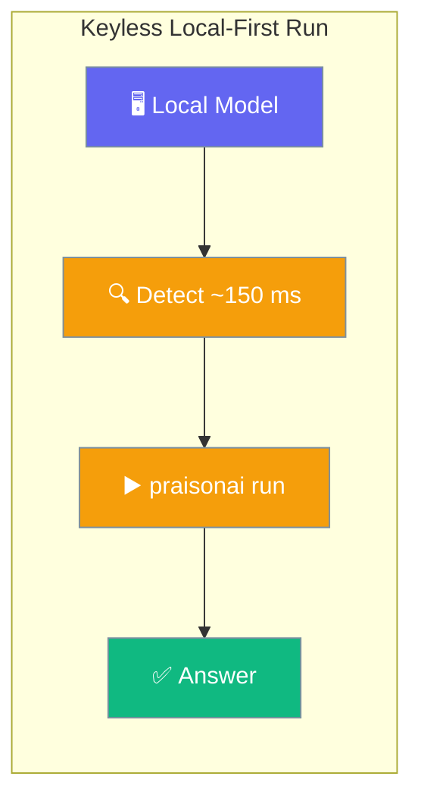
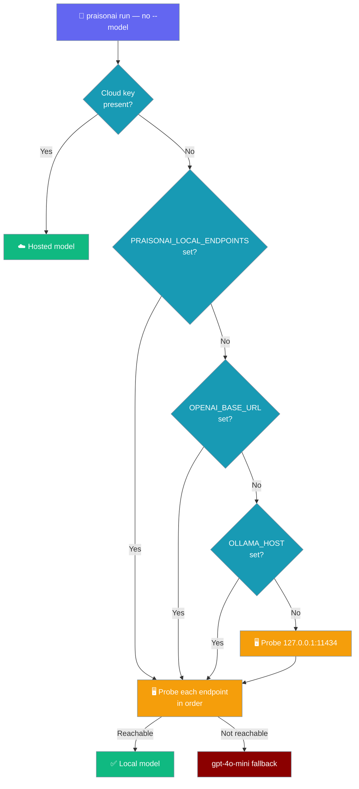

If Ollama (or any OpenAI-compatible local server) is running, `praisonai run "..."`, `praisonai code "..."`, and `praisonai chat "..."` all work with no API key and no setup — each routes its keyless local-first branch through the shared `ensure_configured_or_onboard()` helper.


```mermaid
graph LR
    subgraph "Keyless Local-First Run"
        Local[🖥️ Local Model] --> Detect[🔍 Detect ~150 ms]
        Detect --> Run[▶️ praisonai run]
        Run --> Answer[✅ Answer]
    end

    classDef input fill:#6366F1,stroke:#7C90A0,color:#fff
    classDef process fill:#F59E0B,stroke:#7C90A0,color:#fff
    classDef output fill:#10B981,stroke:#7C90A0,color:#fff

    class Local input
    class Detect,Run process
    class Answer output
```

Start a local model, run a prompt — no `OPENAI_API_KEY`, no `--model`, no `praisonai setup`. When no cloud key is configured but a local endpoint answers, PraisonAI adopts it as the zero-config default.

<Note>
On resume, a **recorded session model takes precedence** over this local-first fallback. A resumed cloud session is not switched to a reachable local endpoint. See [Session Model Restore](/features/session-model-restore).
</Note>

<Note>
**See also:** this page covers the **implicit** form — auto-detection fires only when no cloud key is set and no model is named. To request a local model **explicitly** from an `Agent` — with full engine discovery (Ollama, llama.cpp, LM Studio, vLLM, …) and a loud failure when a named server is missing — set `llm="local"`. See the [Local Model Resolver](/features/local-model-resolver).
</Note>

## Quick Start

<Steps>
<Step title="Start Ollama">
```bash
ollama serve
ollama pull llama3.2
```
</Step>

<Step title="Run a prompt — no key, no model flag">
```bash
praisonai run "Hello"
```

No `OPENAI_API_KEY`. No `--model`. No `praisonai setup`.
</Step>

<Step title="See the one-line notice">
PraisonAI prints a transparency notice to `stderr`, then answers:

```
No cloud key found; using local model ollama/llama3.2. Run `praisonai setup` to add a hosted provider.
```
</Step>
</Steps>

---

## How It Works

PraisonAI checks for a cloud provider key first. When none is present, it probes for a local endpoint before falling back to the terminal default. A cloud key always wins.


```mermaid
graph TB
    A[🚀 praisonai run — no --model] --> B{Cloud key<br/>present?}
    B -->|Yes| H[☁️ Hosted model]
    B -->|No| G{PRAISONAI_LOCAL_ENDPOINTS<br/>set?}
    G -->|Yes| P[🖥️ Probe each endpoint<br/>in order]
    G -->|No| C{OPENAI_BASE_URL<br/>set?}
    C -->|Yes| P
    C -->|No| D{OLLAMA_HOST<br/>set?}
    D -->|Yes| P
    D -->|No| E[🖥️ Probe 127.0.0.1:11434]
    E --> P
    P -->|Reachable| L[✅ Local model]
    P -->|Not reachable| F[gpt-4o-mini fallback]

    classDef start fill:#6366F1,stroke:#7C90A0,color:#fff
    classDef check fill:#189AB4,stroke:#7C90A0,color:#fff
    classDef local fill:#F59E0B,stroke:#7C90A0,color:#fff
    classDef good fill:#10B981,stroke:#7C90A0,color:#fff
    classDef fallback fill:#8B0000,stroke:#7C90A0,color:#fff

    class A start
    class B,C,D,G check
    class P,E local
    class H,L good
    class F fallback
```

### Detection precedence

The probe honours your environment in this exact order:

1. `PRAISONAI_LOCAL_ENDPOINTS` if set — a comma-separated list of candidate endpoints, tried left to right (see [Widened runtime probing](#widened-runtime-probing)).
2. else `OPENAI_BASE_URL` if set.
3. else `OLLAMA_HOST` if set (a bare `host:port` is accepted; a scheme is added if missing).
4. else `http://127.0.0.1:11434`.

At each host it tries Ollama's native `/api/tags` first — the first tag becomes `ollama/<name>`. If that fails, it tries the OpenAI-compatible `/v1/models` — the first id becomes `openai/<id>`. This second path detects llama.cpp, LM Studio, and vLLM.

### Timing and safety

| Property | Value |
|----------|-------|
| Total probe budget | ~150 ms — the credential hot path is never stalled when nothing is listening |
| Negative-cache | 30 s, keyed by endpoint so a mid-session env change is never served a stale result |
| Cloud precedence | A cloud key always wins; the local path only fires when no cloud credential is present |
| CI safety | Non-TTY, `--quiet`, and `--output json` still exit `1` with guidance when nothing is reachable |

---

## Environment Variables

Point detection at one or more endpoints with these variables.

| Variable | Example | Meaning |
|----------|---------|---------|
| `PRAISONAI_LOCAL_ENDPOINTS` | `http://localhost:11434,http://localhost:1234` | Comma-separated candidate endpoints, probed left to right. The first that answers wins. Takes precedence over the single-host variables below |
| `OPENAI_BASE_URL` | `http://localhost:1234` | Probe this OpenAI-compatible endpoint when `PRAISONAI_LOCAL_ENDPOINTS` is unset (llama.cpp, LM Studio, vLLM) |
| `OLLAMA_HOST` | `127.0.0.1:11434` | Probe this Ollama host when the two variables above are unset. A local host is **not** treated as a cloud key |

<Note>
`OLLAMA_HOST` is intentionally **not** a cloud credential — a running local host is not an API key, so it never suppresses local detection.
</Note>

### Widened runtime probing

`PRAISONAI_LOCAL_ENDPOINTS` lists every local server to try, so one setting covers a mixed setup — Ollama alongside llama.cpp, LM Studio, or vLLM on different ports.

```bash
export PRAISONAI_LOCAL_ENDPOINTS="http://localhost:11434,http://localhost:1234,http://localhost:8000"
praisonai run "Hello"
```

Endpoints are tried in order and the first reachable one wins. At each host the same two-step probe runs: Ollama's native `/api/tags` first (first tag → `ollama/<name>`), then the OpenAI-compatible `/v1/models` (first id → `openai/<id>`). The `~150 ms` budget applies per endpoint, so an unreachable host is skipped quickly.

<Tip>
Order the list by preference. Put the server you want first — detection stops at the first host that answers.
</Tip>

### Other local servers

llama.cpp, LM Studio, and vLLM expose an OpenAI-compatible `/v1/models` endpoint, so they are detected via the fallback probe. Point PraisonAI at the port your server uses:

```bash
export OPENAI_BASE_URL=http://localhost:1234
praisonai run "Hello"
```

The first model id the server reports becomes `openai/<id>`.

---

## Behaviour Matrix

Detection combines with your terminal mode as follows.

| Mode | Local reachable | Not reachable |
|------|-----------------|---------------|
| TTY (interactive) | Uses local model, prints the stderr notice, continues into the TUI | Suggests `praisonai setup`, then continues into the TUI |
| `praisonai run` | Adopts the detected model, sets `OPENAI_BASE_URL` via `setdefault` | Exits `1` with guidance |
| `praisonai code` | Adopts the detected model (no `--model`); one-line stderr notice | Headless (`-p` / piped): exits `1` with guidance; TTY: offers wizard |
| `praisonai chat` | Adopts the detected model (no `--model`); one-line stderr notice | Headless (`--json` / piped): exits `1` with guidance; TTY: offers wizard |
| `--quiet` | Uses local model | Exits `1` |
| `--output json` | Uses local model | Exits `1` |

All four entrypoints share the local-first branch inside `ensure_configured_or_onboard()` — see [First-run Onboarding → Shared onboarding helper](/features/first-run-onboarding#shared-onboarding-helper).

The non-TTY / `--quiet` / `--output json` error message is:

```
No API key configured. Run: praisonai setup
(a running local endpoint such as Ollama would be used automatically)
```

---

## Best Practices

<AccordionGroup>
<Accordion title="Add a hosted provider when you need one">
Local-first is zero-config, but `praisonai setup` is still the way to add a hosted provider (OpenAI, Anthropic, …). Once a cloud key is configured, it takes precedence over any running local server.
</Accordion>

<Accordion title="An explicit --model still overrides detection">
Passing `--model <name>` bypasses local detection and routes to that model's own provider gate. Use it to force a specific model regardless of what is running locally.
</Accordion>

<Accordion title="Force cloud despite a running local server">
To ignore a running local endpoint, either unset the local env vars or name a cloud model directly:

```bash
unset OPENAI_BASE_URL OLLAMA_HOST
# or
praisonai run --model gpt-4o "Hello"
```
</Accordion>

<Accordion title="Point at a non-default port">
For llama.cpp / LM Studio / vLLM on a custom port, export `OPENAI_BASE_URL` before running:

```bash
export OPENAI_BASE_URL=http://localhost:8000
praisonai run "Hello"
```
</Accordion>

<Accordion title="List several servers with PRAISONAI_LOCAL_ENDPOINTS">
When more than one local server may be running, list them all and let detection pick the first reachable one:

```bash
export PRAISONAI_LOCAL_ENDPOINTS="http://localhost:11434,http://localhost:1234"
praisonai run "Hello"
```

Put your preferred server first — probing stops at the first host that answers.
</Accordion>
</AccordionGroup>

---

## Related

<CardGroup cols={2}>
  <Card title="Local (Terminal) Channel" icon="terminal" href="/features/local-channel">
    The keyless companion for channels — chat from your terminal, token-free
  </Card>
  <Card title="First-run Onboarding" icon="key-round" href="/features/first-run-onboarding">
    How PraisonAI routes a keyless first run
  </Card>
  <Card title="Setup" icon="key" href="/cli/setup">
    Add a hosted provider credential
  </Card>
  <Card title="Run Command" icon="play" href="/cli/run">
    Run agents from files or prompts
  </Card>
  <Card title="Ollama" icon="dragon" href="/mcp/ollama">
    Use Ollama models with PraisonAI
  </Card>
  <Card title="Local Model Resolver" icon="server" href="/features/local-model-resolver">
    The explicit form — `llm="local"` on an Agent
  </Card>
</CardGroup>
