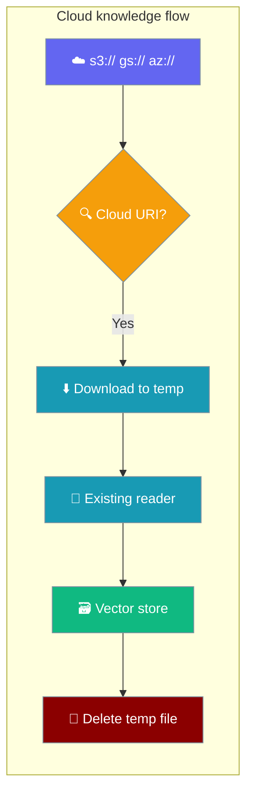
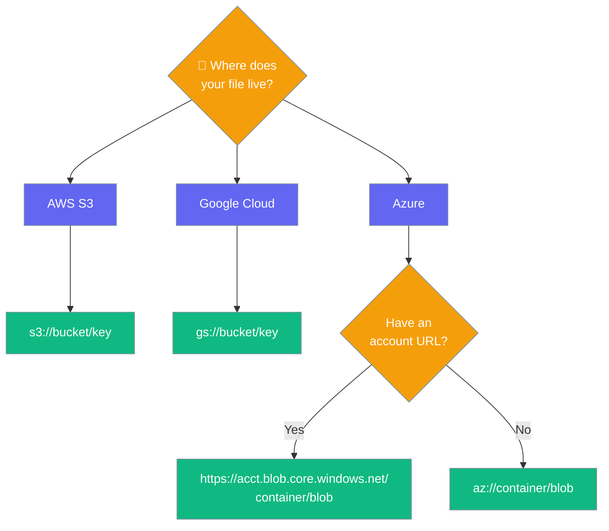
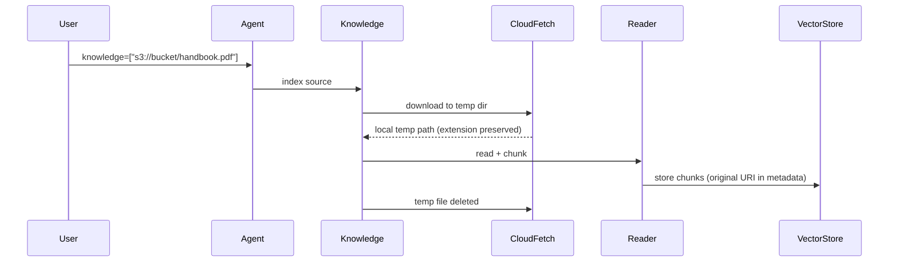

Pass a cloud object storage URI as a knowledge source and PraisonAI downloads and indexes it automatically.

```python
from praisonaiagents import Agent

agent = Agent(
    name="Handbook Assistant",
    instructions="Answer questions using the handbook.",
    knowledge=["s3://my-bucket/handbook.pdf"],
)
agent.start("What's the leave policy?")
```



## Quick Start

<Steps>

<Step title="AWS S3">

Install `boto3` and pass an `s3://` URI.

```bash
pip install boto3
```

```python
from praisonaiagents import Agent

agent = Agent(
    name="Handbook Assistant",
    instructions="Answer from the handbook.",
    knowledge=["s3://my-bucket/handbook.pdf"],
)
agent.start("What's the leave policy?")
```

</Step>

<Step title="Google Cloud Storage">

Install `google-cloud-storage` and pass a `gs://` URI (`gcs://` also works).

```bash
pip install google-cloud-storage
```

```python
from praisonaiagents import Agent

agent = Agent(
    name="Reports Assistant",
    instructions="Answer from the quarterly report.",
    knowledge=["gs://reports/q4.pdf"],
)
agent.start("Summarise Q4 revenue.")
```

</Step>

<Step title="Azure Blob">

Install `azure-storage-blob` and pass an `az://container/blob` URI or an Azure Blob HTTPS URL.

```bash
pip install azure-storage-blob
```

```python
from praisonaiagents import Agent

agent = Agent(
    name="Policy Assistant",
    instructions="Answer from the policy document.",
    knowledge=["https://acct.blob.core.windows.net/docs/policy.pdf"],
)
agent.start("What's the refund window?")
```

</Step>

</Steps>

---

## Choose Your Provider

Match where your file lives to the right URI form.



---

## Install the Right SDK

Each SDK is imported only when a URI of that scheme is used — installing PraisonAI does not pull in all three.

<Tabs>
<Tab title="AWS S3">
```bash
pip install boto3                    # for s3://
```
</Tab>
<Tab title="Google Cloud">
```bash
pip install google-cloud-storage     # for gs:// or gcs://
```
</Tab>
<Tab title="Azure Blob">
```bash
pip install azure-storage-blob       # for az:// or Azure blob URLs
pip install azure-identity           # optional, for Azure managed identity
```
</Tab>
</Tabs>

A missing SDK raises `CloudSourceError` with the exact `pip install …` command to run.

---

## Credentials

Each provider uses its SDK's standard credential discovery — no extra PraisonAI config.

<AccordionGroup>
  <Accordion title="AWS S3 (boto3)">
    Set `AWS_ACCESS_KEY_ID` and `AWS_SECRET_ACCESS_KEY` (plus optional `AWS_SESSION_TOKEN`), or use `~/.aws/credentials`, or an IAM role attached to your EC2 / ECS / Lambda environment.

    ```bash
    export AWS_ACCESS_KEY_ID=AKIA...
    export AWS_SECRET_ACCESS_KEY=...
    ```
  </Accordion>
  <Accordion title="Google Cloud Storage (google-cloud-storage)">
    Point `GOOGLE_APPLICATION_CREDENTIALS` at a service-account JSON file, run `gcloud auth application-default login`, or use a workload-identity-attached environment.

    ```bash
    export GOOGLE_APPLICATION_CREDENTIALS=/path/to/service-account.json
    ```
  </Accordion>
  <Accordion title="Azure Blob (azure-storage-blob)">
    Set `AZURE_STORAGE_CONNECTION_STRING`. For an HTTPS Azure blob URL, `DefaultAzureCredential` (from optional `azure-identity`) is tried when the connection string is missing or names a different account.

    ```bash
    export AZURE_STORAGE_CONNECTION_STRING="DefaultEndpointsProtocol=https;AccountName=..."
    ```
  </Accordion>
</AccordionGroup>

---

## URI Forms

| Provider | URI form | Notes |
|---|---|---|
| AWS S3 | `s3://bucket/key` | Keys are percent-decoded |
| Google Cloud Storage | `gs://bucket/key` (or `gcs://…`) | |
| Azure Blob (short) | `az://container/blob` (or `abfs://…`) | Account from `AZURE_STORAGE_CONNECTION_STRING` |
| Azure Blob (URL) | `https://<account>.blob.core.windows.net/<container>/<blob>` | Account bound to URL; wins over env |

---

## How It Works

A cloud URI is resolved to a local temp file, read by the same reader used for local files, then the temp file is removed.



| Step | What happens |
|---|---|
| 1. Resolve | The cloud URI is parsed into provider, container, and key. |
| 2. Fetch | The object is downloaded into a `TemporaryDirectory`, keeping its extension. |
| 3. Reuse readers | The existing PDF/DOCX/text reader indexes the temp file — no per-provider parsing. |
| 4. Clean up | The temp file is deleted after indexing, so nothing accumulates on disk. |

Design notes worth knowing:

- **Extension is preserved.** Readers dispatch on file extension — a PDF kept as `.pdf` is parsed correctly rather than read as plain text.
- **Ordering matters.** The cloud branch runs **before** the `http(s)://` branch, so an Azure blob HTTPS URL is downloaded, not handed to the web fetcher.
- **SDKs stay optional.** Each cloud SDK is imported only when its scheme is used.
- **Temp file removed after indexing.** The download lives in a `TemporaryDirectory` and is cleaned up automatically.
- **Original URI kept in metadata.** Citations reference the `s3://…` / `gs://…` URI, not the meaningless temp path.
- **Azure account is bound to the URL.** A URL for account A is never served from configured account B — the account named in the URL wins.

---

## Mix Cloud and Local Sources

Cloud URIs, local files, and raw text can share one list.

```python
from praisonaiagents import Agent

agent = Agent(
    name="Research Assistant",
    instructions="Answer from the handbook and local notes.",
    knowledge=[
        "s3://my-bucket/handbook.pdf",
        "gs://reports/q4.pdf",
        "https://acct.blob.core.windows.net/docs/policy.pdf",
        "notes.md",
        "Key fact: launch is in March.",
    ],
)
agent.start("When is the launch?")
```

---

## Error Reference

`CloudSourceError` reports the failure instead of silently indexing an empty document.

| Error message contains | Meaning | Fix |
|---|---|---|
| `pip install boto3` (or the GCS / Azure package) | The SDK for that scheme isn't installed | Run the exact `pip install` from the error |
| `Not a supported cloud source` | The scheme isn't `s3`/`gs`/`gcs`/`az`/`abfs` and it isn't an Azure blob URL | Check the URI; supported schemes are listed above |
| `must include a container and a blob name` (Azure) | Azure blob URL missing `/container/blob` path | Add both parts to the URL |
| `container and an object` | URI names a bucket but no object key | Add the object key |
| `AZURE_STORAGE_CONNECTION_STRING in the environment` | `az://` form used without env var | Set the env var, or use the account-bearing HTTPS URL form |
| `Fetch reported success but wrote no file` | Silent no-op download (rare SDK bug or wrong path) | Verify the object exists and the credentials have `GetObject` |
| `Could not fetch … AccessDenied` (or similar provider error) | Provider rejected the download | Check credentials and the object's ACL |

---

## Best Practices

<AccordionGroup>
  <Accordion title="Install only the SDK you need">
    Each SDK is imported lazily. Install just `boto3`, `google-cloud-storage`, or `azure-storage-blob` for the provider you use — don't bloat your app with all three.
  </Accordion>
  <Accordion title="Prefer IAM roles over long-lived keys">
    In production, attach a bucket-scoped IAM role (or workload identity) instead of exporting long-lived access keys.
  </Accordion>
  <Accordion title="Pin the Azure account with the HTTPS URL form">
    When multiple Azure accounts are in play, use the `https://<account>.blob.core.windows.net/...` form — the account in the URL wins over `AZURE_STORAGE_CONNECTION_STRING`.
  </Accordion>
  <Accordion title="Index once into a persistent store">
    Cloud downloads happen on every index. Cache expensive parses by indexing into a persistent vector store once, not on every process start.
  </Accordion>
  <Accordion title="Cite the original URI, not the temp path">
    The original cloud URI is preserved in metadata. Use it as your citation source — the temp path is deleted after indexing.
  </Accordion>
</AccordionGroup>

---

## Related

<CardGroup cols={2}>
  <Card title="Knowledge Base" icon="book" href="/features/knowledge">
    Chunking, embedding, and search options.
  </Card>
  <Card title="Knowledge Source Types" icon="book-open" href="/features/knowledge-source-types">
    What `Agent(knowledge=...)` accepts today.
  </Card>
</CardGroup>
