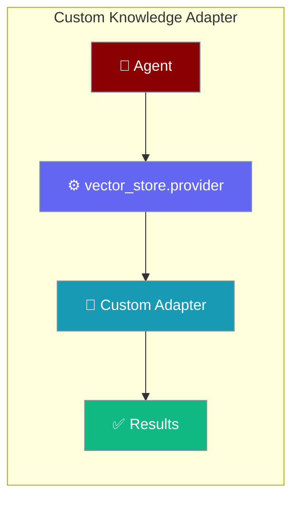
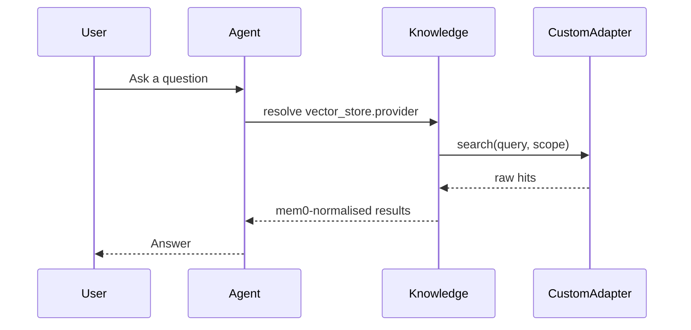
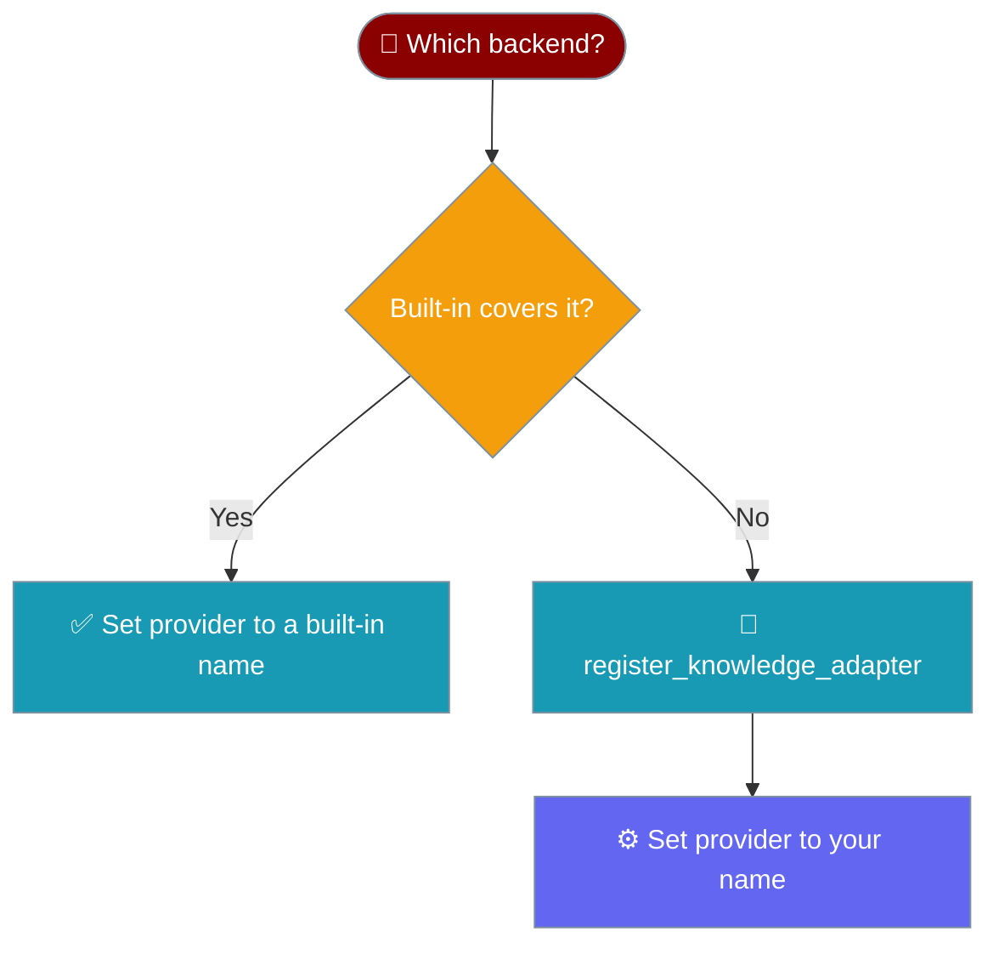

Register a custom knowledge backend under any provider name, then use it from an Agent through `vector_store.provider`.



## Quick Start

<Steps>
<Step title="Register and use a custom backend">
Register your adapter class, then point an Agent's Knowledge at it.

```python
from praisonaiagents import Agent, Knowledge
from praisonaiagents.knowledge.adapters import register_knowledge_adapter

class QdrantKnowledgeAdapter:
    def __init__(self, config=None, verbose=0):
        self.config = config
    def store(self, *args, **kwargs): ...
    def search(self, *args, **kwargs): return []
    def delete(self, *args, **kwargs): ...

register_knowledge_adapter("qdrant", QdrantKnowledgeAdapter)

agent = Agent(
    name="Researcher",
    instructions="Answer using the knowledge base.",
    knowledge=Knowledge(config={"vector_store": {"provider": "qdrant"}}),
)

agent.start("What did we learn about solar output in 2024?")
```
</Step>

<Step title="Lazy-load heavy backends with a factory">
Use a factory when the backend imports heavy dependencies you want to defer.

```python
from praisonaiagents.knowledge.adapters import register_knowledge_factory

def make_qdrant_adapter(config=None, verbose=0):
    from my_backends.qdrant import QdrantKnowledgeAdapter
    return QdrantKnowledgeAdapter(config=config, verbose=verbose)

register_knowledge_factory("qdrant", make_qdrant_adapter)
```
</Step>
</Steps>

---

## How It Works

The Agent reads `vector_store.provider`, looks it up in the registry, and calls your adapter — mem0-normalised results flow back to the user.



Pick the right path — a built-in adapter or a custom one.



---

## Protocol Contract

Your adapter implements `KnowledgeStoreProtocol`. The minimum method set is `store`, `search`, and `delete`, each accepting the scope kwargs `user_id`, `agent_id`, and `run_id`.

```python
from praisonaiagents import KnowledgeStoreProtocol

class QdrantKnowledgeAdapter:
    def __init__(self, config=None, verbose=0):
        self.config = config

    def store(self, content, *, user_id=None, agent_id=None, run_id=None, **kwargs):
        ...

    def search(self, query, *, user_id=None, agent_id=None, run_id=None, **kwargs):
        return []

    def delete(self, *, user_id=None, agent_id=None, run_id=None, **kwargs):
        ...
```

No base-class inheritance is required — any class matching the protocol works.

---

## Registration APIs

Four public functions in `praisonaiagents.knowledge.adapters` manage the registry.

| Function | Purpose |
|----------|---------|
| `register_knowledge_adapter(name, adapter_class)` | Register an adapter class (constructor called with `config=`, `verbose=`). Aliased as `add_knowledge_adapter`. |
| `register_knowledge_factory(name, factory_func)` | Register a factory for heavy/lazy-loaded backends. Aliased as `add_knowledge_factory`. |
| `has_knowledge_adapter(name)` | Check registration (aliased `is_available`). |
| `list_knowledge_adapters()` | List all registered names. |

```python
from praisonaiagents.knowledge.adapters import (
    has_knowledge_adapter,
    list_knowledge_adapters,
)

print(list_knowledge_adapters())      # ['chroma', 'mem0', 'mongodb', 'sqlite', ...]
print(has_knowledge_adapter("qdrant")) # True after registration
```

---

## When Registration Must Run

Register **before** the first `Agent(...)` or `Knowledge(...)` call reads `.memory`. Import-time registration is fine; deferred registration must beat the `cached_property` that resolves the adapter.

```python
from praisonaiagents.knowledge.adapters import register_knowledge_adapter

register_knowledge_adapter("qdrant", QdrantKnowledgeAdapter)  # first

agent = Agent(knowledge=Knowledge(config={"vector_store": {"provider": "qdrant"}}))
agent.start("...")  # resolves the adapter here
```

<Warning>
An explicit provider that isn't registered raises `ValueError` listing the valid names. Register the adapter first, or the Agent fails fast instead of silently degrading to Mem0.
</Warning>

---

## Best Practices

<AccordionGroup>
<Accordion title="Register at import time">
Put `register_knowledge_adapter(...)` at module top level so it runs before any Agent resolves its knowledge backend.
</Accordion>

<Accordion title="Use a factory for heavy dependencies">
When the backend imports heavy libraries, register a factory so the import defers until the adapter is actually needed.
</Accordion>

<Accordion title="Accept the scope kwargs">
Always accept `user_id`, `agent_id`, and `run_id` in `store`, `search`, and `delete` — the Agent passes them for multi-tenant isolation.
</Accordion>

<Accordion title="Verify with has_knowledge_adapter before use">
Call `has_knowledge_adapter("your_name")` in tests to confirm registration ran before the first Agent call.
</Accordion>
</AccordionGroup>

---

## Related

<CardGroup cols={2}>
  <Card title="Knowledge Backends" icon="database" href="/features/knowledge-backends">
    Built-in providers and the supported-provider table
  </Card>
  <Card title="Vector Store" icon="database" href="/features/vector-store">
    Store and query embeddings with a pluggable backend
  </Card>
</CardGroup>
