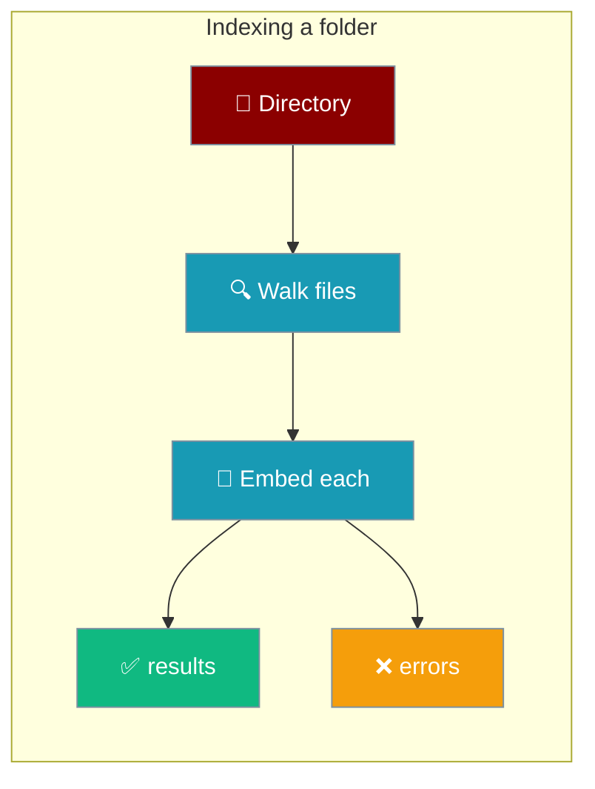
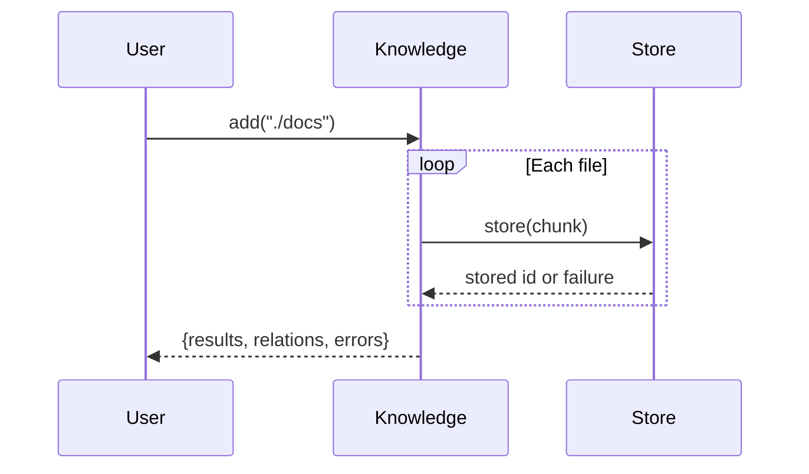

When you index a folder into a knowledge base, `Knowledge.add()` tells you which files failed so an outage in your embedding backend never looks like a successful import.



## Quick Start

<Steps>
<Step title="Simple usage">
Point an agent at a folder and ask a question — indexing happens for you.

```python
from praisonaiagents import Agent

agent = Agent(
    name="Docs Agent",
    instructions="Answer from the docs folder.",
    knowledge=["./docs"],
)

agent.start("What does the knowledge base cover?")
```
</Step>

<Step title="Check indexing succeeded">
Call `add()` directly and inspect `result["errors"]` to see which files failed.

```python
from praisonaiagents.knowledge import Knowledge

k = Knowledge()
result = k.add("./docs")

if result["errors"]:
    for e in result["errors"]:
        print(f"failed: {e['file']} — {e['error']}")
else:
    print(f"indexed {len(result['results'])} chunk(s)")
```
</Step>
</Steps>

---

## How It Works

`Knowledge.add()` walks the directory, embeds each file, and returns the successes and failures together.



A failed file is recorded instead of dropped, so a directory whose every file fails to embed no longer returns an empty-but-successful result.

---

## Return shape

`add()` always returns these three keys — `errors` is present even on success (as an empty list).

| Key | Type | Description |
|------|------|-------------|
| `results` | `list` | Successfully stored chunk records (unchanged) |
| `relations` | `list` | Graph relations, when a graph store is configured (unchanged) |
| `errors` | `list[dict]` | `{'file': str, 'error': str}` entries, one per file that failed to index |

```python
{
    'results': [...],
    'relations': [],
    'errors': [
        {'file': '/abs/path/a.md',
         'error': 'Failed to generate embedding (model=text-embedding-3-small)'},
    ],
}
```

`add([...])` aggregates errors from every input path, so one bad directory never hides errors from another.

---

## Failure modes

<AccordionGroup>
<Accordion title="All files failed">
Every entry lands in `errors` and `results` is empty. The log line names the first cause. Common causes: a wrong embedding model name, a revoked API key, or an exhausted quota.
</Accordion>

<Accordion title="Partial failure">
`results` holds the chunks that succeeded and `errors` names only the ones that failed. The import is not rolled back.
</Accordion>

<Accordion title="Single-file add() where every chunk failed">
The single-file path raises instead of returning silently:

```
RuntimeError: Stored nothing from {path}: all {n} chunk(s) failed (embedding/vector-store backend). See earlier logs.
```

Wrap the call in `try` / `except RuntimeError` if the caller wants to keep going.
</Accordion>

<Accordion title="List input">
`add([path1, path2, ...])` aggregates errors from every input path into one `errors` list.
</Accordion>
</AccordionGroup>

---

## User interaction flow

Bulk-import a docs folder before deployment, then gate the deploy on the result.

```python
from praisonaiagents.knowledge import Knowledge

k = Knowledge()
result = k.add("./docs")

assert not result["errors"], f"{len(result['errors'])} file(s) failed to index"
print(f"indexed {len(result['results'])} chunk(s)")
```

Run this in CI so a broken embedding backend fails the deploy instead of shipping an empty knowledge base.

---

## Common Patterns

Fail fast in CI:

```python
from praisonaiagents.knowledge import Knowledge

k = Knowledge()
result = k.add("./docs")
assert not result["errors"]
```

Report and continue — keep what succeeded, log what didn't:

```python
from praisonaiagents.knowledge import Knowledge

k = Knowledge()
result = k.add("./docs")
for e in result["errors"]:
    print(f"skipped: {e['file']} — {e['error']}")
```

Retry only the failed files:

```python
from praisonaiagents.knowledge import Knowledge

k = Knowledge()
result = k.add("./docs")
for e in result["errors"]:
    k.add(e["file"])
```

---

## Best Practices

<AccordionGroup>
<Accordion title="Always inspect result['errors'] after a bulk import">
A non-empty `errors` list is the only reliable signal that a file was skipped. Check it every time you index a folder.
</Accordion>

<Accordion title="Treat a non-empty errors list as an outage signal">
Failures usually mean the embedding backend is down — a wrong model name, a revoked key, or an exhausted quota. Alert on it rather than logging it as a warning.
</Accordion>

<Accordion title="Catch RuntimeError for single-file calls">
The `errors` list is populated on the directory and list paths. A single-file `add()` where every chunk fails raises `RuntimeError`, so wrap it in `try` / `except` if you need to continue.
</Accordion>

<Accordion title="Trust errors whether the backend raised or returned empty">
`errors` is populated whether the store raised an exception or returned an empty result — embedding backends do both, and both are captured.
</Accordion>
</AccordionGroup>

---

## Related

<CardGroup cols={2}>
<Card title="Knowledge" icon="book" href="/concepts/knowledge">
Core knowledge concepts and how agents use a knowledge base.
</Card>
<Card title="Knowledge Storage" icon="database" href="/features/knowledge-storage">
Where knowledge persists and how to change the location.
</Card>
<Card title="Knowledge Backends" icon="server" href="/features/knowledge-backends">
Choose and configure the vector store behind your knowledge base.
</Card>
<Card title="Incremental Indexing" icon="arrows-rotate" href="/features/incremental-indexing">
Re-index only the files that changed.
</Card>
</CardGroup>
