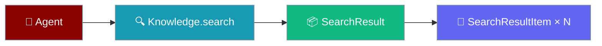
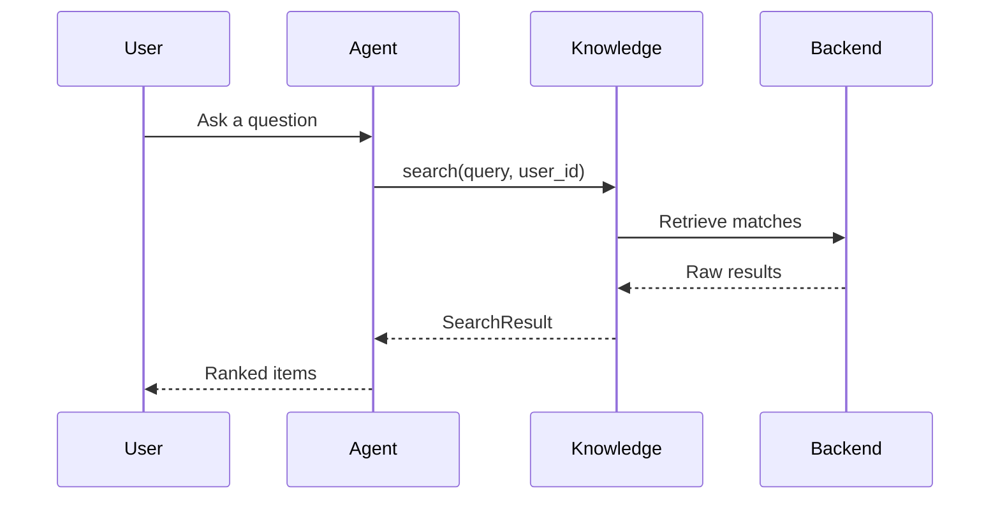

Knowledge search returns a typed result you can loop over and score.



## Quick Start

<Steps>
<Step title="Loop over results">
Call `knowledge.search()` and iterate the `results` list.

```python
from praisonaiagents import Agent
from praisonaiagents.knowledge import Knowledge

knowledge = Knowledge()
knowledge.store("Paris is the capital of France.")

results = knowledge.search("capital of France", user_id="alice")

for item in results.results:
    print(f"[{item.score:.2f}] {item.text}  ({item.source or '-'})")
```
</Step>

<Step title="Convert to a plain dict">
Use `to_legacy_format()` or `to_dict()` when you need raw data.

```python
results = knowledge.search("capital of France", user_id="alice")

legacy = results.to_legacy_format()   # {"results": [{"memory": ..., "text": ...}, ...]}
plain = results.to_dict()             # {"results": [...], "metadata": {}, "query": ..., "total_count": N}
```
</Step>
</Steps>

---

## How It Works

`Knowledge.search()` normalises every backend into one typed `SearchResult`.



---

## The `SearchResult` shape

The container holds the ranked items plus search-level metadata.

| Field | Type | Description |
|-------|------|-------------|
| `results` | `list[SearchResultItem]` | Ranked items |
| `metadata` | `dict` | Search-level metadata (always dict, never None) |
| `query` | `str` | Original query string |
| `total_count` | `int \| None` | Total available (may exceed `len(results)` if paginated) |

---

## The `SearchResultItem` shape

Each item carries the content, its score, and optional source hints.

| Field | Type | Description |
|-------|------|-------------|
| `id` | `str` | Backend identifier |
| `text` | `str` | Content (normalised from `memory` / `text` / `metadata.data`) |
| `score` | `float` | Relevance score (`0.0` default) |
| `metadata` | `dict` | Item metadata (always dict, never None) |
| `source` | `str \| None` | Optional source hint |
| `filename` | `str \| None` | Optional filename |
| `created_at` | `str \| None` | Timestamp |
| `updated_at` | `str \| None` | Timestamp |

---

## Common Patterns

### Show top-N with scores

```python
results = knowledge.search("machine learning", user_id="alice")

for rank, item in enumerate(results.results, start=1):
    print(f"{rank}. [{item.score:.2f}] {item.text}")
```

### Convert to legacy dict format

```python
results = knowledge.search("machine learning", user_id="alice")

legacy = results.to_legacy_format()
for row in legacy["results"]:
    print(row["memory"])  # legacy consumers expect the "memory" key
```

### Handle any backend shape

Custom backends can return a typed `SearchResult`, a legacy dict, or a plain list. Normalise them with one call.

```python
from praisonaiagents.knowledge.models import normalize_search_result

raw = my_custom_backend.query("machine learning")   # dict, list, or SearchResult
results = normalize_search_result(raw)               # always a SearchResult

for item in results.results:
    print(item.text)
```

---

## Best Practices

<AccordionGroup>
<Accordion title="Check .results, not the object">
An empty `SearchResult` is still a dataclass instance, so it is always truthy.

```python
# ❌ Wrong — SearchResult is a dataclass, always truthy
if not results:
    print("No results")

# ✅ Right — check .results (or .total_count)
if not results.results:
    print("No results")
```
</Accordion>

<Accordion title="Trust metadata is a dict">
`metadata` is never `None` on `SearchResult` or `SearchResultItem` — it defaults to an empty dict, so you never need to guard against `None`.

```python
for item in results.results:
    page = item.metadata.get("page")  # safe, metadata is always a dict
```
</Accordion>

<Accordion title="Use to_legacy_format() for dict consumers">
Older code that expects mem0-shaped `{"results": [...]}` dicts stays compatible.

```python
legacy = results.to_legacy_format()
send_to_older_pipeline(legacy)
```
</Accordion>

<Accordion title="Prefer typed access over dict access">
Typed attributes are clearer and safer than dict lookups.

```python
# ✅ Preferred
print(item.text)

# ❌ Avoid
print(item.get("memory"))
```
</Accordion>
</AccordionGroup>

---

## Related

<CardGroup cols={2}>
  <Card title="Knowledge Overview" icon="book-open" href="/docs/knowledge/overview">
    Give agents access to your documents
  </Card>
  <Card title="Knowledge CLI" icon="terminal" href="/docs/cli/knowledge-cli">
    Search from the command line
  </Card>
</CardGroup>
