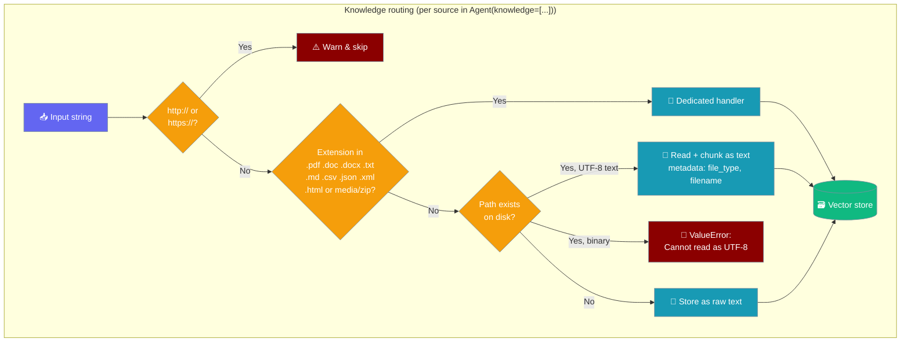

`Agent(knowledge=...)` accepts local file paths (any UTF-8 text file) and plain text — URLs are not ingested and are skipped with a warning.

```python
from praisonaiagents import Agent

agent = Agent(
    name="Reader",
    instructions="Answer from the provided notes.",
    knowledge=["notes.pdf", "Key fact: launch is in March."],
)
agent.start("When is the launch?")
```



## What Each Source Does

`_process_knowledge` inspects every item and routes it by type.

| Source | Example | Behaviour |
|--------|---------|-----------|
| Known-extension file | `"notes.pdf"` | Dedicated handler (`.pdf .doc .docx .txt .md .csv .json .xml .html`, media, `.zip`) — read and indexed |
| Other existing file | `"src/auth.py"`, `"Dockerfile"` | Read as UTF-8 and chunked — metadata records `file_type` and `filename`. Since PraisonAI PR [#4788](https://github.com/MervinPraison/PraisonAI/pull/4788). |
| Plain string (not a path) | `"Key fact: ..."` | `Knowledge.store(text)` — stored as text |
| URL | `"https://example.com"` | **Warns and skips** — not ingested |

<Note>
Empty files raise `ValueError("Empty text file")` and binary / non-UTF-8 files raise `ValueError("Cannot read <path> as UTF-8 text: ...")` instead of being silently indexed. Since PraisonAI PR [#4788](https://github.com/MervinPraison/PraisonAI/pull/4788).
</Note>

## Indexing Source and Text Together

Mix source files, documents, suffix-less files, and raw strings in one list.

```python
from praisonaiagents import Agent

agent = Agent(
    name="Codebase Assistant",
    instructions="Answer from the indexed files.",
    knowledge=[
        "src/auth.py",                  # source file: read as UTF-8
        "docs/architecture.md",         # markdown: dedicated handler
        "Dockerfile",                   # suffix-less: read as UTF-8
        "Key fact: launch is in March", # raw string: stored as text
    ],
)
agent.start("Summarise how auth is set up.")
```

<Warning>
`Agent(knowledge=["https://..."])` does not fetch the URL. It logs:

```
Knowledge source 'https://example.com...' is a URL; URL knowledge ingestion is not yet implemented in the core SDK. This source will be skipped. Fetch and pass the content as text, or a local file path, instead.
```

Only the scheme and host are logged — credentials and query strings are redacted.
</Warning>

## Fetch, Then Pass Text

Fetch the page yourself and pass the text as a knowledge source.

```python
import requests
from praisonaiagents import Agent

text = requests.get("https://example.com/article").text
agent = Agent(name="Reader", instructions="Summarise the article.", knowledge=[text])
agent.start("Summarise it.")
```

<Note>
`Knowledge.add(url)` used directly also does not fetch URLs — it raises `NotImplementedError("URL processing not yet implemented")`. Use the fetch-then-text recipe above for both the `Agent` and direct-`Knowledge` paths.
</Note>

## Best Practices

<AccordionGroup>
  <Accordion title="Convert web content to text before ingesting">
    Fetch pages with `requests`, `httpx`, or a scraper, then pass the extracted text as a knowledge string.
  </Accordion>
  <Accordion title="Prefer local files for documents">
    Save PDFs and docs locally and pass the path — `Knowledge.add(path)` reads and chunks them for you.
  </Accordion>
  <Accordion title="Check logs if a source seems missing">
    A skipped URL logs a warning; if answers lack a source you expected, confirm it was a file or text, not a URL.
  </Accordion>
</AccordionGroup>

## Related

<CardGroup cols={2}>
  <Card icon="book-open" href="/knowledge/features" title="Knowledge Base">
    Chunking, embedding, and search options.
  </Card>
  <Card icon="magnifying-glass" href="/features/rag" title="RAG">
    Retrieval-augmented generation patterns.
  </Card>
</CardGroup>
