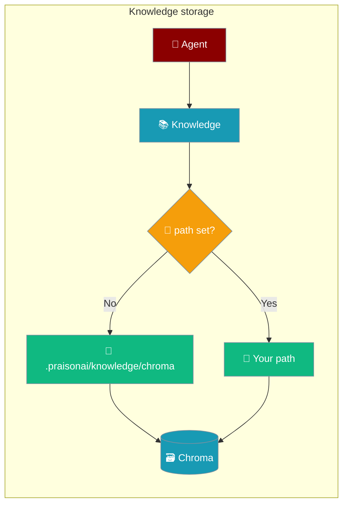

Knowledge persists to an absolute, per-project Chroma store so unrelated projects never share one on-disk database.



## Quick Start

<Steps>
<Step title="Use the default location">
Pass sources and let the store persist under the per-project default.

```python
from praisonaiagents import Agent

agent = Agent(
    name="Research Assistant",
    knowledge=["docs/"]
)

agent.start("Summarize the docs")
```

Data lands at `<project>/.praisonai/knowledge/chroma`.
</Step>

<Step title="Choose your own location">
Set `vector_store.config.path` to store data anywhere you like.

```python
from praisonaiagents import Agent

agent = Agent(
    name="Research Assistant",
    knowledge={
        "sources": ["docs/"],
        "vector_store": {
            "config": {"path": "/data/my_project/chroma"}
        }
    }
)

agent.start("Summarize the docs")
```
</Step>
</Steps>

---

## Where Is My Data Stored?

Omit `path` and Knowledge persists to an absolute directory derived from your project root.

| Setting | Location |
|---------|----------|
| Default (no `path`) | `<project>/.praisonai/knowledge/chroma` |
| Explicit `path` | Exactly the directory you provide |

The default is **absolute** and **per-project**, so two projects — or a test harness that changes directories — never write to the same sqlite file.

<Note>
Earlier releases defaulted to the cwd-relative string `"knowledge_db"`, which let unrelated projects collide. Upgrade to the release built from PraisonAI PR [#4422](https://github.com/MervinPraison/PraisonAI/pull/4422) for the isolated default.
</Note>

---

## How to Change It

Point `path` at any directory via the Agent config or a standalone `Knowledge` instance.

```python
from praisonaiagents import Knowledge

kb = Knowledge(config={
    "vector_store": {
        "config": {"path": "/data/shared/chroma"}
    }
})

kb.add("research.pdf")
```

An explicitly configured `path` always wins over the default.

---

## What If the Store Is Corrupt?

A corrupt, locked, or version-mismatched Chroma store now raises a `RuntimeError` instead of crashing the interpreter.

```
RuntimeError: Chroma persist failed at '<path>' (PanicException: <text>).
Pass a fresh directory via knowledge config vector_store.config.path.
```

ChromaDB's rust bindings can raise a `PanicException` (a `BaseException`, not `Exception`) that previously unwound through `Agent.start` and killed Python — on Windows this showed up as a SIGSEGV or hang ([issue #4376](https://github.com/MervinPraison/PraisonAI/issues/4376)). The SDK now catches it and re-raises an actionable Python error, while `KeyboardInterrupt` still propagates so Ctrl-C keeps working.

Directory indexing behaves the same: a backend panic on one file surfaces as `RuntimeError: Knowledge indexing backend crashed on <file>` rather than terminating the process.

**Recovery:** delete the persist directory and re-index, or point `path` at a fresh directory.

```python
import shutil
from praisonaiagents import Agent

shutil.rmtree(".praisonai/knowledge/chroma", ignore_errors=True)

agent = Agent(name="Research Assistant", knowledge=["docs/"])
agent.start("Re-index and answer")
```

---

## Configuration Options

Chroma persistence is controlled by a single option under `vector_store.config`.

| Option | Type | Default | Description |
|--------|------|---------|-------------|
| `path` | `str` | `<project>/.praisonai/knowledge/chroma` (absolute, per project) | Directory where the Chroma sqlite store is persisted. Optional — omit to use the per-project default. |

---

## Best Practices

<AccordionGroup>
<Accordion title="Omit path for local development">
Leave `path` unset and rely on the per-project default. Each project keeps its own isolated store with zero configuration.
</Accordion>

<Accordion title="Set an explicit path for shared or deployed stores">
Point `path` at a stable, absolute directory when multiple services must read the same knowledge base, or when deploying where the working directory changes.
</Accordion>

<Accordion title="Recover instead of retrying on a panic">
A `RuntimeError: Chroma persist failed ...` means the store is corrupt or locked. Delete the directory or switch to a fresh `path` — re-running against the same broken store repeats the failure.
</Accordion>

<Accordion title="Isolate per environment">
Use distinct paths for development, test, and production so an experiment never corrupts a shared index.
</Accordion>
</AccordionGroup>

---

## Related

<CardGroup cols={2}>
  <Card title="Knowledge" icon="book" href="/features/knowledge">
    Add documents and query them from an agent
  </Card>
  <Card title="Knowledge Backends" icon="database" href="/features/knowledge-backends">
    Pick and configure a vector store
  </Card>
</CardGroup>
