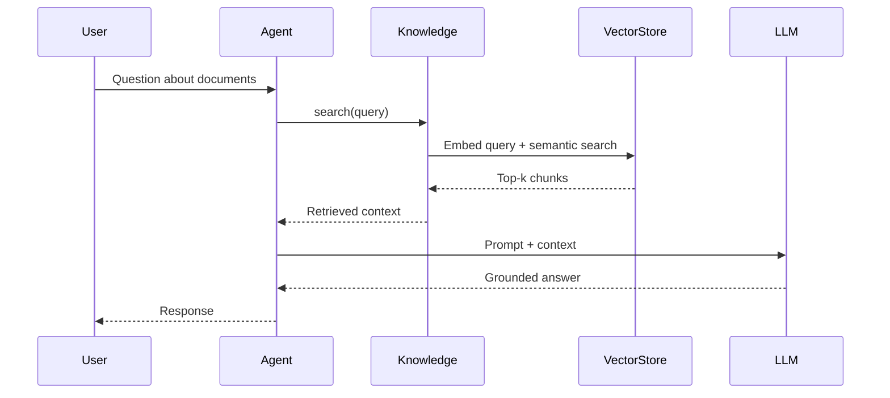
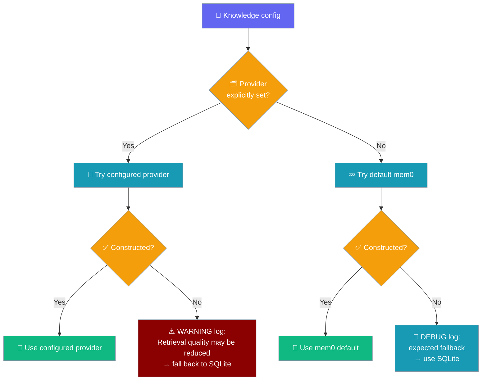
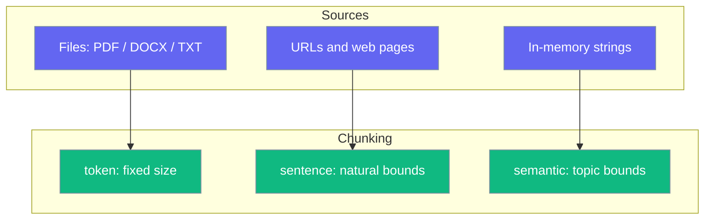
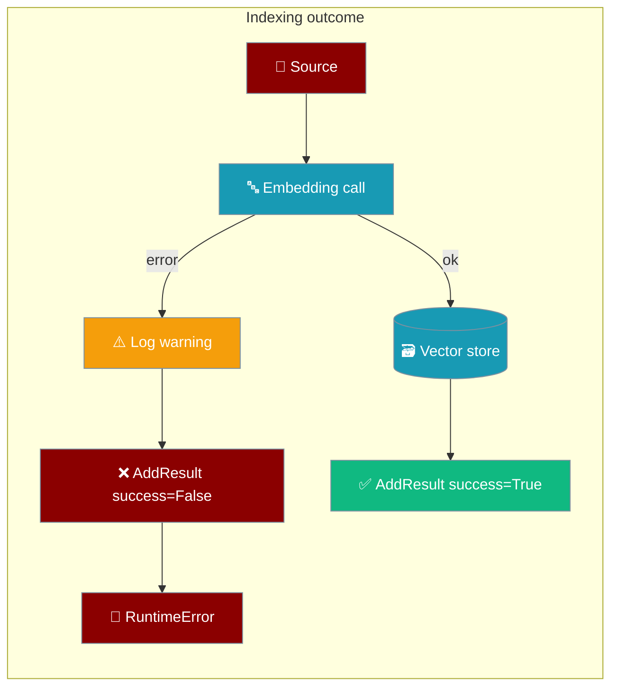

The knowledge system lets agents retrieve relevant information from PDFs, documents, and URLs before answering, grounding responses in your own sources.

```python
from praisonaiagents import Agent

agent = Agent(
    name="Research Assistant",
    instructions="Answer questions using the knowledge base.",
    knowledge=["research_paper.pdf", "data.txt"],
)

agent.start("What are the key findings?")
```

The user asks about their documents; the agent embeds, searches, and answers from your PDFs and URLs.


```mermaid
graph LR
    Sources[📄 Sources] --> Chunk[✂️ Chunk + Embed]
    Chunk --> Store[(🗃️ Vector Store)]
    Store --> Answer[✅ Grounded Answer]

    classDef input fill:#8B0000,stroke:#7C90A0,color:#fff
    classDef process fill:#189AB4,stroke:#7C90A0,color:#fff
    classDef output fill:#10B981,stroke:#7C90A0,color:#fff

    class Sources input
    class Chunk,Store process
    class Answer output
```

## Key Features

<CardGroup cols={2}>
  <Card icon="file-pdf">
    Process PDFs, documents, spreadsheets, images, and web content
  </Card>
  <Card icon="scissors">
    Multiple strategies for optimal text segmentation
  </Card>
  <Card icon="search">
    Vector-based search with optional reranking
  </Card>
  <Card icon="users">
    User, agent, and run-specific knowledge scoping
  </Card>
  <Card icon="project-diagram">
    Optional relationship extraction and storage
  </Card>
  <Card icon="star">
    Automatic quality assessment for stored knowledge
  </Card>
</CardGroup>

## Quick Start

<Steps>

<Step title="Level 1 — List of sources (simplest)">

Pass a list of files or URLs and the agent answers from them.

```python
from praisonaiagents import Agent

agent = Agent(
    name="Research Assistant",
    instructions="Answer questions using the knowledge base.",
    knowledge=["research_paper.pdf", "data.txt"],
)

agent.start("What are the key findings?")
```

</Step>

<Step title="Level 2 — Dict (inline config)">

Use a dict to pick a vector store while still passing sources inline.

```python
from praisonaiagents import Agent

agent = Agent(
    name="Research Assistant",
    instructions="Answer questions using the knowledge base.",
    knowledge={
        "sources": ["research_paper.pdf", "data.txt"],
        "vector_store": {
            "provider": "chroma",
            "config": {"collection_name": "research_docs", "path": ".praison"},
        },
    },
)

agent.start("What are the key findings?")
```

</Step>

<Step title="Level 3 — Config class (full control)">

Use `KnowledgeConfig` for typed control over chunking, retrieval, and reranking.

```python
from praisonaiagents import Agent, KnowledgeConfig

agent = Agent(
    name="Research Assistant",
    instructions="Answer questions using the knowledge base.",
    knowledge=KnowledgeConfig(
        sources=["research_paper.pdf", "data.txt"],
        chunking_strategy="semantic",
        retrieval_k=5,
        rerank=True,
    ),
)

agent.start("What are the key findings?")
```

</Step>

</Steps>

## How It Works


```mermaid
sequenceDiagram
    participant User
    participant Agent
    participant Knowledge
    participant VectorStore
    participant LLM

    User->>Agent: Question about documents
    Agent->>Knowledge: search(query)
    Knowledge->>VectorStore: Embed query + semantic search
    VectorStore-->>Knowledge: Top-k chunks
    Knowledge-->>Agent: Retrieved context
    Agent->>LLM: Prompt + context
    LLM-->>Agent: Grounded answer
    Agent-->>User: Response
```

| Phase | What happens |
|---|---|
| 1. Add | Documents are chunked, embedded, and stored in the vector store via `knowledge.add()` |
| 2. Search | `knowledge.search(query)` embeds the query and returns top-k similar chunks |
| 3. Retrieve | Agent injects the chunks as context before calling the LLM |
| 4. Generate | LLM answers using the retrieved knowledge; responses are grounded in your data |

---

## Configuration Options

<Card title="KnowledgeConfig SDK Reference" icon="code" href="/docs/sdk/reference/python/classes/KnowledgeConfig">
  Full parameter reference for KnowledgeConfig
</Card>

The most common options at a glance:

| Option | Type | Default | Description |
|--------|------|---------|-------------|
| `sources` | `list[str]` | `[]` | Files, directories, or URLs to index |
| `embedder` | `str` | `"openai"` | Embedder to use for vector encoding |
| `chunking_strategy` | `str` | `"semantic"` | `"fixed"` / `"semantic"` / `"sentence"` / `"paragraph"` |
| `retrieval_k` | `int` | `5` | Number of chunks to retrieve per query |
| `rerank` | `bool` | `False` | Apply reranking to improve result order |

### Basic Configuration

<Note>
Set `vector_store.provider` explicitly and a fallback (e.g. to SQLite) is logged at `WARNING` level with `Retrieval quality may be reduced` so you notice it. Rely on the default (no explicit provider) and a fallback stays at `DEBUG`, because that path is expected ([PR #2982](https://github.com/MervinPraison/PraisonAI/pull/2982)).
</Note>

```python
knowledge_config = {
    "vector_store": {
        "provider": "chroma",
        "config": {
            "collection_name": "knowledge_base",
            "path": ".praison",
            "distance_metric": "cosine"
        }
    },
    "embedder": {
        "provider": "openai",
        "config": {
            # Overridden by OPENAI_EMBEDDING_MODEL if set; see /docs/cli/knowledge-cli#environment-variables
            "model": "text-embedding-3-small"
        }
    }
}
```

### If your configured backend seems ignored

Configure a `mem0` or `mongodb` vector store on a release **before 2026-07-14** and find that searches feel like keyword matching? Your Knowledge instance may have been silently falling back to SQLite. This was a bug (fixed in [PR #2982](https://github.com/MervinPraison/PraisonAI/pull/2982)) where the adapter constructors rejected an internal `verbose` keyword and the resulting `TypeError` was swallowed.

Check which adapter you actually got:

```python
from praisonaiagents import Knowledge

kb = Knowledge(config={
    "vector_store": {
        "provider": "mem0",
        "config": {"collection_name": "my_docs"},
    }
})
print(type(kb.memory).__name__)   # 'Mem0Adapter' on the fix; 'SQLiteKnowledgeAdapter' means you're on a buggy release.
```

Upgrade to a release built from `main` after commit `69d7ecf` to fix it. An explicitly-configured backend that fails to initialise now emits a `WARNING` log — no more silent degradation:

```
WARNING praisonaiagents.knowledge.knowledge: Knowledge provider 'mem0' failed to initialize (<reason>); falling back to a different backend. Retrieval quality may be reduced.
```

The configured backend is honoured on releases built after commit `69d7ecf`; before that, the same code silently ran on SQLite.

```python
from praisonaiagents import Agent, Knowledge

kb = Knowledge(config={
    "vector_store": {
        "provider": "mem0",
        "config": {"collection_name": "research_docs"},
    }
})

agent = Agent(
    name="Researcher",
    instructions="Answer research questions using the knowledge base.",
    knowledge=kb,
)

agent.start("What did we learn about solar output in 2024?")
```


```mermaid
graph TB
    Init[🚀 Knowledge config] --> Explicit{🗂️ Provider<br/>explicitly set?}
    Explicit -->|Yes| TryProv[🧠 Try configured provider]
    Explicit -->|No| TryDefault[💤 Try default mem0]

    TryProv --> ProvOK{✅ Constructed?}
    TryDefault --> DefOK{✅ Constructed?}

    ProvOK -->|Yes| UseProv[🎯 Use configured provider]
    ProvOK -->|No| WarnFallback[⚠️ WARNING log:<br/>Retrieval quality may be reduced<br/>→ fall back to SQLite]

    DefOK -->|Yes| UseDefault[🎯 Use mem0 default]
    DefOK -->|No| DebugFallback[🔎 DEBUG log:<br/>expected fallback<br/>→ use SQLite]

    classDef start fill:#6366F1,stroke:#7C90A0,color:#fff
    classDef decision fill:#F59E0B,stroke:#7C90A0,color:#fff
    classDef success fill:#10B981,stroke:#7C90A0,color:#fff
    classDef warn fill:#8B0000,stroke:#7C90A0,color:#fff
    classDef process fill:#189AB4,stroke:#7C90A0,color:#fff

    class Init start
    class Explicit,ProvOK,DefOK decision
    class UseProv,UseDefault success
    class WarnFallback warn
    class TryProv,TryDefault,DebugFallback process
```

### Advanced Configuration with Graph Store

```python
knowledge_config = {
    "vector_store": {
        "provider": "chroma",
        "config": {
            "collection_name": "knowledge_base",
            "path": ".praison"
        }
    },
    "graph_store": {
        "provider": "neo4j",
        "config": {
            "url": "bolt://localhost:7687",
            "username": "neo4j",
            "password": "password"
        }
    },
    "llm": {
        "provider": "openai",
        "config": {
            "model": "gpt-4o-mini",
            "temperature": 0
        }
    },
    "reranker": {
        "enabled": True,
        "default_rerank": False
    }
}
```

## Choosing Sources and Chunking

Pick a source type, then a chunking strategy that matches your content.


```mermaid
graph TB
    subgraph Sources
        S1[Files: PDF / DOCX / TXT]
        S2[URLs and web pages]
        S3[In-memory strings]
    end
    subgraph Chunking
        C1[token: fixed size]
        C2[sentence: natural bounds]
        C3[semantic: topic bounds]
    end
    S1 --> C1
    S2 --> C2
    S3 --> C3

    classDef source fill:#6366F1,stroke:#7C90A0,color:#fff
    classDef strat fill:#10B981,stroke:#7C90A0,color:#fff
    class S1,S2,S3 source
    class C1,C2,C3 strat
```

## Chunking Strategies

<CodeGroup>
```python Token-based Chunking
kb = Knowledge({
    "chunker": {
        "name": "token",
        "chunk_size": 500,
        "chunk_overlap": 50
    }
})
```
Best for: Consistent chunk sizes, token-limited models

```python Sentence-based Chunking
kb = Knowledge({
    "chunker": {
        "name": "sentence",
        "chunk_size": 10,  # sentences per chunk
        "min_chunk_size": 3
    }
})
```
Best for: Natural text boundaries, Q&A systems

```python Semantic Chunking
kb = Knowledge({
    "chunker": {
        "name": "semantic",
        "threshold": 0.7,
        "min_chunk_size": 100
    }
})
```
Best for: Topic-based segmentation, research papers

```python SDPM Chunking
kb = Knowledge({
    "chunker": {
        "name": "sdpm",
        "max_chunk_size": 1000
    }
})
```
Best for: Document structure preservation
</CodeGroup>

## Document Processing

### Supported File Types

<CardGroup cols={2}>
  <Card icon="file-pdf">
    - PDF (.pdf)
    - Word (.doc, .docx)
    - Text (.txt)
    - Markdown (.md)
    - RTF (.rtf)
  </Card>
  <Card icon="table">
    - Excel (.xls, .xlsx)
    - CSV (.csv)
    - JSON (.json)
    - XML (.xml)
  </Card>
  <Card icon="globe">
    - Images (OCR)
    - HTML pages
    - Web URLs
    - YouTube videos
  </Card>
</CardGroup>

### Processing Options

```python
# Add with metadata
kb.add(
    "research.pdf",
    user_id="user123",
    metadata={
        "category": "AI Research",
        "year": 2024,
        "author": "Dr. Smith"
    }
)

# Batch processing
documents = ["doc1.pdf", "doc2.txt", "doc3.md"]
for doc in documents:
    kb.add(doc, user_id="user123")

# URL processing
kb.add("https://arxiv.org/pdf/2301.00000.pdf", user_id="user123")
```

## Handling indexing failures

Indexing errors are surfaced, not swallowed. When the embedding call fails, the CLI exits non-zero and the Python API raises.


```mermaid
graph LR
    subgraph "Indexing outcome"
        Src[📄 Source] --> Embed[🔤 Embedding call]
        Embed -->|ok| Store[(🗃️ Vector store)]
        Embed -->|error| Warn[⚠️ Log warning]
        Warn --> Result[❌ AddResult success=False]
        Result --> Raise[🚨 RuntimeError]
        Store --> Ok[✅ AddResult success=True]
    end

    classDef input fill:#8B0000,stroke:#7C90A0,color:#fff
    classDef process fill:#189AB4,stroke:#7C90A0,color:#fff
    classDef warn fill:#F59E0B,stroke:#7C90A0,color:#fff
    classDef fail fill:#8B0000,stroke:#7C90A0,color:#fff
    classDef ok fill:#10B981,stroke:#7C90A0,color:#fff

    class Src input
    class Embed,Store process
    class Warn warn
    class Result,Raise fail
    class Ok ok
```

<Warning>
`Knowledge.add(source)` from Python raises `RuntimeError` on the first source whose embedding fails. Wrap batch calls in `try` / `except` to keep going.
</Warning>

```python
from praisonaiagents import Knowledge

kb = Knowledge()
try:
    kb.add("research_paper.pdf")
except RuntimeError as e:
    # message includes the embedding model and the underlying error, e.g.
    # "Failed to generate embedding (model=text-embedding-3-small): 403 model_not_found"
    print(f"Indexing failed: {e}")
```

The lower-level `ChromaKnowledgeAdapter.add()` returns an `AddResult` instead of raising:

```python
result = adapter.add("Paris is the capital of France.")
if not result.success:
    print(result.message)   # "Failed to generate embedding (model=…): …"
```

Search degrades gracefully — a failed embedding is logged at `WARNING` and the call returns an empty `SearchResult` rather than raising, so an embedding outage cannot bring down the calling agent.

## Search Features

### Basic Search

```python
# Simple search
results = kb.search("artificial intelligence", limit=5)

# User-scoped search
results = kb.search(
    query="machine learning",
    user_id="user123",
    limit=10
)
```

### Advanced Search Options

<CodeGroup>
```python With Reranking
# Enable Mem0 reranking for better relevance
results = kb.search(
    query="neural networks",
    user_id="user123",
    rerank=True,
    top_k=20  # Retrieve more before reranking
)
```

```python Hybrid Search
# Combine keyword and semantic search
results = kb.search(
    query="transformer architecture",
    user_id="user123",
    keyword_search=True,  # Better recall
    filter_memories=True  # Better precision
)
```

```python Metadata Filtering
# Filter by metadata
results = kb.search(
    query="implementation details",
    user_id="user123",
    filters={
        "category": "technical",
        "year": {"$gte": 2023}
    }
)
```
</CodeGroup>

## Memory Integration

When used with agents, knowledge automatically integrates with memory:

```python
agent = Agent(
    name="Research Assistant",
    knowledge={
        "sources": ["papers/"],
        "vector_store": {
            "provider": "chroma",
            "config": {"collection_name": "research_docs"}
        }
    },
    memory=True  # Enable memory integration
)

# Knowledge is automatically searched during conversations
response = agent.start("What does the research say about transformers?")
```

## Graph Store Features

Graph stores add relationship extraction and connection queries on top of semantic search.

### Configuration

```python
knowledge_config = {
    "graph_store": {
        "provider": "neo4j",  # or "memgraph"
        "config": {
            "url": "bolt://localhost:7687",
            "username": "neo4j",
            "password": "password"
        }
    },
    "extract_relationships": True
}
```

### Relationship Queries

```python
# Find related concepts
results = kb.search_graph(
    "What concepts are related to transformers?",
    user_id="user123"
)

# Explore connections
results = kb.search_graph(
    "How is attention mechanism connected to BERT?",
    user_id="user123"
)
```

## Best Practices

<AccordionGroup>
  <Accordion title="Match chunk size to your query complexity">
    Use smaller chunks (100-200 tokens) for precise fact retrieval. Use larger chunks (500-1000 tokens) when answers need more context. Semantic chunking works best for research papers and long-form documents.
  </Accordion>
  <Accordion title="Separate collections by domain">
    Use a different `collection_name` per knowledge domain (e.g., `product_docs`, `legal_contracts`). This prevents cross-contamination and allows targeted filtering by domain.
  </Accordion>
  <Accordion title="Use metadata for filtering">
    Add `metadata` when indexing documents to enable `filters=` in searches. Filter by `category`, `year`, or `author` to narrow results without changing query text.
  </Accordion>
  <Accordion title="Enable reranking for higher precision">
    Set `rerank=True` in `kb.search()` when you need top-quality results. Reranking retrieves more candidates then scores them for relevance — best for Q&A and research assistants.
  </Accordion>
</AccordionGroup>

## Example: Research Assistant

<CodeGroup>
```python Complete Example
from praisonaiagents import Agent
from praisonaiagents import Knowledge

# Configure knowledge base
knowledge_config = {
    "vector_store": {
        "provider": "chroma",
        "config": {
            "collection_name": "research_papers",
            "path": "./knowledge_db"
        }
    },
    "chunker": {
        "name": "semantic",
        "threshold": 0.7
    },
    "embedder": {
        "provider": "openai",
        "config": {
            "model": "text-embedding-3-small"
        }
    },
    "reranker": {
        "enabled": True
    }
}

# Create research assistant
research_agent = Agent(
    name="Research Assistant",
    instructions="""You are an expert research assistant.
    Use the knowledge base to provide accurate, well-sourced answers.
    Always cite the specific documents you reference.""",
    knowledge={
        "sources": ["research_papers"],
        **knowledge_config
    }
)

# Use the assistant
response = research_agent.start(
    "What are the main approaches to AI alignment?"
)

# Direct knowledge queries
kb = research_agent.knowledge
papers = kb.search("alignment techniques", limit=5)
for paper in papers:
    print(f"- {paper['text'][:100]}...")
    print(f"  Source: {paper.get('metadata', {}).get('source')}")
```
</CodeGroup>

## Troubleshooting

| Symptom | Likely cause | Fix |
|---------|--------------|-----|
| `praisonai knowledge index` exits `1` with `no chunks stored` | Directory contained no supported file types, or every file failed to extract. | Check the file extensions and re-run with `--verbose` to see per-file diagnostics. |
| `AddResult.message: Failed to generate embedding (model=…): 401` | Missing or invalid `OPENAI_API_KEY`. | Export a valid key: `export OPENAI_API_KEY=sk-…`. |
| `AddResult.message: Failed to generate embedding (model=…): 404 model_not_found` | `OPENAI_EMBEDDING_MODEL` is set to a name the provider doesn't recognise. | Unset it (default is `text-embedding-3-small`) or set it to a supported model like `text-embedding-3-large`. |
| `search()` returns empty results for content you just indexed | Embedding failure at index time was masked by an older build. | Upgrade to the latest release (PR [#2823](https://github.com/MervinPraison/PraisonAI/pull/2823)); indexing now exits non-zero if nothing was stored. |
| Search is slower or more expensive than expected | `OPENAI_EMBEDDING_MODEL=text-embedding-3-large` is set. | Switch back to `text-embedding-3-small` for latency-sensitive apps, or budget for the ~6.5× cost. |

## Related

<CardGroup cols={2}>
  <Card title="RAG" icon="database" href="/docs/features/rag">
    Build retrieval-augmented generation pipelines
  </Card>
  <Card title="Vector Store" icon="database" href="/docs/features/vector-store">
    Store and query embeddings with a pluggable, namespace-aware backend
  </Card>
</CardGroup>