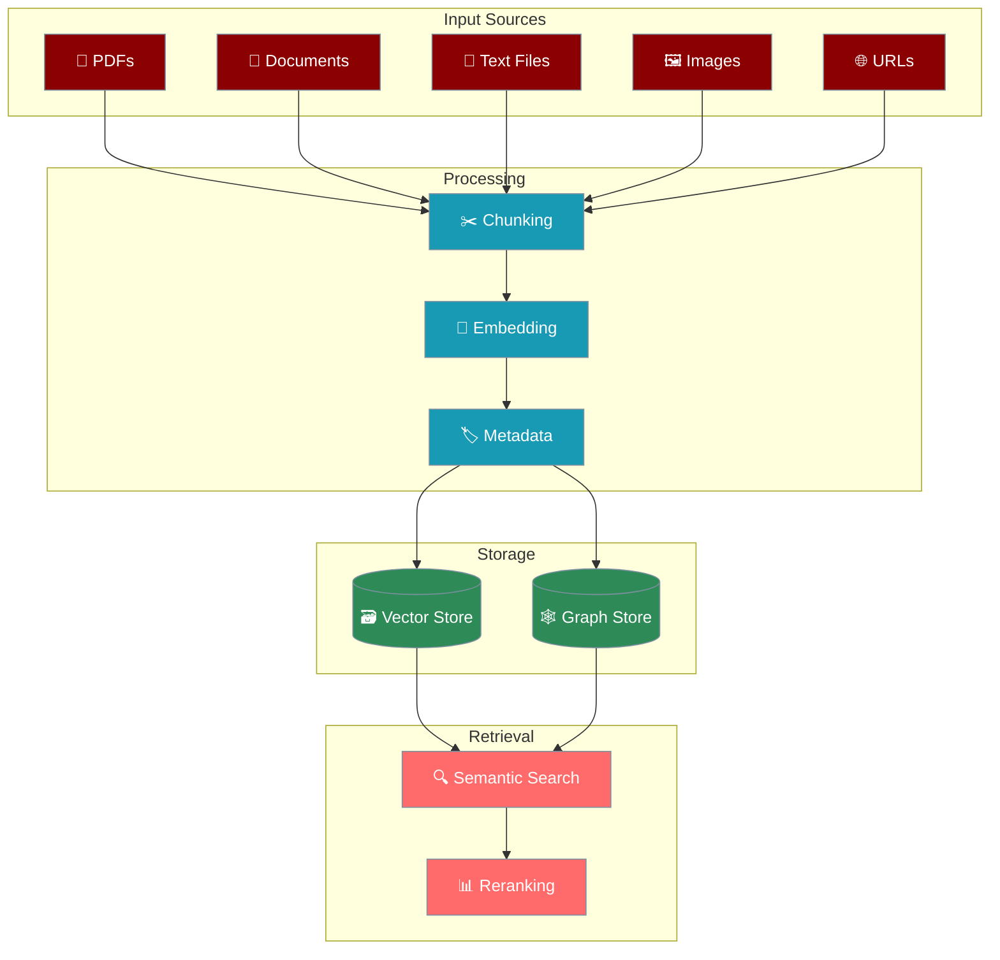

# Knowledge Base System

The knowledge system provides sophisticated document processing and semantic search capabilities, enabling agents to access and utilise information from various sources.


```mermaid
graph TB
    subgraph Input Sources
        PDF[📄 PDFs]
        DOC[📝 Documents]
        TXT[📃 Text Files]
        IMG[🖼️ Images]
        URL[🌐 URLs]
    end
    
    subgraph Processing
        CHUNK[✂️ Chunking]
        EMB[🔢 Embedding]
        META[🏷️ Metadata]
    end
    
    subgraph Storage
        VECTOR[(🗃️ Vector Store)]
        GRAPH[(🕸️ Graph Store)]
    end
    
    subgraph Retrieval
        SEARCH[🔍 Semantic Search]
        RERANK[📊 Reranking]
    end
    
    PDF --> CHUNK
    DOC --> CHUNK
    TXT --> CHUNK
    IMG --> CHUNK
    URL --> CHUNK
    
    CHUNK --> EMB
    EMB --> META
    META --> VECTOR
    META --> GRAPH
    
    VECTOR --> SEARCH
    GRAPH --> SEARCH
    SEARCH --> RERANK
    
    classDef input fill:#8B0000,stroke:#7C90A0,color:#fff
    classDef process fill:#189AB4,stroke:#7C90A0,color:#fff
    classDef storage fill:#2E8B57,stroke:#7C90A0,color:#fff
    classDef retrieval fill:#FF6B6B,stroke:#7C90A0,color:#fff
    
    class PDF,DOC,TXT,IMG,URL input
    class CHUNK,EMB,META process
    class VECTOR,GRAPH storage
    class SEARCH,RERANK retrieval
```


## Best Practices

<AccordionGroup>
  <Accordion title="Start simple">
    Enable the feature with a single parameter before adding configuration. Verify it works, then layer in options.
  </Accordion>
  <Accordion title="Use environment variables for secrets">
    Never hardcode API keys or tokens. Use `os.getenv("KEY_NAME")` to read from environment variables.
  </Accordion>
  <Accordion title="Test with minimal examples first">
    Copy the Quick Start example, run it, then extend it. This confirms your environment is set up correctly.
  </Accordion>
  <Accordion title="Check the logs">
    Set `verbose=True` on your agent to see detailed execution logs when debugging unexpected behavior.
  </Accordion>
</AccordionGroup>

## Key Features

<CardGroup cols={2}>
  <Card icon="file-pdf">
    Process PDFs, documents, spreadsheets, images, and web content
  </Card>
  <Card icon="scissors">
    Multiple strategies for optimal text segmentation
  </Card>
  <Card icon="search">
    Vector-based search with optional reranking
  </Card>
  <Card icon="users">
    User, agent, and run-specific knowledge scoping
  </Card>
  <Card icon="project-diagram">
    Optional relationship extraction and storage
  </Card>
  <Card icon="star">
    Automatic quality assessment for stored knowledge
  </Card>
</CardGroup>

## Quick Start


<Steps>
<Step title="Simple Usage">
<CodeGroup>
```python Agent with Knowledge
from praisonaiagents import Agent

agent = Agent(
    name="Research Assistant",
    instructions="Answer questions using the knowledge base.",
    knowledge={
        "sources": ["research_paper.pdf", "data.txt"],
        "vector_store": {
            "provider": "chroma",
            "config": {
                "collection_name": "research_docs",
                "path": ".praison"
            }
        }
    }
)

response = agent.start("What are the key findings?")
```
</Step>

<Step title="With Configuration">
```python Direct Knowledge Use
from praisonaiagents import Knowledge

# Initialise knowledge base
kb = Knowledge({
    "vector_store": {
        "provider": "chroma",
        "config": {"collection_name": "my_knowledge"}
    }
})

# Add documents
kb.add("document.pdf", user_id="user123")
kb.add("https://example.com/article", user_id="user123")

# Store text directly
kb.store("Important fact about AI", user_id="user123")

# Search
results = kb.search("AI applications", user_id="user123")
```

```python Advanced Search
# Search with reranking
results = kb.search(
    query="machine learning applications",
    user_id="user123",
    rerank=True,
    top_k=10
)

# Filter by metadata
results = kb.search(
    query="technical specs",
    user_id="user123",
    filters={"category": "engineering"}
)
```
</CodeGroup>
</Step>
</Steps>


## 