# Knowledge Base System

The knowledge system provides sophisticated document processing and semantic search capabilities, enabling agents to access and utilise information from various sources.

```mermaid
graph TB
    subgraph Input Sources
        PDF[📄 PDFs]
        DOC[📝 Documents]
        TXT[📃 Text Files]
        IMG[🖼️ Images]
        URL[🌐 URLs]
    end
    
    subgraph Processing
        CHUNK[✂️ Chunking]
        EMB[🔢 Embedding]
        META[🏷️ Metadata]
    end
    
    subgraph Storage
        VECTOR[(🗃️ Vector Store)]
        GRAPH[(🕸️ Graph Store)]
    end
    
    subgraph Retrieval
        SEARCH[🔍 Semantic Search]
        RERANK[📊 Reranking]
    end
    
    PDF --> CHUNK
    DOC --> CHUNK
    TXT --> CHUNK
    IMG --> CHUNK
    URL --> CHUNK
    
    CHUNK --> EMB
    EMB --> META
    META --> VECTOR
    META --> GRAPH
    
    VECTOR --> SEARCH
    GRAPH --> SEARCH
    SEARCH --> RERANK
    
    classDef input fill:#8B0000,stroke:#7C90A0,color:#fff
    classDef process fill:#189AB4,stroke:#7C90A0,color:#fff
    classDef storage fill:#2E8B57,stroke:#7C90A0,color:#fff
    classDef retrieval fill:#FF6B6B,stroke:#7C90A0,color:#fff
    
    class PDF,DOC,TXT,IMG,URL input
    class CHUNK,EMB,META process
    class VECTOR,GRAPH storage
    class SEARCH,RERANK retrieval
```



## Key Features

<CardGroup cols={2}>
  <Card icon="file-pdf">
    Process PDFs, documents, spreadsheets, images, and web content
  </Card>
  <Card icon="scissors">
    Multiple strategies for optimal text segmentation
  </Card>
  <Card icon="search">
    Vector-based search with optional reranking
  </Card>
  <Card icon="users">
    User, agent, and run-specific knowledge scoping
  </Card>
  <Card icon="project-diagram">
    Optional relationship extraction and storage
  </Card>
  <Card icon="star">
    Automatic quality assessment for stored knowledge
  </Card>
</CardGroup>

## Quick Start

<CodeGroup>
```python Agent with Knowledge
from praisonaiagents import Agent

agent = Agent(
    name="Research Assistant",
    instructions="Answer questions using the knowledge base.",
    knowledge={
        "sources": ["research_paper.pdf", "data.txt"],
        "vector_store": {
            "provider": "chroma",
            "config": {
                "collection_name": "research_docs",
                "path": ".praison"
            }
        }
    }
)

response = agent.start("What are the key findings?")
```

```python Direct Knowledge Use
from praisonaiagents.knowledge import Knowledge

# Initialise knowledge base
kb = Knowledge({
    "vector_store": {
        "provider": "chroma",
        "config": {"collection_name": "my_knowledge"}
    }
})

# Add documents
kb.add("document.pdf", user_id="user123")
kb.add("https://example.com/article", user_id="user123")

# Store text directly
kb.store("Important fact about AI", user_id="user123")

# Search
results = kb.search("AI applications", user_id="user123")
```

```python Advanced Search
# Search with reranking
results = kb.search(
    query="machine learning applications",
    user_id="user123",
    rerank=True,
    top_k=10
)

# Filter by metadata
results = kb.search(
    query="technical specs",
    user_id="user123",
    filters={"category": "engineering"}
)
```
</CodeGroup>

## Configuration Options

### Basic Configuration

```python
knowledge_config = {
    "vector_store": {
        "provider": "chroma",
        "config": {
            "collection_name": "knowledge_base",
            "path": ".praison",
            "distance_metric": "cosine"
        }
    },
    "embedder": {
        "provider": "openai",
        "config": {
            "model": "text-embedding-3-small"
        }
    }
}
```

### Advanced Configuration with Graph Store

```python
knowledge_config = {
    "vector_store": {
        "provider": "chroma",
        "config": {
            "collection_name": "knowledge_base",
            "path": ".praison"
        }
    },
    "graph_store": {
        "provider": "neo4j",
        "config": {
            "url": "bolt://localhost:7687",
            "username": "neo4j",
            "password": "password"
        }
    },
    "llm": {
        "provider": "openai",
        "config": {
            "model": "gpt-4o-mini",
            "temperature": 0
        }
    },
    "reranker": {
        "enabled": True,
        "default_rerank": False
    }
}
```

## Chunking Strategies

<CodeGroup>
```python Token-based Chunking
kb = Knowledge({
    "chunker": {
        "name": "token",
        "chunk_size": 500,
        "chunk_overlap": 50
    }
})
```
Best for: Consistent chunk sizes, token-limited models

```python Sentence-based Chunking
kb = Knowledge({
    "chunker": {
        "name": "sentence",
        "chunk_size": 10,  # sentences per chunk
        "min_chunk_size": 3
    }
})
```
Best for: Natural text boundaries, Q&A systems

```python Semantic Chunking
kb = Knowledge({
    "chunker": {
        "name": "semantic",
        "threshold": 0.7,
        "min_chunk_size": 100
    }
})
```
Best for: Topic-based segmentation, research papers

```python SDPM Chunking
kb = Knowledge({
    "chunker": {
        "name": "sdpm",
        "max_chunk_size": 1000
    }
})
```
Best for: Document structure preservation
</CodeGroup>

## Document Processing

### Supported File Types

<CardGroup cols={3}>
  <Card icon="file-pdf">
    - PDF (.pdf)
    - Word (.doc, .docx)
    - Text (.txt)
    - Markdown (.md)
    - RTF (.rtf)
  </Card>
  <Card icon="table">
    - Excel (.xls, .xlsx)
    - CSV (.csv)
    - JSON (.json)
    - XML (.xml)
  </Card>
  <Card icon="globe">
    - Images (OCR)
    - HTML pages
    - Web URLs
    - YouTube videos
  </Card>
</CardGroup>

### Processing Options

```python
# Add with metadata
kb.add(
    "research.pdf",
    user_id="user123",
    metadata={
        "category": "AI Research",
        "year": 2024,
        "author": "Dr. Smith"
    }
)

# Batch processing
documents = ["doc1.pdf", "doc2.txt", "doc3.md"]
for doc in documents:
    kb.add(doc, user_id="user123")

# URL processing
kb.add("https://arxiv.org/pdf/2301.00000.pdf", user_id="user123")
```

## Search Features

### Basic Search

```python
# Simple search
results = kb.search("artificial intelligence", limit=5)

# User-scoped search
results = kb.search(
    query="machine learning",
    user_id="user123",
    limit=10
)
```

### Advanced Search Options

<CodeGroup>
```python With Reranking
# Enable Mem0 reranking for better relevance
results = kb.search(
    query="neural networks",
    user_id="user123",
    rerank=True,
    top_k=20  # Retrieve more before reranking
)
```

```python Hybrid Search
# Combine keyword and semantic search
results = kb.search(
    query="transformer architecture",
    user_id="user123",
    keyword_search=True,  # Better recall
    filter_memories=True  # Better precision
)
```

```python Metadata Filtering
# Filter by metadata
results = kb.search(
    query="implementation details",
    user_id="user123",
    filters={
        "category": "technical",
        "year": {"$gte": 2023}
    }
)
```
</CodeGroup>

## Memory Integration

When used with agents, knowledge automatically integrates with memory:

```python
agent = Agent(
    name="Research Assistant",
    knowledge={
        "sources": ["papers/"],
        "vector_store": {
            "provider": "chroma",
            "config": {"collection_name": "research_docs"}
        }
    },
    memory=True  # Enable memory integration
)

# Knowledge is automatically searched during conversations
response = agent.chat("What does the research say about transformers?")
```

## Graph Store Features

Graph stores enable relationship extraction and complex queries beyond simple semantic search.

### Configuration

```python
knowledge_config = {
    "graph_store": {
        "provider": "neo4j",  # or "memgraph"
        "config": {
            "url": "bolt://localhost:7687",
            "username": "neo4j",
            "password": "password"
        }
    },
    "extract_relationships": True
}
```

### Relationship Queries

```python
# Find related concepts
results = kb.search_graph(
    "What concepts are related to transformers?",
    user_id="user123"
)

# Explore connections
results = kb.search_graph(
    "How is attention mechanism connected to BERT?",
    user_id="user123"
)
```

## Best Practices

<CardGroup cols={2}>
  <Card icon="cut" title="Chunking Strategy">
    - Smaller chunks (100-200 tokens): Better precision
    - Larger chunks (500-1000 tokens): Better context
    - Match chunk size to query complexity
  </Card>
  <Card icon="folder-tree" title="Organisation">
    - Separate collections by domain
    - Use metadata for filtering
    - Regular cleanup of outdated content
  </Card>
  <Card icon="gauge-high" title="Performance">
    - Enable caching for repeated queries
    - Use appropriate embedding models
    - Batch document processing
  </Card>
  <Card icon="shield-check" title="Quality">
    - Verify document processing
    - Monitor search relevance
    - Regular reindexing if needed
  </Card>
</CardGroup>

## Example: Research Assistant

<CodeGroup>
```python Complete Example
from praisonaiagents import Agent
from praisonaiagents.knowledge import Knowledge

# Configure knowledge base
knowledge_config = {
    "vector_store": {
        "provider": "chroma",
        "config": {
            "collection_name": "research_papers",
            "path": "./knowledge_db"
        }
    },
    "chunker": {
        "name": "semantic",
        "threshold": 0.7
    },
    "embedder": {
        "provider": "openai",
        "config": {
            "model": "text-embedding-3-small"
        }
    },
    "reranker": {
        "enabled": True
    }
}

# Create research assistant
research_agent = Agent(
    name="Research Assistant",
    instructions="""You are an expert research assistant.
    Use the knowledge base to provide accurate, well-sourced answers.
    Always cite the specific documents you reference.""",
    knowledge={
        "sources": ["research_papers"],
        **knowledge_config
    }
)

# Use the assistant
response = research_agent.chat(
    "What are the main approaches to AI alignment?"
)

# Direct knowledge queries
kb = research_agent.knowledge_instance
papers = kb.search("alignment techniques", limit=5)
for paper in papers:
    print(f"- {paper['text'][:100]}...")
    print(f"  Source: {paper.get('metadata', {}).get('source')}")
```
</CodeGroup>

## Next Steps

<CardGroup cols={2}>
  <Card icon="brain" href="/concepts/memory">
    Learn about memory integration
  </Card>
  <Card icon="magnifying-glass" href="/features/rag">
    Build RAG applications
  </Card>
</CardGroup>