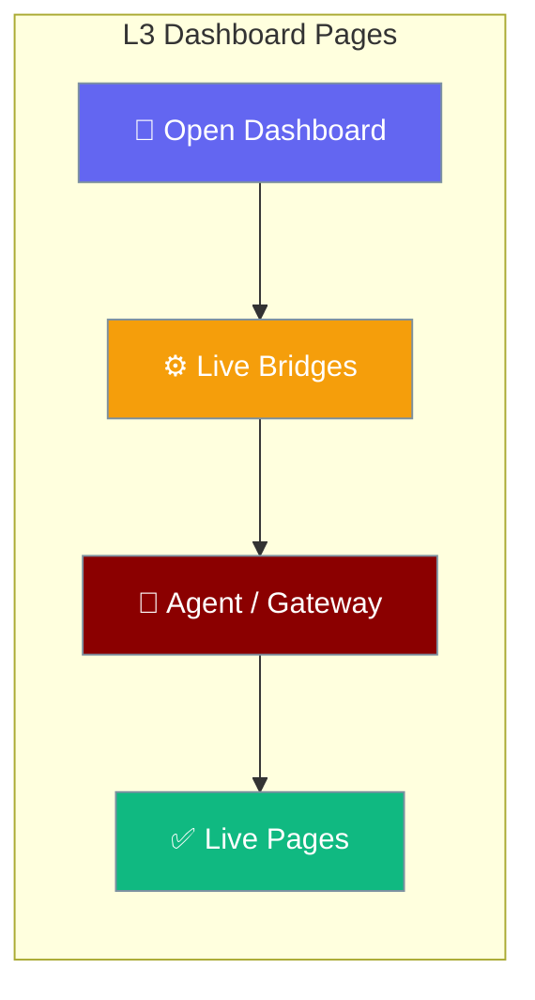
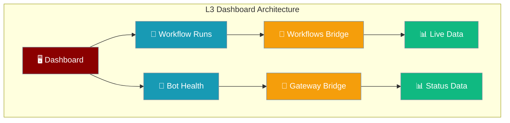
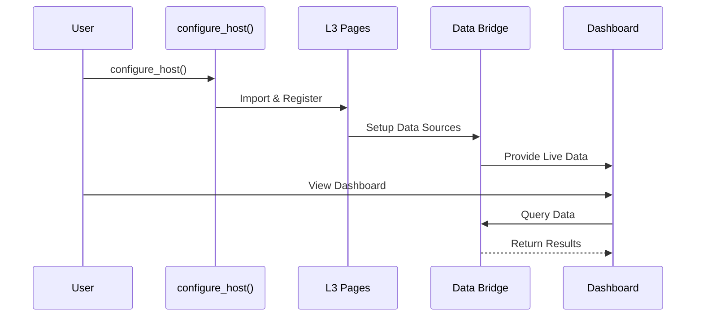

L3 dashboard pages provide workflow monitoring and system health status that auto-register when using the integrated host configuration.

```python
from praisonaiagents import Agent
from praisonai.integration import configure_host

agent = Agent(name="Assistant", instructions="Run workflows you can monitor in the dashboard")
configure_host(title="My Dashboard", agent=agent)
```

The user opens the dashboard in a browser; workflow runs and bot health pages update from live gateway data.



### Dashboard Architecture



## Quick Start

<Steps>
<Step title="Configure Host with Pages">

The L3 pages auto-register when you configure the host:

```python
from praisonaiagents import Agent
from praisonai.integration import configure_host

agent = Agent(
    name="Assistant",
    instructions="You are a helpful assistant"
)

configure_host(
    title="My Dashboard",
    style="dashboard",
    agents=[agent]
)
```

</Step>

<Step title="Access Dashboard Pages">

Navigate to the integrated UI to see the new pages:

- **Workflow Runs** (`/workflow-runs`) - View workflow execution history
- **Bot Health** (`/bot-health`) - Monitor gateway and channel status

```bash
praisonai serve ui-gateway --port 8765
# Open http://localhost:8765
```

</Step>
</Steps>

---

## How It Works

The L3 pages are automatically imported and registered during host configuration:



---

## Available Pages

### Workflow Runs

The workflow runs page displays execution history and status for all workflows:

| Feature | Description |
|---------|-------------|
| **Route** | `/workflow-runs` |
| **Icon** | 🔄 |
| **Data Source** | `praisonai.integration.bridges.workflows_service` |
| **Status** | Live data when bridge available, stub otherwise |

### Bot Health

The bot health page shows gateway and channel connection status:

| Feature | Description |
|---------|-------------|
| **Route** | `/bot-health` |
| **Icon** | 🤖 |
| **Data Source** | Gateway reference via `praisonaiui.features._gateway_ref` |
| **Status** | Real-time when gateway active |

---

## Configuration

The pages automatically configure based on available bridges and services:

```python
from praisonai.integration import configure_host

# Basic configuration (pages auto-register)
configure_host(
    title="Agent Dashboard",
    style="dashboard"
)

# Pages appear automatically in navigation
# No additional setup required
```

---

## Data Sources

### Workflow Bridge

```python
# Automatically wired when available
from praisonai.integration.bridges.workflows_service import run_workflow

# Powers the Workflow Runs page
workflow_backend = lambda wf_id, **kwargs: run_workflow(
    wf_id, 
    input_text=kwargs.get("text", ""),
    workflow_config=kwargs.get("workflow")
)
```

### Gateway Bridge

```python
# Auto-detected from gateway reference
from praisonaiui.features._gateway_ref import get_gateway

gateway = get_gateway()
if gateway:
    # Powers Bot Health page
    status = {
        "gateway": "running",
        "agents": gateway.list_agents()
    }
```

---

## Best Practices

<AccordionGroup>

<Accordion title="Page Availability">
The L3 pages gracefully handle missing dependencies:

```python
# Pages no-op silently if aiui not installed
try:
    from praisonai.integration.pages import workflow_runs, bot_health
except ImportError:
    # Pages won't register, no error
    pass
```
</Accordion>

<Accordion title="Custom Data Sources">
You can override the default backends for custom data:

```python
import praisonaiui.backends as backends

# Custom workflow data source
def my_workflow_backend(wf_id, **kwargs):
    return {"custom": "workflow_data"}

backends.set_backend("workflows", my_workflow_backend)
```
</Accordion>

<Accordion title="Monitoring Integration">
Connect the pages to your monitoring systems:

```python
# Custom usage tracking
def usage_monitor(usage_data):
    # Send to your monitoring service
    send_to_datadog(usage_data)

backends.set_backend("usage_sink", usage_monitor)
```
</Accordion>

<Accordion title="Production Deployment">
For production, ensure proper bridge configuration:

```python
configure_host(
    title="Production Dashboard",
    style="dashboard",
    # Ensures all bridges are available
    agents=[production_agent],
    gateway=gateway_instance
)
```
</Accordion>

</AccordionGroup>

---

## Related

<CardGroup cols={2}>
<Card title="Host Integration" icon="plug" href="/docs/features/host-integration">
  Configure the integrated host
</Card>
<Card title="Integration Patterns" icon="diagram-project" href="/docs/features/integration-patterns">
  Pattern C deployment guide
</Card>
</CardGroup>