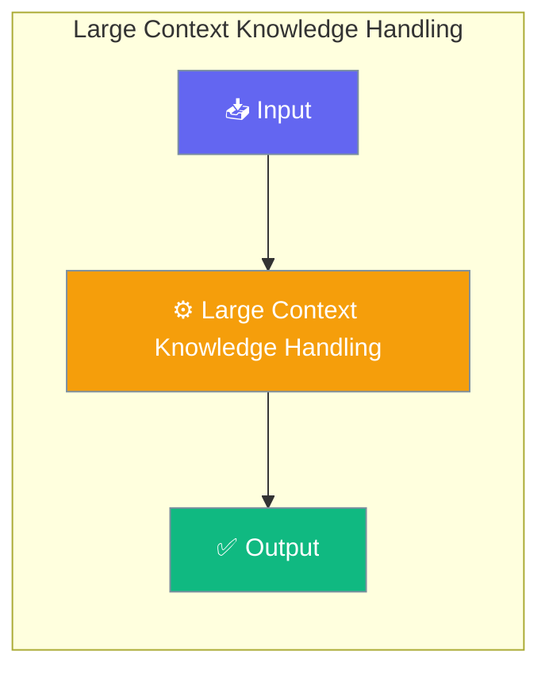

# Large Context Knowledge Handling

PraisonAI Agents provides a comprehensive system for handling large knowledge bases efficiently, with automatic strategy selection, token budgeting, and intelligent compression.




## Overview

The large context handling system includes:

| Feature | Description |
|---------|-------------|
| [Token Budgeting](/features/token-budgeting) | Dynamic budget management for context windows |
| [Incremental Indexing](/features/incremental-indexing) | Efficient file tracking and updates |
| [Retrieval Strategies](/features/retrieval-strategies) | Automatic strategy selection by corpus size |
| [Smart Retrieval](/features/smart-retrieval) | Hybrid search with reranking |
| [Context Compression](/features/context-compression) | Intelligent compression to fit budgets |
| [Hierarchical Summaries](/features/hierarchical-summaries) | Multi-level summaries for large corpora |

## Quick Start


<Steps>
<Step title="Quick Start">
```python
from praisonaiagents import Agent

# Create agent with knowledge base
agent = Agent(
    name="KnowledgeAgent",
    instructions="Answer questions using the knowledge base.",
    knowledge={"sources": ["./docs"]},
    memory={"user_id": "my_user"},
)

# Ask questions - system automatically handles:
# - Indexing documents
# - Selecting retrieval strategy
# - Managing token budget
# - Compressing context if needed
response = agent.chat("What are the main features?")
```
</Step>
</Steps>


## Best Practices

<AccordionGroup>
  <Accordion title="Start simple">
    Enable the feature with a single parameter before adding configuration. Verify it works, then layer in options.
  </Accordion>
  <Accordion title="Use environment variables for secrets">
    Never hardcode API keys or tokens. Use `os.getenv("KEY_NAME")` to read from environment variables.
  </Accordion>
  <Accordion title="Test with minimal examples first">
    Copy the Quick Start example, run it, then extend it. This confirms your environment is set up correctly.
  </Accordion>
  <Accordion title="Check the logs">
    Set `verbose=True` on your agent to see detailed execution logs when debugging unexpected behavior.
  </Accordion>
</AccordionGroup>

## Related

<CardGroup cols={2}>
  <Card title="Features Overview" icon="grid-2" href="/docs/features">
    Browse all PraisonAI features
  </Card>
  <Card title="Quick Start" icon="rocket" href="/docs/introduction">
    Get started with PraisonAI agents
  </Card>
</CardGroup>
