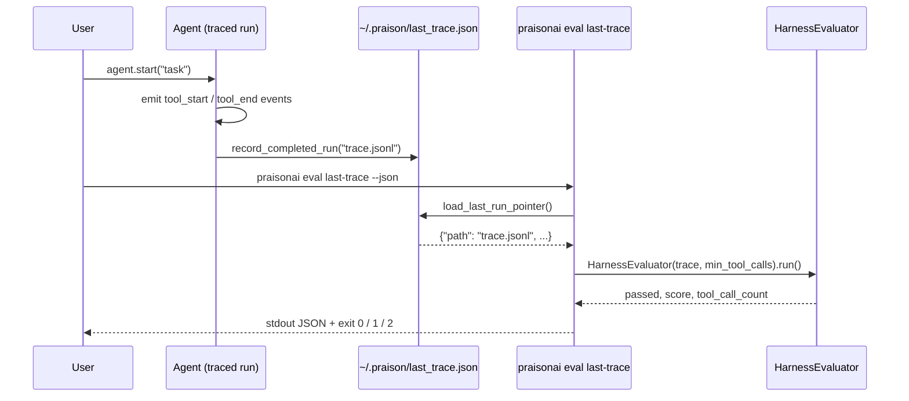

Grade the last completed traced run without a manual JSON export.



An agent runs, records a pointer to its trace, and one command grades it.

```python
from praisonaiagents import Agent
from praisonaiagents.trace import record_completed_run

agent = Agent(
    name="Researcher",
    instructions="Research the user's question using the available tools.",
)

result = agent.start("What is the capital of France?")

# Mark this run as the latest trace to grade.
# Point at whatever trace file your trace sink produced.
record_completed_run("trace.jsonl", meta={"agent": "Researcher"})
```

```bash
praisonai eval last-trace --json
# {"passed": true, "score": 1.0, "tool_call_count": 1}
# $ echo $?
# 0
```

## Quick Start

<Steps>
<Step title="Run a traced agent">
Run your agent, then record a pointer to the trace file it produced.

```python
from praisonaiagents import Agent
from praisonaiagents.trace import record_completed_run

agent = Agent(
    name="Researcher",
    instructions="Research the user's question using the available tools.",
)

agent.start("What is the capital of France?")

record_completed_run("trace.jsonl", meta={"agent": "Researcher"})
```
</Step>

<Step title="Grade it">
One command grades the last run and exits with a CI-friendly code.

```bash
praisonai eval last-trace --json
# {"passed": true, "score": 1.0, "tool_call_count": 1}
```
</Step>
</Steps>

---

## How It Works

The CLI reads the pointer file, loads the trace it points at, maps tool events to the harness evaluator, and grades.


The subcommand counts one tool call per `tool_start` event so repeated calls are preserved; it falls back to `tool_end` only when a trace emits ends without starts.

| Step | What happens |
|------|--------------|
| Record | `record_completed_run` writes the pointer atomically |
| Load | `load_last_run_pointer` reads the pointer, or returns `None` |
| Map | each `tool_start` (or `tool_end` fallback) becomes one tool call |
| Grade | `HarnessEvaluator` checks the run against `--min-tool-calls` |

---

## CLI Reference

`praisonai eval last-trace` grades your last run. One command, three exit codes.

```bash
praisonai eval last-trace [OPTIONS]
```

### Options

| Option | Type | Default | Description |
|--------|------|---------|-------------|
| `--min-tool-calls` | `int` | `1` | Minimum number of tool calls required to pass. `0` disables the gate. |
| `--json` | flag | `False` | Emit result as a single-line JSON object to stdout. |

### Exit codes

| Code | Meaning |
|------|---------|
| `0` | Pass (`result.passed` is `True`) |
| `1` | Fail (`result.passed` is `False`), or malformed trace file |
| `2` | No completed traced run found (missing pointer, or pointer path no longer exists on disk) |

### JSON output

```json
{"passed": true, "score": 1.0, "tool_call_count": 1}
```

The three keys come from `result.passed`, `result.score`, and `result.tool_call_count`.

### Trace formats

Both **JSONL** (one JSON event per line) and a **JSON array** (detected when the first non-whitespace character is `[`) work transparently. Each event is a dict:

```json
{"event_type": "tool_start", "tool_name": "search"}
```

---

## Python API Reference

Three stdlib-only helpers on `praisonaiagents.trace` persist and read the pointer.

### `record_completed_run`

Persist a pointer to the trace file of the just-completed run.

```python
from praisonaiagents.trace import record_completed_run

pointer_path = record_completed_run(
    "trace.jsonl",
    meta={"agent": "researcher", "status": "ok"},
)
```

<ParamField path="trace_path" type="str | Path" required>
  Path to the trace artifact (JSON or JSONL). Resolved to absolute inside the pointer.
</ParamField>

<ParamField path="meta" type="Optional[Dict[str, Any]]" default="None">
  Optional run metadata (agent name, status, etc.). Shallow-copied.
</ParamField>

<ResponseField name="returns" type="Path">
  The pointer file path (same as `last_run_pointer_path()`). Writes atomically; the parent directory is created if missing.
</ResponseField>

### `load_last_run_pointer`

Load the pointer, or `None` if none has been recorded or it is unreadable.

```python
from praisonaiagents.trace import load_last_run_pointer

pointer = load_last_run_pointer()
# None, or:
# {"schema_version": "1.0", "path": "...", "recorded_at": 1762..., "meta": {...}}
```

<ResponseField name="returns" type="Optional[Dict[str, Any]]">
  The pointer dict, or `None` (never raises) when the file is missing, unreadable, not valid JSON, not a dict, or has no `path` key.
</ResponseField>

### `last_run_pointer_path`

Absolute path to the pointer file.

```python
from praisonaiagents.trace import last_run_pointer_path

print(last_run_pointer_path())
# -> /Users/you/.praison/last_trace.json   (default)
# -> $PRAISON_HOME/last_trace.json          (when PRAISON_HOME is set)
```

<ResponseField name="returns" type="Path">
  Absolute path to `last_trace.json`.
</ResponseField>

---

## Pointer File

The pointer lives at `~/.praison/last_trace.json` by default, written with JSON Schema version `1.0`.

```json
{
  "schema_version": "1.0",
  "path": "/absolute/path/to/trace.jsonl",
  "recorded_at": 1762598400.123,
  "meta": {"agent": "researcher"}
}
```

| Key | Type | Description |
|-----|------|-------------|
| `schema_version` | `str` | Currently `"1.0"`. Reserved for forward-compat. |
| `path` | `str` | Absolute path to the trace artifact. |
| `recorded_at` | `float` | `time.time()` at write. |
| `meta` | `object` | Caller-supplied metadata (may be `{}`). |

<Note>
Set `PRAISON_HOME` to redirect the pointer to `$PRAISON_HOME/last_trace.json` — the escape hatch for sandboxes, tests, and CI runners that cannot write to `$HOME`.
</Note>

---

## CI Usage

Exit code `1` propagates naturally, so a failing grade fails the build.

```bash
praisonai eval last-trace --min-tool-calls 1 --json || exit 1
```

---

## Common Pitfalls

<AccordionGroup>
<Accordion title="'No completed traced run found'">
The SDK does not auto-call `record_completed_run()`. Your trace sink or your own code must call it after the run so the pointer exists.
</Accordion>

<Accordion title="Exit 2 vs exit 1">
`2` means "no run to grade" — a missing or stale pointer (an operator problem). `1` means the run failed grading or the trace was malformed (a test failure).
</Accordion>

<Accordion title="Where is the pointer?">
`~/.praison/last_trace.json` by default, or `$PRAISON_HOME/last_trace.json` when `PRAISON_HOME` is set.
</Accordion>
</AccordionGroup>

---

## Related

<CardGroup cols={2}>
  <Card title="Evaluation Loop" icon="arrows-rotate" href="/eval/evaluation-loop">
    Iterative improvement — the long-running cousin.
  </Card>
  <Card title="Judge" icon="gavel" href="/eval/judge">
    Standalone LLM-as-judge scoring.
  </Card>
  <Card title="CLI Eval" icon="terminal" href="/cli/eval">
    The broader `praisonai eval …` surface.
  </Card>
  <Card title="Custom Tracing" icon="route" href="/observability/custom-tracing">
    How traces get produced in the first place.
  </Card>
</CardGroup>
