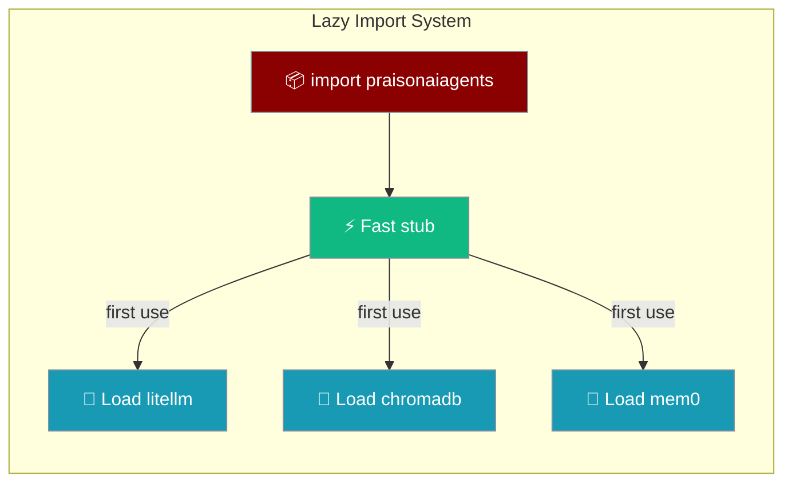

PraisonAI Agents v0.5.0+ uses lazy imports to dramatically reduce startup time and memory usage. Heavy dependencies like `litellm`, `requests`, and `chromadb` are only loaded when actually needed.

## Quick Start

<Steps>
<Step title="Import is instant">
```python
from praisonaiagents import Agent, Session, Memory, Knowledge

assert 'litellm' not in __import__('sys').modules
print("Import done in ~18ms")
```
</Step>

<Step title="Heavy deps load on first use">
```python
agent = Agent(name="MyAgent")  # litellm loaded here, not before
response = agent.chat("Hello")
```
</Step>
</Steps>

---

## Performance Benefits

| Metric | Before | After | Improvement |
|--------|--------|-------|-------------|
| Import Time | 820ms | 18ms | **97.8% faster** |
| Memory Usage | 93.3MB | 33.0MB | **64.6% reduction** |

---

## How It Works

### Lazy Module Loading

Core modules are loaded on-demand using Python's `__getattr__` mechanism:

```python
# These imports are fast - modules loaded lazily
from praisonaiagents import Agent, Session, Memory, Knowledge

# Agent is only fully loaded when you use it
agent = Agent(name="MyAgent")  # litellm loaded here
```

### Heavy Dependencies

The following dependencies are NOT loaded at import time:

- **litellm** - Only loaded when LLM calls are made
- **requests** - Only loaded when HTTP calls are needed
- **chromadb** - Only loaded when vector stores are used
- **mem0** - Only loaded when memory features are used

### Training & Vision Module Lazy Loading

Modules affected: `praisonai.train.llm.trainer` (the `TrainModel` class) and `praisonai.upload_vision` (the `UploadVisionModel` class) now use lazy loading to defer heavy ML dependencies.

These modules use a `_lazy_import_*_deps()` helper called from `__init__`, mirroring `train.py` / `train_vision.py` patterns.

**Dependencies deferred:**
- **torch** - CUDA/GPU computation framework
- **transformers** (`TextStreamer`, `TrainingArguments`) - Hugging Face transformers
- **unsloth** (`FastLanguageModel`, `FastVisionModel`, `is_bfloat16_supported`, `standardize_sharegpt`, `get_chat_template`) - Fast training optimization
- **trl** (`SFTTrainer`) - Transformer Reinforcement Learning
- **datasets** (`load_dataset`, `concatenate_datasets`) - Dataset loading utilities
- **psutil** (`virtual_memory`) - System memory monitoring

**Impact:** Importing `praisonai.upload_vision` or `praisonai.train.llm.trainer` is now near-instant; CUDA / ~2 GB of ML libs only load when you instantiate `UploadVisionModel(...)` or `TrainModel(...)`.

```python
# Fast — no torch/unsloth load
from praisonai.upload_vision import UploadVisionModel

# Heavy deps load here, not at import time
uploader = UploadVisionModel(config_path="config.yaml")
```

ImportError messages now include install hints:
- Vision upload: `pip install torch unsloth`
- Training: `pip install torch transformers unsloth datasets trl psutil`

## Verifying Lazy Imports

You can verify lazy imports are working:

```python
import sys

# Import the package
import praisonaiagents

# Check that heavy deps are NOT loaded
assert 'litellm' not in sys.modules
assert 'requests' not in sys.modules
assert 'chromadb' not in sys.modules

# Check training/vision modules are lazy loaded
from praisonai.upload_vision import UploadVisionModel  # noqa
assert "torch" not in sys.modules
assert "unsloth" not in sys.modules

print("✓ All heavy dependencies are lazy loaded")
```

## Configuration

Lazy imports are enabled by default. You can check the configuration:

```python
from praisonaiagents._config import LAZY_IMPORTS

print(f"Lazy imports enabled: {LAZY_IMPORTS}")
```

## Best Practices

<AccordionGroup>
<Accordion title="Import at module level">
Imports are now fast (~18ms), so import at the top of your file as usual. No need to defer imports in your own code.
</Accordion>

<Accordion title="Use specific imports">
Import only what you need to keep the loaded module graph small.

```python
from praisonaiagents import Agent, Task
```
</Accordion>

<Accordion title="Avoid star imports">
`from praisonaiagents import *` triggers loading of all sub-modules. Prefer named imports.
</Accordion>

<Accordion title="Verify lazy loading in tests">
Add an assertion in your CI to confirm heavy deps aren't loaded eagerly.

```python
import praisonaiagents
assert 'litellm' not in __import__('sys').modules
```
</Accordion>
</AccordionGroup>

---

## Measuring Performance

Use the built-in benchmarks to measure import time:

```python
import time

start = time.perf_counter()
import praisonaiagents
end = time.perf_counter()

print(f"Import time: {(end - start) * 1000:.1f}ms")
```

## Related

<CardGroup cols={2}>
<Card title="Performance Benchmarks" icon="gauge-high" href="/features/performance-benchmarks">
  Benchmark scripts and CI integration
</Card>
<Card title="Lite Package" icon="feather" href="/features/lite-package">
  Minimal agent framework with no litellm dependency
</Card>
</CardGroup>
