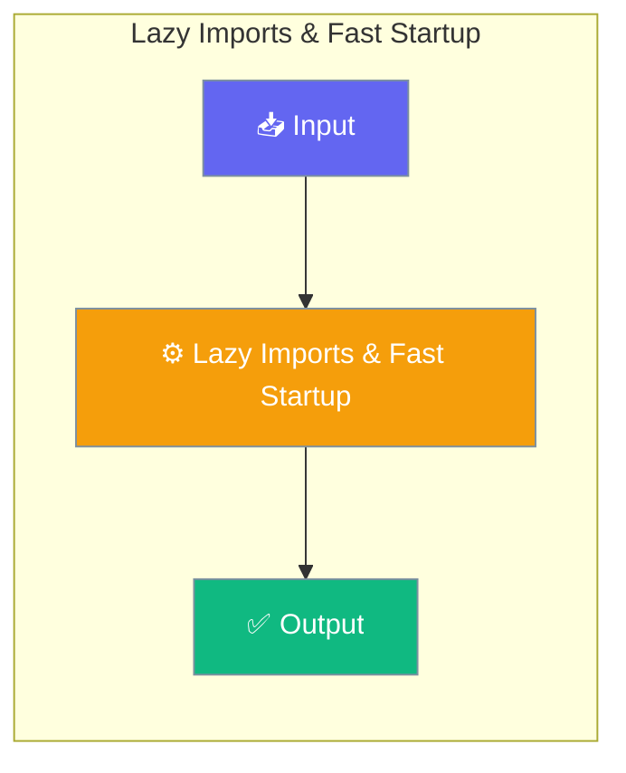

# Lazy Imports & Fast Startup

PraisonAI Agents v0.5.0+ uses lazy imports to dramatically reduce startup time and memory usage. Heavy dependencies like `litellm`, `requests`, and `chromadb` are only loaded when actually needed.




## Performance Benefits

| Metric | Before | After | Improvement |
|--------|--------|-------|-------------|
| Import Time | 820ms | 18ms | **97.8% faster** |
| Memory Usage | 93.3MB | 33.0MB | **64.6% reduction** |

## How It Works

### Lazy Module Loading

Core modules are loaded on-demand using Python's `__getattr__` mechanism:

```python
# These imports are fast - modules loaded lazily
from praisonaiagents import Agent, Session, Memory, Knowledge

# Agent is only fully loaded when you use it
agent = Agent(name="MyAgent")  # litellm loaded here
```

### Heavy Dependencies

The following dependencies are NOT loaded at import time:

- **litellm** - Only loaded when LLM calls are made
- **requests** - Only loaded when HTTP calls are needed
- **chromadb** - Only loaded when vector stores are used
- **mem0** - Only loaded when memory features are used

### Training & Vision Module Lazy Loading

Modules affected: `praisonai.train.llm.trainer` (the `TrainModel` class) and `praisonai.upload_vision` (the `UploadVisionModel` class) now use lazy loading to defer heavy ML dependencies.

These modules use a `_lazy_import_*_deps()` helper called from `__init__`, mirroring `train.py` / `train_vision.py` patterns.

**Dependencies deferred:**
- **torch** - CUDA/GPU computation framework
- **transformers** (`TextStreamer`, `TrainingArguments`) - Hugging Face transformers
- **unsloth** (`FastLanguageModel`, `FastVisionModel`, `is_bfloat16_supported`, `standardize_sharegpt`, `get_chat_template`) - Fast training optimization
- **trl** (`SFTTrainer`) - Transformer Reinforcement Learning
- **datasets** (`load_dataset`, `concatenate_datasets`) - Dataset loading utilities
- **psutil** (`virtual_memory`) - System memory monitoring

**Impact:** Importing `praisonai.upload_vision` or `praisonai.train.llm.trainer` is now near-instant; CUDA / ~2 GB of ML libs only load when you instantiate `UploadVisionModel(...)` or `TrainModel(...)`.

```python
# Fast — no torch/unsloth load
from praisonai.upload_vision import UploadVisionModel

# Heavy deps load here, not at import time
uploader = UploadVisionModel(config_path="config.yaml")
```

ImportError messages now include install hints:
- Vision upload: `pip install torch unsloth`
- Training: `pip install torch transformers unsloth datasets trl psutil`

## Verifying Lazy Imports

You can verify lazy imports are working:

```python
import sys

# Import the package
import praisonaiagents

# Check that heavy deps are NOT loaded
assert 'litellm' not in sys.modules
assert 'requests' not in sys.modules
assert 'chromadb' not in sys.modules

# Check training/vision modules are lazy loaded
from praisonai.upload_vision import UploadVisionModel  # noqa
assert "torch" not in sys.modules
assert "unsloth" not in sys.modules

print("✓ All heavy dependencies are lazy loaded")
```

## Configuration

Lazy imports are enabled by default. You can check the configuration:

```python
from praisonaiagents._config import LAZY_IMPORTS

print(f"Lazy imports enabled: {LAZY_IMPORTS}")
```

## Best Practices

1. **Import at module level** - Imports are fast, so import at the top of your file
2. **Use specific imports** - Import only what you need
3. **Avoid star imports** - `from praisonaiagents import *` loads everything

```python
# Good - specific imports
from praisonaiagents import Agent, Task

# Avoid - loads all modules
from praisonaiagents import *
```

## Measuring Performance

Use the built-in benchmarks to measure import time:

```python
import time

start = time.perf_counter()
import praisonaiagents
end = time.perf_counter()

print(f"Import time: {(end - start) * 1000:.1f}ms")
```


## Best Practices

<AccordionGroup>
  <Accordion title="Start simple">
    Enable the feature with a single parameter before adding configuration. Verify it works, then layer in options.
  </Accordion>
  <Accordion title="Use environment variables for secrets">
    Never hardcode API keys or tokens. Use `os.getenv("KEY_NAME")` to read from environment variables.
  </Accordion>
  <Accordion title="Test with minimal examples first">
    Copy the Quick Start example, run it, then extend it. This confirms your environment is set up correctly.
  </Accordion>
  <Accordion title="Check the logs">
    Set `verbose=True` on your agent to see detailed execution logs when debugging unexpected behavior.
  </Accordion>
</AccordionGroup>

## Related

- [Performance Benchmarks](/docs/features/performance-benchmarks)
- [Telemetry Configuration](/docs/features/telemetry)
- [Lite Package](/docs/features/lite-package)

## Related

<CardGroup cols={2}>
  <Card title="Features Overview" icon="grid-2" href="/docs/features">
    Browse all PraisonAI features
  </Card>
  <Card title="Quick Start" icon="rocket" href="/docs/introduction">
    Get started with PraisonAI agents
  </Card>
</CardGroup>
