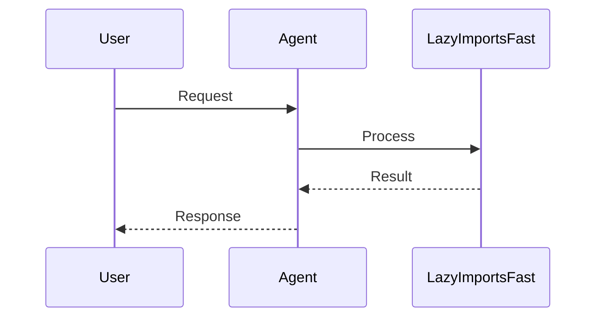
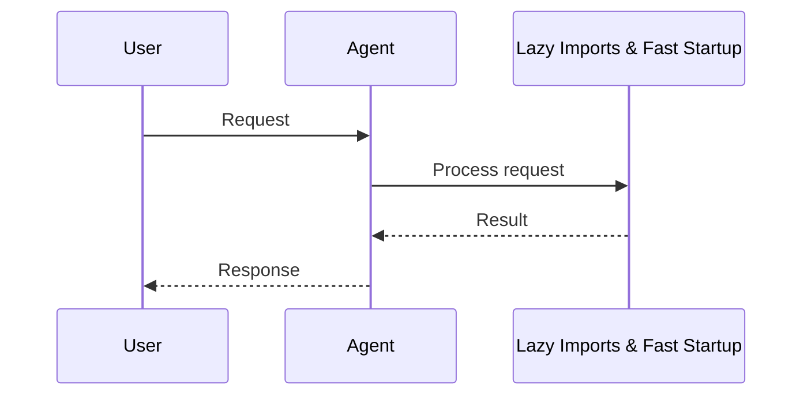
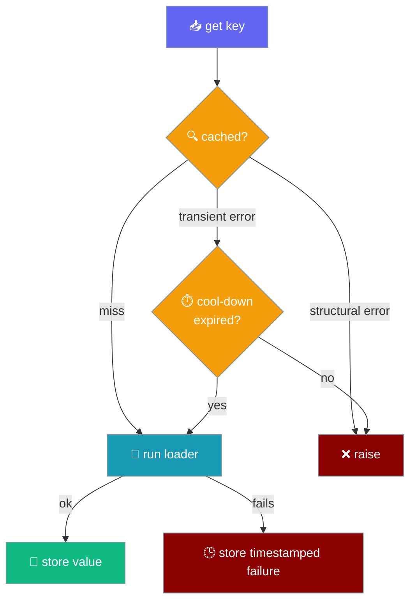

# Lazy Imports & Fast Startup

PraisonAI Agents v0.5.0+ uses lazy imports to dramatically reduce startup time and memory usage. Heavy dependencies like `litellm`, `requests`, and `chromadb` are only loaded when actually needed.

```python
from praisonaiagents import Agent

agent = Agent(name="MyAgent")  # litellm loads on first LLM call
agent.start("Hello")
```

The user imports PraisonAI and starts an agent instantly; heavy libraries load only on first use.


```mermaid
graph LR
    Agent[🤖 Agent] --> Tool[⚡ Lazy Import]
    Tool --> Result[🚀 Fast Startup]

    classDef agent fill:#8B0000,stroke:#7C90A0,color:#fff
    classDef tool fill:#189AB4,stroke:#7C90A0,color:#fff
    class Agent agent
    class Tool tool
```

## How It Works


```mermaid
sequenceDiagram
    participant User
    participant Agent
    participant LazyImportsFast

    User->>Agent: Request
    Agent->>LazyImportsFast: Process
    LazyImportsFast-->>Agent: Result
    Agent-->>User: Response
```


## Quick Start

<Steps>
<Step title="Import without heavy deps">

```python
from praisonaiagents import Agent

agent = Agent(name="MyAgent")  # litellm loads on first LLM call
```

</Step>

<Step title="Verify lazy loading">

```python
import sys
import praisonaiagents

assert "litellm" not in sys.modules
print("Heavy dependencies not loaded at import time")
```

</Step>
</Steps>

## Performance Benefits

| Metric | Before | After | Improvement |
|--------|--------|-------|-------------|
| Import Time | 820ms | 18ms | **97.8% faster** |
| Memory Usage | 93.3MB | 33.0MB | **64.6% reduction** |

## How It Works


```mermaid
sequenceDiagram
    participant User
    participant Agent
    participant Feature as Lazy Imports & Fast Startup

    User->>Agent: Request
    Agent->>Feature: Process request
    Feature-->>Agent: Result
    Agent-->>User: Response
```


### Lazy Module Loading

Core modules are loaded on-demand using Python's `__getattr__` mechanism:

```python
# These imports are fast - modules loaded lazily
from praisonaiagents import Agent, Session, Memory, Knowledge

# Agent is only fully loaded when you use it
agent = Agent(name="MyAgent")  # litellm loaded here
```

### Heavy Dependencies

The following dependencies are NOT loaded at import time:

- **litellm** - Only loaded when LLM calls are made
- **requests** - Only loaded when HTTP calls are needed
- **chromadb** - Only loaded when vector stores are used
- **mem0** - Only loaded when memory features are used

### Wrapper CLI Lazy Loading

The `praisonai` CLI and `praisonai.run(...)` used to eagerly import the framework adapter tree (`praisonaiagents.frameworks.*`) on every invocation, wasting the ~420 ms deferral that `agent.py` already had. As of PR [#4821](https://github.com/MervinPraison/PraisonAI/pull/4821) the `agents_generator` module is fully lazy — framework adapters load only when a framework is actually selected.

- Runtime access goes through the lazy `_get_default_adapter_registry()`; framework-adapter imports live under `TYPE_CHECKING`, so importing `praisonai.agents_generator` never loads the framework tree.

```python
import sys
import praisonai.agents_generator  # noqa: F401

assert not any(m.startswith("praisonaiagents.frameworks") for m in sys.modules), (
    "agents_generator must not eagerly load the framework tree"
)
```

### Training & Vision Module Lazy Loading

Modules affected: `praisonai.train.llm.trainer` (the `TrainModel` class) and `praisonai.upload_vision` (the `UploadVisionModel` class) now use lazy loading to defer heavy ML dependencies.

These modules use a `_lazy_import_*_deps()` helper called from `__init__`, mirroring `train.py` / `train_vision.py` patterns.

**Dependencies deferred:**
- **torch** - CUDA/GPU computation framework
- **transformers** (`TextStreamer`, `TrainingArguments`) - Hugging Face transformers
- **unsloth** (`FastLanguageModel`, `FastVisionModel`, `is_bfloat16_supported`, `standardize_sharegpt`, `get_chat_template`) - Fast training optimization
- **trl** (`SFTTrainer`) - Transformer Reinforcement Learning
- **datasets** (`load_dataset`, `concatenate_datasets`) - Dataset loading utilities
- **psutil** (`virtual_memory`) - System memory monitoring

**Impact:** Importing `praisonai.upload_vision` or `praisonai.train.llm.trainer` is now near-instant; CUDA / ~2 GB of ML libs only load when you instantiate `UploadVisionModel(...)` or `TrainModel(...)`.

```python
# Fast — no torch/unsloth load
from praisonai.upload_vision import UploadVisionModel

# Heavy deps load here, not at import time
uploader = UploadVisionModel(config_path="config.yaml")
```

ImportError messages now include install hints:
- Vision upload: `pip install torch unsloth`
- Training: `pip install torch transformers unsloth datasets trl psutil`

## Verifying Lazy Imports

You can verify lazy imports are working:

```python
import sys

# Import the package
import praisonaiagents

# Check that heavy deps are NOT loaded
assert 'litellm' not in sys.modules
assert 'requests' not in sys.modules
assert 'chromadb' not in sys.modules

# Check training/vision modules are lazy loaded
from praisonai.upload_vision import UploadVisionModel  # noqa
assert "torch" not in sys.modules
assert "unsloth" not in sys.modules

print("✓ All heavy dependencies are lazy loaded")
```

## Configuration

Lazy imports are enabled by default. You can check the configuration:

```python
from praisonaiagents._config import LAZY_IMPORTS

print(f"Lazy imports enabled: {LAZY_IMPORTS}")
```

## Shared lazy cache for optional-dep loading

`praisonai._lazy_cache` is the single source of truth for thread-safe optional-dependency loading — `lazy_get(key, factory)` returns a memoised value (including memoised *exceptions*), and `lazy_reset(key)` clears it.

```python
# praisonaiagents-side (illustrative of the pattern PraisonAI uses internally)
from praisonai._lazy_cache import lazy_get, lazy_reset

def _get_workflow_models():
    def _create():
        from pydantic import BaseModel
        # ... class definitions ...
        return {"WorkflowStructure": WorkflowStructure, ...}
    return lazy_get("workflow_models", _create)
```

As of PR [#4861](https://github.com/MervinPraison/PraisonAI/pull/4861), all three lazy-model factories in `praisonai/auto.py` (team, workflow, job workflow) route through the shared `lazy_get`, so exception caching and `lazy_reset` behave identically across them — no more ad-hoc `_models_cache` with divergent semantics. A broken `pydantic` install now fails fast and identically for every factory, and `lazy_reset` clears all three caches at once.

### Transient vs structural failures

`LazyCache(retry_cooldown: float = 30.0)` splits cached loader failures by type, so a one-off environment blip no longer poisons the cache for the whole process lifetime.

| Failure type | Examples | Cache lifetime |
|---|---|---|
| Structural | `ImportError`, `ValueError`, `AttributeError`, `RuntimeError` | Process lifetime — fails fast on every subsequent call |
| Transient | `OSError`, `ConnectionError`, `TimeoutError` | `retry_cooldown` seconds (default 30s), then the loader is retried |
| Control-flow | `KeyboardInterrupt`, `SystemExit` | Never cached — propagate immediately |

A transient failure is timestamped when cached. Inside the cool-down window `get(key, loader)` re-raises the cached error; once the cool-down expires the next `get` retries the loader, and a success clears the cached failure. `reset(key)` clears both the value cache and the failure timestamp; `reset()` with no key clears everything.


```mermaid
graph TB
    Get[📥 get key] --> Look{🔍 cached?}
    Look -->|miss| Load[🔄 run loader]
    Look -->|structural error| Raise[❌ raise]
    Look -->|transient error| Cool{⏱️ cool-down<br/>expired?}
    Cool -->|no| Raise
    Cool -->|yes| Load
    Load -->|ok| Store[💾 store value]
    Load -->|fails| Stamp[🕒 store timestamped failure]

    classDef input fill:#6366F1,stroke:#7C90A0,color:#fff
    classDef check fill:#F59E0B,stroke:#7C90A0,color:#fff
    classDef process fill:#189AB4,stroke:#7C90A0,color:#fff
    classDef bad fill:#8B0000,stroke:#7C90A0,color:#fff
    classDef good fill:#10B981,stroke:#7C90A0,color:#fff

    class Get input
    class Look,Cool check
    class Load process
    class Raise,Stamp bad
    class Store good
```

Use a scoped instance for multi-tenant callers instead of sharing the module-level singleton.

```python
from praisonai._lazy_cache import LazyCache

# Scoped cache with a shorter cool-down for a tenant that expects
# transient errors to clear quickly.
cache = LazyCache(retry_cooldown=5.0)
```

The cool-down mirrors the one `PraisonAIDB._init_stores` already uses for the same failure mode. It closes a real failure: a long-lived process (`praisonai serve`) that hit a transient `OSError` on first `litellm` load previously returned the cached error for the entire process lifetime — every subsequent request in every tenant. With the cool-down, the process recovers automatically once the underlying condition clears. See PR [#4948](https://github.com/MervinPraison/PraisonAI/pull/4948) (fixes [#4945](https://github.com/MervinPraison/PraisonAI/issues/4945)).

## Best Practices

<AccordionGroup>
  <Accordion title="Import at point of use">
    Defer optional modules until a feature is invoked — keeps CLI and server startup fast.
  </Accordion>
  <Accordion title="Install extras only when needed">
    Use `pip install praisonaiagents[memory]` rather than pulling every optional dependency upfront.
  </Accordion>
  <Accordion title="Measure import time in CI">
    Track cold import duration to catch accidental module-level heavy imports in PRs.
  </Accordion>
  <Accordion title="Prefer lite for embedded use">
    Use the lite package when you bring your own LLM client and need minimal footprint.
  </Accordion>
  <Accordion title="Use a scoped LazyCache in multi-tenant callers">
    Construct a scoped `LazyCache` instance per tenant so a `reset` in one tenant does not stomp another, and tune `retry_cooldown` to how quickly transient failures are expected to clear.
  </Accordion>
</AccordionGroup>

```python
# Good - specific imports
from praisonaiagents import Agent, Task

# Avoid - loads all modules
from praisonaiagents import *
```

## Measuring Performance

Use the built-in benchmarks to measure import time:

```python
import time

start = time.perf_counter()
import praisonaiagents
end = time.perf_counter()

print(f"Import time: {(end - start) * 1000:.1f}ms")
```

## Related

<CardGroup cols={2}>
<Card title="Performance Benchmarks" icon="gauge" href="/features/performance-benchmarks">
  Import time and memory metrics
</Card>
<Card title="Lite Package" icon="feather" href="/features/lite-package">
  Minimal BYO-LLM subpackage
</Card>
</CardGroup>
