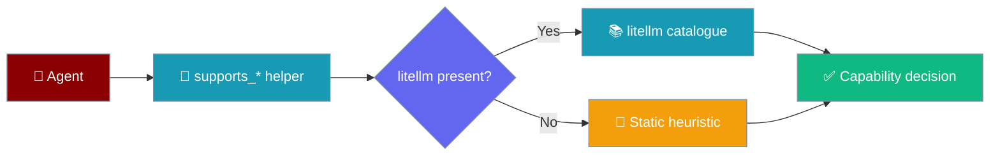
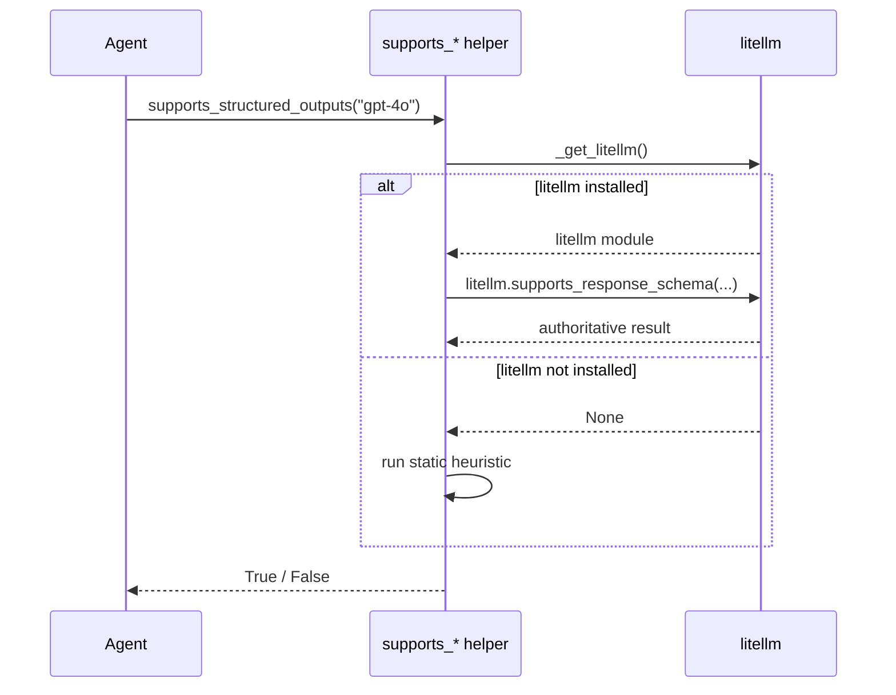
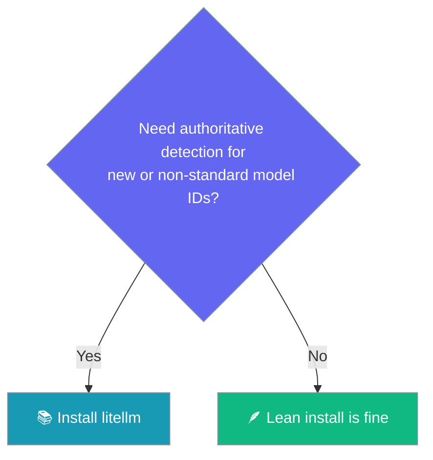

On lean installs (no `litellm`), PraisonAI still detects what each model can do — structured outputs, function calling, prompt caching, and web search — via a conservative built-in heuristic.



You installed PraisonAI without extra dependencies, and structured outputs still work.

## Quick Start

<Steps>
<Step title="Install lean (no litellm)">

```bash
pip install praisonaiagents
```

```python
from praisonaiagents import Agent
from pydantic import BaseModel

class Recipe(BaseModel):
    name: str
    steps: list[str]

agent = Agent(name="Chef", instructions="Return a simple recipe.", llm="gpt-4o")
result = agent.chat("Give me a recipe for pancakes", output_pydantic=Recipe)
print(result)
```

Capability gating stays usable — `gpt-4o` still reports structured-output support without `litellm`.

</Step>

<Step title="Add litellm for authoritative detection">

```bash
pip install litellm
```

```python
from praisonaiagents import Agent
from pydantic import BaseModel

class Recipe(BaseModel):
    name: str
    steps: list[str]

agent = Agent(name="Chef", instructions="Return a simple recipe.", llm="gpt-4o")
result = agent.chat("Give me a recipe for pancakes", output_pydantic=Recipe)
print(result)
```

Same code, now backed by litellm's live catalogue — recommended for production and for newly-released models.

</Step>
</Steps>

---

## How It Works

Each `supports_*` helper checks for `litellm` first, then falls back to the static heuristic only when litellm is absent.



`litellm` stays authoritative whenever it is installed — even when a helper is missing or raises, the result is `False` rather than the heuristic, so an unsupported param never reaches a provider request. The static heuristic runs **only** when `litellm` is `None`.

| Situation | Result |
|-----------|--------|
| Empty `""` model name | `False` |
| litellm installed | litellm's answer (authoritative) |
| litellm installed but helper missing / raises | `False` (stays authoritative) |
| litellm not installed | Static heuristic |
| Unknown / novel model, no litellm | `False` |

---

## What each model gets on a lean install

These are the exact patterns from the static heuristic — names are lowercased and any `provider/` prefix is stripped before matching.

| Model family | Structured outputs | Function calling | Parallel tools | Prompt caching | Native web search |
|--------------|:---:|:---:|:---:|:---:|:---:|
| GPT-4o / GPT-4.1 / GPT-5 | ✅ | ✅ | ✅ | ✅ | ❌¹ |
| o1 / o3 / o4 | ✅ | ✅ | ✅ | ❌ | ❌ |
| GPT-3.5 | ❌ | ✅ | ✅ | ❌ | ❌ |
| Claude 3 / Sonnet / Opus / Haiku | ✅ | ✅ | ✅ | ✅ | ❌² |
| Gemini 2.x | ✅ | ✅ | ✅ | ❌ | ✅ |
| Mistral / Mixtral / Llama 3 | ❌ | ✅ | ❌³ | ❌ | ❌ |
| Perplexity / Sonar | ❌ | ❌ | ❌ | ❌ | ✅ |
| Grok 3 | ❌ | ✅ | ❌ | ❌ | ✅ |
| DeepSeek | ❌ | ❌ | ❌ | ✅ | ❌ |
| Embeddings / Whisper / TTS / DALL-E | ❌ | ❌⁴ | ❌ | ❌ | ❌ |

¹ Only `*-search-preview` variants (e.g. `gpt-4o-search-preview`) report native web search.
² Claude uses `web_fetch` instead of native web search, so it is intentionally excluded from the web-search heuristic — this is expected, not a bug.
³ Mistral / Mixtral / Llama / Grok report **serial** function calling but **not** parallel — the parallel heuristic is deliberately narrower.
⁴ Function calling is disabled by design for `embedding`, `whisper`, `tts`, and `dall-e` model names.

<Note>
The web-search heuristic also matches any model name containing the literal substring `search`, plus `gemini-2` and `grok-3`. Anthropic Claude is excluded on purpose.
</Note>

---

## Lean or full install?

<Info>
Use this to decide whether the lean install is enough or whether you should add `litellm`.
</Info>



## When to install `litellm` anyway

Add `litellm` when a wrong `True` would break a real request.

- **Newly released models** with no matching pattern — the heuristic returns `False` until you add litellm.
- **Non-standard model IDs** — custom deployments, self-hosted proxies, or renamed models.
- **Production workloads** where a wrong `True` would send an unsupported `response_format` or `web_search_options` param and fail the call.

<Note>
The helpers live at `praisonaiagents.llm.model_capabilities`, but you never call them directly — the Agent uses them for you. Just install `litellm` when you need authoritative detection.
</Note>

---

## Best Practices

<AccordionGroup>
<Accordion title="Install litellm for anything user-facing in production">
The static heuristic is conservative, not exhaustive. For production traffic, `pip install litellm` so capability detection matches each provider's live catalogue.
</Accordion>
<Accordion title="Lean installs are ideal for edge, serverless, and air-gapped CI">
When you target a single provider and want a small footprint, skip `litellm`. Structured outputs, function calling, and prompt caching still gate correctly for mainstream models.
</Accordion>
<Accordion title="litellm stays authoritative even when it errors">
When `litellm` is installed but a helper is missing or raises, the result is `False` — not the heuristic. Don't wrap these helpers with your own fallback; that would send unsupported params to the provider.
</Accordion>
<Accordion title="Unknown models return False — add litellm before shipping a new provider">
A novel model with no matching pattern reports `False` across the board on a lean install. Install `litellm` before shipping support for a new provider so its capabilities are detected.
</Accordion>
</AccordionGroup>

---

## Related

<CardGroup cols={2}>
<Card title="Lite Package (BYO-LLM)" icon="feather" href="/features/lite-package">
  A different feature — the `praisonaiagents.lite` subpackage with `LiteAgent`, not the litellm-free capability fallback.
</Card>
<Card title="Installation Extras" icon="puzzle-piece" href="/features/installation-extras">
  Optional dependency groups for bots, gateway, and storage.
</Card>
<Card title="Model Fallback" icon="shuffle" href="/features/model-fallback">
  Fall back across models — also uses capability info.
</Card>
<Card title="Model Capabilities" icon="microchip" href="/features/model-capabilities">
  Higher-level model-selection layer, distinct from these `supports_*` helpers.
</Card>
</CardGroup>
