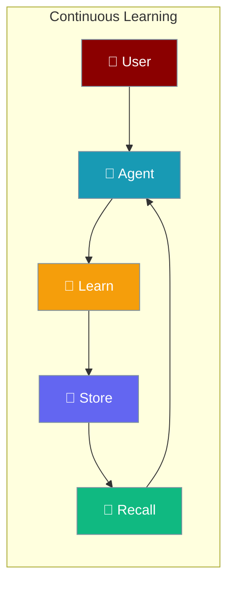
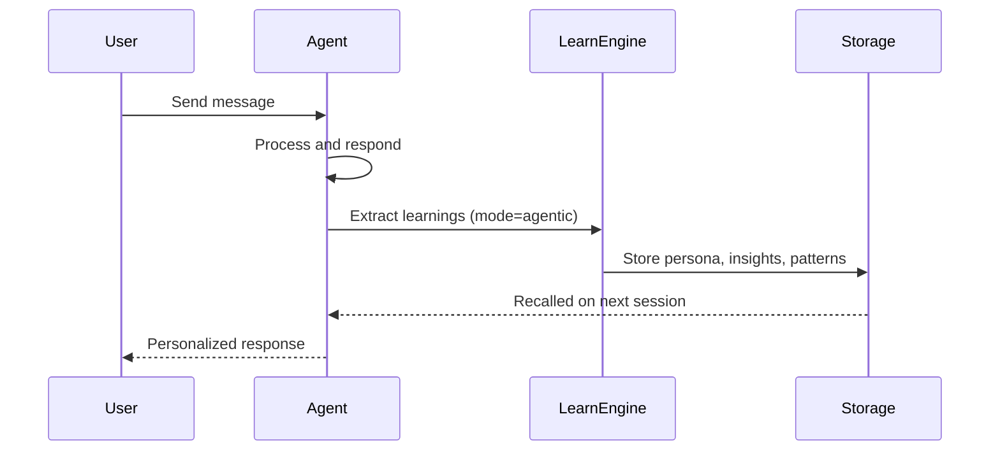
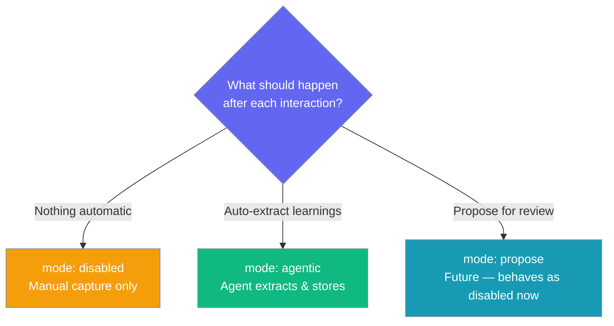
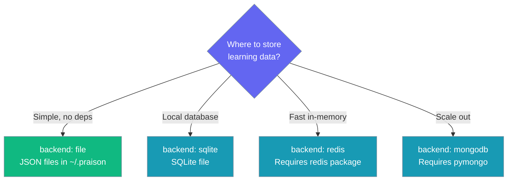

Agents learn from every interaction — capturing user preferences, insights, and patterns to improve future responses automatically.

```python
from praisonaiagents import Agent, LearnConfig

agent = Agent(
    name="Personal Assistant",
    instructions="You are a helpful assistant that remembers user preferences.",
    learn=LearnConfig(
        persona=True,
        insights=True,
        mode="agentic",
    )
)

agent.start("I prefer concise answers with bullet points")
```

The user interacts with the agent; learnings are extracted and stored, then recalled in future sessions.



## Quick Start

<Steps>
<Step title="Enable Learning with Defaults">

```python
from praisonaiagents import Agent

agent = Agent(
    name="Learning Agent",
    instructions="You are a helpful assistant",
    learn=True
)

agent.start("I work in Python and prefer type hints")
```

</Step>

<Step title="Configure Learning Capabilities">

```python
from praisonaiagents import Agent, LearnConfig

agent = Agent(
    name="Smart Assistant",
    instructions="Remember my preferences and insights.",
    learn=LearnConfig(
        persona=True,
        insights=True,
        patterns=True,
        mode="agentic",
    )
)

agent.start("Always format code examples with type annotations")
```

</Step>

<Step title="Use a Database Backend">

```python
from praisonaiagents import Agent, LearnConfig

agent = Agent(
    name="Persistent Learner",
    instructions="Store learnings in a database.",
    learn=LearnConfig(
        backend="sqlite",
        db_url="sqlite:///learn.db",
        persona=True,
        insights=True,
    )
)

agent.start("My timezone is UTC+5:30")
```

</Step>
</Steps>

---

## How It Works



---

## Choose a Learning Mode



## Choose a Storage Backend



---

## Configuration Options

<Card title="LearnConfig Python Reference" icon="code" href="/docs/sdk/reference/python/classes/LearnConfig">
  Full parameter reference for LearnConfig
</Card>

| Option | Type | Default | Description |
|--------|------|---------|-------------|
| `persona` | `bool` | `True` | Capture user preferences and profile |
| `insights` | `bool` | `True` | Capture observations and learnings |
| `thread` | `bool` | `True` | Capture session/conversation context |
| `patterns` | `bool` | `False` | Capture reusable knowledge patterns |
| `decisions` | `bool` | `False` | Log decision history |
| `feedback` | `bool` | `False` | Capture outcome signals |
| `improvements` | `bool` | `False` | Self-improvement proposals |
| `mode` | `str` | `"disabled"` | `"disabled"`, `"agentic"`, or `"propose"` |
| `backend` | `str` | `"file"` | `"file"`, `"sqlite"`, `"redis"`, or `"mongodb"` |
| `db_url` | `str \| None` | `None` | Database connection URL (non-file backends) |
| `store_path` | `str \| None` | `None` | Custom path for file backend |
| `max_entries` | `int` | `0` | Max entries per store (0 = unbounded) |
| `retention_days` | `int` | `0` | Archive entries unused for N days (0 = keep forever) |
| `llm` | `str \| None` | `None` | LLM for learning extraction (defaults to agent's LLM) |
| `scope` | `str` | `"private"` | `"private"` or `"shared"` |
| `nudge_interval` | `int` | `0` | Nudge agent every N turns (0 = disabled) |
| `nudge_min_tool_iters` | `int` | `3` | Minimum tool iterations before a nudge fires |
| `propose_skills` | `bool` | `False` | Enable `skill_manage` tool in propose mode |

---

## Common Patterns

**Self-improving assistant with retention governance:**

```python
from praisonaiagents import Agent, LearnConfig

agent = Agent(
    name="Adaptive Assistant",
    instructions="Adapt to user preferences over time.",
    learn=LearnConfig(
        persona=True,
        insights=True,
        patterns=True,
        mode="agentic",
        max_entries=500,
        retention_days=90,
    )
)
```

**Shared learnings across a team of agents:**

```python
from praisonaiagents import Agent, LearnConfig

shared_learn = LearnConfig(
    scope="shared",
    backend="sqlite",
    db_url="sqlite:///team_learnings.db",
    persona=True,
    insights=True,
)

researcher = Agent(name="Researcher", instructions="Research topics.", learn=shared_learn)
writer = Agent(name="Writer", instructions="Write content.", learn=shared_learn)
```

---

## Best Practices

<AccordionGroup>
<Accordion title="Start with learn=True before tuning">
Enable learning with defaults first. Once you understand what gets captured, switch to `LearnConfig` to enable only the capabilities you need (`persona`, `insights`, `patterns`).
</Accordion>

<Accordion title="Use agentic mode for hands-off learning">
Set `mode="agentic"` to have the agent automatically extract and store learnings after each conversation. This requires no manual action from users or developers.
</Accordion>

<Accordion title="Set retention limits in production">
Use `max_entries` and `retention_days` to prevent unbounded growth. A limit of `max_entries=1000` with `retention_days=180` keeps the learning store manageable.
</Accordion>

<Accordion title="Use sqlite or redis for persistence across restarts">
The default `file` backend stores JSON in `~/.praison`. For production or multi-instance setups, use `backend="sqlite"` or `backend="redis"` with a `db_url`.
</Accordion>
</AccordionGroup>

---

## Related

<CardGroup cols={2}>
  <Card title="Memory Config" icon="brain" href="/docs/configuration/memory-config">
    Session and persistent memory configuration
  </Card>
  <Card title="Agent Learning" icon="graduation-cap" href="/docs/features/learn">
    Agent learn feature overview
  </Card>
  <Card title="Learning Retention" icon="clock" href="/docs/features/learning-retention">
    Govern how long learnings are kept
  </Card>
  <Card title="Learn Skill" icon="star" href="/docs/features/learn-skill">
    Teach agents new skills dynamically
  </Card>
</CardGroup>
