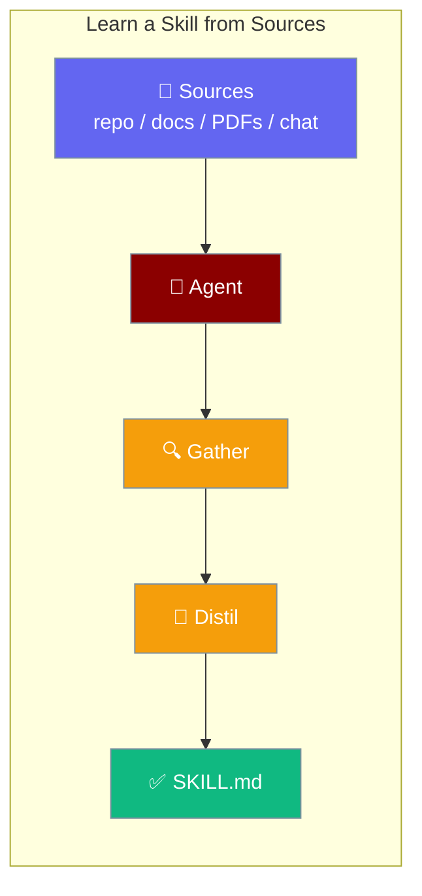
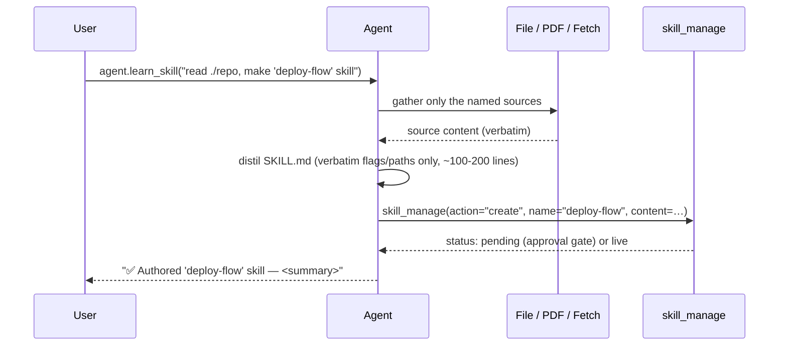

Learn-skill turns real source material — code, docs, PDFs, configs, or this chat — into one grounded, reusable `SKILL.md` in a single command.

```python
from praisonaiagents import Agent

agent = Agent(name="SkillAuthor", instructions="Distil sources into reusable skills")
agent.learn_skill("Read ./my-repo and author a deploy-flow skill")
```

The user points at repos or docs; the agent authors one grounded `SKILL.md` they can reuse later.



## Quick Start

<Steps>
<Step title="Learn from a repo">
```python
from praisonaiagents import Agent

agent = Agent()
agent.learn_skill(
    "Read ./my-repo and make a 'deploy-flow' skill"
)
```
</Step>

<Step title="Learn from multiple sources">
```python
from praisonaiagents import Agent

agent = Agent()
agent.learn_skill(
    "Read ./my-repo and the docs in ./docs/*.pdf and make a 'deploy-flow' skill"
)
```
</Step>

<Step title="Learn from the current chat">
```python
from praisonaiagents import Agent

agent = Agent()
agent.start("Walk me through deploying this service: …")
agent.learn_skill("Save what we just figured out as a 'deploy-flow' skill")
```
</Step>
</Steps>

---

## How It Works



The agent follows three rules when authoring a skill:

| Rule | What it means |
|---|---|
| **Verbatim only** | Only flags, paths, commands, env vars, and API names that appear **verbatim** in the gathered sources end up in the skill. Never invented. |
| **Tight body** | `SKILL.md` is kept to ~100–200 lines. Long material moves to supporting files referenced by relative path. |
| **Named sources only** | The agent reads only the sources you name. It does not browse unrelated material. |
| **YAML frontmatter** | Every generated skill has at least `name` + `description`. |

---

## Three Surfaces

<Tabs>
<Tab title="Python SDK">
```python
from praisonaiagents import Agent

agent = Agent()
agent.learn_skill("Read ./my-repo and make a 'deploy-flow' skill")
```
</Tab>
<Tab title="CLI">
```bash
praisonai skills learn "the API in ./openapi.yaml as a 'stripe-billing' skill"
```
</Tab>
<Tab title="Bot Chat">
```
/learn deploy steps from this repo and the runbook PDF
```
</Tab>
</Tabs>

---

## Async

```python
from praisonaiagents import Agent

agent = Agent()
result = await agent.alearn_skill(
    "Read ./my-repo and make a 'deploy-flow' skill"
)
```

<Note>
`alearn_skill` is the async equivalent of `learn_skill`. Use it inside `async` functions or notebooks.
</Note>

---

## Approval Gate

<Note>
Skills authored by `learn_skill` go through the **same human approval gate** as any other agent-created skill. By default the tool returns `{"status": "pending", "id": "skl-…"}` and disk is not touched until a human approves. See [Skill Manage](/docs/features/skill-manage).
</Note>

---

## Common Patterns

### From a single repo

```python
from praisonaiagents import Agent

agent = Agent()
agent.learn_skill("Read ./my-repo and make a 'deploy-flow' skill")
```

### Multi-source (repo + PDFs + URL)

The agent picks the right tool per source — file read, PDF read, or fetch — automatically.

```python
from praisonaiagents import Agent

agent = Agent()
agent.learn_skill(
    "Read ./my-repo, the runbook at ./docs/runbook.pdf, "
    "and https://docs.example.com/api — make a 'deploy-flow' skill"
)
```

### From the current chat

Phrases like `"what we just figured out"` or `"this conversation"` route the agent to use the chat as the source.

```python
from praisonaiagents import Agent

agent = Agent()
agent.start("Walk me through deploying this service to AWS…")
agent.learn_skill("Save what we just figured out as a 'deploy-flow' skill")
```

### CLI with model override

```bash
praisonai skills learn "the API in ./openapi.yaml as a 'stripe-billing' skill" --llm gpt-4o
```

---

## Best Practices

<AccordionGroup>
  <Accordion title="Name sources explicitly">
    Saying "read `./my-repo` and `./docs/*.pdf`" beats "learn about deploys" because the agent only reads what you name. Explicit paths give better, more grounded skills.
  </Accordion>
  <Accordion title="Pick a kebab-case skill name in the request">
    Include a quoted name like `"… make a 'deploy-flow' skill"`. If you omit it, the agent derives one from the content — which may be less predictable.
  </Accordion>
  <Accordion title="Prefer learn_skill over learn in new code">
    `learn` / `alearn` are kept as backward-compat aliases. The canonical names are `learn_skill` / `alearn_skill` to avoid confusion with the memory `learn=` constructor param on `Agent`.
  </Accordion>
  <Accordion title="Don't pre-wire skill_manage yourself">
    `learn_skill` automatically adds `skill_manage`, `read_skill_file`, and `list_skill_scripts` to `agent.tools` if they are missing. The call is idempotent — running it multiple times does not double-register tools.
  </Accordion>
</AccordionGroup>

---

## Backward-compat Aliases

`learn` and `alearn` are aliases for `learn_skill` and `alearn_skill`:

```python
agent.learn("Read ./my-repo and make a 'deploy-flow' skill")
await agent.alearn("Read ./my-repo and make a 'deploy-flow' skill")
```

Prefer `learn_skill` / `alearn_skill` in new code.

---

## Related

<CardGroup cols={2}>
  <Card title="Skill Manage" icon="shield-check" href="/docs/features/skill-manage">
    The approval gate the authored skill flows through
  </Card>
  <Card title="Agent Skills" icon="puzzle-piece" href="/docs/features/skills">
    Invoking and discovering skills
  </Card>
  <Card title="Self-Improving Agents" icon="rotate" href="/docs/features/self-improve">
    Auto-curate skills from conversation (different mechanism)
  </Card>
  <Card title="Bot Chat Commands" icon="terminal" href="/docs/features/bot-commands">
    /learn slash command in Telegram, Discord, and Slack
  </Card>
</CardGroup>
