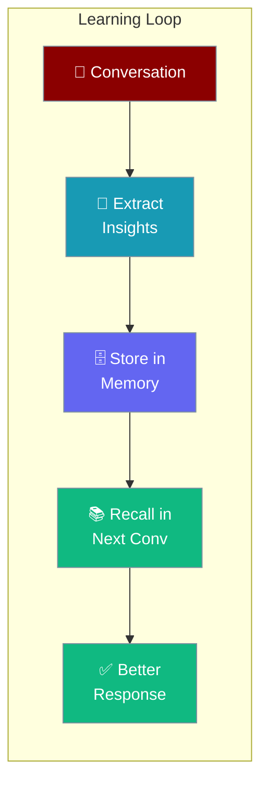
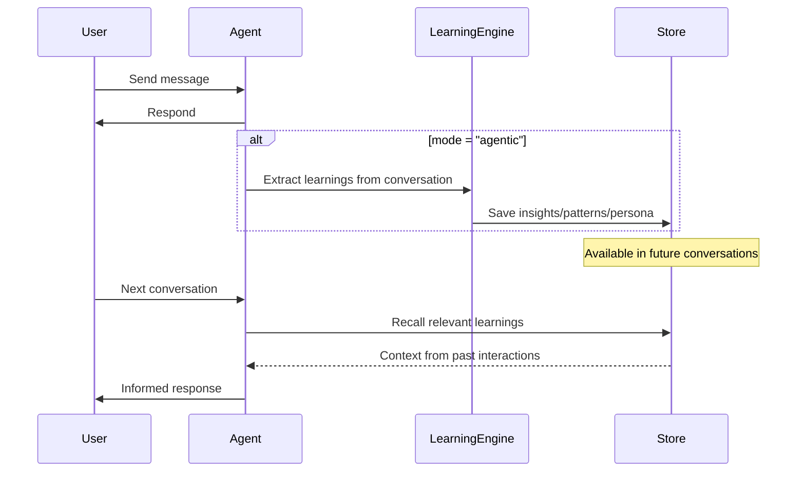

Make your agent smarter over time — it learns from every conversation and applies those insights automatically.

```python
from praisonaiagents import Agent

agent = Agent(
    name="LearningAssistant",
    instructions="You are a helpful personal assistant.",
    learn=True  # Agent captures and reuses learnings automatically
)

result = agent.start("I prefer concise bullet points over long paragraphs")
print(result)
```



## Quick Start

<Steps>
<Step title="Simple Usage">
Enable learning with a boolean — the agent captures persona and insights by default:

```python
from praisonaiagents import Agent

agent = Agent(
    name="PersonalAssistant",
    instructions="You are my personal assistant.",
    learn=True
)

agent.start("Remember: I always want responses in markdown format")
```
</Step>

<Step title="With LearnConfig">
Choose what to learn and how to store it:

```python
from praisonaiagents import Agent, LearnConfig

agent = Agent(
    name="SmartAssistant",
    instructions="You are a helpful assistant.",
    learn=LearnConfig(
        persona=True,      # Learn user preferences
        insights=True,     # Capture observations
        patterns=True,     # Identify reusable patterns
        mode="agentic",    # Auto-extract learnings after each turn
        backend="sqlite",  # Persist to SQLite database
    )
)

agent.start("Analyze this dataset and note any patterns for future reference")
```
</Step>
</Steps>

---

## How It Works



---

## Configuration Options

<Card title="LearnConfig SDK Reference" icon="code" href="/docs/sdk/reference/python/classes/LearnConfig">
  Full parameter reference for LearnConfig
</Card>

**Precedence ladder:**

```python
# Level 1: Bool (enable with defaults)
agent = Agent(learn=True)

# Level 2: LearnConfig (full control)
agent = Agent(learn=LearnConfig(
    persona=True,
    mode="agentic",
    backend="sqlite",
))
```

**What the agent can learn:**

| Option | Type | Default | Description |
|--------|------|---------|-------------|
| `persona` | `bool` | `True` | User preferences and profile |
| `insights` | `bool` | `True` | Observations from conversations |
| `thread` | `bool` | `True` | Session/conversation context |
| `patterns` | `bool` | `False` | Reusable knowledge patterns |
| `decisions` | `bool` | `False` | Log decisions made |
| `feedback` | `bool` | `False` | Capture outcome signals |
| `improvements` | `bool` | `False` | Self-improvement proposals |

**Learning mode:**

| Option | Type | Default | Description |
|--------|------|---------|-------------|
| `mode` | `str` | `"disabled"` | `"disabled"` / `"agentic"` / `"propose"` (see note) |
| `scope` | `str` | `"private"` | `"private"` (per user) or `"shared"` (all agents) |
| `nudge_interval` | `int` | `0` | Nudge agent to reflect every N turns (0 = off) |

<Note>
`propose` mode is defined in the SDK but not yet implemented. Setting `mode="propose"` currently behaves the same as `"disabled"`.
</Note>

**Storage backend:**

| Option | Type | Default | Description |
|--------|------|---------|-------------|
| `backend` | `str` | `"file"` | `"file"` / `"sqlite"` / `"redis"` / `"mongodb"` |
| `db_url` | `str \| None` | `None` | Connection URL for non-file backends |
| `store_path` | `str \| None` | `None` | Custom path for file backend |
| `max_entries` | `int` | `0` | Max stored entries (0 = unlimited) |
| `retention_days` | `int` | `0` | Archive entries older than N days (0 = keep forever) |
| `llm` | `str \| None` | `None` | LLM model for extracting learnings |

---

## Common Patterns

**Auto-learning with SQLite persistence:**

```python
from praisonaiagents import Agent, LearnConfig

agent = Agent(
    name="PersonalCoach",
    instructions="You are a personal productivity coach.",
    learn=LearnConfig(
        persona=True,
        insights=True,
        patterns=True,
        mode="agentic",
        backend="sqlite",
        db_url="sqlite:///coach_memory.db",
    )
)

# The agent builds a profile of you over time
agent.start("I struggle with time management in the mornings")
agent.start("I prefer evening workouts")
agent.start("What routine would work best for me?")
```

**Shared learning across agents:**

```python
from praisonaiagents import Agent, LearnConfig

shared_learn = LearnConfig(
    insights=True,
    patterns=True,
    scope="shared",  # All agents share this learning store
    backend="redis",
    db_url="redis://localhost:6379",
)

agent1 = Agent(name="SupportAgent1", instructions="Handle customer support.", learn=shared_learn)
agent2 = Agent(name="SupportAgent2", instructions="Handle customer support.", learn=shared_learn)
```

**Nudge-based self-improvement:**

```python
from praisonaiagents import Agent, LearnConfig

agent = Agent(
    name="ImprovingAgent",
    instructions="You are a coding assistant that gets better over time.",
    learn=LearnConfig(
        improvements=True,
        nudge_interval=5,  # Reflect and propose improvements every 5 turns
        nudge_min_tool_iters=3,  # Only nudge if agent did real work
    )
)
```

---

## Best Practices

<AccordionGroup>
<Accordion title="Start with learn=True, then tune">
The default settings (`persona=True`, `insights=True`) cover most use cases. Only add `patterns=True` or `decisions=True` when you need those specific learning types — they add overhead per turn.
</Accordion>

<Accordion title="Use sqlite or redis for production">
The default `file` backend is great for development and local agents. For production, switch to `sqlite` (single-node) or `redis`/`mongodb` (multi-node or high throughput).
</Accordion>

<Accordion title="Set max_entries to prevent unbounded growth">
For long-lived agents, set `max_entries` (e.g., `max_entries=1000`) and `retention_days` (e.g., `retention_days=30`) to prevent the learning store from growing indefinitely.
</Accordion>

<Accordion title="Use scope='shared' carefully">
Shared learning means all agents read and write to the same store. This is powerful for multi-agent coordination but can cause unexpected behavior if different agents learn conflicting patterns.
</Accordion>
</AccordionGroup>

---

## Related

<CardGroup cols={2}>
<Card title="Learning Retention" icon="brain" href="/docs/features/learning-retention">
  How learned data persists between sessions
</Card>
<Card title="Advanced Memory" icon="database" href="/docs/features/advanced-memory">
  Full memory system configuration
</Card>
<Card title="Learn Skill" icon="graduation-cap" href="/docs/features/learn-skill">
  Agent skill learning system
</Card>
<Card title="Self Improve" icon="sparkles" href="/docs/features/self-improve">
  Agent self-improvement mechanisms
</Card>
</CardGroup>
